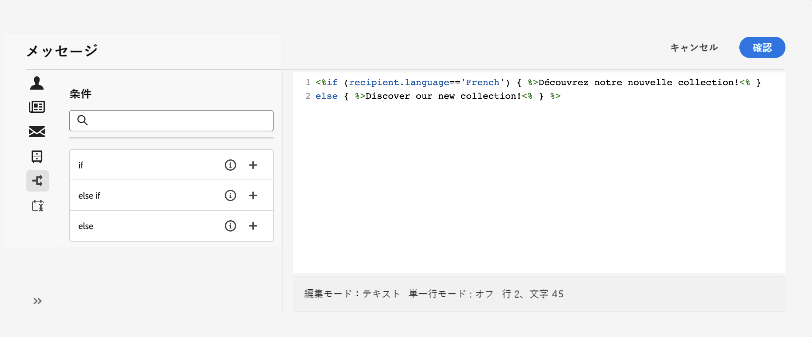
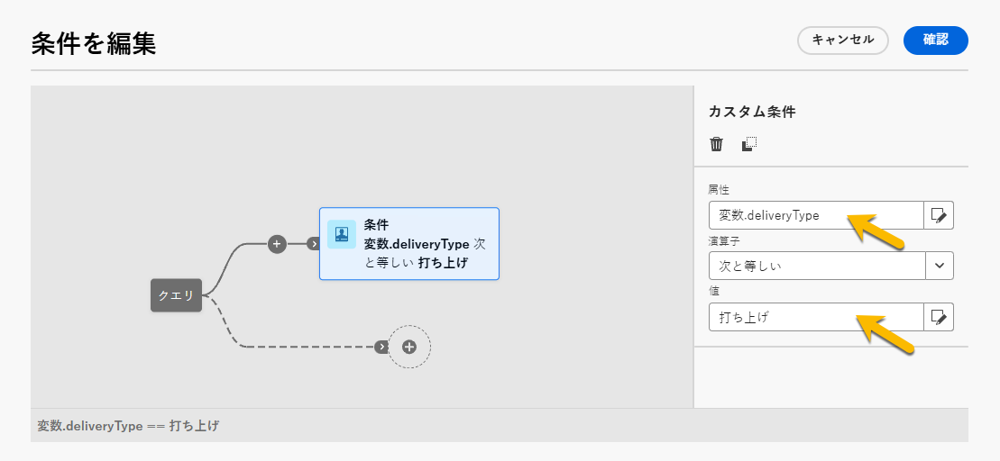

# 条件付きコンテンツをビルド {#add-conditions}

>[!CONTEXTUALHELP]
>id="acw_conditional_content"
>title="条件付きコンテンツを追加"
>abstract="条件付きコンテンツフィールドを設定して、受信者のプロファイルデータに基づいて高度な動的パーソナライゼーションを作成します。特定の条件が満たされた場合に、メッセージコンテンツ内のテキストブロック、リンク、件名、画像を置き換えることができます。"

## 条件付きコンテンツの基本を学ぶ {#gs}

条件付きコンテンツは、受信者のプロファイルデータに基づいて動的パーソナライゼーションを可能にする強力な機能です。特定の条件が満たされた場合に、テキストブロックと画像が自動的に置き換えられます。この機能により、キャンペーンが強化され、高度にターゲティングおよびパーソナライズされたエクスペリエンスをオーディエンスに提供できます。

条件付きコンテンツフィールドを設定することで、受信者のプロファイルに基づいて高度な動的パーソナライゼーションを作成できます。例えば、特定の条件が満たされた場合に、メッセージコンテンツ内のテキストブロック、リンク、件名、画像を置き換えることができます。例えば、Adobe Campaign データベースの「性別」フィールドの値に従って「Mr」または「Mrs」を表示したり、受信者の優先言語に基づいて別のリンクを含めたりできます。

条件付きコンテンツを作成するには、**式エディター**&#x200B;で特定のヘルパー関数を使用して条件を作成します。この方法は、すべての配信チャネルで、件名、メールリンク、テキスト／ボタンコンテンツコンポーネントなど、式エディターにアクセスできる任意のフィールドで使用できます。[詳しくは、式エディターにアクセスする方法を参照してください](gs-personalization.md#access)。

さらに、メールをデザインする際に専用の&#x200B;**条件付きコンテンツビルダー**&#x200B;を使用して、メール本文の要素に対して複数のバリエーションを作成できます。[詳しくは、メールでの条件付きコンテンツの作成方法を参照してください](#condition-condition-builder)。

## 式エディターでの条件を作成 {#condition-perso-editor}

>[!CONTEXTUALHELP]
>id="acw_personalization_editor_conditions"
>title="条件"
>abstract="このメニューでは、ヘルパー関数を利用して条件付きコンテンツを定義できます。"

式エディターを使用して配信の条件付きコンテンツを定義するには、次の手順に従います。この例では、受信者の言語（フランス語または英語）に基づく条件付きコンテンツを作成します。

1. 配信を開き、コンテンツ編集セクションに移動します。

1. 条件付きコンテンツを追加するフィールドを見つけます。例えば、SMS メッセージに条件付きコンテンツを追加します。

1. フィールドの横にある「**[!UICONTROL パーソナライゼーションダイアログを開く]**」アイコンをクリックして、式エディターを開きます。

   {zoomable="yes"}

1. パーソナライゼーションエディターで、左側にある&#x200B;**[!UICONTROL 条件]**&#x200B;メニューを参照します。

1. 条件の作成を開始するには、**If** 関数の横にある「+」アイコンをクリックします。中央の画面に次の行が追加されます：`<% if (<FIELD>==<VALUE>) { %>Insert content here<% } %>`

   * `<FIELD>` を、受信者の言語などのパーソナライゼーションフィールド `recipient.language` に置き換えます。
   * `<VALUE>` を `'French'` などの条件を満たす値に置き換えます。
   * `Insert content here` を、指定した条件を満たすプロファイルに表示するコンテンツに置き換えます。

     {zoomable="yes"}{width="800" align="center"}

1. 受信者が条件を満たさない場合に表示するコンテンツを指定します。**else** ヘルパー関数を使用します。

   1. 式終了タグ `%>` の前にカーソルを置き、**Else** 関数の横にある `+` をクリックします。

   1. `Insert content here` を、if 関数の条件を満たさないプロファイルに表示するコンテンツに置き換えます。

   {zoomable="yes"}{width="800" align="center"}

   **else if** ヘルパー関数を使用して、複数のコンテンツバリアントを含む条件を作成します。例えば、次の式では、受信者の言語に応じてメッセージの 3 つのバリアントが表示されます。

   {zoomable="yes"}{width="800" align="center"}

   >[!NOTE]
   >
   >ヘルパー関数を追加するたびに、関数の前後に開始タグ（`<%`）と終了タグ（`%>`）が自動的に追加されます。
   >
   >式内に「Else」ヘルパー関数を追加した後の例を次に示します。
   >
   >`<% if (<FIELD>==<VALUE>) { %>Insert content here<% } <% else { %> Insert content here<% } %>%>`
   >
   >構文エラーを避けるために、これらのタグを削除する必要があります。**else** 関数タグを削除した後の修正された式の例を次に示します。
   >
   >`<% if (<FIELD>==<VALUE>) { %>Insert content here<% } else { %> Insert content here<% } %>`

1. コンテンツを保存し、コンテンツをシミュレートしてそのレンダリングを確認します。

## メールでの条件付きコンテンツを作成 {#condition-condition-builder}

条件付きコンテンツをメールで作成するには、次の 2 つの方法があります。
* 式エディターで、ヘルパー関数を使用して条件を作成する。
* メールのデザイン時にアクセスできる、専用の条件付きコンテンツビルダーで行う。

次の節では、E メールデザイナーの条件付きコンテンツ機能を使用して条件を作成する方法を順を追って説明します。式エディターを使用して条件を作成する方法について詳しくは、[こちら](#condition-perso-editor)を参照してください。

この例では、受信者の言語に基づく複数のバリアントを含むメールメッセージを作成します。次の手順に従います。

1. メール配信を作成または開き、コンテンツを編集し、「**[!UICONTROL メール本文を編集]**」ボタンをクリックして、メールデザインワークスペースを開きます。

1. コンテンツコンポーネントを選択し、「**[!UICONTROL 条件付きコンテンツを有効にする]**」アイコンをクリックします。

   {zoomable="yes"}{width="800" align="center"}

1. 画面の左側に&#x200B;**[!UICONTROL 条件付きコンテンツ]**&#x200B;パネルが開きます。 このパネルでは、条件を使用して、選択したコンテンツコンポーネントの複数のバリエーションを作成します。

1. 最初のバリアントを設定します。**[!UICONTROL 条件付きコンテンツ]**&#x200B;パネルの&#x200B;**[!UICONTROL バリアント - 1]** 上にポインタを合わせて、「**[!UICONTROL 条件を追加]**」ボタンをクリックします。

   {zoomable="yes"}{width="800" align="center"}

1. クエリモデラーが開き、受信者のプロファイルデータをフィルタリングして、条件を作成できます。[詳しくは、クエリモデラーの操作方法を参照してください](../query/query-modeler-overview.md)。

   メッセージの最初のバリアントの条件が整ったら、「**[!UICONTROL 確認]**」をクリックします。この例では、言語が「フランス語」の受信者をターゲティングするルールを作成します。

   {zoomable="yes"}{width="800" align="center"}

1. ルールがバリアントに関連付けられました。読みやすくするために、省略記号メニューをクリックしてバリアントの名前を変更します。

1. メッセージの送信時にルールが満たされた場合の、コンポーネントの表示方法を設定します。この例では、受信者の優先言語がフランス語の場合、テキストをフランス語で表示します。

   {zoomable="yes"}{width="800" align="center"}

1. コンテンツコンポーネントに必要な数だけバリアントを追加します。任意にバリアントを切り替えて、条件ルールに基づいてコンテンツコンポーネントの表示方法を確認します。

   >[!NOTE]
   >メッセージの送信時にバリアントで定義されたルールのいずれも満たされない場合、コンテンツコンポーネントには、**[!UICONTROL 条件付きコンテンツ]**&#x200B;パネルの&#x200B;**[!UICONTROL デフォルトバリアント]**&#x200B;で定義されたコンテンツが表示されます。

## 条件付きコンテンツに変数を使用 {#variables-conditional}

変数は、配信の条件付きコンテンツに使用できます。

詳しくは、[配信への変数の追加](../advanced-settings/delivery-settings.md#variables-delivery)を参照してください。

条件付きコンテンツを配置する要素を選択します。

{zoomable="yes"}

変数を使用するには、以下に示すように、「**[!UICONTROL 式を編集]**」ボタンを使用して条件を設定します。この例では、変数の値が `launch` の場合に、この画像が表示されます。

{zoomable="yes"}

別の画像を表示する場所に、例えば値 `reminder` を使用して別のバリアントを作成します。