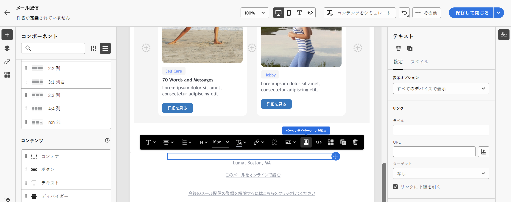
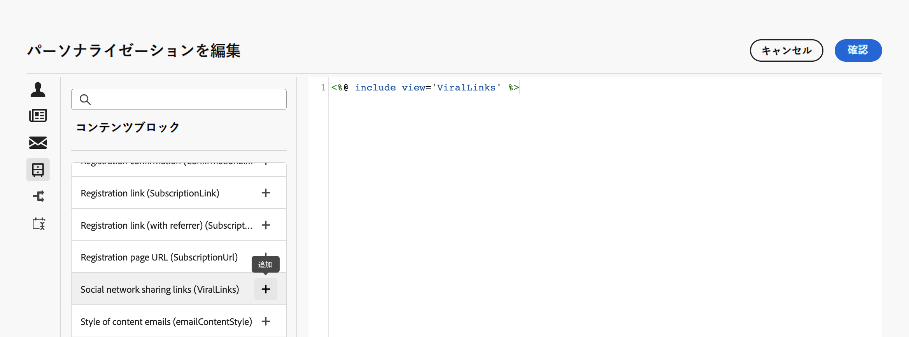

# ビルトインコンテンツブロック {#ootb-content-blocks}

Adobe Campaign は、事前設定済みのコンテンツブロックのリストを提供します。コンテンツブロックは動的で、パーソナライズされています。そこには、配信に挿入できる特定のレンダリングが格納されています。例えば、ロゴ、挨拶メッセージまたはミラーページへのリンクを追加できます。

コンテンツブロックを配信に追加するには、次の手順に従います。

1. 配信を開き、そのコンテンツを編集します。

1. コンテンツブロックを追加するフィールドを見つけ、**[!UICONTROL パーソナライゼーションダイアログを開く]**&#x200B;アイコンをクリックして式エディターを開きます。

   {width="800" align="center"}

1. 式エディターで、**[!UICONTROL コンテンツブロック]**&#x200B;の左側のメニューを参照します。

1. コンテンツブロックを追加するには、コンテンツ内の目的の場所にカーソルを置き、「+」ボタンをクリックして挿入します。

   {width="800" align="center"}

ビルトインコンテンツブロックは次のとおりです。

* **[!UICONTROL デフォルトのオプトアウトバナー]**
* **[!UICONTROL Adobe Campaign で有効化]**：「Adobe Campaign で有効化」ロゴを挿入します。
* **[!UICONTROL 固有名詞の書式設定関数]**：JavaScript の **[!UICONTROL toSmartCase]** 関数を生成します。この関数は各単語の最初の文字をすべて大文字に変更します。
* **[!UICONTROL 挨拶]**：受信者の姓名の後にコンマを付けた挨拶文を挿入します。例：「こんにちは、John Doe。」
* **[!UICONTROL ロゴの挿入]**：インスタンス設定で定義されているロゴを挿入します。
* **[!UICONTROL ミラーページへのリンク]**：[ミラーページ](../content/mirror-page.md)へのリンクを挿入します。デフォルトの形式は、「このメッセージが正しく表示されない場合は、ここをクリックしてください」です。
* **[!UICONTROL ミラーページの URL]**：ミラーページの URL を挿入し、配信デザイナーがリンクを確認できるようにします。
* **[!UICONTROL 通知スタイル]**
* **[!UICONTROL 単一モードのオファー許可 URL]**：オファーを&#x200B;**[!UICONTROL 許可済み]**&#x200B;に設定できる URL を挿入します。（このブロックは、インタラクションモジュールが有効な場合に使用できます）
* **[!UICONTROL 登録の確認]**：購読を確認できるリンクを挿入します。
* **[!UICONTROL 登録リンク]**：購読リンクを挿入します。このリンクは、インスタンス設定で定義されています。デフォルトの内容は「登録するには、ここをクリックしてください。」です。
* **[!UICONTROL 登録リンク（リファラーを含む）]**：購読リンクを挿入し、訪問者と配信を識別できるようにします。このリンクは、インスタンス設定で定義されています。
* **[!UICONTROL 登録ページ URL]**：購読 URL を挿入します。
* ソーシャルネットワーク共有リンク
* **[!UICONTROL コンテンツメールのスタイル]**&#x200B;および&#x200B;**[!UICONTROL 通知スタイル]**：定義済みの HTML スタイルでメールを書式設定するコードを生成します。
* **[!UICONTROL 登録解除リンク]**：すべての配信を購読解除（ブロックリスト登録）できるリンクを挿入します。関連付けられているデフォルトのコンテンツは、「このメッセージが届いたのは、お客様が&#x200B;***組織名***&#x200B;または関連会社と連絡を取ったことがあるからです。***組織名***&#x200B;からメッセージを受け取らないようにするには、ここをクリックしてください。」です。

>[!NOTE]
>
>Adobe Campaign v8 コンソールから新しいブロックを定義すると、配信のパーソナライゼーションを最適化できます。詳しくは、[Campaign v8（クライアントコンソール）ドキュメント](https://experienceleague.adobe.com/docs/campaign/campaign-v8/campaigns/send/personalize/personalization-blocks.html?lang=ja#create-custom-personalization-blocks){target="_blank"}を参照してください。

