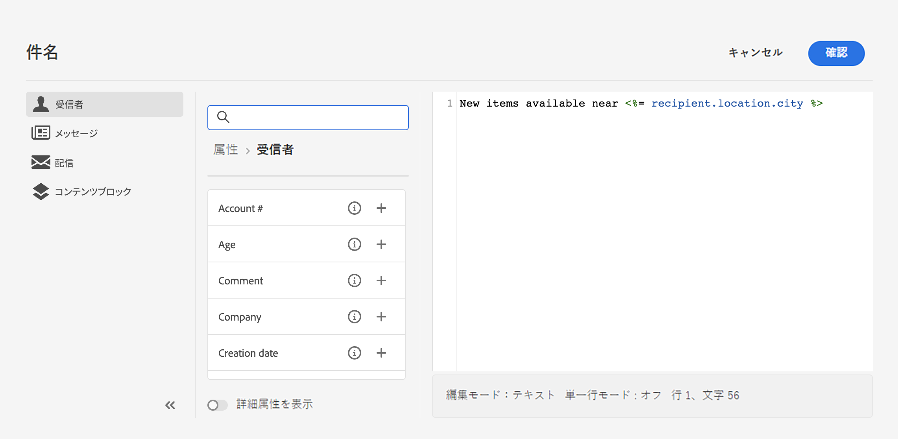
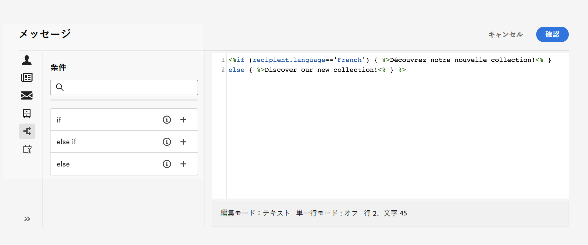
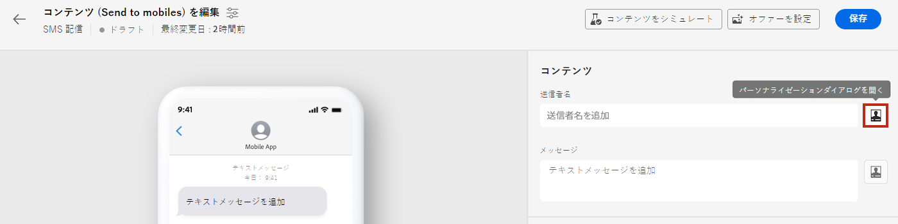
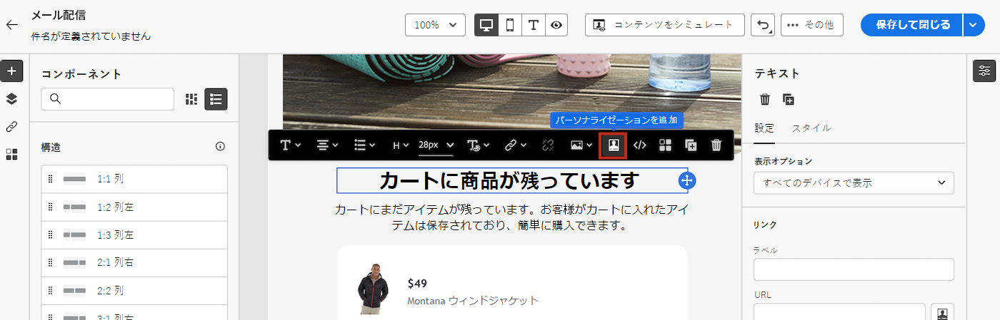
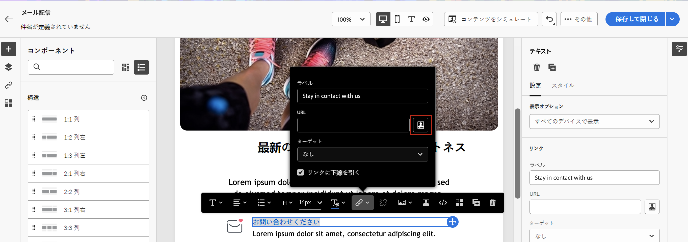

# コンテンツを動的にする方法 {#gs-dynamic-content}

>[!CONTEXTUALHELP]
>id="acw_targetdata_personalization_dashboard"
>title="パーソナライズ機能"
>abstract="式エディターでは、すべてのデータを選択、整理、カスタマイズおよび検証して、コンテンツに合わせてカスタマイズされたエクスペリエンスを作成できます。プロファイルデータを活用して、各受信者に対するメッセージをパーソナライズし、条件付きコンテンツを作成して、各受信者にメッセージを適応させ、関連するコンテンツのみを表示できます。"

マーケターは、お客様の製品に真に興味を持つ顧客をターゲットにし、効果的で関連性の高いコンテンツを提供して顧客を惹きつけることが重要です。発生する様々な受信者の範囲を考えると、異なる人物に訴える複数のマーケティングコンテンツを作成するのに時間がかかり、無駄が多くなる可能性があります。動的コンテンツは、ここで利用できます。

Adobe Campaign Web 動的コンテンツ機能を使用すると、受信者について収集した情報に基づいてコンテンツをカスタマイズできます。動的コンテンツを利用することで、マーケティング活動の関連性が高まり、不要な製品やサービスのマーケティングを回避できます。このアプローチにより、コンテンツがより魅力的になり、読まれる可能性が高まります。さらに、コンテンツをパーソナライズできるので、受信者は機械ではなくユーザーから情報を受信しているように感じることができます。

## コンテンツを動的にする方法 {#make-content-dyn}

Campaign web 式エディターに JavaScript 構造を挿入することで、メッセージのコンテンツを動的にすることができます。メッセージの送信時に、次の式が Adobe Campaign によって解釈され、各受信者に正しいコンテンツが配信されます。

* **メッセージのパーソナライズ**：特定の受信者ごとに名前（名）、興味、住所、購入内容などのプロファイルデータを活用します。受信者、メッセージまたは配信に関連するパーソナライゼーションエディターから、データベースで使用可能な任意のフィールドを選択できます。これらのパーソナライゼーション属性は、メッセージの件名行や本文に挿入できます。&lt;%= recipient.location.city %> の構文は、受信者の市区町村をコンテンツに挿入します。

  {zoomable="yes"}{width="800" align="center"}

* **条件付きコンテンツの作成**：各受信者に合わせて配信を調整し、特定の顧客に関する情報に基づいて、その顧客に関連するコンテンツのみを表示します。これにより、条件に基づいて特定のテキストブロックや画像を表示できます。例えば、特定のサービスに対する受信者の購読に基づいてメールバナーを調整します。

  {zoomable="yes"}{width="800" align="center"}

## 式エディターにアクセスする {#access}

Adobe Campaign Web では、式エディターを使用すると、すべてのデータを選択、整理、カスタマイズおよび検証して、コンテンツ用にカスタマイズされたエクスペリエンスを作成できます。式エディターは、すべてのチャネルで、件名フィールド、メールリンク、テキスト／ボタンコンテンツコンポーネントなど、「**[!UICONTROL パーソナライゼーションダイアログを開く]**」アイコンのあるすべてのフィールドで使用できます。

動的にするコンテンツに応じて式エディターにアクセスする方法の例を次に示します。

* *「送信者名」フィールドから式エディターにアクセスする*

  {zoomable="yes"}{width="800" align="center"}

* *メールテキストコンポーネントから式エディターにアクセスする*

  {zoomable="yes"}{width="800" align="center"}

* *メール内のリンクから式エディターにアクセスする*

  {zoomable="yes"}{width="800" align="center"}

>[!NOTE]
>
>式エディターに加えて、メールをデザインする際に、専用の条件付きコンテンツビルダーを活用することもできます。[詳しくは、メールでの条件付きコンテンツの作成方法を参照してください](conditions.md)
