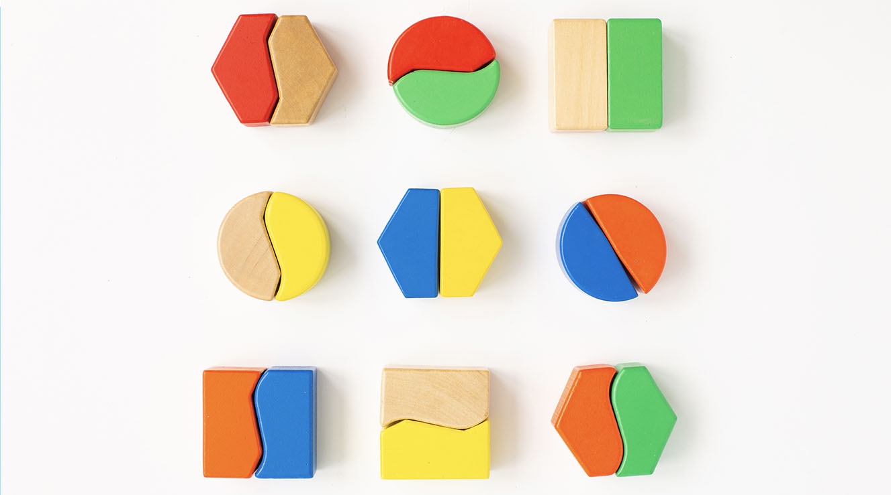

# 動的コンテンツの基本を学ぶ

すべてのマーケティングキャンペーンを最大限に活用するために、Adobe Campaignでは、お客様のレベルで話すカスタム動的コンテンツを配信できます。 プロファイルデータに基づいて、パーソナライゼーション機能を使用して様々なグループおよび個人のカスタムエクスペリエンスを作成します。メッセージに関するデータと情報を活用することで、メッセージを特定の受信者に合わせて変更できます。 名前、興味、住んでいる場所、購入したものなど、様々な情報が考えられます。

Campaign を使用して動的コンテンツを作成し、パーソナライズされたメッセージを送信します。パーソナライゼーション機能を組み合わせて、メッセージを改善し、カスタムなユーザーエクスペリエンスを実現することができます。

次の項目を挿入することで、メッセージコンテンツを動的に設定できます。

* **パーソナライゼーションフィールド**

   パーソナライゼーションフィールドは、メッセージの第 1 レベルのパーソナライゼーションに使用されます。パーソナライゼーションエディターから、データベースで使用可能な任意のフィールドを選択できます。配信の場合は、受信者、メッセージまたは配信に関連する任意のフィールドを選択できます。これらのパーソナライゼーション属性は、メッセージの件名行や本文に挿入できます。

   

   &lt;%= recipient.location.city %> の構文は、受信者の市区町村をコンテンツに挿入します。

* **条件付きコンテンツ**

   条件付きコンテンツを設定して、例えば受信者のプロファイルに基づいてコンテンツを追加します。 特定の条件が成立した場合に、テキストブロックや画像を挿入できます。条件が true でない場合のコンテンツの代替バージョンを定義できます。

* **ビルトインコンテンツブロック**

   Campaign には、配信に挿入できる特定のレンダリングを含んだ一連のパーソナライゼーションブロックが付属しています。例えば、電子メールメッセージのミラーページにロゴ、挨拶メッセージまたはリンクを追加できます。 コンテンツブロックは、パーソナライゼーションエディターの専用のエントリから使用できます。

   

## 動的コンテンツはどこに追加できますか？

Adobe Campaign V8 Web には式エディターが用意されており、すべてのデータを選択、整理、カスタマイズおよび検証して、コンテンツに合わせてカスタマイズされたエクスペリエンスを作成できます。

式エディターは、パーソナライゼーションダイアログを開くアイコンを持つすべてのフィールド（件名フィールド、E メールリンク、テキスト/ボタンコンテンツコンポーネントなど）で、すべてのチャネルで使用できます。

さらに、E メールのデザイン時に、専用の条件付きコンテンツビルダーにアクセスできます。 [メールでの条件付きコンテンツの作成方法を説明します](conditions.md)

## さらに深く掘り下げましょう

コンテンツを動的にする方法を理解できたので、次にこれらのドキュメントの節をさらに詳しく調べて、この機能の使用を開始します。

<table style="table-layout:fixed"><tr style="border: 0;">
<td>

<a href="personalize.md"><strong>パーソナライゼーションの追加</strong></a>

</td>
<td>

<a href="conditions.md"><strong>条件付きコンテンツを追加</strong>

</td>
<td>

<a href="content-blocks.md"><strong>組み込みコンテンツブロックを追加する</strong></a>

</td>
</tr></table>
