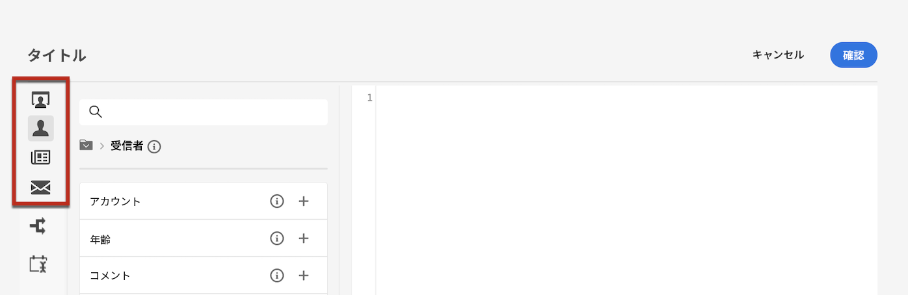

# コンテンツのパーソナライズ {#add-personalization}

パーソナライゼーションは、式エディターを使用して任意の配信に追加できます。式エディターは、 **[!UICONTROL パーソナライゼーションダイアログを開く]** アイコン（件名フィールド、E メールリンク、テキスト/ボタンのコンテンツコンポーネントなど） [動的コンテンツの追加場所を説明します](gs-personalization.md/#access)

## パーソナライゼーション構文 {#syntax}

パーソナライゼーションタグでは、常に `<%=table.field%>` 構文を使用します。例えば、受信者テーブルに格納されている受信者の名前を挿入する場合、パーソナライゼーションタグは &lt;%= recipient.lastName %> 構文を使用します。

配信の準備が完了すると、これらのタグはAdobe Campaignで自動的に解釈され、特定の受信者のフィールドの値で置き換えられます。 その後、実際に置き換えられたコンテンツをシミュレートする際に、その内容を確認できます。

## パーソナライゼーションタグを追加 {#add}

パーソナライゼーションタグを配信に追加するには、 **[!UICONTROL パーソナライゼーションダイアログを開く]** 件名行や SMS 本文など、テキストタイプの編集フィールドからアクセス可能なアイコン。 [動的コンテンツの追加場所を説明します](gs-personalization.md/#access)

式エディターが表示されます。 パーソナライゼーションフィールドは、画面の左側にある 3 つのメニューに整理されます。 これらのメニューを使用すると、Adobe Campaignデータベースで使用可能なすべてのフィールドにアクセスできます。

| メニュー | 説明 |
|-----|------------|
|  | この **[!UICONTROL 受信者]** メニューには、受信者の名前、年齢、住所など、受信者テーブルに定義されたすべてのフィールドが一覧表示されます。 |
|  | この **[!UICONTROL メッセージ]** メニューには、配信ログに関連するすべてのフィールドが一覧表示されます。つまり、特定の受信者との最後のイベントの日付など、すべてのチャネルをまたいで受信者やデバイスに送信されたすべてのメッセージが一覧表示されます |
|  | この **[!UICONTROL 配信]** メニューには、配信チャネル、ラベルなど、配信の実行に必要なパラメーターに関連するすべてのフィールドがリストされます。 |

>[!NOTE]
>
>デフォルトでは、各メニューには、選択したテーブル内のすべてのフィールド（受信者、/メッセージ/配信）が表示されます。 選択したテーブルにリンクするテーブルのフィールドを含める場合は、 **[!UICONTROL 詳細属性の表示]** オプションがリストの下に表示されます。

パーソナライゼーションフィールドを追加するには、コンテンツ内の目的の場所にカーソルを置き、「+」ボタンをクリックして挿入します。

コンテンツの準備が整ったら、コンテンツを保存し、コンテンツをシミュレートして、パーソナライゼーションのレンダリングをテストできます。 次の例では、ターゲットプロファイルの名を使用して SMS メッセージをパーソナライズしています。

*メッセージコンテンツにパーソナライゼーションタグを追加する*

*特定のテストプロファイルに対するパーソナライゼーションのレンダリングをシミュレート*

