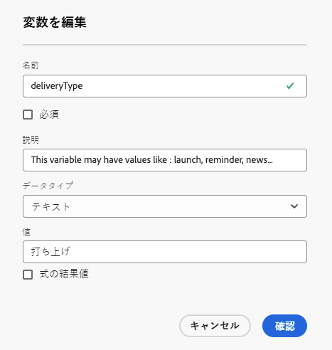

# コンテンツのパーソナライズ {#add-personalization}

>[!CONTEXTUALHELP]
>id="acw_personalization_editor_add_current_date"
>title="現在の日付を追加"
>abstract="このメニューには、コンテンツをパーソナライズするために活用できる日付の書式設定に関連する関数が用意されています。"

配信コンテンツのパーソナライゼーションは、メッセージを個々の受信者に対して調整し、コミュニケーションの関連性と魅力を高めることができる主な機能です。

Adobe Campaign では、プロファイルの名前、場所、過去のやり取りなどの[プロファイルデータ](#data-personalization)と、特定の[配信の変数](#variables-personalization)を使用して、コミュニケーション内のテキスト、画像、オファーなどの要素を動的にカスタマイズします。

配信のパーソナライゼーションは、ユーザーエクスペリエンスを向上させ、エンゲージメント率を向上させ、コンバージョンと顧客満足度の向上につながります。

## パーソナライゼーションに対するプロファイルデータの使用 {#data-personalization}

式エディターを使用して、プロファイルデータを使用して任意の配信をパーソナライズします。式エディターには、「**[!UICONTROL パーソナライゼーションダイアログを開く]**」アイコンのある各フィールド（件名行、メールリンク、テキスト／ボタンのコンテンツコンポーネントなど）からアクセスできます。[詳しくは、式エディターにアクセスする方法を参照してください](gs-personalization.md#access)。

### パーソナライゼーション構文 {#syntax}

パーソナライゼーションタグは、次の特定の構文 `<%= table.field %>` に従います。例えば、受信者テーブルから受信者の姓を挿入するには、`<%= recipient.lastName %>` 構文を使用します。

配信準備プロセス中に、Adobe Campaign はこれらのタグを解釈し、各受信者の対応するフィールド値に置き換えます。コンテンツをシミュレートして、実際の置き換えを確認します。

スタンドアロンのメール配信用に外部ファイルから連絡先をアップロードする場合、入力ファイル内のすべてのフィールドをパーソナライズに使用できます。構文は次のようになります。`<%= dataSource.field %>`

### パーソナライゼーションタグを追加 {#add}

配信にパーソナライゼーションタグを追加するには、次の手順に従います。

1. 式エディターを開くには、テキストタイプの編集フィールド（件名行や SMS 本文など）からアクセスできる「**[!UICONTROL パーソナライゼーションダイアログを開く]**」アイコンを使用します。[詳しくは、式エディターにアクセスする方法を参照してください](gs-personalization.md#access)。

   {zoomable="yes"}{width="800" align="center"}

1. 式エディターが開きます。画面の左側にあるいくつかのメニューに、Adobe Campaign データベースで使用可能なパーソナライゼーションフィールドが整理されています。

   {zoomable="yes"}{width="800" align="center"}

   | メニュー | 説明 |
   |------|-------------|
   | {zoomable="yes"} | **[!UICONTROL サブスクライバーのアプリケーション]**&#x200B;メニューには、使用するターミナルやオペレーティングシステムなど、アプリケーションのサブスクライバーに関連するフィールドが一覧表示されます。*このメニューは、プッシュ通知でのみ使用できます。* |
   | {zoomable="yes"} | **[!UICONTROL 受信者]**&#x200B;メニューには、受信者の名前、年齢、アドレスなど、受信者テーブルで定義されたフィールドが一覧表示されます。スタンドアロンのメール配信用に[外部ファイルからの連絡先をアップロード](../audience/file-audience.md)すると、このメニューに入力ファイルで使用できるすべてのフィールドが一覧表示されます。 |
   | {zoomable="yes"} | **[!UICONTROL メッセージ]**&#x200B;メニューには、配信ログに関連するフィールドが一覧表示されます。特定の受信者との最後のイベントの日付など、すべてのチャネルにわたって受信者またはデバイスに送信されたすべてのメッセージが含まれます。 |
   | {zoomable="yes"} | **[!UICONTROL 配信]**&#x200B;メニューには、配信チャネルやラベルなど、配信の実行に必要なパラメーターに関連するフィールドが一覧表示されます。 |

   >[!NOTE]
   >
   >デフォルトでは、各メニューには、選択したテーブル内のすべてのフィールド（受信者、メッセージ、配信）が一覧表示されます。選択したテーブルにリンクするテーブルのフィールドを含める場合は、リストの下にある「**[!UICONTROL 詳細属性を表示]**」オプションを有効にします。

1. パーソナライゼーションフィールドを追加するには、コンテンツ内の目的の場所にカーソルを置き、「`+`」ボタンをクリックして挿入します。

1. コンテンツの準備が整ったら、コンテンツを保存し、シミュレーションを実行して、パーソナライゼーションのレンダリングをテストします。次の例は、受信者の名を使用した SMS メッセージのパーソナライズを示しています。

   {zoomable="yes"}{width="800" align="center"}

   {zoomable="yes"}{width="800" align="center"}

## パーソナライゼーションに対する変数の使用 {#variables-personalization}

変数も使用して、配信をパーソナライズします。詳しくは、[配信への変数の追加](../advanced-settings/delivery-settings.md#variables-delivery)を参照してください。

例えば、変数 `deliveryType` は、次のように定義されます。

{zoomable="yes"}

この変数は、配信のコンテンツで使用します。この例では、「**[!UICONTROL パーソナライゼーションを追加]**」アイコンと式 `<%= variables.deliveryType %>` を使用します。

{zoomable="yes"}

「**[!UICONTROL コンテンツをシミュレート]**」ボタンを使用して変数の使用状況を確認します。

{zoomable="yes"}