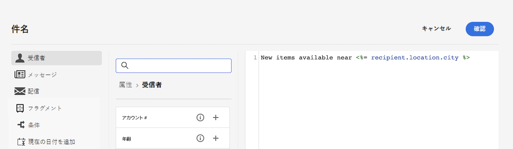

# コンテンツのパーソナライズ{#add-personalization}

メッセージコンテンツは、次の方法でパーソナライズできます。

* 動的な&#x200B;**パーソナライゼーションフィールド**&#x200B;の挿入

   パーソナライゼーションフィールドは、メッセージの第 1 レベルのパーソナライゼーションに使用されます。パーソナライゼーションエディターから、データベースで使用可能な任意のフィールドを選択できます。配信の場合は、受信者、メッセージまたは配信に関連する任意のフィールドを選択できます。これらのパーソナライゼーション属性は、メッセージの件名行や本文に挿入できます。

   

   &lt;%= recipient.location.city %> の構文は、受信者の市区町村をコンテンツに挿入します。

* 事前定義済みの&#x200B;**コンテンツブロック**&#x200B;の挿入

   Campaign には、配信に挿入できる特定のレンダリングを含んだ一連のパーソナライゼーションブロックが付属しています。例えば、ロゴ、挨拶メッセージまたはメッセージのミラーページへのリンクを追加できます。コンテンツブロックは、パーソナライゼーションエディターの専用のエントリから使用できます。

   
<!--
* Create **conditional content**

    Configure conditional content to add dynamic personalization based on the recipient’s profile for example. Text blocks and/or images are inserted when a particular condition is true.
-->

## メールの件名のパーソナライズ {#personalize-subject-line}

メッセージの「**[!UICONTROL 件名]**」フィールドにパーソナライゼーションを追加するには、次の手順に従います。

1. 「**件名**」フィールドの右側にある「**パーソナライゼーションダイアログを開く**」アイコンをクリックします。
1. 件名の内容を入力し、追加するパーソナライゼーション属性を選択します。
1. 「**確認**」をクリックして確定します。パーソナライゼーション属性が件名に追加されます。

## メールコンテンツのパーソナライズ {#personalize-emails}

メールコンテンツをパーソナライズするには、電子メールデザイナーでメッセージを開き、次の操作を実行します。

1. テキストブロック内をクリックします。
1. コンテキストツールバーで、「**パーソナライゼーションを追加**」を選択します。

   

1. パーソナライゼーションエディターに受信者の名前を挿入し、確認します。

   

   パーソナライゼーション属性がメールコンテンツに追加されます。

   コンテンツをシミュレートして、レンダリングを確認できます。[詳細情報](../preview-test/preview-content.md)

   

メールにコンテンツブロックを追加するには、同じ手順を適用し、最後のアイコンからコンテンツブロックを選択します。

挿入すると、コンテンツブロックがメールコンテンツに追加されます（下図を参照）。 配信準備段階で、パーソナライゼーションが生成されると、受信者プロファイルに適合するように自動的に調整されます。

ビルトインコンテンツブロックは次のとおりです。
* **[!UICONTROL Adobe Campaign によって有効にされています]**：「Adobe Campaign によって有効にされています」ロゴを挿入します。
* **[!UICONTROL 固有名詞のフォーマット設定関数]**：JavaScript の **[!UICONTROL toSmartCase]** 関数を生成します。この関数は各単語の最初の文字を大文字に変更します。
* **[!UICONTROL 挨拶]**：受信者の名前と共に挨拶文を挿入します。例：「こんにちは、John Doe。」
* **[!UICONTROL ロゴを挿入]**：インスタンス設定で定義されているロゴを挿入します。
* **[!UICONTROL ミラーページへのリンク]**：ミラーページへのリンク「このメッセージが正しく表示されない場合は、ここをクリックしてください」を挿入します。
* **[!UICONTROL ミラーページの URL]**：ミラーページの URL を挿入し、配信デザイナーがリンクを確認できるようにします。
* **[!UICONTROL 単一モードのオファー許可 URL]**：オファーを&#x200B;**[!UICONTROL 許可済み]**&#x200B;に設定できる URL を挿入します。
* **[!UICONTROL 登録ページ URL]**：購読 URL を挿入します。
* **[!UICONTROL 登録リンク]**：購読リンクを挿入します。このリンクは、インスタンス設定で定義されています。デフォルトの内容は「登録するには、ここをクリックしてください。」です。
* **[!UICONTROL 登録リンク (リファラーを含む)]**：購読リンクを挿入し、訪問者と配信を識別できるようにします。このリンクは、インスタンス設定で定義されています。
* **[!UICONTROL 登録の確認]**：購読を確認できるリンクを挿入します。
* **[!UICONTROL ソーシャルネットワーク共有リンク]**：ミラーページコンテンツへのリンクを受信者が共有できるボタンを挿入します。
* **[!UICONTROL コンテンツ E メールのスタイル]**&#x200B;および&#x200B;**[!UICONTROL 通知スタイル]**：定義済みの HTML スタイルでメールを書式設定するコードを生成します。
* **[!UICONTROL 購読解除リンク]**：すべての配信を購読解除（ブロックリスト登録）できるリンクを挿入します。関連付けられているデフォルトのコンテンツは、「このメッセージが届いたのは、お客様が&#x200B;***組織名***&#x200B;または関連会社と連絡を取ったことがあるからです。***組織名***&#x200B;からメッセージを受け取らないようにするには、ここをクリックしてください。」です。

## メール内のリンクのパーソナライズ {#personalize-links}

**リンク**&#x200B;をパーソナライズするには：

1. テキストブロックまたは画像を選択します。
1. コンテキストツールバーで、「**リンクを挿入**」を選択します。

   

1. リンクラベルを入力し、「**リンクを挿入**」ボタンを使用して、リンクをパーソナライズします。

   

1. パーソナライゼーションエディターを使用して、リンクを定義およびパーソナライズし、確定します。

   

## オファーのパーソナライズ {#personalize-offers}

テキストタイプのコンテンツをオファーの表示域に追加する際に、パーソナライゼーションエディターにアクセスすることもできます。詳しくは、[こちら](../content/offers.md)を参照してください。
