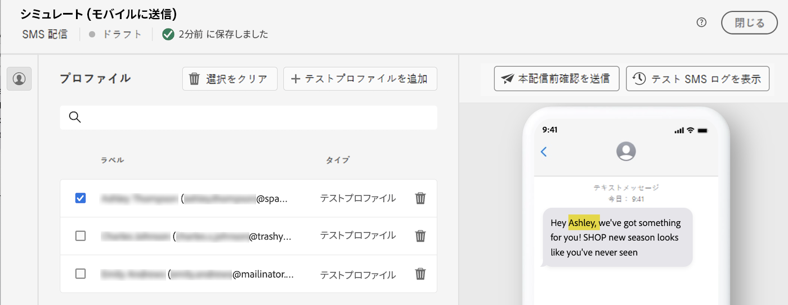

# コンテンツのパーソナライズ {#add-personalization}

式エディターを使用して、任意の配信をパーソナライズできます。式エディターは、 **[!UICONTROL パーソナライゼーションダイアログを開く]** アイコン（件名行、E メールリンク、テキスト/ボタンのコンテンツコンポーネントなど）。 [式エディターにアクセスする方法を説明します](gs-personalization.md/#access)

## パーソナライゼーション構文 {#syntax}

パーソナライゼーションタグは、次の特定の構文に従います。 `<%= table.field %>`. 例えば、受信者テーブルから受信者の姓を挿入するには、 `<%= recipient.lastName %>` 構文と同じです。

配信の準備プロセス中、Adobe Campaignはこれらのタグを自動的に解釈し、各受信者の対応するフィールド値に置き換えます。 コンテンツをシミュレートすると、実際の置き換えを表示できます。

スタンドアロンの E メール配信用に外部ファイルから連絡先をアップロードする場合、入力ファイル内のすべてのフィールドをパーソナライズに使用できます。 構文は次のとおりです。 `<%= dataSource.field %>`.

## パーソナライゼーションタグを追加 {#add}

配信にパーソナライゼーションタグを追加するには、次の手順に従います。

1. 式エディターを開くには、 **[!UICONTROL パーソナライゼーションダイアログを開く]** 件名行や SMS 本文など、テキストタイプの編集フィールドからアクセス可能なアイコン。 [式エディターにアクセスする方法を説明します](gs-personalization.md/#access)

   {width="800" align="center"}

1. 式エディターが開きます。 Adobe Campaignデータベースで使用可能なパーソナライゼーションフィールドは、画面の左側にあるいくつかのメニューに整理されています。

   {width="800" align="center"}

   | メニュー | 説明 |
   |-----|------------|
   |  | この **[!UICONTROL 購読者のアプリケーション]** メニューには、使用するターミナルやオペレーティングシステムなど、アプリケーションの購読者に関連するフィールドが一覧表示されます。 *このメニューは、プッシュ通知でのみ使用できます* |
   |  | この **[!UICONTROL 受信者]** メニューには、受信者の名前、年齢、アドレスなど、受信者テーブルで定義されたフィールドが一覧表示されます。 条件 [外部ファイルからの連絡先のアップロード](../audience/file-audience.md) スタンドアロンの e メール配信の場合、このメニューには入力ファイルで使用できるすべてのフィールドが一覧表示されます。 |
   |  | この **[!UICONTROL メッセージ]** メニューには、特定の受信者との最後のイベントの日付など、すべてのチャネルで受信者に送信されるすべてのメッセージやデバイスを含む、配信ログに関連するフィールドが一覧表示されます |
   |  | この **[!UICONTROL 配信]** メニューには、配信チャネルやラベルなど、配信の実行に必要なパラメーターに関連するフィールドがリストされます。 |

   >[!NOTE]
   >
   >デフォルトでは、各メニューには、選択したテーブル内のすべてのフィールドがリストされます（受信者、/メッセージ/配信）。 選択したテーブルにリンクするテーブルのフィールドを含める場合は、 **[!UICONTROL 詳細属性の表示]** オプションがリストの下に表示されます。

1. パーソナライゼーションフィールドを追加するには、コンテンツ内の目的の場所にカーソルを置き、 `+` ボタンをクリックして挿入します。

1. コンテンツの準備が整ったら、コンテンツを保存し、コンテンツをシミュレートして、パーソナライゼーションのレンダリングをテストできます。 次の例は、受信者の名を持つ SMS メッセージのパーソナライゼーションを示しています。

   {width="800" align="center"}

   {width="800" align="center"}
