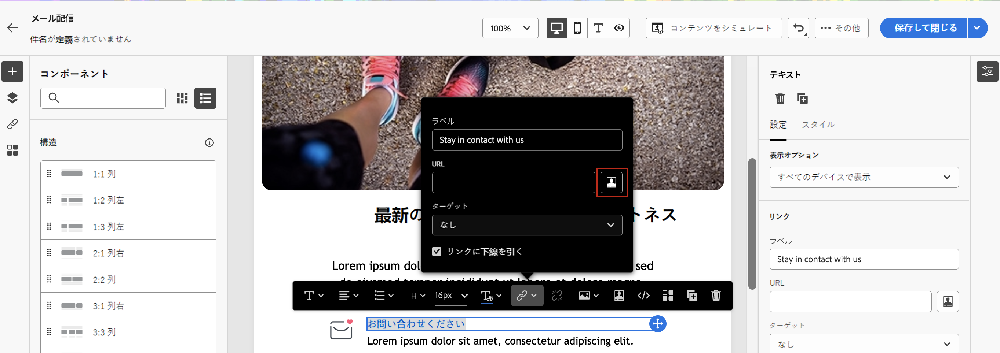

# コンテンツのパーソナライズ{#add-personalization}

メッセージの内容は、次の方法でパーソナライズできます。

* 動的な挿入 **パーソナライゼーションフィールド**

   パーソナライゼーションフィールドは、メッセージの第 1 レベルのパーソナライゼーションに使用されます。 パーソナライゼーションエディターから、データベースで使用可能な任意のフィールドを選択できます。 配信の場合は、受信者、メッセージまたは配信に関連する任意のフィールドを選択できます。 これらのパーソナライゼーション属性は、件名行やメッセージ本文に挿入できます。

   

   次の構文は、受信者の市区町村をコンテンツに挿入します。&lt;%= recipient.location.city %> です。

* 事前定義済みの挿入 **コンテンツブロック**

   Campaign には、配信に挿入できる特定のレンダリングを含む、一連のパーソナライゼーションブロックが付属しています。 例えば、メッセージのミラーページにロゴ、挨拶メッセージまたはリンクを追加できます。 コンテンツブロックは、パーソナライゼーションエディターの専用のエントリから使用できます。

   
<!--
* Create **conditional content**

    Configure conditional content to add dynamic personalization based on the recipient’s profile for example. Text blocks and/or images are inserted when a particular condition is true.
-->

## E メールの件名行をパーソナライズ {#personalize-subject-line}

パーソナライゼーションを **[!UICONTROL 件名]** メッセージの「 」フィールドで、次の手順に従います。

1. 次をクリック： **パーソナライゼーションダイアログを開く** アイコン **件名** フィールドに入力します。
1. 件名行のコンテンツを入力し、追加するパーソナライゼーション属性を選択します。
1. クリック **確認** をクリックして検証します。 パーソナライゼーション属性が件名行に追加されます。

## E メールコンテンツをパーソナライズ {#personalize-emails}

E メールの内容をパーソナライズするには、E メールデザイナーでメッセージを開き、次の操作を実行します。

1. テキストブロック内をクリックします。
1. コンテキストツールバーで、「 」を選択します。 **パーソナライゼーションを追加**.

   

1. パーソナライゼーションエディターで受信者の名前を挿入し、確定します。

   

   パーソナライゼーション属性が E メールコンテンツに追加されます。

   コンテンツをシミュレートして、レンダリングを確認できます。 [詳細情報](../preview-test/preview-content.md)

   

コンテンツブロックを E メールに追加するには、同じ手順を適用し、最後のアイコンからコンテンツブロックを選択します。

挿入後、次に示すように、コンテンツブロックが E メールコンテンツに追加されます。 配信の準備手順で、パーソナライゼーションが生成される際に、受信者プロファイルに自動的に適応されます。

組み込みコンテンツブロックは次のとおりです。
* **[!UICONTROL Adobe Campaignで有効]** :「Adobe Campaignが有効」ロゴを挿入します。
* **[!UICONTROL 固有名詞の書式設定関数]**：JavaScript の **[!UICONTROL toSmartCase]** 関数を生成します。この関数は各単語の最初の文字を大文字に変更します。
* **[!UICONTROL 挨拶]**：受信者の名前と共に挨拶文を挿入します。例：「こんにちは、John Doe。」
* **[!UICONTROL ロゴを挿入]**：インスタンスの設定時に定義された標準のロゴを挿入します。
* **[!UICONTROL ミラーページへのリンク]**：ミラーページへのリンク「このメッセージが正しく表示されない場合は、ここをクリックしてください」を挿入します。
* **[!UICONTROL ミラーページの URL]**：ミラーページの URL を挿入し、配信デザイナーがリンクを確認できるようにします。
* **[!UICONTROL 単一モードのオファー承認 URL]** :インタラクションオファーを次のように設定できる URL を挿入します。 **[!UICONTROL 許可済み]**.
* **[!UICONTROL 登録ページの URL]** :購読 URL を挿入します。
* **[!UICONTROL 登録リンク]**：購読リンクを挿入します。このリンクは、インスタンスを設定する際に定義する必要があります。 デフォルトの内容は次のとおりです。「登録するには、ここをクリックしてください。」
* **[!UICONTROL 登録リンク（リファラーを含む）]**：購読リンクを挿入し、訪問者と配信を識別できるようにします。このリンクは、インスタンスの設定時に定義されたものです。
* **[!UICONTROL 登録の確認]**：購読を確認できるリンクを挿入します。
* **[!UICONTROL ソーシャルネットワーク共有リンク]** :受信者がミラーページコンテンツへのリンクを共有できるボタンを挿入します。
* **[!UICONTROL コンテンツ E メールのスタイル]**&#x200B;および&#x200B;**[!UICONTROL 通知スタイル]**：定義済みの HTML スタイルで E メールを書式設定するコードを生成します。
* **[!UICONTROL 購読解除リンク]**：すべての配信を購読解除（ブロックリスト登録）できるリンクを挿入します。デフォルトで関連付けられているコンテンツは次のとおりです。「このメッセージは、 `<your rganization name>` または関連会社。 メッセージを今後受信しない場合： `<your rganization name>` ここをクリックしてください。」

## メール内のリンクをパーソナライズ {#personalize-links}

をパーソナライズするには **リンク**:

1. テキストブロックまたは画像を選択します。
1. コンテキストツールバーで、「 」を選択します。 **リンクを挿入**.

   

1. リンクラベルを入力し、 **リンクを挿入** ボタンをクリックして、リンクをパーソナライズします。

   

1. パーソナライゼーションエディターを使用して、リンクを定義およびパーソナライズし、確認します。

   

## オファーをパーソナライズする {#personalize-offers}

テキストタイプのコンテンツをオファーの表示域に追加する際に、パーソナライゼーションエディターにアクセスすることもできます。詳しくは、[この節](../content/offers.md)を参照してください。
