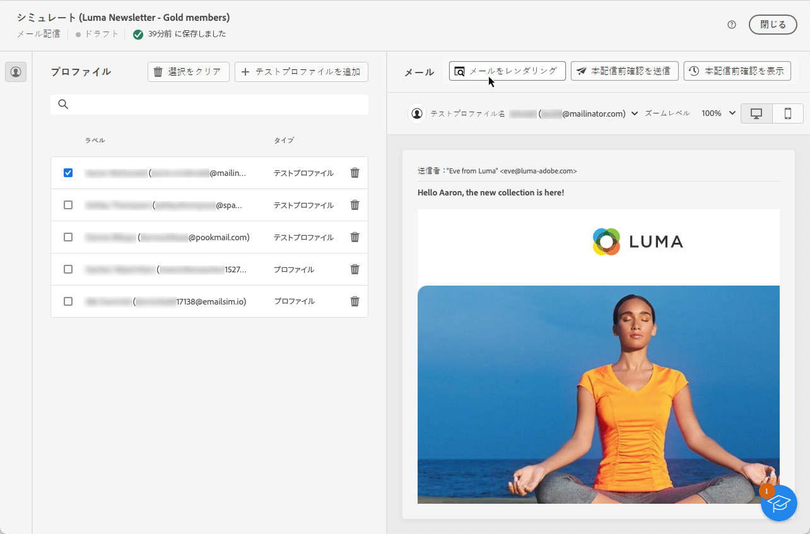

# メールのレンダリングのテスト {#email-rendering}

E メールを送信する前に、様々な Web クライアントおよびデバイスで受信者へのメッセージの表示が最適化されていることを確認してください。

これをおこなうには、 **Litmus** ～を説明する [!DNL Adobe Campaign] 様々なコンテキストで e メールのレンダリングを即座にプレビューし、主要なデスクトップおよびアプリケーション（web メール、メッセージサービス、モバイルなど）の互換性を確認します。

>[!CAUTION]
>
>Campaign で E メールのレンダリングを使用すると、テスト E メールがサードパーティのシステムに送信されます。 Litmus アカウントをに接続する [!DNL Campaign]を使用する場合、お客様は、Adobeがそのサードパーティに送信するすべてのデータに対して責任を負わないことを認めます。 Litmus のデータ保持 E メールポリシーは、これらのテストメッセージに含まれる可能性のあるパーソナライゼーションデータを含め、これらの E メールに適用されます。 このようなデータにアクセスしたり削除したりするには、Litmus に直接問い合わせる必要があります。

E メールのレンダリング機能にアクセスするには、次の操作が必要です。

* Litmus アカウントを持っている
* テストプロファイルの選択 — での方法を説明します。 [この節](preview-content.md)

次に、以下の手順に従います。

1. 内 [コンテンツを編集](../content/edit-content.md) 画面または [メールデザイナー](../content/get-started-email-designer.md)、 **[!UICONTROL コンテンツをシミュレート]** 」ボタンをクリックします。

1. を選択します。 **[!UICONTROL E メールをレンダリング]** 」ボタンをクリックします。

   

1. クリック **Litmus アカウントを接続する** をクリックします。

   

1. 資格情報を入力してログインします。

   

1. 次をクリック： **テストを実行** ボタンをクリックして、e メールのプレビューを生成します。

1. 一般的なデスクトップ、モバイル、Web ベースのクライアントで E メールの内容を確認します。

   

<!--
TO CHECK IF user is directed to Litmus or if the email rendering is shown directly in the Campaign UI.

CONTENT ABOVE COPIED FROM AJO

If not redirecting to Litmus:

To test the email rendering, follow these steps:

1. Access the email content creation screen, then click **[!UICONTROL Simulate content]**.

1. Click the **[!UICONTROL Render email]** button.

    The left pane provides various desktop, mobile and web-based email clients. Select the desired email client to display a preview of your email in the right pane. 

    

    >[!NOTE]
    >
    >The email clients list provides a sample of the major mail clients. Additional email clients are available from the filter button next to the top search bar.

 -->
