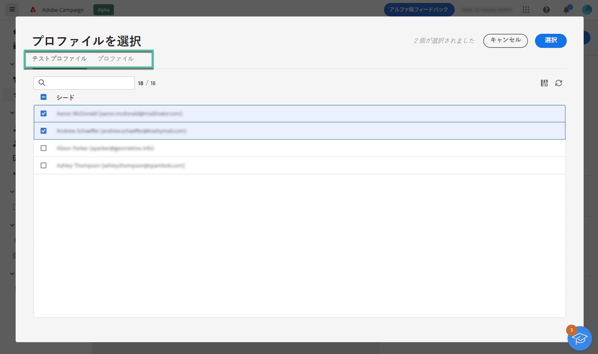
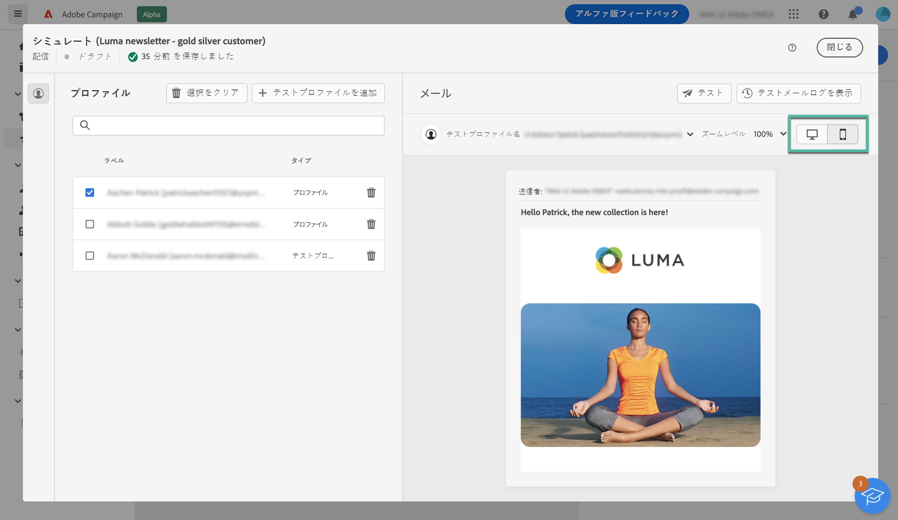

# メールコンテンツのプレビュー {#preview}

>[!CONTEXTUALHELP]
>id="acw_homepage_card4"
>title="コンテンツのスマートプレビュー"
>abstract="Adobe Campaignでは、プロファイルを使用して、送信前に E メールのコンテンツをプレビューし、パーソナライゼーションと受信者への表示方法を確認できます。"

Adobe Campaign では、プロファイルを使用して、送信前にメールのコンテンツをプレビューし、パーソナライゼーションを確認して、受信者にどのように表示されるのかを確認できます。

メッセージは、次を使用してプレビューできます。

* **テストプロファイル**:データベース内の追加の架空の受信者であるシードアドレスを使用して、e メールをプレビューします。
* **プロファイル**：既存のプロファイルを使用してメールをプレビューします。

メールのコンテンツをプレビューするには、次の手順に従います。

1. メールコンテンツ作成画面にアクセスし、「**[!UICONTROL コンテンツをシミュレート]**」をクリックします。

1. 「**[!UICONTROL プロファイルを選択]**」ボタンをクリックし、「**[!UICONTROL テストプロファイル]**&#x200B;および&#x200B;**[!UICONTROL プロファイル]**」タブをクリックして、1 つまたは複数のプロファイルを選択します。

   テストプロファイルとプロファイルの両方を組み合わせて、メールをプレビューできます。

   

1. プロファイルを選択すると、右側のパネルにメールのプレビューが表示されます。パーソナライズされた要素は、左側のパネルで選択したプロファイルのデータに置き換えられます。

   複数のプロファイルを追加した場合は、リスト内の各プロファイルを切り替えて、対応するメールをプレビューできます。

   様々なデバイス（デスクトップ、モバイル、タブレットなど）でのコンテンツのレンダリングをプレビューすることもできます。

   
