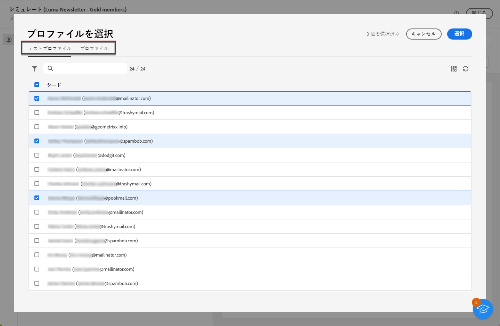
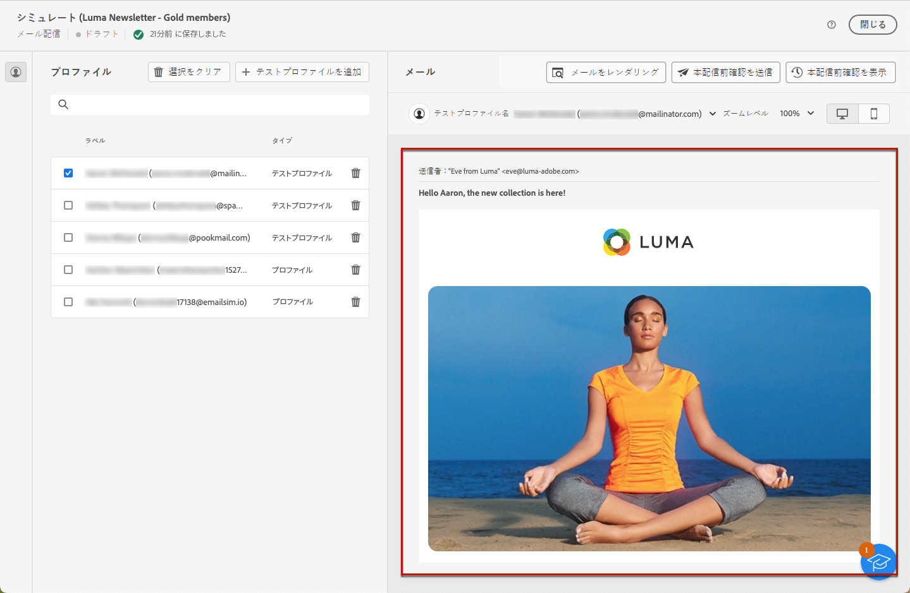

# メッセージコンテンツのプレビュー {#preview-content}

[!DNL Campaign] コンテンツシミュレーション機能を使用して、メッセージを送信する前にコンテンツをプレビューします。これにより、パーソナライゼーションを制御し、受信者に対するパーソナライゼーションの表示方法を確認できます。

配信のコンテンツをプレビューするには、次の手順に従います。

1. 配信のコンテンツを編集画面または[メールデザイナー](../email/get-started-email-designer.md)を参照します。

1. 「**[!UICONTROL コンテンツをシミュレート]**」ボタンをクリックします。

   {zoomable=&quot;yes&quot;}

1. コンテンツのプレビューに使用するプロファイルを選択します。これを行うには、「**[!UICONTROL テストプロファイルを追加]**」ボタン（メールと SMS の場合）または「**[!UICONTROL 購読者を追加]**」ボタン（プッシュ通知の場合）をクリックします。

1. プロファイルとテストプロファイルを組み合わせて、メールまたは SMS メッセージをプレビューできます。

   * 「**[!UICONTROL テストプロファイル]**」タブには、データベース内の架空の追加受信者であるすべてのテストプロファイルが一覧表示されます。[詳しくは、テストプロファイルの操作方法を参照してください](../audience/test-profiles.md)

   * 「**[!UICONTROL プロファイル]**」タブには、データベースに保存されているすべてのプロファイルが一覧表示されます。[詳しくは、プロファイルの操作方法を参照してください](../audience/about-recipients.md)

   {zoomable=&quot;yes&quot;}

1. テストプロファイルリストまたはプロファイルリストを参照する際に、フィルターを使用して検索を絞り込むことができます。例えば、**[!UICONTROL 見込み客]**&#x200B;ステータスとなっている、すべてのテストプロファイルを検索するルールを定義できます。[ルールの追加方法については、クエリモデラーを参照してください](../query/query-modeler-overview.md)。

   {zoomable=&quot;yes&quot;}

1. 「**[!UICONTROL 選択]**」をクリックして選択内容を確定します。

   配信コンテンツのプレビューが、**[!UICONTROL シミュレート]**&#x200B;画面の右側のパネルに表示されます。パーソナライズされた要素は、左側のパネルで選択したプロファイルのデータに置き換えられます。

   {zoomable=&quot;yes&quot;}

1. 複数のプロファイルを追加した場合は、リスト内のプロファイルを切り替えて、対応する配信コンテンツをプレビューできます。また、左側のパネルの対応するボタンを使用して、さらにテストプロファイルを追加したり、選択をクリアしたりすることもできます。

1. メール配信の場合、右上隅の専用アイコンを使用して、**[!UICONTROL ズームレベル]**&#x200B;を調整し、デスクトップまたはモバイルデバイスでコンテンツをプレビューできます。

1. **[!UICONTROL シミュレート]**&#x200B;画面では、次の操作も実行できます。
   * 検証用の特定の受信者への本配信前確認の送信 - [詳細情報](test-deliveries.md)
   * 送信済み本配信前確認のログへのアクセス - [詳細情報](test-deliveries.md#access-test-deliveries)
   * メールのみの場合、一般的なメールクライアントでのメッセージコンテンツのレンダリングの確認 - [詳細情報](email-rendering.md)

