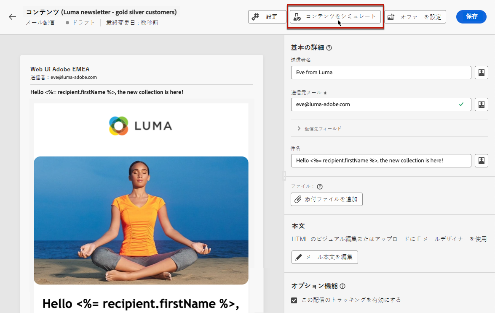

# 配信コンテンツをプレビュー {#preview-content}

以下を使用： [!DNL Campaign] コンテンツシミュレーション機能を使用して、メッセージを送信する前にメッセージのコンテンツをプレビューできます。 これにより、パーソナライゼーションを制御し、受信者に対するパーソナライゼーションの表示方法を確認できます。

配信のコンテンツをプレビューするには、次の手順に従います。

1. 配信のコンテンツを編集画面を参照します。

   <!--email [Edit content](../content/edit-content.md) screen or to the [Email Designer](../content/get-started-email-designer.md).-->

1. 「**[!UICONTROL コンテンツをシミュレート]**」ボタンをクリックします。

   

1. パーソナライズされたコンテンツのプレビューに使用するプロファイルを選択するには、次を使用します。

   * **[!UICONTROL テストプロファイルを追加]** （E メールと SMS 配信のプレビュー用）

   * **[!UICONTROL 購読者を追加]** （プッシュ通知のプレビュー）

1. テストプロファイルとプロファイルを組み合わせて、E メールや SMS メッセージをプレビューできます。

   * 「**[!UICONTROL テストプロファイル]**」タブには、データベース内の架空の追加受信者であるすべてのシードアドレスが一覧表示されます。

     >[!NOTE]
     >
     >テストプロファイルは、[!DNL Campaign] コンソールの&#x200B;**[!UICONTROL リソース]**／**[!UICONTROL キャンペーン管理]**／**[!UICONTROL シードアドレス]**&#x200B;フォルダーに作成されます。詳しくは、[Campaign v8（コンソール）ドキュメント](https://experienceleague.adobe.com/docs/campaign/campaign-v8/audience/add-profiles/test-profiles.html?lang=ja){target="_blank"}を参照してください.

   * 「**[!UICONTROL プロファイル]**」タブには、コンソールから&#x200B;**[!UICONTROL プロファイルとターゲット]**&#x200B;フォルダーに保存されたすべての受信者がリストされます。[!DNL Campaign]詳細については、[Campaign v8 コンソールドキュメント](https://experienceleague.adobe.com/docs/campaign/campaign-v8/audience/view-profiles.html?lang=ja)を参照してください{target="_blank"}。

   

1. クリック **[!UICONTROL 選択]** をクリックして選択を確定します。

   配信コンテンツのプレビューが **[!UICONTROL シミュレート]** 画面 パーソナライズされた要素は、左側のパネルで選択したプロファイルのデータに置き換えられます。

   

1. 複数のプロファイルを追加した場合は、リスト内で切り替えて、対応する配信コンテンツをプレビューできます。 また、左側のパネルの対応するボタンを使用して、さらにテストプロファイルを追加したり、選択をクリアしたりすることもできます。

1. E メール配信の場合は、 **[!UICONTROL ズームレベル]** および右上隅の専用アイコンを使用して、デスクトップまたはモバイルデバイスでコンテンツをプレビューします。

1. **[!UICONTROL シミュレート]**&#x200B;画面では、次の操作も実行できます。
   * 特定の受信者にテスト配信を送信し、検証を実施します — [詳細情報](test-deliveries.md)
   * 送信済みテスト配信のログにアクセス — [詳細情報](test-deliveries.md#access-proofs)
   * E メールのみの場合は、一般的な E メールクライアントでメッセージコンテンツのレンダリングを確認します。 [詳細情報](email-rendering.md)

