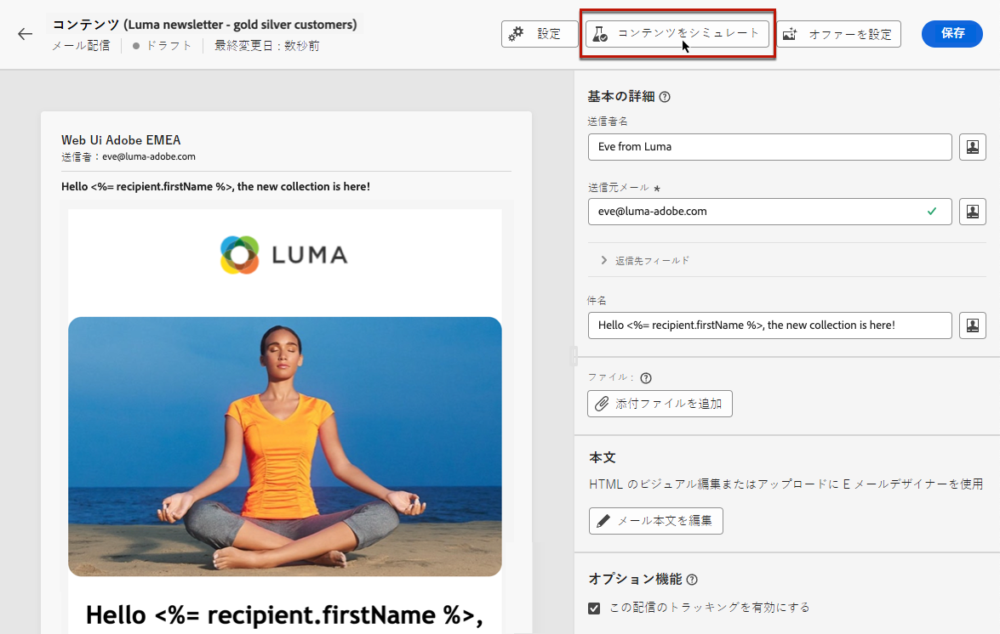

# 配信のプレビューとテストについて {#about-preview-test}

>[!CONTEXTUALHELP]
>id="acw_deliveries_simulate"
>title="メッセージのプレビューとテスト"
>abstract="メッセージコンテンツを定義したら、テストプロファイルを使用してプレビューとテストを行うことができます。"
>additional-url="https://experienceleague.adobe.com/docs/campaign-web/v8/msg/preview-test/preview-content.html" text="配信コンテンツのプレビュー"
>additional-url="https://experienceleague.adobe.com/docs/campaign-web/v8/msg/preview-test/preview-test.html" text="テストメッセージの送信"

配信コンテンツを定義したら、メッセージを送信する前に、テストプロファイルを使用してプレビューおよびテストできます。

これは、コンテンツが正確であると同時に、コンテンツとパーソナライゼーション設定の両方にエラーがないことを確認するための重要な手順です。

これを行うには、[!DNL Adobe Campaign] で次の操作を実行します。

* [メッセージの内容とパーソナライゼーションのプレビュー](preview-content.md)
* [テスト配信の送信](proofs.md) テストおよび検証の対象となる特定の受信者または購読者
* 一般的なデスクトップ、モバイル、web ベースのクライアントで[メールのレンダリングを確認](email-rendering.md)します。

これらのアクションは、 **[!UICONTROL コンテンツをシミュレート]** ボタン（配信のコンテンツを編集画面からアクセス可能）

<!-- from the [Edit content](../content/edit-content.md) screen or from the [Email Designer](../content/get-started-email-designer.md).-->

>[!NOTE]
>
>「**[!UICONTROL 確認して送信]**」ボタンをクリックすると、[配信概要](../monitor/prepare-send.md)からコンテンツシミュレーションを利用することもできます。
