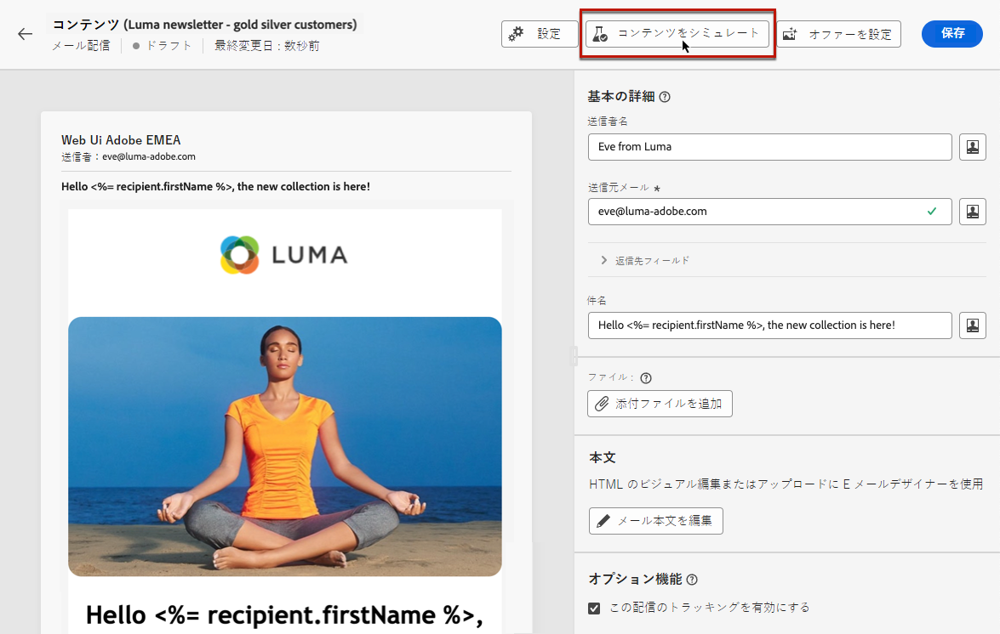

# プレビューとテストについて {#about-preview-test}

>[!CONTEXTUALHELP]
>id="acw_deliveries_simulate"
>title="コンテンツのプレビューとテスト"
>abstract="コンテンツを定義したら、プロファイルとテストプロファイルを使用してプレビューとテストを行うことができます。"
>additional-url="https://experienceleague.adobe.com/docs/campaign-web/v8/msg/preview-test/preview-test.html?lang=ja" text="配達確認の送信"
>additional-url="https://experienceleague.adobe.com/docs/campaign-web/v8/landing-pages/create-lp.html?lang=ja#test-landing-page" text="ランディングページのテスト"

配信コンテンツを定義したら、メッセージを送信する前に、プロファイルとテストプロファイルを使用してプレビューとテストを行うことができます。 この手順により、コンテンツとパーソナライゼーションの設定の両方の正確性が確保され、エラーが排除されます。

[!DNL Adobe Campaign Web user interface] では、次の操作を実行できます。

* [メッセージのコンテンツとパーソナライゼーションのプレビュー](preview-content.md)
* テストおよび検証のために特定の受信者またはサブスクライバーに対して[本配信前確認を送信](test-deliveries.md)
* 一般的なデスクトップ、モバイル、web ベースのクライアントで[メールのレンダリングを確認](email-rendering.md)します。
* [読みやすさ、CTAの有効性、件名の品質などを評価するために、コンテンツの品質](../content/brands-score.md#validate-quality)を検証します
* [ランディングページのプレビューとテスト](../landing-pages/create-lp.md#test-landing-page)

これらのアクションは、配信のコンテンツを編集画面または[E メールデザイナー](../email/get-started-email-designer.md)からアクセスできる「**[!UICONTROL コンテンツをシミュレート]**」ボタンを使用して実行します。

{zoomable="yes"}

>[!NOTE]
>
>「**[!UICONTROL 確認して送信]**」ボタンをクリックすると、[配信概要](../monitor/prepare-send.md)からコンテンツシミュレーションを利用することもできます。
>
>ファイルからアップロードされたオーディエンスをターゲットにする場合は、配信をプレビューしテストする方法については[この節](../audience/file-audience.md#preview--test-your-email-test)を参照してください。