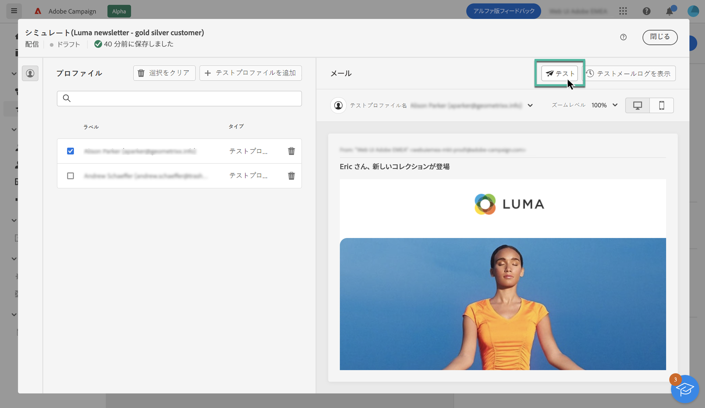
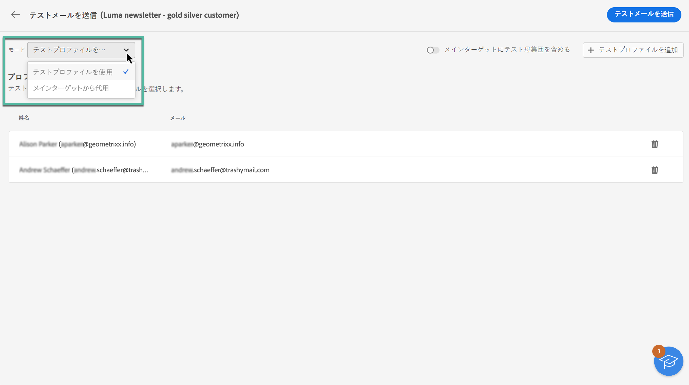

# テストメールを送信 {#send-proofs}

テストメールの送信は、メールキャンペーンを検証し、潜在的な問題を特定するための重要な手順です。 テスト E メールを送信することで、リンク、オプトアウトリンク、画像、ミラーページなどの様々な要素を確認し、エラーを検出できます。

テスト E メールは、次の 2 種類の受信者に送信できます。

* **テストプロファイル**:シードアドレスにテストメールを送信します。シードアドレスは、データベース内の追加の架空の受信者です。 これらは、Adobe Campaignコンソールの **[!UICONTROL リソース]** / **[!UICONTROL Campaign Management]** / **[!UICONTROL シードアドレス]** フォルダー。

* **メインターゲットからの代替**:既存のプロファイルを偽装しているときに、特定のメールアドレスにテストメールを送信します。 これにより、E メールを受信者と同じように体験し、プロファイルが受け取ったメッセージを正確に表示できます。

## テスト受信者を選択 {#recipients}

1. E メールコンテンツのシミュレーション画面にアクセスし、 **[!UICONTROL テスト]** 」ボタンをクリックします。

   

1. 以下を使用： **[!UICONTROL モード]** ドロップダウンリストを使用して、テスト E メールを受信する受信者のタイプを選択します。

   * **テストプロファイル**:シードアドレスにテスト用の E メールを送信します。シードアドレスは、データベース内の追加の架空の受信者です。

   * **メインターゲットからの代替**:既存のプロファイルを偽装しているときに、特定のメールアドレスにテストメールを送信します。 これにより、E メールを受信者と同じように体験し、プロファイルが受け取るメッセージを正確に表示できます。

   

   >[!NOTE]
   >
   >デフォルトでは、 **[!UICONTROL テストプロファイル]** モードが選択されています。 コンテンツシミュレーション画面で E メールのプレビュー用のプロファイルを既に選択している場合、それらのプロファイルはテスト受信者として事前に選択されています。 選択を解除したり、受信者を追加したりできます。

1. テストメールを代替プロファイルに送信するには、 **[!UICONTROL ターゲットからの代替]** モードで次の手順に従います。

   1. 次をクリック： **[!UICONTROL アドレスを追加]** ボタンをクリックし、テスト電子メールを受信する電子メールアドレスを指定します。

      任意の電子メールアドレスを入力できます。 これにより、Adobe Campaign V8 のユーザーでなくても、すべてのユーザーにテストメールを送信できます。

   1. テスト E メールの送信に使用するプロファイルをターゲットから選択します。 また、Adobe Campaign にターゲットからランダムプロファイルを選択させることもできます。

   1. 受信者を確認し、必要な数のアドレスを追加するように操作を繰り返します。

      

1. テスト受信者を選択したら、テスト用 E メールを送信できます。 [テストメールの送信方法を説明します](#send)

   >[!NOTE]
   >
   >テスト用 E メールの受信者に最終的な E メールメッセージを送信する場合は、 **[!UICONTROL メインターゲットにテスト母集団を含める]** オプションをオンにします。

## テストメールを送信 {#send}

選択した受信者にテスト E メールを送信するには、 **[!UICONTROL テストメールの送信]** 次に、送信を確定します。

配信のコンテンツが完成するまで、必要な数のテスト E メールを送信します。 この操作が完了したら、メールをメインターゲットに送信できます。[メールの準備と送信の方法を学ぶ](../monitor/prepare-send.md)

## 送信済みテストメールにアクセス {#access-proofs}

テスト E メールが送信されると、 **[!UICONTROL テストメールログを表示]** 」ボタンをクリックします。

これらのログでは、選択した配信に対して送信されたすべてのテスト E メールにアクセスし、送信に関する特定の統計を視覚化できます。 [詳しくは、配信ログの監視方法を参照してください](../monitor/delivery-logs.md)

また、他の配信と同様に、配信リストから送信済みのテスト E メールにアクセスすることもできます。

