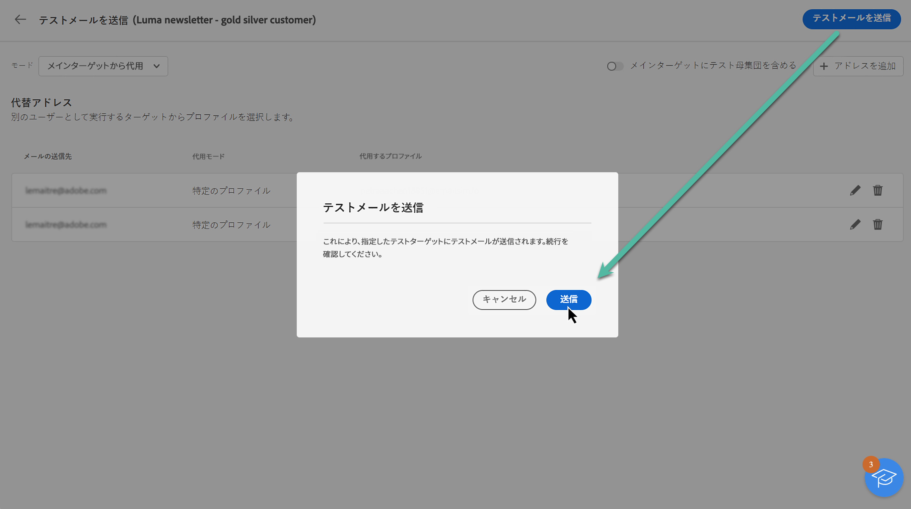
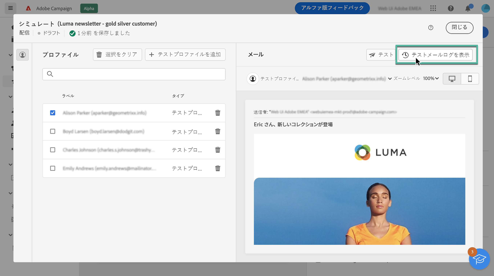
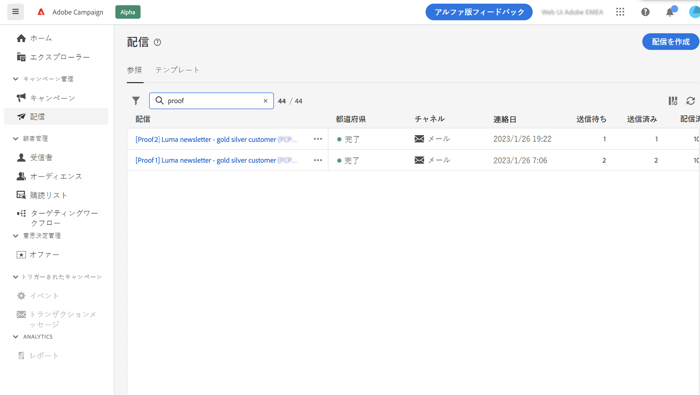

# 配達確認の送信 {#send-proofs}

テスト E メールを送信すると、E メールを検証し、リンク、オプトアウトリンク、ミラーページ、画像などの様々な要素を確認して、可能性のあるエラーを検出できます。

配達確認は、次の 2 種類の受信者に送信できます。

* **テストプロファイル**:配達確認をシードアドレスに送信します。シードアドレスは、データベース内の追加の架空の受信者です。
* **代替プロファイル**：既存のプロファイルを使用して、特定のメールアドレスに配達確認を送信します。これを使用すると、プロファイルの位置に自分を配置し、プロファイルが受け取るメッセージを正確に表示できます。

## 配達確認の受信者を選択 {#recipients}

1. メールコンテンツ作成画面にアクセスし、「**[!UICONTROL コンテンツをシミュレート]**」をクリックします。

1. 「**[!UICONTROL テスト]**」ボタンをクリックし、「**[!UICONTROL モード]**」ドロップダウンリストを使用して、配達確認を受け取る受信者のタイプを選択します。

<!-- to check: by default, profiles selected in previous screen are pre-selected for proofs. Can add addtitional profiles + remove preselected?-->

### テストプロファイルへの配達確認の送信

1. 「**[!UICONTROL テストプロファイルを使用]**」モードを選択します。

1. テストメールを受信するテストプロファイルを追加します。

   <!--FOR BETA: You can also build an audience to select test profiles based on your own criteria using the **[!UICONTROL Add test audience]** button.-->

   

### 代替プロファイルへの配達確認の送信

1. 「**[!UICONTROL ターゲットからの代替]**」モードを選択します。

1. 配達確認を受信するメールアドレスを追加します。

   >[!NOTE]
   >
   >任意の電子メールアドレスを指定できます。 これにより、Adobe Campaign V8 のユーザーでなくても、任意のユーザーに配達確認を送信できます。

1. 各メールアドレスに対して、使用するターゲットからプロファイルを選択します。また、Adobe Campaign にターゲットからランダムプロファイルを選択させることもできます。

   

配達確認の受信者を選択したら、テストメールを送信できます。[配達確認の送信方法を学ぶ](#send)

>[!NOTE]
>
>配達確認の受信者に最終的なメールメッセージを送信する場合は、「**[!UICONTROL メインターゲットにテスト母集団を含める]**」オプションを有効にします。

## 配達確認を送信 {#send}

選択した受信者に配達確認を送信するには、「**[!UICONTROL テストメールの送信]**」をクリックして、送信を確定します。

配信のコンテンツが完成するまで、必要な数の配達確認を送信します。この操作が完了したら、メールをメインターゲットに送信できます。[メールの準備と送信の方法を学ぶ](../monitor/prepare-send.md)

## 送信済みの配達確認にアクセス {#access-proofs}

配達確認が送信されると、「**[!UICONTROL テストメールログを表示]**」ボタンから専用ログにアクセスできます。これらのログでは、選択した配信に対して送信されたすべての配達確認にアクセスし、送信に関連する特定の統計を視覚化できます。

また、他の配信と同様に、配信リストから配達確認にアクセスすることもできます。

