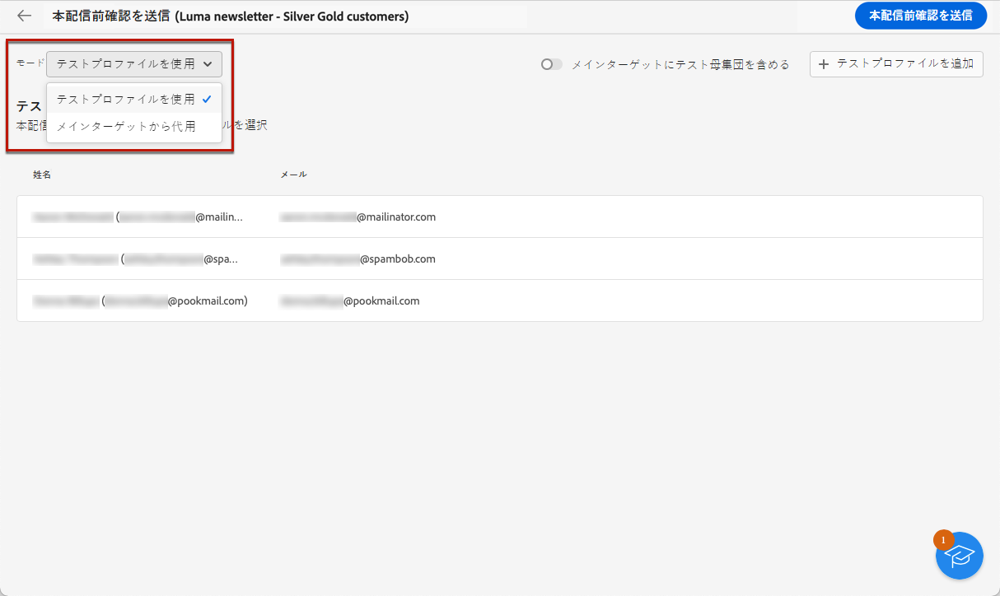
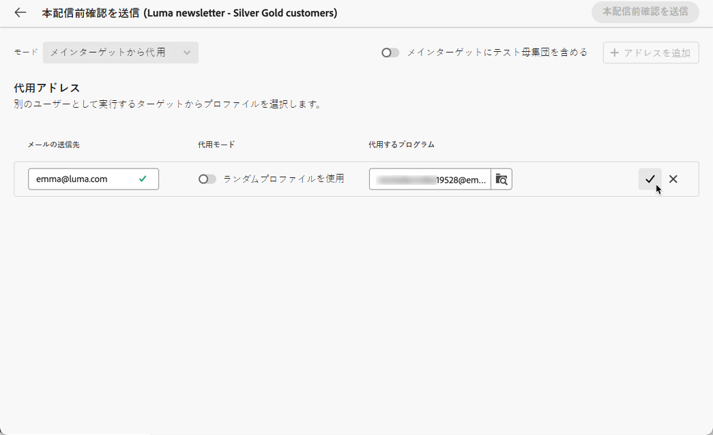
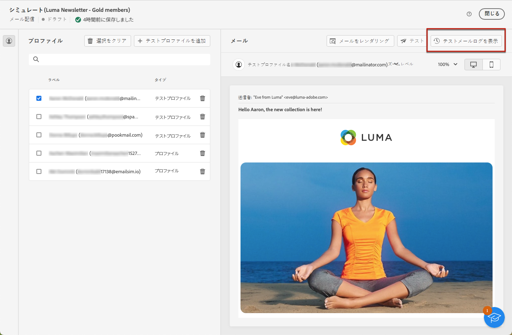
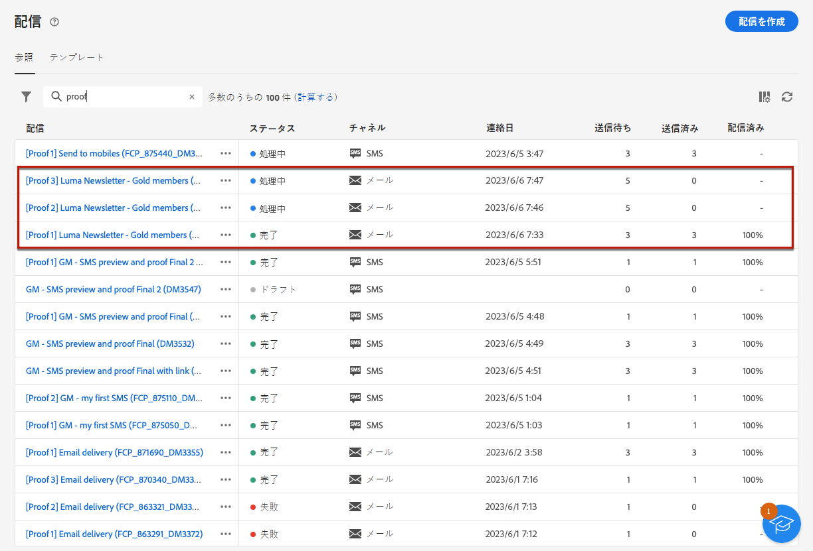

# テストメールの送信 {#send-test-emails}

**[!UICONTROL Adobe Campaign]** では、メッセージをメインオーディエンスに送信する前にテストできます。

テストメールの送信は、メールキャンペーンを検証し、潜在的な問題を特定するための重要な手順です。

テストの受信者は、リンク、オプトアウトリンク、画像、ミラーページなどの様々な要素を確認し、レンダリング、コンテンツ、パーソナライゼーション設定、E メール設定でエラーを検出できます。

## テスト受信者の選択 {#test-recipients}

テストメールは、次の 2 種類の受信者に送信できます。

* **テストプロファイル** ：シードアドレスにテストメールを送信します。シードアドレスは、データベース内の追加の架空の受信者です。 これらは、 [!DNL Campaign] コンソールを **[!UICONTROL リソース]** > **[!UICONTROL Campaign Management]** > **[!UICONTROL シードアドレス]** フォルダー。 詳しくは、 [Campaign v8（コンソール）ドキュメント](https://experienceleague.adobe.com/docs/campaign/campaign-v8/audience/add-profiles/test-profiles.html){target="_blank"}

* **メインターゲットから置換**  — 既存のプロファイルを偽装しているときに、特定の電子メールアドレスにテスト用の電子メールを送信します。 これにより、プロファイルが受け取るメッセージが正確に表示され、メール受信者と同じエクスペリエンスが得られます。

E メールテストの受信者を選択するには、次の手順に従います。

1. 電子メールにアクセス [コンテンツを編集](../content/edit-content.md) screen または [メールデザイナー](../content/get-started-email-designer.md)」、「 **[!UICONTROL コンテンツをシミュレート]** 」ボタンをクリックします。

1. 次をクリック： **[!UICONTROL テスト]** 」ボタンをクリックします。

   

1. 「**[!UICONTROL モード]**」ドロップダウンリストを使用して、テストメールを受信する受信者のタイプを選択します。

   * **テストプロファイル** 架空の受信者をターゲットにする

   * **メインターゲットから置換** 既存のプロファイルからのデータを表示しながら、特定の e メールアドレスにテストを送信する。

   

   >[!NOTE]
   >
   >デフォルトでは、 **[!UICONTROL テストプロファイルを使用]** モードが選択されています。 コンテンツシミュレーション画面でメールのプレビュー用のプロファイルを既に選択している場合、それらのプロファイルがテスト受信者として事前に選択されています。 選択を解除したり、受信者を追加したりできます。

1. テストメールを代替プロファイルに送信するには、 **[!UICONTROL ターゲットから置換]** モードを使用して、次の手順に従います。

   1. 「**[!UICONTROL アドレスを追加]**」ボタンをクリックし、テストメールを受信するメールアドレスを指定します。

      任意のメールアドレスを指定できます。これにより、任意のユーザー（のユーザーでないユーザーも含む）にテストメールを送信できます。 [!DNL Adobe Campaign].

   1. 代替として使用するプロファイルをターゲットから選択します。 また、 [!DNL Adobe Campaign] ターゲットからランダムプロファイルを選択します。 選択したプロファイルのプロファイルデータがテスト用 E メールに表示されます。

   1. 受信者を確認し、この操作を繰り返して必要な数のアドレスを追加します。

      

1. テスト受信者を選択したら、 [テストメールを送信](#send-test).

   >[!NOTE]
   >
   >テスト E メールの受信者に最終的な E メールメッセージを送信する場合は、 **[!UICONTROL メインターゲットにテスト母集団を含める]** オプション。

## メールの送信 {#send-test}

選択した受信者にテスト E メールを送信するには、次の手順に従います。

1. クリック **[!UICONTROL テストメールの送信]**.

1. 送信を確認します。

   

1. 配信のコンテンツが仕上がるまで、必要な数のテストメールを送信します。

これが完了したら、次の操作を実行できます。 [メールの準備と送信](../monitor/prepare-send.md) をメインターゲットに追加します。

## 送信済みテストメールへのアクセス {#access-proofs}

テストメールが送信されると、「**[!UICONTROL テストメールログを表示]**」ボタンを使用して専用ログにアクセスできます。

これらのログでは、選択した配信のすべての送信済みテストメールにアクセスしたり、送信に関係する特定の統計情報を視覚化したりできます。[配信ログの監視方法の詳細](../monitor/delivery-logs.md)

また、 [配信リスト](../msg/gs-messages.md)（他の配信と同様）

