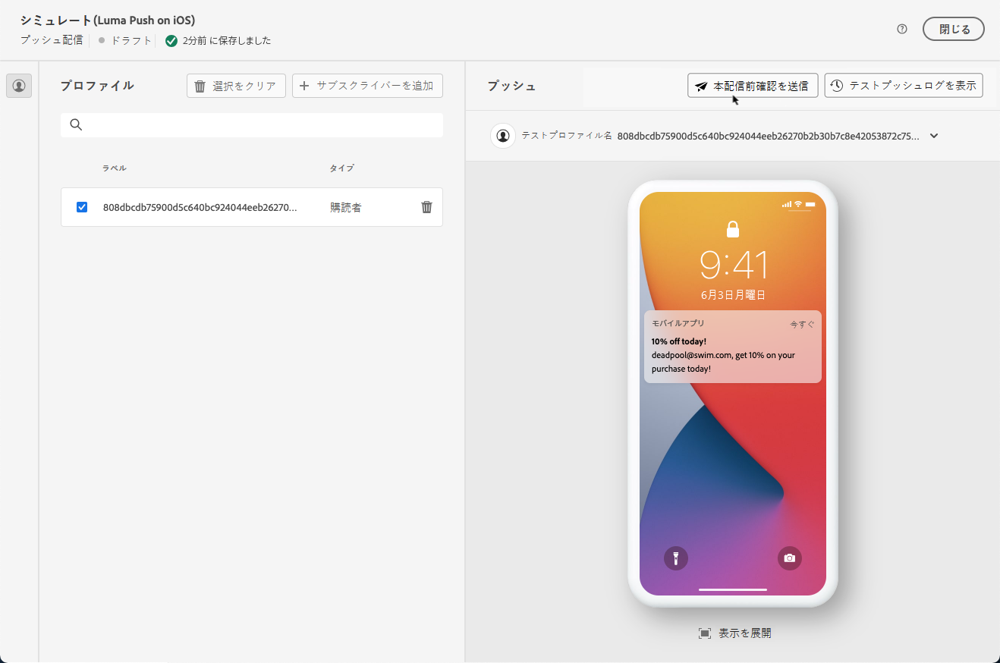
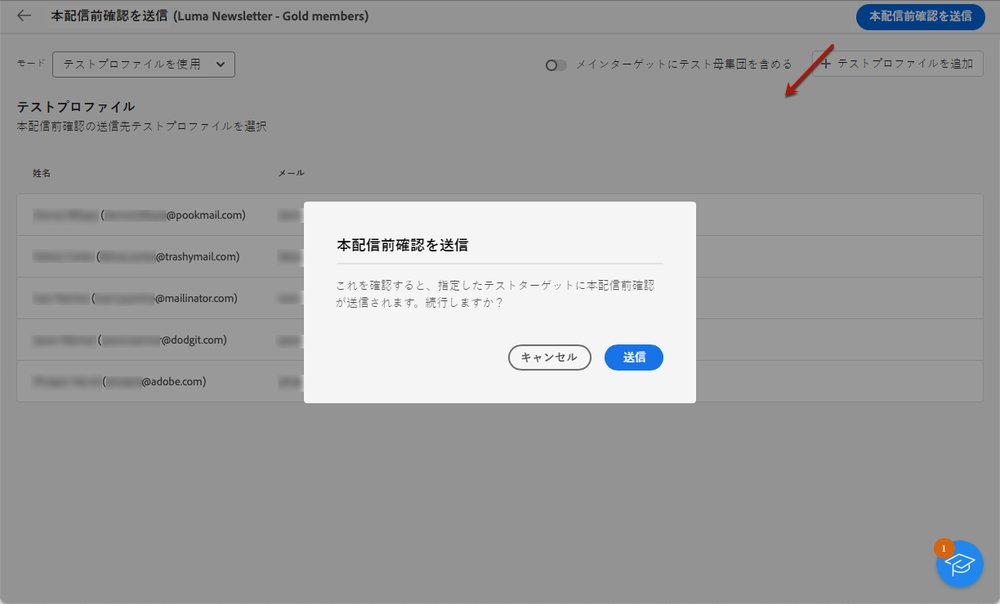

# テスト配信の送信 {#send-test-deliveries}

>[!CONTEXTUALHELP]
>id="acw_email_preview_mode"
>title="プレビューモード"
>abstract="テスト母集団をメインターゲットに含めて、メッセージをプレビューおよびテストします。"

**[!UICONTROL Adobe Campaign]** では、メッセージをメインオーディエンスに送信する前にテストできます。

テスト配信の送信は、キャンペーンを検証し、潜在的な問題を特定するための重要な手順です。

テストの受信者は、リンク、オプトアウトリンク、画像、ミラーページなどの様々な要素を確認し、レンダリング、コンテンツ、パーソナライゼーション設定、配信設定でエラーを検出できます。

## テスト受信者の選択 {#test-recipients}

>[!CONTEXTUALHELP]
>id="acw_email_preview_option_test_target"
>title="テスト母集団"
>abstract="テスト母集団モードを選択します。"

使用しているチャネルに応じて、テストメッセージを次の 3 種類の受信者に送信できます。

* [テストプロファイル](#test-profiles)  — 送信 **メールと SMS のテスト** シードアドレス（データベース内の追加の架空の受信者）に割り当てます。

  これらは、 [!DNL Campaign] コンソールを **[!UICONTROL リソース]** > **[!UICONTROL Campaign Management]** > **[!UICONTROL シードアドレス]** フォルダー。 詳しくは、 [Campaign v8（コンソール）ドキュメント](https://experienceleague.adobe.com/docs/campaign/campaign-v8/audience/add-profiles/test-profiles.html){target="_blank"}

* [メインターゲットから置換](#substitution-profiles)  — 送信 **メールと SMS のテスト** 既存のプロファイルを偽装しているときに、特定の電子メールアドレスまたは電話番号にアクセスできるようになりました。

  これにより、受信者と同じようにメッセージを体験し、プロファイルが受け取るコンテンツを正確に表示できます。

* [購読者](#subscribers)  — 送信 **プッシュ通知のテスト** をデータベースに追加した架空の購読者に送信できます。

  テストプロファイルと同様に、 [!DNL Campaign] コンソールを **[!UICONTROL リソース]** > **[!UICONTROL Campaign Management]** > **[!UICONTROL シードアドレス]** フォルダー。 詳しくは、 [Campaign v8（コンソール）ドキュメント](https://experienceleague.adobe.com/docs/campaign/campaign-v8/audience/add-profiles/test-profiles.html){target="_blank"}

テスト配信の受信者を選択するには、使用するプロファイルのタイプに応じて、次の手順に従います。

### テストプロファイル {#test-profiles}

1. E メールまたは SMS 配信のコンテンツを編集画面を参照し、 **[!UICONTROL コンテンツをシミュレート]** 」ボタンをクリックします。

1. 次をクリック： **[!UICONTROL テスト]** 」ボタンをクリックします。

   >[!NOTE]
   >
   >既に [配信のプレビュー](preview-content.md)の場合、それらは左側のウィンドウにリストされます。

   

1. 次の **[!UICONTROL モード]** ドロップダウンリストで、「 **[!UICONTROL テストプロファイル]** ：テスト e メールまたは SMS 配信を受信する架空の受信者をターゲットに設定します。

   

1. 既に [メッセージのプレビュー](preview-content.md) コンテンツシミュレーション画面では、これらのプロファイルはテストの受信者として事前に選択されています。 選択を解除したり、 **[!UICONTROL テストプロファイルを追加]** 」ボタンをクリックします。

   >[!NOTE]
   >
   >デフォルトでは、 **[!UICONTROL テストプロファイルを使用]** モードが選択されています。

1. テスト配信の受信者にも最終的なメッセージを送信するには、 **[!UICONTROL メインターゲットにテスト母集団を含める]** オプション。

1. テストプロファイルを選択したら、 [テスト配信を送信](#send-test).

### 代替プロファイル {#substitution-profiles}

の既存のプロファイルのデータを表示しながら、特定の E メールアドレスまたは電話番号にテスト E メールまたは SMS を送信するには [!DNL Campaign] データベース、代替プロファイルを使用します。

1. テストを送信する前に、配信用のオーディエンスを定義しておく必要があります。 [詳細情報](../audience/about-audiences.md)

1. E メールまたは SMS 配信のコンテンツを編集画面を参照し、 **[!UICONTROL コンテンツをシミュレート]** 」ボタンをクリックします。

1. 次をクリック： **[!UICONTROL テスト]** 」ボタンをクリックします。

   

1. 次の **[!UICONTROL モード]** ドロップダウンリストで、「 **[!UICONTROL メインターゲットから置換]** 既存のプロファイルからのデータを表示しながら、特定の電子メールアドレスまたは電話番号にテストを送信する。

   >[!CAUTION]
   >
   >選択していない場合は、 [audience](../audience/about-audiences.md) 配信の場合、 **[!UICONTROL メインターゲットから置換]** オプションは灰色表示になり、代用プロファイルを選択できなくなります。

1. 次をクリック： **[!UICONTROL アドレスを追加]** ボタンをクリックして、テスト配信を受信する電子メールアドレスまたは電話番号を指定します。

   

   >[!NOTE]
   >
   >任意の電子メールアドレスまたは電話番号を入力できます。 これにより、任意の受信者（のユーザーでない場合でも）にテスト配信を送信できます。 [!DNL Adobe Campaign].

1. 代替として使用するプロファイルをデータベースから選択します。 また、 [!DNL Adobe Campaign] ランダムプロファイルを選択します。 選択したプロファイルのプロファイルデータがテスト配信に表示されます。

1. 受信者を確認し、操作を繰り返して、必要な数の E メールアドレスまたは電話番号を追加します。

   

1. テスト配信の受信者にも最終的なメッセージを送信するには、 **[!UICONTROL メインターゲットにテスト母集団を含める]** オプション。

1. 代替プロファイルを選択すると、次の操作が可能になります。 [テスト配信を送信](#send-test).

### サブスクライバー {#subscribers}

プッシュ通知を扱う場合、テスト配信は購読者にのみ送信できます。 選択するには、次の手順に従います。

1. 配信のコンテンツを編集画面を参照し、 **[!UICONTROL コンテンツをシミュレート]** 」ボタンをクリックします。

1. 次をクリック： **[!UICONTROL テスト]** 」ボタンをクリックします。

   

1. 既に [配信のプレビュー](preview-content.md) コンテンツシミュレーション画面では、これらのプロファイルがテスト購読者として事前に選択されています。

   該当するボタンを使用して、選択をクリアしたり、追加の購読者を追加したりできます。

   

1. テスト購読者にも最終的なプッシュ通知を送信するには、 **[!UICONTROL メインターゲットにテスト母集団を含める]** オプション。

1. 購読者を選択すると、次の操作が可能になります [テスト配信を送信](#send-test).

## テスト配信を送信 {#send-test}

選択した受信者にテスト配信を送信するには、次の手順に従います。

1. 次をクリック： **[!UICONTROL テストを送信]** 」ボタンをクリックします。

1. 送信を確認します。

   

1. 配信のコンテンツが完成するまで、必要な数のテストを送信します。

完了したら、配信を準備し、メインターゲットに送信できます。 以下の該当する節で方法を説明します。

* [メールを送信](../monitor/prepare-send.md)
* [プッシュ通知を送信](../push/send-push.md#send-push)
* [SMS 配信の送信](../sms/send-sms.md#send-sms)

## 送信済みテスト配信へのアクセス {#access-proofs}

テスト配信が送信されると、 **[!UICONTROL テストログを表示]** 」ボタンをクリックします。

これらのログでは、選択した配信に対して送信されたすべてのテストにアクセスし、送信に関連する特定の統計を視覚化できます。 [配信ログの監視方法の詳細](../monitor/delivery-logs.md)

また、 [配信リスト](../msg/gs-messages.md)（他の配信と同様）

