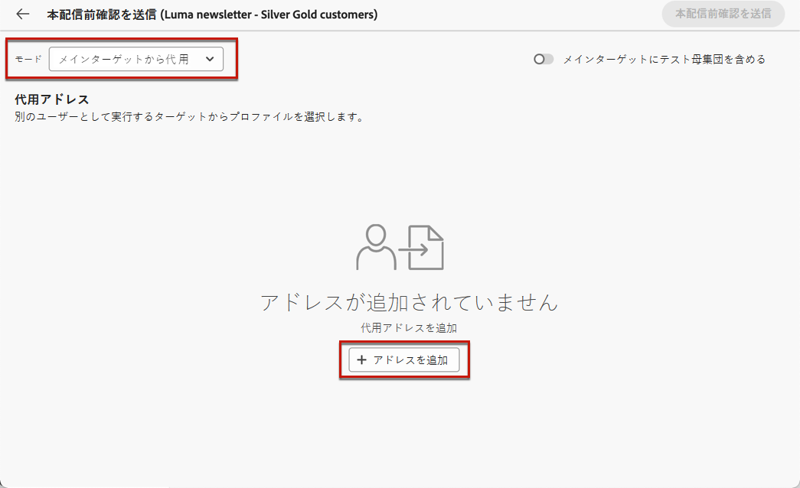
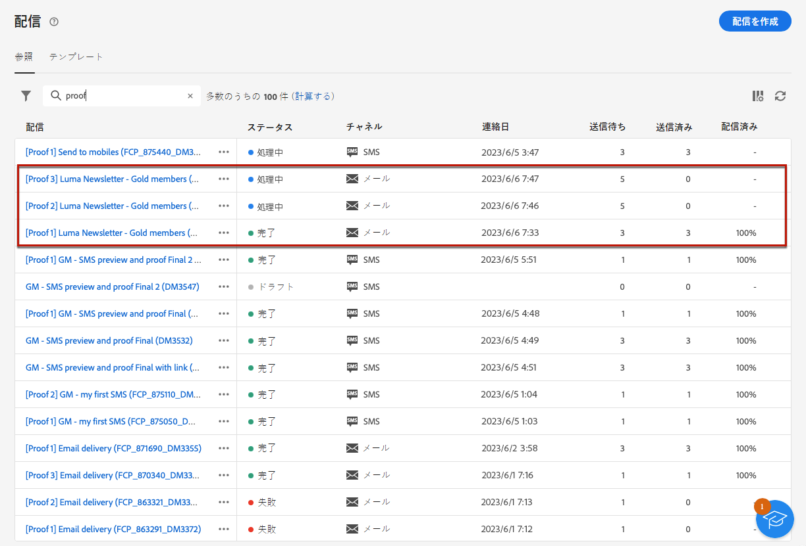

# テスト配信の送信 {#send-test-deliveries}

>[!CONTEXTUALHELP]
>id="acw_email_preview_mode"
>title="プレビューモード"
>abstract="テスト母集団をメインターゲットに含めて、メッセージをプレビューおよびテストします。"

メッセージの内容を定義したら、テスト配信 ( 「配達確認」) を使用して、プロファイルをテストします。 パーソナライズされたコンテンツを挿入した場合は、このコンテンツがメッセージにどのように表示されるかを、テストプロファイルデータを使用して確認できます。

メッセージのコンテンツやパーソナライゼーションの設定でエラーが発生する可能性を検出するには、テストメッセージをテストプロファイルに送信してから、ターゲットオーディエンスに送信します。 最新のコンテンツを検証するには、変更を加えるたびにテストメッセージを送信する必要があります。 テスト配信（旧称「配達確認」）の送信は、キャンペーンを検証し、潜在的な問題を特定するための重要な手順です。テストメッセージの受信者は、リンク、オプトアウトリンク、画像、ミラーページなどの様々な要素を確認し、レンダリング、コンテンツ、パーソナライゼーション設定、配信設定でエラーを検出できます。

## テスト受信者を選択 {#test-recipients}

>[!CONTEXTUALHELP]
>id="acw_email_preview_option_test_target"
>title="テスト母集団"
>abstract="テスト母集団モードを選択します。"

使用しているチャネルに応じて、テストメッセージを次の 3 種類の受信者に送信できます。

* [テストプロファイル](#test-profiles) - シードアドレス（データベースに追加されている受信者）に&#x200B;**テストメールと SMS** を送信します。これらは、[!DNL Campaign] コンソールの&#x200B;**[!UICONTROL リソース]**／**[!UICONTROL キャンペーン管理]**／**[!UICONTROL シードアドレス]**&#x200B;フォルダーに作成されます。詳しくは、[Campaign v8（クライアントコンソール）ドキュメント](https://experienceleague.adobe.com/docs/campaign/campaign-v8/audience/add-profiles/test-profiles.html?lang=ja){target="_blank"}を参照してください

* [メインターゲットから代用](#substitution-profiles) - 既存のプロファイルを借用して、特定のメールアドレスまたは電話番号に&#x200B;**テストメールと SMS** を送信します。これにより、プロファイルが受け取るコンテンツが正確に表示され、メッセージ受信者と同じエクスペリエンスが得られます。

* [サブスクライバー](#subscribers) - データベースに追加された架空のサブスクライバーに&#x200B;**テストプッシュ通知**&#x200B;を送信します。テストプロファイルは同様に、[!DNL Campaign] コンソールの&#x200B;**[!UICONTROL リソース]**／**[!UICONTROL キャンペーン管理]**／**[!UICONTROL シードアドレス]**&#x200B;フォルダーに作成されます。詳しくは、[Campaign v8（クライアントコンソール）ドキュメント](https://experienceleague.adobe.com/docs/campaign/campaign-v8/audience/add-profiles/test-profiles.html?lang=ja){target="_blank"}を参照してください

テスト配信の受信者を選択するには、使用するプロファイルのタイプに応じて、次の手順に従います。

### テストプロファイル {#test-profiles}

>[!CONTEXTUALHELP]
>id="acw_deliveries_simulate_test_mode"
>title="配達確認のターゲット"
>abstract="メインターゲットに送信する前に配信をテストする場合は、2 番目のファイルを「配達確認のターゲット」としてアップロードできます。"

>[!CONTEXTUALHELP]
>id="acw_deliveries_simulate_test_upload"
>title="プロファイルのアップロード"
>abstract="メインターゲットに使用したセットとは異なるセットで配信をテストする場合は、追加のプロファイルを含む 2 番目のファイルをアップロードできます。"

>[!CONTEXTUALHELP]
>id="acw_deliveries_simulate_test_sample"
>title="テンプレートファイル"
>abstract="メモ：ファイル形式は、元のファイルと同じにする必要があります。 サポートされているファイル形式：txt、csv。最大ファイルサイズ：15 MB。先頭行を列ヘッダーとして使用します。"

テストプロファイルはシードアドレスで、データベースの追加の受信者です。 これらは、 [!DNL Adobe Campaign] クライアントコンソールを **[!UICONTROL リソース]** > **[!UICONTROL Campaign Management]** > **[!UICONTROL シードアドレス]** フォルダー。 シードアドレスにテストメッセージを送信する手順については、以下で詳しく説明します。

1. メールまたは SMS 配信のコンテンツを編集画面を参照し、「**[!UICONTROL コンテンツをシミュレート]**」ボタンをクリックします。

1. 「**[!UICONTROL テスト]**」ボタンをクリックします。

   >[!NOTE]
   >
   >[配信のプレビュー](preview-content.md)用のプロファイルを既に選択している場合、左側のパネルにリストされます。

   

1. **[!UICONTROL モード]**&#x200B;ドロップダウンリストから「**[!UICONTROL テストプロファイル]**」を選択し、テストメールまたは SMS 配信を受信する架空の受信者をターゲットにします。

   

1. コンテンツシミュレーション画面で[メッセージのプレビュー](preview-content.md)用のプロファイルを既に選択している場合、それらのプロファイルがテスト受信者として事前に選択されています。「**[!UICONTROL テストプロファイルを追加]**」ボタンを使用して、選択を解除したり、追加の受信者を追加したりできます。

   >[!NOTE]
   >
   >デフォルトでは、**[!UICONTROL テストプロファイルを使用]**&#x200B;モードが選択されています。

1. テスト配信の受信者に最終的なメッセージを送信するには、「**[!UICONTROL メインターゲットにテスト母集団を含める]**」オプションを有効にします。

1. テストプロファイルを選択したら、[テスト配信を送信](#send-test)できます。

### 代用プロファイル {#substitution-profiles}

の既存のプロファイルのデータを表示しながら、特定の E メールアドレスまたは電話番号にテスト E メールまたは SMS を送信するには [!DNL Adobe Campaign] データベース、次に説明する代替プロファイルを使用します。

1. テストを送信する前に、配信のターゲットオーディエンスを定義する必要があります。[詳細情報](../audience/about-recipients.md)

1. メールまたは SMS 配信のコンテンツを編集画面を参照し、「**[!UICONTROL コンテンツをシミュレート]**」ボタンをクリックします。

1. 「**[!UICONTROL テスト]**」ボタンをクリックします。

   

1. **[!UICONTROL モード]**&#x200B;ドロップダウンリストから「**[!UICONTROL メインターゲットから代用]**」を選択し、既存のプロファイルのデータを表示しながら、特定のメールアドレスまたは電話番号にテストを送信します。

   >[!CAUTION]
   >
   >配信の[オーディエンス](../audience/about-recipients.md)を選択していない場合、「**[!UICONTROL メインターゲットから代用]**」オプションは灰色表示され、代用プロファイルを選択できません。

1. 「**[!UICONTROL アドレスを追加]**」ボタンをクリックし、テスト配信を受信するメールアドレスまたは電話番号を指定します。

   

   >[!NOTE]
   >
   >任意のメールアドレスまたは電話番号を指定できます。これにより、任意の受信者にテスト配信を送信できます。[!DNL Adobe Campaign] のユーザーでなくても構いません。

1. 配信用に定義したターゲットから、代用として使用するプロファイルを選択します。また、[!DNL Adobe Campaign] にターゲットからランダムプロファイルを選択させることもできます。選択したプロファイルのプロファイルデータがテスト配信に表示されます。

1. 受信者を確認し、この操作を繰り返して必要な数のメールアドレスまたは電話番号を追加します。

   

1. また、テスト配信の受信者にも最終的なメッセージを送信するには、「**[!UICONTROL メインターゲットにテスト母集団を含める]**」オプションを選択します。

1. 代用プロファイルを選択したら、[テスト配信を送信](#send-test)できます。

### サブスクライバー {#subscribers}

プッシュ通知を扱う場合、テスト配信はアプリの購読者にのみ送信できます。 選択するには、次の手順に従います。

1. 配信のコンテンツを編集画面を参照し、「**[!UICONTROL コンテンツをシミュレート]**」ボタンをクリックします。

1. 「**[!UICONTROL テスト]**」ボタンをクリックします。

   

1. コンテンツシミュレーション画面で[配信のプレビュー](preview-content.md)用のサブスクライバーを既に選択している場合、それらのプロファイルがテストサブスクライバーとして事前に選択されています。

   専用のボタンを使用して、選択を解除したり、サブスクライバーを追加したりできます。

   

1. また、テストサブスクライバーにも最終的なプッシュ通知を送信するには、「**[!UICONTROL メインターゲットにテスト母集団を含める]**」オプションを選択します。

1. サブスクライバーを選択したら、[テスト配信を送信](#send-test)できます。

## テスト配信の送信 {#send-test}

選択した受信者にテスト配信を送信するには、次の手順に従います。

1. 「**[!UICONTROL テストを送信]**」ボタンをクリックします。

1. 送信を確定します。

   

1. 配信のコンテンツが完成するまで、必要な数のテストを送信します。

完了したら、メインターゲットに配信を準備して送信できます。以下の該当する節で方法を説明します。

* [メールの送信](../monitor/prepare-send.md)
* [プッシュ通知の送信](../push/send-push.md#send-push)
* [SMS 配信の送信](../sms/send-sms.md#send-sms)

## 送信済みテスト配信へのアクセス {#access-proofs}

テスト配信が送信されると、「**[!UICONTROL テストログを表示]**」ボタンを使用して専用ログにアクセスできます。

これらのログでは、選択した配信のすべての送信済みテストにアクセスしたり、送信に関係する特定の統計情報を視覚化したりできます。[配信ログの監視方法の詳細](../monitor/delivery-logs.md)

また、他の任意の配信と同様に、[配信リスト](../msg/gs-messages.md)から送信済みテストにアクセスすることもできます。

