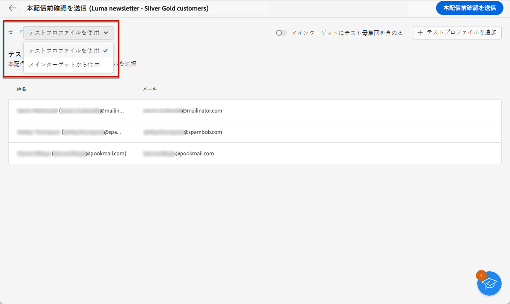
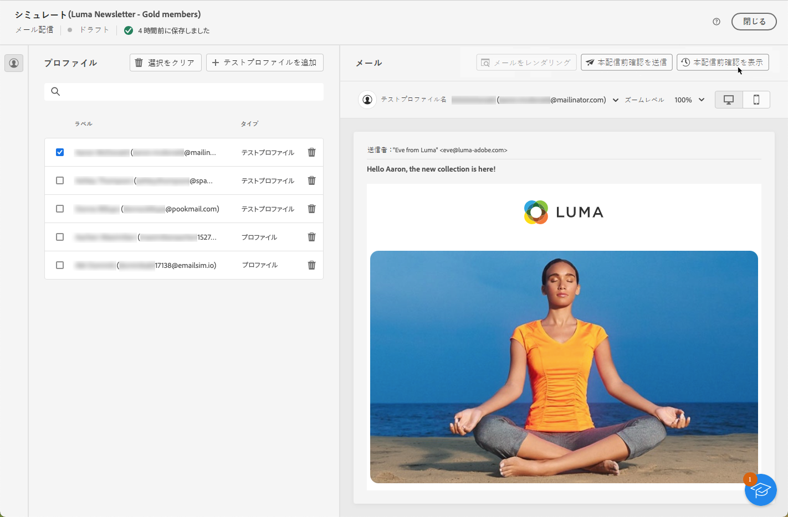

# 本配信前確認の送信 {#send-test-deliveries}

>[!CONTEXTUALHELP]
>id="acw_email_preview_mode"
>title="プレビューモード"
>abstract="テスト母集団をメインターゲットに含めて、メッセージをプレビューおよびテストします。"

>[!CONTEXTUALHELP]
>id="acw_deliveries_additional_proof_target"
>title="追加の配達確認ターゲット"
>abstract="追加の配達確認ターゲット。"

メッセージコンテンツを定義したら、本配信前確認をテストプロファイルに送信することで、メッセージコンテンツをプレビューおよびテストできます。パーソナライズされたコンテンツを挿入した場合は、このコンテンツがメッセージにどのように表示されるかを、テストプロファイルデータを使用して確認できます。

メッセージのコンテンツやパーソナライゼーション設定でエラーが発生する可能性を検出するには、メッセージをターゲットオーディエンスに送信する前に、本配信前確認をテストプロファイルに送信します。変更を加えるたびに配達確認を送信して、最新のコンテンツを確認します。本配信前確認の送信は、キャンペーンを検証し、潜在的な問題を特定するための重要な手順です。本配信前確認の受信者は、リンク、オプトアウトリンク、画像、ミラーページなどの様々な要素を確認し、レンダリング、コンテンツ、パーソナライゼーション設定、配信設定のエラーを検出できます。

## テストプロファイルを使用したコンテンツのシミュレート {#simulate-content-test-deliveries}

>[!CONTEXTUALHELP]
>id="acw_email_preview_option_test_target"
>title="テスト母集団"
>abstract="テスト母集団モードを選択します。"

本配信前確認を送信する前に、配信のターゲットオーディエンスを定義する必要があります。[詳細情報](../audience/add-audience.md)

メッセージコンテンツのテストを開始するには：

1. 配信のコンテンツを編集します。
1. 「**[!UICONTROL コンテンツをシミュレート]**」ボタンをクリックします。
1. 「**[!UICONTROL 本配信前確認を送信]**」ボタンをクリックして、本配信前確認を送信します。

   {zoomable="yes"}

1. 本配信前確認の受信者を選択します。

   メッセージチャネルに応じて、配達確認を次のタイプの受信者に送信できます。

   * SMS やメールの場合は、[テストプロファイル](#test-profiles)を使用できます。これは、データベース内の特定の追加受信者です。また、[メインターゲットからの代用](#substitution-profiles)モードを使用したり、既存プロファイルのパーソナライゼーションデータを使用したりすることもできます。この代用モードでは、本配信前確認をメールのテストアドレスまたは電話番号に送信します。これにより、プロファイルが受け取るコンテンツが正確に表示され、メッセージ受信者と同じエクスペリエンスが得られます。

   * プッシュメッセージの場合は、データベースに追加した架空の[サブスクライバー](#subscribers)を使用できます。これらは、[!DNL Campaign] コンソールで作成します。詳しくは、[Campaign v8（クライアントコンソール）ドキュメント](https://experienceleague.adobe.com/docs/campaign/campaign-v8/audience/add-profiles/test-profiles.html?lang=ja){target="_blank"}を参照してください。

   各モードの詳細な設定については、以下を参照してください。

## テストプロファイルの使用 {#test-profiles}

>[!CONTEXTUALHELP]
>id="acw_deliveries_simulate_test_mode"
>title="配達確認のターゲット"
>abstract="メインターゲットに送信する前に配信をテストする場合は、2 番目のファイルを「配達確認のターゲット」としてアップロードできます。"

>[!CONTEXTUALHELP]
>id="acw_deliveries_simulate_test_upload"
>title="プロファイルのアップロード"
>abstract="メインターゲットに使用したセットとは異なるセットで配信をテストする場合は、追加のプロファイルを含む 2 番目のファイルをアップロードできます。"

>[!CONTEXTUALHELP]
>id="acw_deliveries_simulate_test_sample"
>title="テンプレートファイル"
>abstract="メモ：ファイル形式は、元のファイルと同じにする必要があります。 サポートされているファイル形式：txt、csv。最大ファイルサイズ：15 MB。先頭行を列ヘッダーとして使用します。"

>[!CONTEXTUALHELP]
>id="acw_sms_preview_option_app_target"
>title="メインオーディエンスにテストプロファイルを含める"
>abstract="本配信前確認の受信者にも最終メッセージを送信するには、このオプションを有効にします。"

テストプロファイルは、データベース内の追加の受信者です。これらは、**[!UICONTROL 顧客管理]**／**[!UICONTROL プロファイル]**&#x200B;メニューから作成されます。[詳細情報](../audience/test-profiles.md#create-test-profiles)

テストプロファイルに本配信前確認を送信する手順については、以下で詳しく説明します。

1. 配信のコンテンツから、「**[!UICONTROL コンテンツをシミュレート]**」ボタン、「**[!UICONTROL 本配信前確認を送信]**」ボタンの順にクリックします。

1. 本配信前確認または SMS 配信を受信する架空の受信者をターゲットにするには、**[!UICONTROL モード]**&#x200B;ドロップダウンリストから「**[!UICONTROL テストプロファイル]**」を選択します。

   {zoomable="yes"}

1. コンテンツシミュレーション画面で[メッセージのプレビュー](preview-content.md)用のプロファイルを既に選択している場合、それらのプロファイルが本配信前確認の受信者として事前に選択されています。「**[!UICONTROL テストプロファイルを追加]**」ボタンを使用して、選択を解除したり、追加の受信者を追加したりできます。

1. テストプロファイルリストまたはプロファイルリストを参照する際に、フィルターを使用して検索を絞り込むことができます。例えば、**[!UICONTROL 見込み客]**&#x200B;ステータスとなっている、すべてのテストプロファイルを検索するルールを定義できます。ルールの追加方法について詳しくは、[クエリモデラー](../query/query-modeler-overview.md)を参照してください。

   {zoomable="yes"}

1. 本配信前確認の受信者にも最終メッセージを送信するには、「**[!UICONTROL メインターゲットにテスト母集団を含める]**」オプションを選択します。

   {zoomable="yes"}

1. テストプロファイルを選択したら、[本配信前確認を送信](#send-test)できます。

## プロファイルデータの代用 {#substitution-profiles}

プロファイルの代用を使用すると、[!DNL Adobe Campaign] データベースの既存プロファイルのデータを表示しながら、特定のメールアドレスまたは電話番号に配達確認を送信できます。このモードは、配信のオーディエンスが定義されている場合にのみ選択できます。

メインターゲットからプロファイルデータを代用するには、次の手順に従います。

1. 配信のコンテンツから、「**[!UICONTROL コンテンツをシミュレート]**」ボタン、「**[!UICONTROL 本配信前確認を送信]**」ボタンの順にクリックします。

1. **[!UICONTROL モード]**&#x200B;ドロップダウンリストから「**[!UICONTROL メインターゲットから代用]**」を選択し、既存のプロファイルのデータを表示しながら、特定のメールアドレスまたは電話番号に本配信前確認を送信します。

   >[!CAUTION]
   >
   >配信の [ オーディエンス ](../audience/about-recipients.md) を選択していない場合、「**[!UICONTROL メインターゲットから代用]**」オプションは灰色表示され、代用プロファイルを選択できません。 また、ターゲットオーディエンスが選択されている場合でも、繰り返しタイプの配信では、メインの配信がテンプレートなので、このオプションは引き続きグレー表示されます。

1. 「**[!UICONTROL アドレスを追加]**」ボタンをクリックし、本配信前確認を受信するメールアドレスまたは電話番号を指定します。

   {zoomable="yes"}

   >[!NOTE]
   >
   >任意のメールアドレスまたは電話番号を指定できます。これにより、任意の受信者に本配信前確認を送信できます。[!DNL Adobe Campaign] のユーザーでなくても構いません。

1. 配信用に定義したターゲットから、代用として使用するプロファイルを選択します。また、[!DNL Adobe Campaign] にターゲットからランダムプロファイルを選択させることもできます。選択したプロファイルのプロファイルデータが本配信前確認に表示されます。

1. 受信者を確認し、この操作を繰り返して必要な数のメールアドレスまたは電話番号を追加します。

   {zoomable="yes"}

1. 本配信前確認の受信者にも最終メッセージを送信するには、「**[!UICONTROL メインターゲットにテスト母集団を含める]**」オプションを選択します。

1. 代用プロファイルを選択したら、[本配信前確認を送信](#send-test)できます。

## アプリのサブスクライバーへ本配信前確認を送信 {#subscribers}

プッシュ通知を使用してデザインする場合、本配信前確認はアプリのサブスクライバーにのみ送信できます。これらのサブスクライバーを選択するには、次の手順に従います。

1. プッシュ配信のコンテンツから、「**[!UICONTROL コンテンツをシミュレート]**」ボタンをクリックし、続いて「**[!UICONTROL 本配信前確認を送信]**」ボタンをクリックします。

   {zoomable="yes"}

1. コンテンツシミュレーション画面で[配信のプレビュー](preview-content.md)用のサブスクライバーを既に選択している場合、それらのプロファイルがテストサブスクライバーとして事前に選択されています。

   専用のボタンを使用して、選択を解除したり、サブスクライバーを追加したりできます。

   {zoomable="yes"}

1. また、テストサブスクライバーにも最終的なプッシュ通知を送信するには、「**[!UICONTROL メインターゲットにテスト母集団を含める]**」オプションを選択します。

1. サブスクライバーを選択したら、[本配信前確認を送信](#send-test)できます。

## 本配信前確認の送信 {#send-test}

選択した受信者に本配信前確認を送信するには、次の手順に従います。

1. 「**[!UICONTROL 本配信前確認を送信]**」ボタンをクリックします。

1. 送信を確定します。

   {zoomable="yes"}

1. 配信のコンテンツが完成するまで、必要な数の本配信前確認を送信します。

完了したら、メインターゲットに配信を準備して送信できます。以下の該当する節で方法を説明します。

* [メールの送信](../monitor/prepare-send.md)
* [プッシュ通知の送信](../push/send-push.md#send-push)
* [SMS 配信の送信](../sms/send-sms.md#send-sms)

## 送信された本配信前確認へのアクセス {#access-test-deliveries}

本配信前確認が送信されると、**[!UICONTROL コンテンツをシミュレート]**&#x200B;画面からログにアクセスできます。

これらのログでは、選択した配信のすべての送信済み本配信前確認にアクセスしたり、送信に関する特定の統計情報を視覚化したりできます。[配信ログの監視方法の詳細](../monitor/delivery-logs.md)

{zoomable="yes"}

また、他の任意の配信と同様に、[配信リスト](../msg/gs-messages.md)から送信済みの本配信前確認にアクセスすることもできます。

{zoomable="yes"}