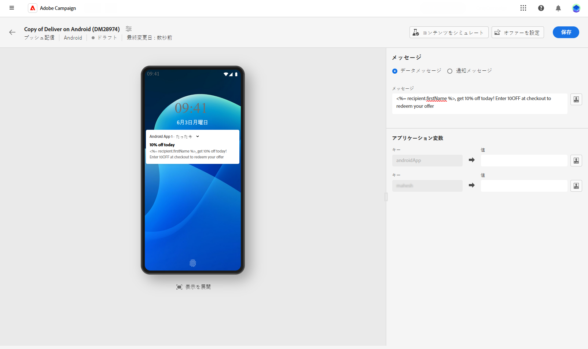
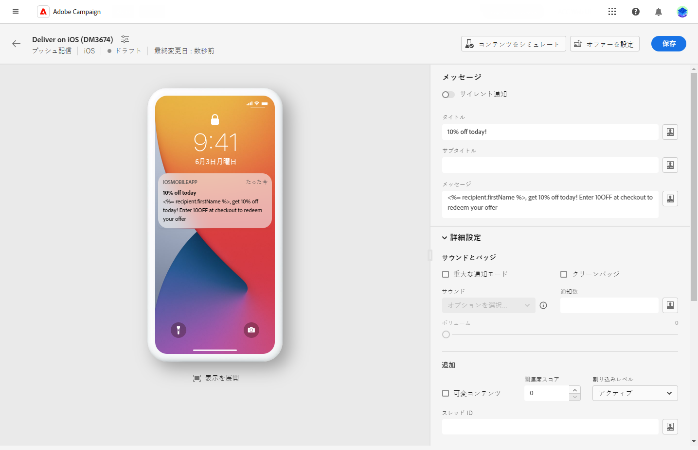
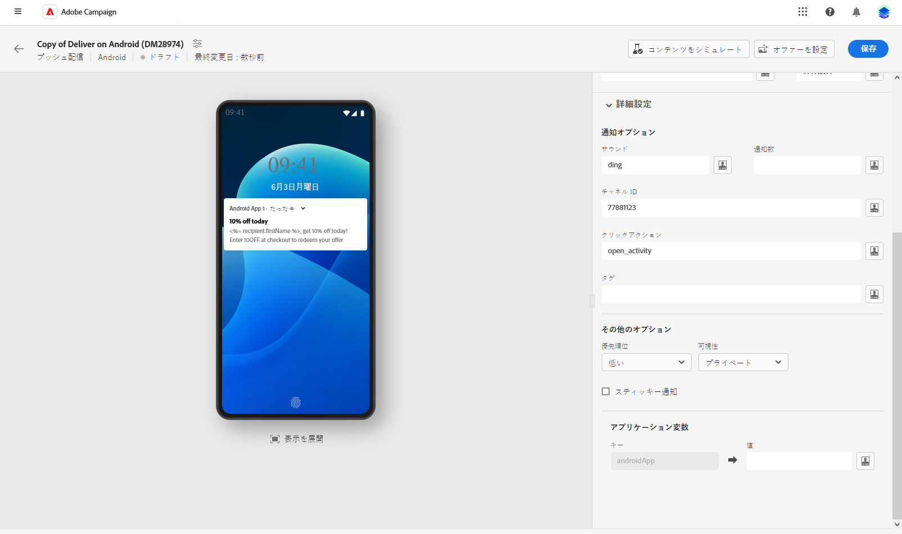
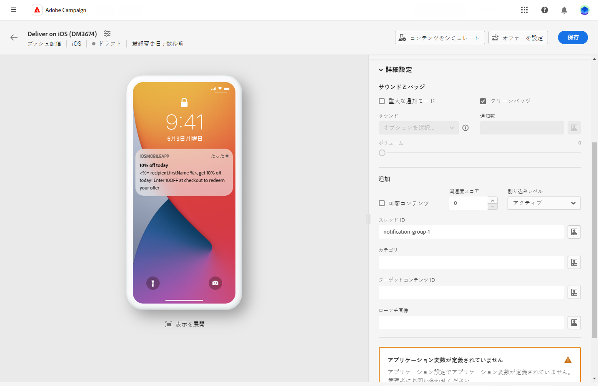

# プッシュ配信をデザイン {#content-push}

>[!CONTEXTUALHELP]
>id="acw_deliveries_push_android_content"
>title="Android コンテンツのプッシュ"
>abstract="Android デバイス用のプッシュ通知のコンテンツを定義します。メッセージの作成を開始するには、「**コンテンツを編集**」ボタンをクリックします。"

>[!CONTEXTUALHELP]
>id="acw_deliveries_push_ios_content"
>title="iOS コンテンツのプッシュ"
>abstract="iOS デバイス用のプッシュ通知のコンテンツを定義します。メッセージの作成を開始するには、「**コンテンツを編集**」ボタンをクリックします。"

## 通知のコンテンツの定義 {#push-message}

>[!CONTEXTUALHELP]
>id="acw_deliveries_push_ios_msg"
>title="プッシュ iOS メッセージ"
>abstract="iOS デバイス用のプッシュ通知のコンテンツを定義します。メッセージを作成するには、「**タイトル**」フィールドと「**メッセージ**」フィールドをクリックします。式エディターを使用して、データのパーソナライズ、動的コンテンツの追加を行います。その他のカスタム設定については、**詳細設定**&#x200B;の節を参照してください。"

>[!CONTEXTUALHELP]
>id="acw_deliveries_push_android_msg"
>title="プッシュ Android メッセージ"
>abstract="Android デバイス用のプッシュ通知のコンテンツを定義します。メッセージを作成するには、「**タイトル**」フィールドと「**メッセージ**」フィールドをクリックします。式エディターを使用して、データのパーソナライズ、動的コンテンツの追加を行います。プッシュ通知をさらにパーソナライズするには、プッシュ通知に追加する画像、プロファイルのデバイスおよびそのカラーに表示する通知のアイコンを選択します。その他のカスタム設定については、**詳細設定**&#x200B;の節を参照してください。"

>[!CONTEXTUALHELP]
>id="acw_deliveries_push_ios_silent"
>title="iOS のサイレント通知"
>abstract="サイレントプッシュモードを使用すると、モバイルアプリケーションに「サイレント」通知を送信できます。ユーザーは、通知が到着したことを知らされません。通知は、アプリケーションに直接転送されます。"

プッシュ配信を作成したら、そのコンテンツを定義できます。パラメーターと設定は、モバイルオペレーティングシステム（Android または iOS）によって異なります。各オペレーティングシステムでメッセージを作成する方法については、以下のタブを参照してください。

>[!BEGINTABS]

>[!TAB Android]

Firebase Cloud Messaging では、次の 2 種類のメッセージの中から選択できます。

* **[!UICONTROL データメッセージ]**&#x200B;は、クライアントアプリで処理されます。これらのメッセージは、モバイルアプリケーションに直接送信され、デバイス上で Android 通知を生成して表示されます。データメッセージには、カスタムアプリケーション変数のみが含まれます。

  コンテンツの定義、データのパーソナライズ、動的コンテンツの追加を行うには、「**[!UICONTROL メッセージ]**」フィールドをクリックし、式エディターを使用します。このエディターにアクセスして、メッセージをカスタマイズできます。
**[!UICONTROL アプリケーション変数]**&#x200B;メニューに追加される変数は、自動的に追加されます。これらの変数を使用して、通知の動作を定義できます。例えば、ユーザーが通知を有効化したときに表示される、特定のアプリケーション画面を設定できます。

  

* **[!UICONTROL 通知メッセージ]**&#x200B;は、FCM SDK によって自動的に処理されます。 FCM は、クライアントアプリに代わって、ユーザーのデバイスにメッセージを自動的に表示します。通知メッセージには、事前に定義された一連のパラメーターとオプションが含まれていますが、カスタムアプリケーション変数を使用してさらにパーソナライズすることもできます。

  メッセージを作成するには、「**[!UICONTROL タイトル]**」フィールドと「**[!UICONTROL メッセージ]**」フィールドをクリックします。式エディターを使用して、コンテンツの定義、データのパーソナライズ、動的コンテンツの追加を行います。

  プッシュ通知をさらにパーソナライズするには、プッシュ通知に追加する画像、プロファイルのデバイスおよびそのカラーに表示する通知のアイコンを選択します。

  

>[!TAB iOS]

メッセージを作成するには、「**[!UICONTROL タイトル]**」フィールドと「**[!UICONTROL メッセージ]**」フィールドをクリックします。式エディターを使用して、コンテンツの定義、データのパーソナライズ、動的コンテンツの追加を行います。

**[!UICONTROL 字幕]**（iOS 通知ペイロードの subtitle パラメーターの値）を追加することができます。この節を参照してください。

サイレントプッシュモードを使用すると、モバイルアプリケーションに「サイレント」通知を送信できます。ユーザーは、通知が到着したことを知らされません。通知は、アプリケーションに直接転送されます。

>[!ENDTABS]

## プッシュ通知の詳細設定 {#push-advanced}

>[!CONTEXTUALHELP]
>id="acw_deliveries_push_advanced_settings"
>title="プッシュ通知の詳細設定"
>abstract="プッシュ通知の詳細設定（優先度、関連する通知数、アプリケーション変数など）を定義します。"

>[!CONTEXTUALHELP]
>id="acw_deliveries_push_advanced_settings_critical"
>title="重大な通知モード"
>abstract="ユーザーの電話がフォーカスモードに設定されている場合や、デバイスがミュートになっている場合でも、通知にサウンドを追加するには、このオプションを有効にします。これにより、どのような場合でもユーザーに重要なアラートが通知されます。"

>[!CONTEXTUALHELP]
>id="acw_deliveries_push_advanced_settings_count"
>title="通知数"
>abstract="アプリアイコンに直接表示する未読通知の数を設定するには、このオプションを使用します。これにより、ユーザーは保留中の通知数をすばやく確認できます。"

>[!CONTEXTUALHELP]
>id="acw_deliveries_push_advanced_settings_mutable"
>title="可変コンテンツ"
>abstract="モバイルアプリケーションが通知に関連付けられたメディアコンテンツをダウンロードできるようにするには、このオプションを有効にします。"

>[!CONTEXTUALHELP]
>id="acw_deliveries_push_advanced_settings_score"
>title="関連度スコア"
>abstract="通知概要内の通知の順序に優先順位を付けるには、関連度スコアを 0 ～ 100 に設定します。スコアが高いほど、より重要な通知を示します。"

>[!CONTEXTUALHELP]
>id="acw_deliveries_push_advanced_settings_app_variables"
>title="アプリケーション変数"
>abstract="通知の動作を定義するには、アプリケーション変数を使用します。これらの変数は完全にカスタマイズ可能で、モバイルデバイスに送信されるメッセージペイロードの一部に含まれます。"

>[!CONTEXTUALHELP]
>id="acw_deliveries_push_advanced_settings_category"
>title="カテゴリ ID"
>abstract="通知に関連付けるカテゴリ ID の名前を指定します。これにより、アクションボタンの表示が有効になり、ユーザーはアプリケーションを開かずに通知から直接様々なタスクを実行できるようになります。"

詳細設定オプションは、モバイルオペレーティングシステム（Android または iOS）によって異なります。各オペレーティングシステムでメッセージのオプションを定義する方法については、以下のタブを参照してください。

>[!BEGINTABS]

>[!TAB Android]

| パラメーター | 説明 |
|---------|---------|
| **[!UICONTROL サウンド]** | デバイスが通知を受け取るときに再生するサウンドを設定します。 |
| **[!UICONTROL 通知数]** | アプリケーションアイコンに直接表示する新しい未読情報の数を設定します。これにより、ユーザーは保留中の通知数をすばやく確認できます。 |
| **[!UICONTROL チャネル ID]** | 通知のチャネル ID を設定します。このチャネル ID を持つ通知を受信するには、このチャネル ID を持つチャネルをアプリで事前に作成しておく必要があります。 |
| **[!UICONTROL クリックアクション]** | 通知のユーザークリックに関連付けられたアクションを設定します。これにより、ユーザーが通知を操作するときの動作（特定の画面を開く、アプリで特定のアクションを実行するなど）が決定されます。 |
| **[!UICONTROL タグ]** | 通知ドロワー内の既存の通知を置き換えるために使用する識別子を設定します。これにより、複数の通知が蓄積されるのを防ぎ、関連する最新通知のみが表示されるようにします。 |
| **[!UICONTROL 優先順位]** | 通知の優先度レベル（デフォルト、最小、低、高）を設定します。 優先度レベルは通知の重要度と緊急性を決定し、通知の表示方法と、特定のシステム設定をバイパスできるかどうかに影響します。詳しくは、[FCM のドキュメント](https://firebase.google.com/docs/reference/fcm/rest/v1/projects.messages?hl=ja#notificationpriority)を参照してください。 |
| **[!UICONTROL 可視性]** | 通知の表示レベルを（パブリック、プライベート、秘密）のいずれかに設定します。表示レベルは、通知の内容をロック画面やその他の機密領域にどの程度表示するかを決定します。詳しくは、[FCM ドキュメント](https://firebase.google.com/docs/reference/fcm/rest/v1/projects.messages#visibility)を参照してください。 |
| **[!UICONTROL スティッキー]** | 有効にした場合、ユーザーがクリックした後も通知は表示されたままになります。 無効にした場合、ユーザーが操作すると通知は自動的に閉じられます。スティッキー動作を使用すると、重要な通知を長期間画面に保持できます。 |
| **[!UICONTROL アプリケーション変数]** | 通知動作を定義できます。 これらの変数は完全にカスタマイズ可能で、モバイルデバイスに送信されるメッセージペイロードの一部に含まれます。 |

>[!TAB iOS]

| パラメーター | 説明 |
|---------|---------|
| **[!UICONTROL 重大なアラートモード]** | ユーザーの電話がフォーカスモードに設定されている場合や、デバイスがミュートになっている場合でも、通知にサウンドを追加するには、このオプションを有効にします。重要なアラートがユーザーに確実に通知されるようになります。選択すると、ボリュームレベルバーを使用して通知のボリュームを調整できます。バーの上の 0～100 の数値は、設定を反映します。 |
| **[!UICONTROL クリーンバッジ]** | アプリケーションアイコンに表示されるバッジ値を更新するには、このオプションを有効にします。バッジに新しい未読情報の数が正確に反映されるようになります。 |
| **[!UICONTROL 通知数]** | アプリケーションアイコンに直接表示される、新しい未読情報の数を示す数値を設定します。これにより、ユーザーは簡単かつ視覚的に参照できます。 |
| **[!UICONTROL ボリューム]** | サウンドのボリューム（0～100）。 |
| **[!UICONTROL 可変コンテンツ]** | このオプションを有効にすると、モバイルアプリケーションが通知に関連付けられたメディアコンテンツをダウンロードできるようになります。詳しくは、[Apple 開発者向けドキュメント](https://developer.apple.com/library/content/documentation/NetworkingInternet/Conceptual/RemoteNotificationsPG/ModifyingNotifications.html)を参照してください。 |
| **[!UICONTROL 関連度スコア]** | 通知概要内の通知の順序に優先順位を付けるには、関連度スコアを 0 ～ 100 に設定します。スコアが高いほど、より重要な通知を示します。 |
| **[!UICONTROL 割り込みレベル]** | <ul> <li>**[!UICONTROL アクティブ]**：デフォルトでは、通知が直ちに表示され、画面が点灯し、サウンドを再生できます。通知はフォーカスモードを妨げません。</li><li>**[!UICONTROL パッシブ]**：画面を点灯させたり、サウンドを再生したりせずに、システムは通知リストに通知を追加します。通知はフォーカスモードを妨げません。</li><li>**[!UICONTROL 時間依存]**：システムにより通知がすぐに表示され、画面が点灯し、サウンドを再生でき、フォーカスモードで通知することができます。このレベルでは、Apple からの特別な権限は必要ありません。</li> <li>**[!UICONTROL 重大]**：システムにより通知が直ちに表示され、画面が点灯し、ミュートスイッチまたはフォーカスモードがバイパスされます。このレベルには、Apple からの特別な権限が必要です。</ul> |
| **[!UICONTROL スレッド ID]** | 関連する通知をグループ化するために使用される識別子。同じスレッド ID を持つ通知は、通知リスト内の単一の会話またはスレッドとして整理されます。 |
| **[!UICONTROL カテゴリ]** | 通知に関連付けるカテゴリ ID の名前を指定します。これにより、アクションボタンの表示が有効になり、ユーザーはアプリケーションを開かずに通知から直接様々なタスクを実行できるようになります。 |
| **[!UICONTROL ターゲットコンテンツ ID]** | 通知が開かれたときに転送するアプリケーションウィンドウをターゲティングするために使用される識別子。 |
| **[!UICONTROL ローンチ画像]** | ユーザーが通知からアプリケーションの起動を選択したときに表示されるローンチ画像ファイルの名前を指定します。アプリの通常の起動画面ではなく、選択した画像が表示されます。 |
| **[!UICONTROL アプリケーション変数]** | 通知動作を定義できます。 これらの変数は完全にカスタマイズ可能で、モバイルデバイスに送信されるメッセージペイロードの一部に含まれます。 |

>[!ENDTABS]

<!--Sounds must be included in the application and defined when the service is created. Refer to this section.-->
