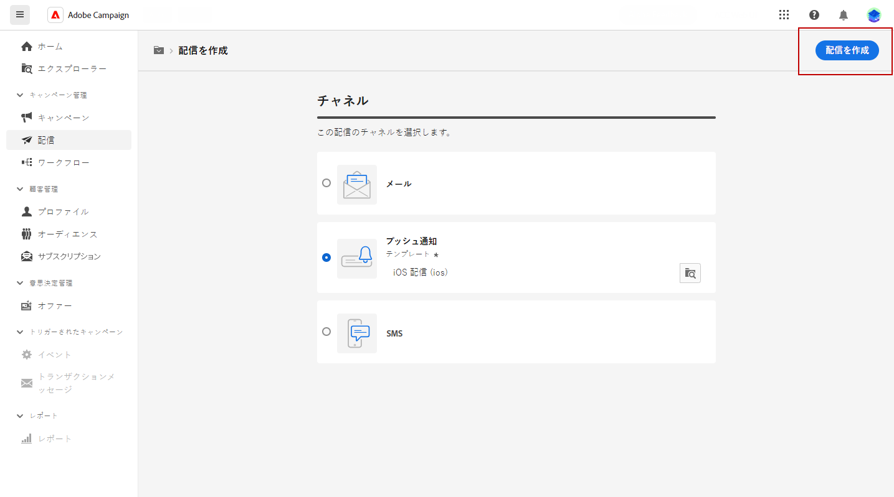
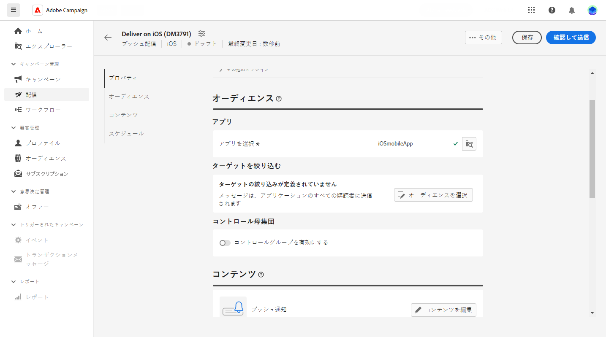
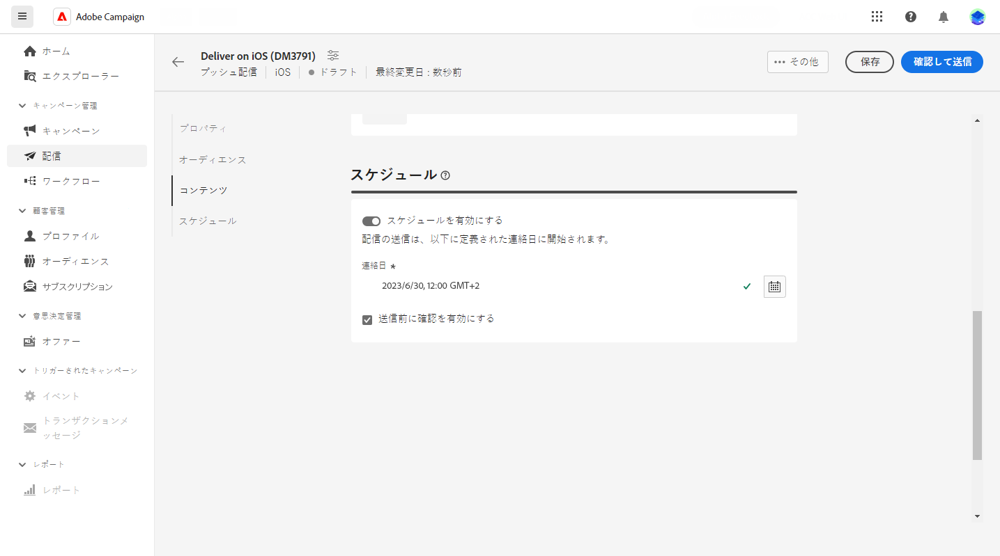

# プッシュ通知配信を作成 {#create-push}

>[!CONTEXTUALHELP]
>id="acw_push_notification_template"
>title="プッシュ通知テンプレート"
>abstract="プッシュ通知テンプレートを選択して、プッシュ配信を開始します。配信テンプレートを使用すると、キャンペーンや配信全体でカスタムコンテンツや設定を簡単に再利用できます。"
>additional-url="https://experienceleague.adobe.com/docs/campaign-web/v8/msg/delivery-template.html?lang=ja" text="配信テンプレートの使用"

>[!CONTEXTUALHELP]
>id="acw_deliveries_push_properties"
>title="プッシュ配信プロパティ"
>abstract="プッシュ配信プロパティを定義します。プッシュのラベルを入力して、**追加オプション**&#x200B;を使用すると、内部名、配信フォルダーおよびコードを設定できます。また、カスタムの説明を入力することもできます。"

スタンドアロンのプッシュ通知配信を作成することも、キャンペーンワークフローのコンテキストでプッシュ通知を作成することもできます。以下の手順では、スタンドアロン（1 回限りの）プッシュ配信の手順について説明します。キャンペーンワークフローのコンテキストで作業している場合、作成手順について詳しくは、[この節](../workflows/activities/channels.md#create-a-delivery-in-a-campaign-workflow)を参照してください。

## プッシュ配信の作成 {#create-push-delivery}

スタンドアロンプッシュ配信を新規作成するには、次の手順に従います。

1. 左側のパネルの&#x200B;**[!UICONTROL 配信]**&#x200B;メニューを参照し、「**[!UICONTROL 配信を作成]**」ボタンをクリックします。

1. 「**[!UICONTROL チャネル]**」セクションで、チャネルとして「**プッシュ通知**」を選択し、これを選択したデバイス操作システム（Android または iOS）に応じてテンプレートを選択します。[テンプレートの詳細情報](../msg/delivery-template.md)

1. 「**[!UICONTROL 配信を作成]**」ボタンをクリックして、確定します。

   {zoomable="yes"}

## 配信設定の指定 {#configure-push-settings}

以下の説明に従って、配信設定を指定します。

1. 配信の&#x200B;**[!UICONTROL ラベル]**&#x200B;を入力します。デフォルトでは、ラベルは選択したテンプレートのラベルで設定されるので、更新する必要があります。

1. 必要に応じて、**[!UICONTROL 追加オプション]**&#x200B;ドロップダウンを参照してオプションをカスタマイズします。配信が拡張スキーマに基づいている場合は、特定の&#x200B;**カスタムオプション**&#x200B;フィールドを使用できます。

   +++要件に基づいて、次の設定を指定します。
   * **[!UICONTROL 内部名]**：配信に一意の ID を割り当てます。
   * **[!UICONTROL フォルダー]**：配信を特定のフォルダーに保存します。
   * **[!UICONTROL 配信コード]**：独自の命名規則を使用して配信を整理します。
   * **[!UICONTROL 説明]**：配信の説明を指定します。
   * **[!UICONTROL 特性]** : 分類目的で配信の特性を指定します。
   +++

## プッシュ配信オーディエンスの選択 {#create-audience-push}

>[!CONTEXTUALHELP]
>id="acw_deliveries_push_audience"
>title="プッシュ通知オーディエンスの定義"
>abstract="メッセージのオーディエンスを定義するには、まずプッシュ配信に関連付けられたアプリを選択する必要があります。デフォルトでは、プッシュ通知はアプリケーションのすべてのサブスクライバーに送信されます。「**オーディエンスを選択**」ボタンをクリックすると、特定のオーディエンスに絞り込むことができます。必要に応じて、コントロール母集団を追加して、配信の影響を測定します。"
>additional-url="https://experienceleague.adobe.com/docs/campaign-web/v8/audiences/target-audiences/control-group.html?lang=ja" text="コントロール母集団の設定"

まずアプリを選択する必要があります。次に、以下の説明に従って、プッシュ通知オーディエンスを絞り込むことができます。

1. 「**[!UICONTROL オーディエンス]**」セクションで、この配信に使用するアプリケーションを選択します。デフォルトでは、プッシュ通知はアプリケーションのすべてのサブスクライバーに送信されます。「**[!UICONTROL オーディエンスを選択]**」ボタンをクリックすると、特定のオーディエンスに絞り込むことができます。

   {zoomable="yes"}

1. 既存のオーディエンスを選択するか、独自のオーディエンスを作成して、プッシュ配信のターゲット母集団を絞り込みます。プッシュ通知の場合、デフォルトの [ ターゲットディメンション ](../audience/about-recipients.md#targeting-dimensions) は **購読者のアプリケーション** （nms:appSubscriptionRcp）であり、受信者テーブルにリンクされています。

   既存のオーディエンスを選択する方法について詳しくは、[このページ](../audience/add-audience.md)を参照してください。

   新しいオーディエンスを作成する方法について詳しくは、[このページ](../audience/one-time-audience.md)を参照してください。

1. 「**[!UICONTROL コントロール母集団を有効にする]**」オプションをオンにして、配信の影響を測定するコントロール母集団を設定します。そのコントロール母集団にはメッセージが送信されないので、メッセージを受信した母集団の行動と、受信しなかった連絡先の行動を比較できます。[詳細情報](../audience/control-group.md)。

## プッシュ通知コンテンツの定義 {#create-content-push}

通知のコンテンツを定義するには、「**[!UICONTROL コンテンツを編集]**」をクリックします。[詳細情報](content-push.md)。

{zoomable="yes"}

この画面から、[コンテンツをシミュレート](../preview-test/preview-test.md)したり、[オファーを設定](../msg/offers.md)したりすることもできます。

## 配信送信のスケジュール設定 {#schedule-push}

ワークフローのコンテキストで配信を送信する際は、「**スケジューラー**」アクティビティを使用する必要があります。詳しくは、[このページ](../workflows/activities/scheduler.md)を参照してください。以下の手順は、スタンドアロン配信にのみ適用されます。

スタンドアロンのプッシュ配信を特定の日時にスケジュールするには、次の手順に従います。

1. 配信プロパティの「**[!UICONTROL スケジュール]**」セクションを参照します。

1. **[!UICONTROL スケジュールを有効にする]**&#x200B;切替スイッチをオンにしてアクティブ化します。

1. 送信する日時を設定します。

配信を開始すると、メッセージは、その受信者に対して定義した、正確な日時に自動的に送信されます。

{zoomable="yes"}

配信スケジュールについて詳しくは、[この節](../msg/gs-deliveries.md#gs-schedule)を参照してください。

## 配信の詳細設定 {#adv-push}

「**[!UICONTROL 配信設定を指定]**」をクリックして、配信テンプレートに関連する詳細オプションにアクセスします。[詳細情報](../advanced-settings/delivery-settings.md)。

{zoomable="yes"}