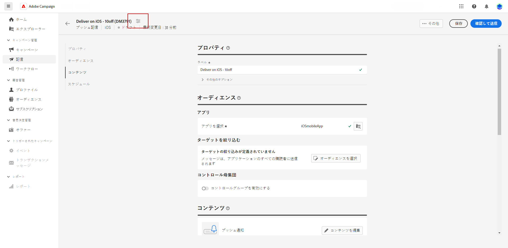

# プッシュ通知配信を作成 {#create-push}

>[!CONTEXTUALHELP]
>id="acw_push_notification_template"
>title="プッシュ通知テンプレート"
>abstract="プッシュ通知テンプレートを選択して、プッシュ配信を開始します。 配信テンプレートを使用すると、キャンペーンや配信全体でカスタムコンテンツや設定を簡単に再利用できます。"
>additional-url="https://experienceleague.adobe.com/docs/campaign-web/v8/msg/delivery-template.html" text="配信テンプレートの使用"

>[!CONTEXTUALHELP]
>id="acw_deliveries_push_properties"
>title="プッシュ配信プロパティ"
>abstract="プッシュ配信プロパティを定義します。 プッシュのラベルを入力し、 **その他のオプション** 内部名、配信フォルダーおよびコードを設定するには、以下を実行します。 カスタムの説明を入力することもできます。"

スタンドアロンのプッシュ通知配信を作成することも、キャンペーンワークフローのコンテキストでプッシュ通知を作成することもできます。以下の手順では、スタンドアロン（1 回限りの）プッシュ配信の手順について説明します。キャンペーンワークフローのコンテキストで作業している場合、作成手順について詳しくは[この節](../workflows/activities/channels.md#create-a-delivery-in-a-campaign-workflow)で説明します。

## プッシュ配信の作成 {#create-push-delivery}

スタンドアロンプッシュ配信を新規作成するには、次の手順に従います。

1. 左側のナビゲーションの&#x200B;**[!UICONTROL 配信]**&#x200B;メニューを参照し、「**[!UICONTROL 配信を作成]**」ボタンをクリックします。

1. の下 **[!UICONTROL チャネル]** セクション、選択 **プッシュ通知** チャネルとして「 」を選択し、選択したデバイスのオペレーションシステムに応じて、「 Android 」または「 iOS 」のいずれかのテンプレートを選択します。 [テンプレートの詳細情報](../msg/delivery-template.md)

1. 「**[!UICONTROL 配信を作成]**」ボタンをクリックして、確定します。

   

## 配信設定の指定 {#configure-push-settings}

以下に示すように、配信設定を指定します。

1. を入力します。 **[!UICONTROL ラベル]** 配信に使用します。 デフォルトでは、ラベルは選択したテンプレートのラベルで設定されます。 更新する必要があります。

1. 次を参照： **[!UICONTROL その他のオプション]** ドロップダウンを使用して、必要に応じてオプションをカスタマイズします。 配信が拡張スキーマに基づいている場合は、特定の **カスタムオプション** フィールドを使用できます。

   +++要件に基づいて次の設定を行います。
   * **[!UICONTROL 内部名]**：配信に一意の ID を割り当てます。
   * **[!UICONTROL フォルダー]**：配信を特定のフォルダーに保存します。
   * **[!UICONTROL 配信コード]**：独自の命名規則を使用して配信を整理します。
   * **[!UICONTROL 説明]**：配信の説明を指定します。
   * **[!UICONTROL 特性]**：分類目的でメールの特性を指定します。
+++

## プッシュ配信オーディエンスを選択 {#create-audience-push}

>[!CONTEXTUALHELP]
>id="acw_deliveries_push_audience"
>title="プッシュ通知オーディエンスの定義"
>abstract="メッセージのオーディエンスを定義するには、まずプッシュ配信に関連付けられたアプリを選択する必要があります。 デフォルトでは、プッシュ通知は、アプリケーションのすべての購読者に送信されます。 特定のオーディエンスに絞り込むには、 **オーディエンスを選択** 」ボタンをクリックします。 必要に応じて、配信の影響を測定するためのコントロール母集団を追加します。"
>additional-url="https://experienceleague.adobe.com/docs/campaign-web/v8/audiences/target-audiences/control-group.html?lang=ja" text="コントロール母集団を設定"

最初にアプリを選択してから、以下に示すように、プッシュ通知オーディエンスを調整する必要があります。

1. 次から： **[!UICONTROL 対象ユーザ]** 「 」セクションで、この配信に使用するアプリケーションを選択します。 デフォルトでは、プッシュ通知は、アプリケーションのすべての購読者に送信されます。 特定のオーディエンスに絞り込むには、 **[!UICONTROL オーディエンスを選択]** 」ボタンをクリックします。

   

1. 既存のオーディエンスを選択するか、独自のオーディエンスを作成して、プッシュ配信のターゲット母集団を絞り込みます。 プッシュ通知の場合、デフォルトは [ターゲットディメンション](../audience/about-recipients.md#targeting-dimensions) 次に該当 **購読者のアプリケーション** (nms:appSubscriptionRcp)：受信者テーブルにリンクされています。

   既存のオーディエンスを選択する方法については、 [このページ](../audience/add-audience.md)

   で新しいオーディエンスを作成する方法を説明します。 [このページ](../audience/one-time-audience.md)

1. をオンにします。 **[!UICONTROL コントロール母集団を有効にする]** 配信の影響を測定するコントロール母集団を設定するオプションです。 メッセージはそのコントロール母集団に送信されないので、メッセージを受け取った母集団の行動と、メッセージを受け取らなかった連絡先の行動を比較できます。 [詳細情報](../audience/control-group.md)

## プッシュ通知コンテンツの定義 {#create-content-push}

通知の内容を定義するには、 **[!UICONTROL コンテンツを編集]**. [詳細情報](content-push.md)

この画面から、[コンテンツをシミュレート](../preview-test/preview-test.md)したり、[オファーを設定](../content/offers.md)したりすることもできます。

## 配信送信のスケジュール設定 {#schedule-push}

特定の日時に配信をスケジュールするには、「**[!UICONTROL スケジュールを有効にする]**」オプションをオンにします。配信を開始すると、メッセージは、その受信者に対して定義した、正確な日時に自動的に送信されます。配信スケジュールについて詳しくは、[この節](../msg/gs-messages.md#gs-schedule)を参照してください

## 配信の詳細設定 {#adv-push}

「**[!UICONTROL 配信設定を指定]**」をクリックして、配信テンプレートに関連する詳細オプションにアクセスします。[詳細情報](../advanced-settings/delivery-settings.md)

