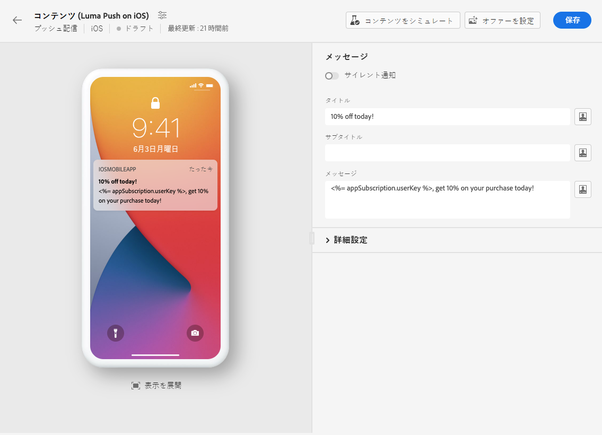

# プッシュ通知配信を作成 {#create-push}

>[!CONTEXTUALHELP]
>id="acw_deliveries_push_audience"
>title="プッシュオーディエンスの定義"
>abstract="プッシュメッセージに最適なオーディエンスを選択します。"

>[!CONTEXTUALHELP]
>id="acw_push_notification_template"
>title="プッシュ通知テンプレート"
>abstract="プッシュ通知テンプレートを選択して、プッシュ配信を開始します。"

>[!CONTEXTUALHELP]
>id="acw_deliveries_push_properties"
>title="プッシュ配信プロパティ"
>abstract="プッシュ配信プロパティを管理します。"

スタンドアロンのプッシュ通知配信を作成することも、キャンペーンワークフローのコンテキストでプッシュ通知を作成することもできます。 以下の手順では、スタンドアロン（ワンショット）プッシュ配信の手順について詳しく説明します。 キャンペーンワークフローのコンテキストで作業している場合、作成手順の詳細は [この節](../workflows/activities/channels.md#create-a-delivery-in-a-campaign-workflow).

新しいスタンドアロンのプッシュ配信を作成するには、次の手順に従います。

1. 左側のナビゲーションの&#x200B;**[!UICONTROL 配信]**&#x200B;メニューを参照し、「**[!UICONTROL 配信を作成]**」ボタンをクリックします。

1. の下 **[!UICONTROL チャネル]** セクション、選択 **プッシュ通知** 「 」チャネルで「 」テンプレートを選択し、選択したデバイスの運用システムに応じて、「 Android 」または「 iOS 」を選択します。 [テンプレートの詳細情報](../msg/delivery-template.md)

1. 「**[!UICONTROL 配信を作成]**」ボタンをクリックして、確定します。

   

1. 配信の&#x200B;**[!UICONTROL ラベル]**&#x200B;を入力し、**[!UICONTROL その他のオプション]**&#x200B;ドロップダウンにアクセスします。

   +++要件に基づいて次の設定を行います。
   * **[!UICONTROL 内部名]**：配信に一意の ID を割り当てます。
   * **[!UICONTROL フォルダー]**：配信を特定のフォルダーに保存します。
   * **[!UICONTROL 配信コード]**：独自の命名規則を使用して配信を整理します。
   * **[!UICONTROL 説明]**：配信の説明を指定します。
   * **[!UICONTROL 特性]**：分類目的でメールの特性を指定します。
+++

1. **[!UICONTROL オーディエンス]**&#x200B;メニューで、この配信に使用するアプリケーションを選択します。

1. 「**[!UICONTROL オーディエンスを選択]**」ボタンをクリックして、既存のオーディエンスをターゲットにするか、独自のユーザーを作成します。[詳細情報](../audience/about-recipients.md)

   デフォルトでは、プッシュ通知はアプリケーションのすべてのサブスクライバーに送信されます。

   

1. 「**[!UICONTROL コントロール母集団を有効にする]**」オプションをオンにして、配信の影響を測定するコントロール母集団を設定すると、メッセージを受信した母集団の行動と、受信しなかった連絡先の行動を比較できるようになります。[詳細情報](../audience/control-group.md)

1. 「**[!UICONTROL コンテンツを編集]**」をクリックして、プッシュ通知のコンテンツのデザインを開始します。[詳細情報](content-push.md)

   

   この画面から、[コンテンツをシミュレート](../preview-test/preview-test.md)したり、[オファーを設定](../content/offers.md)したりすることもできます。

1. 特定の日時に配信をスケジュールするには、「**[!UICONTROL スケジュールを有効にする]**」オプションをオンにします。配信を開始すると、メッセージは、その受信者に対して定義した、正確な日時に自動的に送信されます。配信スケジュールについて詳しくは、 [この節](../msg/gs-messages.md#gs-schedule)

   

1. 「**[!UICONTROL 配信設定を指定]**」をクリックして、配信テンプレートに関連する詳細オプションにアクセスします。[詳細情報](../advanced-settings/delivery-settings.md)

   
