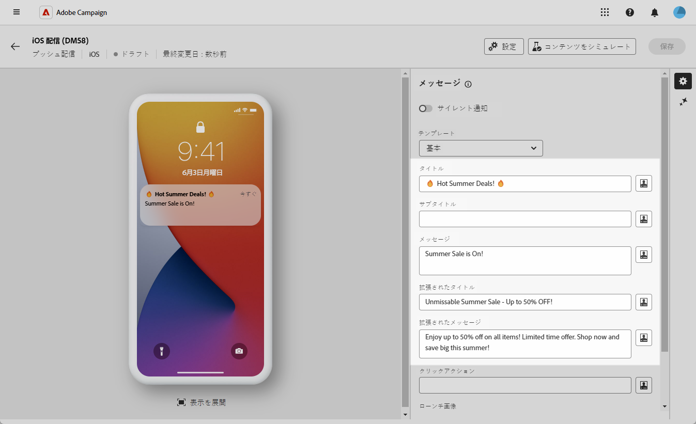
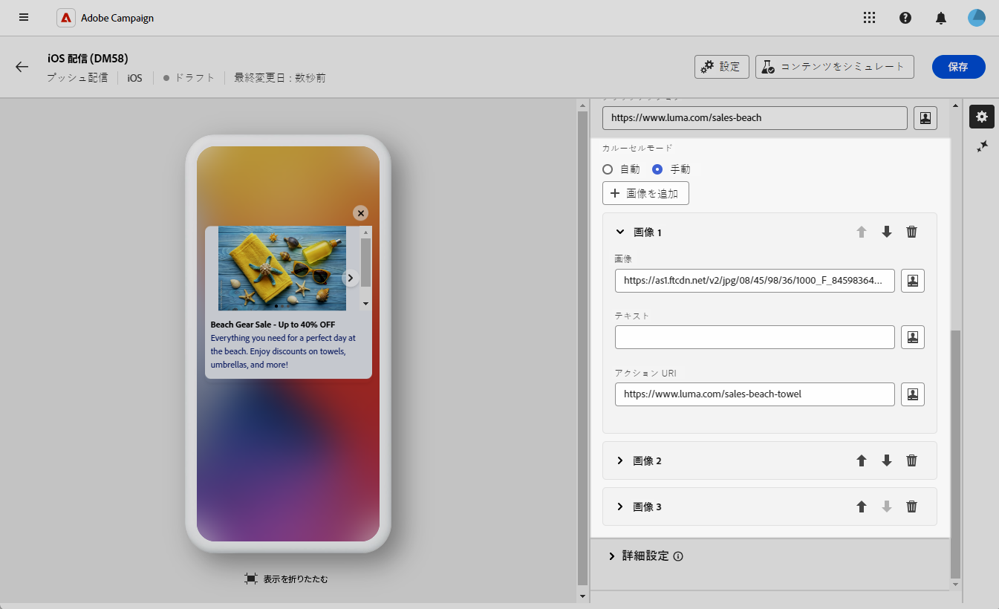
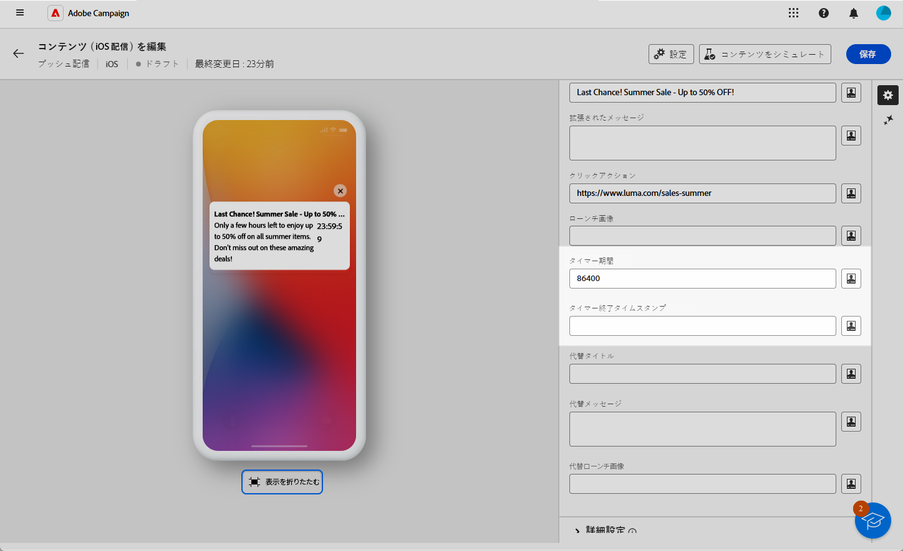

# iOS のリッチプッシュ配信の設計 {#rich-push}

>[!IMPORTANT]
>
>リッチプッシュ通知を設計する前に、V2 コネクタを設定する必要があります。手順について詳しくは、[このページ](https://experienceleague.adobe.com/ja/docs/campaign-classic/using/sending-messages/sending-push-notifications/configure-the-mobile-app/configuring-the-mobile-application)を参照してください。

## 通知のコンテンツの定義 {#push-message}

プッシュ配信を作成したら、次のいずれかのテンプレートを使用して、そのコンテンツを定義します。

* **デフォルト**&#x200B;では、シンプルなアイコンと付属の画像を使用して通知を送信できます。
* **基本**&#x200B;では、通知にテキスト、画像、ボタンを含めることができます。
* **カルーセル**&#x200B;では、ユーザーがスワイプできるテキストと複数の画像を含む通知を送信できます。
* **タイマー**&#x200B;には、通知にライブカウントダウンタイマーが含まれます。

これらのテンプレートをパーソナライズする方法について詳しくは、以下のタブを参照してください。

>[!BEGINTABS]

>[!TAB デフォルト]

1. **[!UICONTROL テンプレート]**&#x200B;ドロップダウンから、「**[!UICONTROL デフォルト]**」を選択します。

   

1. 「**[!UICONTROL タイトル]**」フィールドで、通知センターから使用可能な通知のリストに表示するタイトルのラベルを入力します。

   このフィールドは、iOS 通知ペイロードの **title** パラメーターの値を定義します。

1. オプションで、iOS 通知ペイロードの **subtitle** パラメーターに対応する&#x200B;**[!UICONTROL 字幕]**&#x200B;を追加します。

1. 「**[!UICONTROL メッセージ]**」フィールドにメッセージの内容を入力します。

1. 式エディターを使用して、コンテンツの定義、データのパーソナライズ、動的コンテンツの追加を行います。[詳細情報](../personalization/personalize.md)

   

1. プッシュ通知をさらにパーソナライズするには、プッシュ通知に追加する&#x200B;**[!UICONTROL ローンチ画像]**&#x200B;の URL を選択します。

1. **[!UICONTROL 詳細設定]**&#x200B;ドロップダウンから「**[!UICONTROL サウンドとバッジ]**」タブに移動して、通知のサウンドやバッジのオプションなどの追加設定をカスタマイズします。[詳細情報](#sound-badge)

   

1. さらにカスタマイズするには、プッシュ通知で使用できる「**[!UICONTROL 追加]**」オプションを確認します。[詳細情報](#push-advanced)

   

1. **[!UICONTROL アプリケーション変数]**&#x200B;メニューから、**[!UICONTROL アプリケーション変数]**&#x200B;が自動的に追加されます。これによって、通知の動作を定義できます。例えば、ユーザーが通知をアクティブ化したときに特定のアプリケーション画面が表示されるように設定します。

メッセージのコンテンツを定義したら、テストサブスクライバーを利用して、メッセージをプレビューしテストします。

>[!TAB 基本]

1. **[!UICONTROL テンプレート]**&#x200B;ドロップダウンから、「**[!UICONTROL 基本]**」を選択します。

   

1. メッセージを作成するには、「**[!UICONTROL タイトル]**」、「**[!UICONTROL 拡張されたタイトル]**」、「**[!UICONTROL メッセージ]**」、「**[!UICONTROL 拡張されたメッセージ]**」の各フィールドにテキストを入力します。

   **[!UICONTROL メッセージ]**&#x200B;テキストは折りたたまれたビューに表示され、通知を拡張すると&#x200B;**[!UICONTROL 拡張されたメッセージ]**&#x200B;が表示されます。

   

1. 式エディターを使用して、コンテンツの定義、データのパーソナライズ、動的コンテンツの追加を行います。[詳細情報](../personalization/personalize.md)

1. オプションで、iOS 通知ペイロードの **subtitle** パラメーターに対応する&#x200B;**[!UICONTROL 字幕]**&#x200B;を追加します。

1. 通知のユーザークリックに関連付けられた&#x200B;**[!UICONTROL クリックアクション]**&#x200B;を定義する URL を追加します。これにより、ユーザーが通知を操作するときの動作（特定の画面を開く、アプリで特定のアクションを実行するなど）が決定されます。

1. プッシュ通知をさらにパーソナライズするには、プッシュ通知に追加する&#x200B;**[!UICONTROL ローンチ画像]**&#x200B;の URL を選択します。

1. **[!UICONTROL 詳細設定]**&#x200B;ドロップダウンから「**[!UICONTROL サウンドとバッジ]**」タブに移動して、通知のサウンドやバッジのオプションなどの追加設定をカスタマイズします。[詳細情報](#sound-badge)

   

1. **[!UICONTROL カラーオプション]**&#x200B;メニューで、**[!UICONTROL 通知の背景色]**、**[!UICONTROL 通知の背景色]**&#x200B;および&#x200B;**[!UICONTROL メッセージテキストの色]**&#x200B;の 16 進数のカラーコードを入力します。

   

1. さらにカスタマイズするには、プッシュ通知で使用できる「**[!UICONTROL 追加]**」オプションを確認します。[詳細情報](#push-advanced)

1. **[!UICONTROL アプリケーション変数]**&#x200B;メニューから、**[!UICONTROL アプリケーション変数]**&#x200B;が自動的に追加されます。これによって、通知の動作を定義できます。例えば、ユーザーが通知をアクティブ化したときに特定のアプリケーション画面が表示されるように設定します。

メッセージのコンテンツを定義したら、テストサブスクライバーを利用して、メッセージをプレビューしテストします。

>[!TAB カルーセル]

1. **[!UICONTROL テンプレート]**&#x200B;ドロップダウンから、「**[!UICONTROL カルーセル]**」を選択します。

   

1. メッセージを作成するには、「**[!UICONTROL タイトル]**」、「**[!UICONTROL 拡張されたタイトル]**」、「**[!UICONTROL メッセージ]**」、「**[!UICONTROL 拡張されたメッセージ]**」の各フィールドにテキストを入力します。

   **[!UICONTROL メッセージ]**&#x200B;テキストは折りたたまれたビューに表示され、通知を拡張すると&#x200B;**[!UICONTROL 拡張されたメッセージ]**&#x200B;が表示されます。

   

1. 式エディターを使用して、コンテンツの定義、データのパーソナライズ、動的コンテンツの追加を行います。[詳細情報](../personalization/personalize.md)

1. オプションで、iOS 通知ペイロードの **subtitle** パラメーターに対応する&#x200B;**[!UICONTROL 字幕]**&#x200B;を追加します。

1. 通知のユーザークリックに関連付けられた&#x200B;**[!UICONTROL クリックアクション]**&#x200B;を定義する URL を追加します。これにより、ユーザーが通知を操作するときの動作（特定の画面を開く、アプリで特定のアクションを実行するなど）が決定されます。

1. **[!UICONTROL カルーセル]**&#x200B;の操作方法を選択します。

   * **[!UICONTROL 自動]**：画像をスライドとして自動的に切り替えさせ、定義済みの間隔で移行します。
   * **[!UICONTROL 手動]**：ユーザーはスライド間を手動でスワイプして画像間を移動できます。

1. 「**[!UICONTROL 画像を追加]**」をクリックし、**[!UICONTROL 画像]**&#x200B;の URL、**[!UICONTROL テキスト]**、**[!UICONTROL アクションの URI]** を入力します。

   少なくとも 3 つの画像、最大 5 つの画像を含めます。

   

1. 下向き矢印と上向き矢印を使用して、画像の順序を操作します。

1. **[!UICONTROL 詳細設定]**&#x200B;ドロップダウンから「**[!UICONTROL サウンドとバッジ]**」タブに移動して、通知のサウンドやバッジのオプションなどの追加設定をカスタマイズします。[詳細情報](#sound-badge)

1. **[!UICONTROL カラーオプション]**&#x200B;メニューで、**[!UICONTROL 通知の背景色]**、**[!UICONTROL 通知の背景色]**&#x200B;および&#x200B;**[!UICONTROL メッセージテキストの色]**&#x200B;の 16 進数のカラーコードを入力します。

   

1. さらにカスタマイズするには、プッシュ通知で使用できる「**[!UICONTROL 追加]**」オプションを確認します。[詳細情報](#push-advanced)

1. **[!UICONTROL アプリケーション変数]**&#x200B;メニューから、**[!UICONTROL アプリケーション変数]**&#x200B;が自動的に追加されます。これによって、通知の動作を定義できます。例えば、ユーザーが通知をアクティブ化したときに特定のアプリケーション画面が表示されるように設定します。

メッセージのコンテンツを定義したら、テストサブスクライバーを利用して、メッセージをプレビューしテストします。

>[!TAB タイマー]

1. **[!UICONTROL 通知タイプ]**&#x200B;ドロップダウンから、「**[!UICONTROL タイマー]**」を選択します。

   

1. メッセージを作成するには、「**[!UICONTROL タイトル]**」、「**[!UICONTROL 拡張されたタイトル]**」、「**[!UICONTROL メッセージ]**」、「**[!UICONTROL 拡張されたメッセージ]**」の各フィールドにテキストを入力します。

   **[!UICONTROL メッセージ]**&#x200B;テキストは折りたたまれたビューに表示され、通知を拡張すると&#x200B;**[!UICONTROL 拡張されたメッセージ]**&#x200B;が表示されます。

   

1. 式エディターを使用して、コンテンツの定義、データのパーソナライズ、動的コンテンツの追加を行います。[詳細情報](../personalization/personalize.md)

1. オプションで、iOS 通知ペイロードの **subtitle** パラメーターに対応する&#x200B;**[!UICONTROL 字幕]**&#x200B;を追加します。

1. 通知のユーザークリックに関連付けられた&#x200B;**[!UICONTROL クリックアクション]**&#x200B;を定義する URL を追加します。これにより、ユーザーが通知を操作するときの動作（特定の画面を開く、アプリで特定のアクションを実行するなど）が決定されます。

1. プッシュ通知をさらにパーソナライズするには、プッシュ通知に追加する&#x200B;**[!UICONTROL ローンチ画像]**&#x200B;の URL を選択します。

1. **[!UICONTROL タイマー期間]**&#x200B;を秒単位で設定するか、**[!UICONTROL タイマー終了タイムスタンプ]**&#x200B;を特定のエポックタイムスタンプに設定します。

   

1. タイマーの有効期限が切れた後に表示されるテキストと画像を「**[!UICONTROL 代替タイトル]**」、「**[!UICONTROL 代替メッセージ]**」、「**[!UICONTROL 代替ローンチ画像]**」の各フィールドに入力します。

   

1. **[!UICONTROL 詳細設定]**&#x200B;ドロップダウンから「**[!UICONTROL サウンドとバッジ]**」タブに移動して、通知のサウンドやバッジのオプションなどの追加設定をカスタマイズします。[詳細情報](#sound-badge)

1. **[!UICONTROL カラーオプション]**&#x200B;メニューで、**[!UICONTROL 通知の背景色]**、**[!UICONTROL 通知の背景色]**&#x200B;および&#x200B;**[!UICONTROL メッセージテキストの色]**&#x200B;の 16 進数のカラーコードを入力します。

1. さらにカスタマイズするには、プッシュ通知で使用できる「**[!UICONTROL 追加]**」オプションを確認します。[詳細情報](#push-advanced)

1. **[!UICONTROL アプリケーション変数]**&#x200B;メニューから、**[!UICONTROL アプリケーション変数]**&#x200B;が自動的に追加されます。これによって、通知の動作を定義できます。例えば、ユーザーが通知をアクティブ化したときに特定のアプリケーション画面が表示されるように設定します。

メッセージのコンテンツを定義したら、テストサブスクライバーを利用して、メッセージをプレビューしテストします。

>[!ENDTABS]

## プッシュ通知の詳細設定 {#push-advanced}

### 「サウンドとバッジ」オプション {#sound-badge}

| パラメーター | 説明 |
|-----------|-------------|
| **[!UICONTROL 重大なアラートモード]** | ユーザーの電話がフォーカスモードに設定されている場合や、ミュートになっている場合でも、通知にサウンドを追加するには、このオプションを有効にします。 |
| **[!UICONTROL クリーンバッジ]** | このオプションを有効にして、バッジ値を更新します。 |
| **[!UICONTROL サウンド]** | デバイスが通知を受け取るときに再生するサウンドを設定します。 |
| **[!UICONTROL 通知数]** | アプリケーションアイコンに直接表示される、新しい未読通知の数を示す数値を設定します。 |
| **[!UICONTROL ボリューム]** | サウンドのボリューム（0～100）を設定します。サウンドは、アプリケーションに含まれている必要があり、サービスが作成されたときに定義される必要があります。 |

### カラーのオプション {#color}

| パラメーター | 説明 |
|-----------|-------------|
| **[!UICONTROL 通知の背景色]** | 通知の背景色を 16 進数のカラーコードで設定します。 |
| **[!UICONTROL タイトルの色]** | タイトルの色を 16 進数のカラーコードで設定します。 |
| **[!UICONTROL メッセージテキストの色]** | テキストの色を 16 進数のカラーコードで設定します。 |

### 詳細オプション {#notification-options}

| パラメーター | 説明 |
|-----------|-------------|
| **[!UICONTROL 可変コンテンツ]** | モバイルアプリケーションがメディアコンテンツをダウンロードできるようにするには、このオプションを有効にします。 |
| **[!UICONTROL 関連度スコア]** | 関連度スコアを 0 から 100 に設定します。通知の概要で通知を並べ替える場合にシステムが使用します。 |
| **[!UICONTROL 割り込みレベル]** | <ul><li>**アクティブ**：デフォルトでは、通知が直ちに表示され、画面が点灯し、サウンドを再生できます。通知はフォーカスモードを妨げません。</li><li>**パッシブ**：画面を点灯させたり、サウンドを再生したりせずに、システムは通知リストに通知を追加します。通知はフォーカスモードを妨げません。</li><li>**時間依存**：システムにより通知がすぐに表示され、画面が点灯し、サウンドを再生でき、フォーカスモードで通知できます。このレベルでは、Apple からの特別な権限は必要ありません。</li><li>**重大**：システムにより通知が直ちに表示され、画面が点灯し、ミュートスイッチまたはフォーカスモードがバイパスされます。このレベルには、Apple からの特別な権限が必要です。</li></ul> |
| **[!UICONTROL スレッド ID]** | 関連する通知をグループ化するために使用される識別子を設定します。 |
| **[!UICONTROL カテゴリ]** | アクションボタンを表示するカテゴリ ID の名前を設定します。これらの通知により、ユーザーは、アプリケーションを開いたりアプリケーション内を移動したりせずに、通知に応じて様々なタスクをより迅速に実行できます。 |
| **[!UICONTROL ターゲットコンテンツ ID]** | 通知が開かれたときに転送するアプリケーションウィンドウをターゲティングするのに使用される識別子を設定します。 |