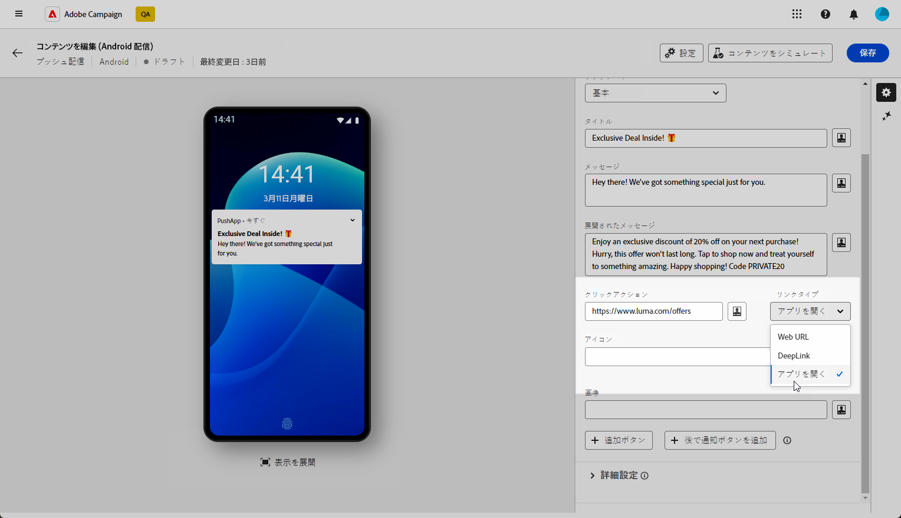
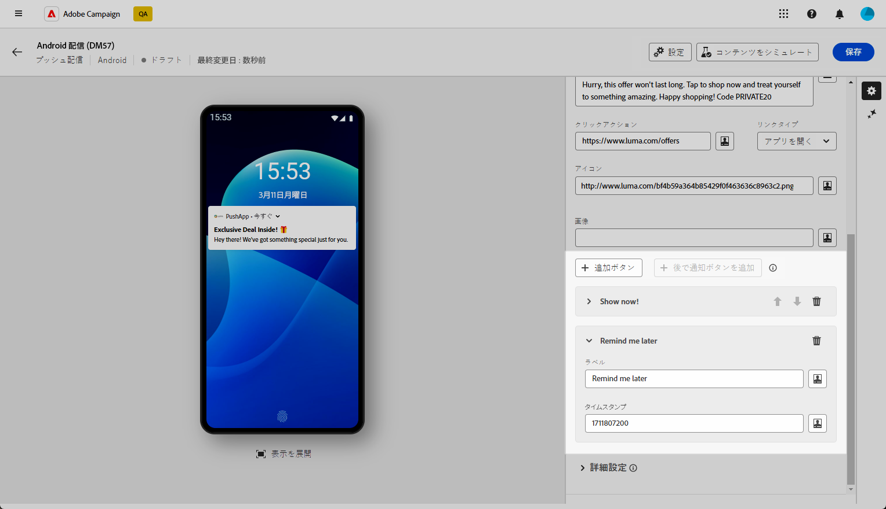
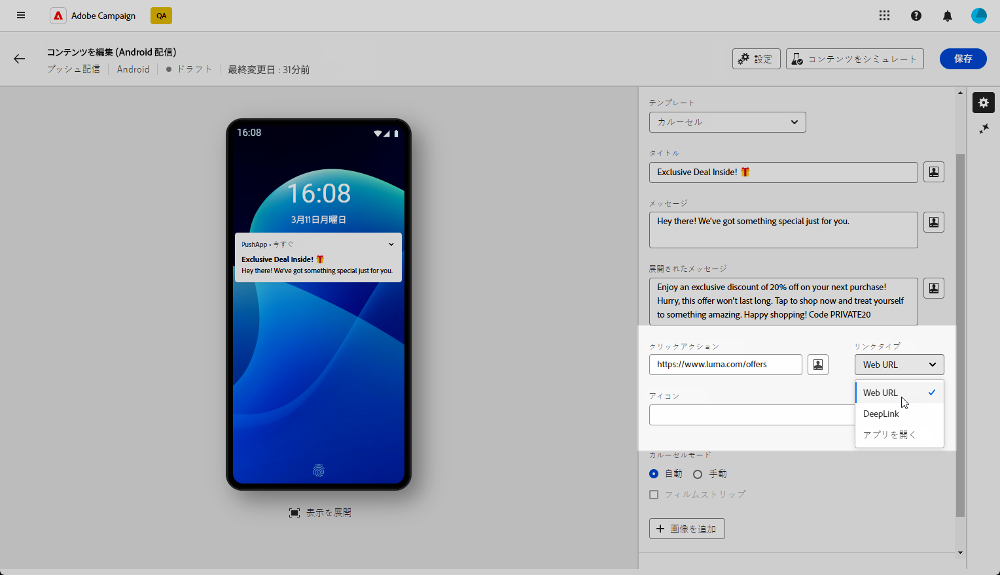
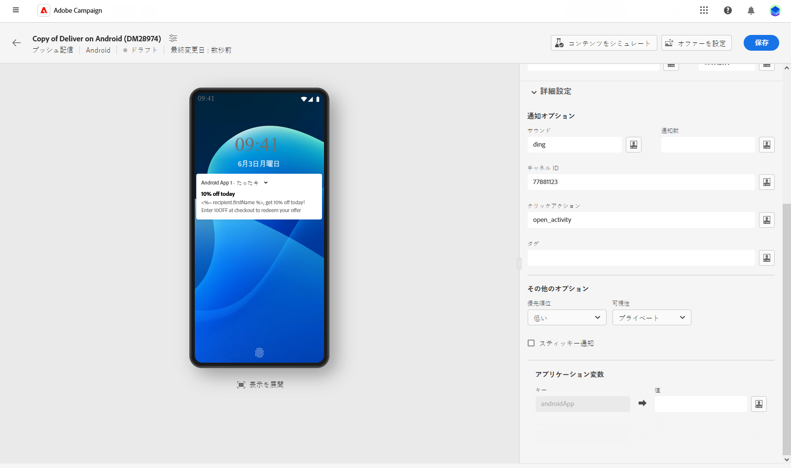

# Android のリッチプッシュ配信のデザイン {#rich-push}

Firebase Cloud Messaging では、次の 2 種類のメッセージの中から選択できます。

* **[!UICONTROL データメッセージ]**&#x200B;は、クライアントアプリで処理されます。これらのメッセージは、モバイルアプリケーションに直接送信され、デバイス上で Android 通知を生成して表示されます。データメッセージには、カスタムアプリケーション変数のみが含まれます。

* **[!UICONTROL 通知メッセージ]**&#x200B;は、FCM SDK によって自動的に処理されます。 FCM は、クライアントアプリに代わって、ユーザーのデバイスにメッセージを自動的に表示します。通知メッセージには、事前に定義された一連のパラメーターとオプションが含まれていますが、カスタムアプリケーション変数を使用してさらにパーソナライズすることもできます。

{zoomable=&quot;yes&quot;}

## 通知のコンテンツの定義 {#push-message}

プッシュ配信を作成したら、そのコンテンツを定義できます。次の 3 つのテンプレートを使用できます。

* **デフォルトのテンプレート** では、シンプルなアイコンと付属の画像を使用して通知を送信できます。

* **基本テンプレート** には、通知にテキスト、画像およびボタンを含めることができます。

* **カルーセルテンプレート** を使用すると、ユーザーがスワイプできるテキストと複数の画像と共に通知を送信できます。

これらのテンプレートをパーソナライズする方法の詳細については、以下のタブを参照してください。

>[!BEGINTABS]

>[!TAB デフォルトのテンプレート]

1. 次から： **[!UICONTROL テンプレート]** ドロップダウンで、「 **[!UICONTROL デフォルト]**.

   

1. メッセージを作成するには、 **[!UICONTROL タイトル]** および **[!UICONTROL メッセージ]** フィールド。

   

1. 式エディターを使用して、コンテンツの定義、データのパーソナライズ、動的コンテンツの追加をおこないます。 [詳細情報](../personalization/personalize.md)

1. 次を定義： **[!UICONTROL クリックアクション]** 通知をクリックしたユーザーに関連付けられました。 これにより、ユーザーが通知を操作するときの動作（特定の画面を開く、アプリで特定のアクションを実行するなど）が決定されます。

1. プッシュ通知をさらにパーソナライズするには、 **[!UICONTROL 画像]** プッシュ通知と通知に追加する URL **[!UICONTROL アイコン]** を使用して、プロファイルのデバイスに表示できます。

   

1. を設定します。 **[!UICONTROL 詳細設定]** プッシュ通知を送信します。 [詳細情報](#push-advanced)

メッセージのコンテンツを定義したら、テスト購読者を使用して、メッセージをプレビューおよびテストできます。

>[!TAB 基本テンプレート]

1. 次から： **[!UICONTROL テンプレート]** ドロップダウンで、「 **[!UICONTROL 基本]**.

   

1. メッセージを作成するには、 **[!UICONTROL タイトル]**, **[!UICONTROL メッセージ]** および **[!UICONTROL 拡張されたメッセージ]** フィールド。

   The **[!UICONTROL メッセージ]** 折りたたまれた表示で、 **[!UICONTROL 拡張されたメッセージ]** 通知を展開すると、が表示されます。

   

1. 式エディターを使用して、コンテンツの定義、データのパーソナライズ、動的コンテンツの追加をおこないます。 [詳細情報](../personalization/personalize.md)

1. を定義する URL を追加します。 **[!UICONTROL クリックアクション]** 通知をクリックしたユーザーに関連付けられました。 これにより、ユーザーが通知を操作するときの動作（特定の画面を開く、アプリで特定のアクションを実行するなど）が決定されます。

1. を選択します。 **[!UICONTROL リンクタイプ]** 」で指定します。 **[!UICONTROL クリックアクション]** フィールド：

   * **[!UICONTROL Web URL]**:Web URL は、ユーザーをオンラインコンテンツに誘導します。 クリックすると、デバイスのデフォルトの Web ブラウザーが開いて、指定された URL に移動するように求められます。

   * **[!UICONTROL ディープリンク]**：ディープリンクは、アプリが閉じられている場合でも、アプリ内の特定のセクションにユーザーを導く URL です。 クリックすると、ダイアログが表示され、ユーザーはリンクを処理できる様々なアプリから選択できます。

   * **[!UICONTROL アプリを開く]**：アプリの URL を開くと、アプリケーション内のコンテンツに直接接続できます。 これにより、アプリケーションは、曖昧さ回避ダイアログを回避し、特定のタイプのリンクのデフォルトハンドラーとして自身を確立できます。

   Android アプリのリンクの処理方法について詳しくは、 [Android 開発者向けドキュメント](https://developer.android.com/training/app-links).

   

1. プッシュ通知をさらにパーソナライズするには、 **[!UICONTROL 画像]** プッシュ通知と通知に追加する URL **[!UICONTROL アイコン]** を使用して、プロファイルのデバイスに表示できます。

1. クリック **[!UICONTROL 追加ボタン]** 次のフィールドに入力します。

   * **[!UICONTROL ラベル]**：ボタンに表示されるテキスト。
   * **[!UICONTROL リンク URI]**:「 」ボタンをクリックしたときに実行される URI を指定します。
   * **[!UICONTROL リンクタイプ]**：リンクのタイプ。どちらか **[!UICONTROL Web URL]**, **[!UICONTROL ディープリンク]**&#x200B;または **[!UICONTROL アプリを開く]**.

   プッシュ通知には、最大 3 つのボタンを含めることができます。 を選択した場合、 **[!UICONTROL 後で通知ボタン]**&#x200B;の場合、最大 2 つのボタンのみを含めることができます。

   

1. クリック **[!UICONTROL 後で通知を追加]** ボタンをクリックして、プッシュ通知に [ 後で通知する ] オプションを追加します。 を入力します。 **[!UICONTROL ラベル]** および **[!UICONTROL タイムスタンプ]**.

   「タイムスタンプ」フィールドには、エポックを表す値（秒単位）が必要です。

   

1. を設定します。 **[!UICONTROL 詳細設定]** プッシュ通知を送信します。 [詳細情報](#push-advanced)

メッセージのコンテンツを定義したら、テスト購読者を使用して、メッセージをプレビューおよびテストできます。

>[!TAB カルーセルテンプレート]

1. 次から： **[!UICONTROL テンプレート]** ドロップダウンで、「 **[!UICONTROL カルーセル]**.

   

1. メッセージを作成するには、 **[!UICONTROL タイトル]**, **[!UICONTROL メッセージ]** および **[!UICONTROL 拡張されたメッセージ]** フィールド。

   The **[!UICONTROL メッセージ]** 折りたたまれた表示で、 **[!UICONTROL 拡張されたメッセージ]** 通知を展開すると、が表示されます。

   

1. 式エディターを使用して、コンテンツの定義、データのパーソナライズ、動的コンテンツの追加をおこないます。 [詳細情報](../personalization/personalize.md)

1. を定義する URL を追加します。 **[!UICONTROL クリックアクション]** 通知をクリックしたユーザーに関連付けられました。 これにより、ユーザーが通知を操作するときの動作（特定の画面を開く、アプリで特定のアクションを実行するなど）が決定されます。

1. を選択します。 **[!UICONTROL リンクタイプ]** 」で指定します。 **[!UICONTROL クリックアクション]** フィールド：

   * **[!UICONTROL Web URL]**L:Web の URL は、ユーザーをオンラインコンテンツに誘導します。 クリックすると、デバイスのデフォルトの Web ブラウザーが開いて、指定された URL に移動するように求められます。

   * **[!UICONTROL ディープリンク]**：ディープリンクは、アプリが閉じられている場合でも、アプリ内の特定のセクションにユーザーを導く URL です。 クリックすると、ダイアログが表示され、ユーザーはリンクを処理できる様々なアプリから選択できます。

   * **[!UICONTROL アプリを開く]**：アプリの URL を開くと、アプリケーション内のコンテンツに直接接続できます。 これにより、アプリケーションは、曖昧さ回避ダイアログを回避し、特定のタイプのリンクのデフォルトハンドラーとして自身を確立できます。

   Android アプリのリンクの処理方法について詳しくは、 [Android 開発者向けドキュメント](https://developer.android.com/training/app-links).

   

1. プッシュ通知をさらにパーソナライズするには、通知の **[!UICONTROL アイコン]** を使用して、プロファイルのデバイスに表示できます。

1. 選択方法 **[!UICONTROL カルーセル]** が操作された場合：

   * **[!UICONTROL 自動]**：事前に定義された間隔で画像を切り替えて切り替え、スライドとして自動的に切り替わります。
   * **[!UICONTROL 手動]**：ユーザーが手動でスライドをスワイプして画像間を移動できるようにします。

     を有効にします。 **[!UICONTROL フィルムストリップ]** メインスライドと共に前と次の画像のプレビューを含めるオプション。

1. クリック **[!UICONTROL 画像を追加]** をクリックし、画像の URL とテキストを入力します。

   画像が 3 つ以上、画像が最大 5 つ含まれている必要があります。

   

1. 下向き矢印と上向き矢印を使用して、画像の順序を処理します。

1. を設定します。 **[!UICONTROL 詳細設定]** プッシュ通知を送信します。 [詳細情報](#push-advanced)

メッセージのコンテンツを定義したら、テスト購読者を使用して、メッセージをプレビューおよびテストできます。

>[!ENDTABS]

## プッシュ通知の詳細設定 {#push-advanced}

{zoomable=&quot;yes&quot;}

| パラメーター | 説明 |
|---------|---------|
| **[!UICONTROL アイコンの色]** | アイコンの色を 16 進数のカラーコードで設定します。 |
| **[!UICONTROL タイトルの色]** | タイトルの色を 16 進数のカラーコードで設定します。 |
| **[!UICONTROL メッセージのテキストカラー]** | メッセージテキストの色を 16 進数のカラーコードで設定します。 |
| **[!UICONTROL 通知の背景色]** | 通知の背景の色を 16 進数の色コードで設定します。 |
| **[!UICONTROL サウンド]** | デバイスが通知を受け取るときに再生するサウンドを設定します。 |
| **[!UICONTROL 通知数]** | アプリケーションアイコンに直接表示する新しい未読情報の数を設定します。これにより、ユーザーは保留中の通知数をすばやく確認できます。 |
| **[!UICONTROL チャネル ID]** | 通知のチャネル ID を設定します。このチャネル ID を持つ通知を受信するには、このチャネル ID を持つチャネルをアプリで事前に作成しておく必要があります。 |
| **[!UICONTROL タグ]** | 通知ドロワー内の既存の通知を置き換えるために使用する識別子を設定します。これにより、複数の通知が蓄積されるのを防ぎ、関連する最新通知のみが表示されるようにします。 |
| **[!UICONTROL 優先順位]** | 通知の優先度レベル（デフォルト、最小、低、高）を設定します。 優先度レベルは通知の重要度と緊急性を決定し、通知の表示方法と、特定のシステム設定をバイパスできるかどうかに影響します。詳しくは、[FCM のドキュメント](https://firebase.google.com/docs/reference/fcm/rest/v1/projects.messages?hl=ja#notificationpriority)を参照してください。 |
| **[!UICONTROL 可視性]** | 通知の表示レベルを（パブリック、プライベート、秘密）のいずれかに設定します。表示レベルは、通知の内容をロック画面やその他の機密領域にどの程度表示するかを決定します。詳しくは、[FCM ドキュメント](https://firebase.google.com/docs/reference/fcm/rest/v1/projects.messages#visibility)を参照してください。 |
| **[!UICONTROL 共通通知]** | 有効にした場合、ユーザーがクリックした後も通知は表示されたままになります。 無効にした場合、ユーザーが操作すると通知は自動的に閉じられます。スティッキー動作を使用すると、重要な通知を長期間画面に保持できます。 |
| **[!UICONTROL アプリケーション変数]** | 通知動作を定義できます。 これらの変数は完全にカスタマイズ可能で、モバイルデバイスに送信されるメッセージペイロードの一部に含まれます。 |
