# Android のリッチプッシュ配信の設計 {#rich-push}

>[!CONTEXTUALHELP]
>id="acw_deliveries_push_remind_later"
>title="「後で通知」ボタン"
>abstract="「**後で通知**」ボタンをクリックすると、リマインダーをスケジュールできます。「タイムスタンプ」フィールドには、エポック（秒）を表す値が必要です。"

>[!IMPORTANT]
>
>* この機能を使用するには、Campaign v8.6.3 <!--or v8.7.2-->へのアップデートが必要です。詳しくは、Campaign v8 クライアントコンソール[リリースノート](https://experienceleague.adobe.com/ja/docs/campaign/campaign-v8/releases/release-notes){target="_blank"}を参照してください。
>
>* リッチプッシュ通知を設計する前に、まず V2 コネクタを設定する必要があります。手順について詳しくは、[このページ](https://experienceleague.adobe.com/ja/docs/campaign-classic/using/sending-messages/sending-push-notifications/configure-the-mobile-app/configuring-the-mobile-application-android#configuring-external-account-android){target="_blank"}を参照してください。

Firebase Cloud Messaging では、次の 2 種類のメッセージの中から選択できます。

* **[!UICONTROL データメッセージ]**&#x200B;は、クライアントアプリで処理されます。これらのメッセージは、モバイルアプリケーションに直接送信され、デバイス上で Android 通知を生成して表示されます。データメッセージには、カスタムアプリケーション変数のみが含まれます。

* **[!UICONTROL 通知メッセージ]**&#x200B;は、FCM SDK によって自動的に処理されます。 FCM は、クライアントアプリに代わって、ユーザーのデバイスにメッセージを自動的に表示します。通知メッセージには、事前に定義された一連のパラメーターとオプションが含まれていますが、カスタムアプリケーション変数を使用してさらにパーソナライズすることもできます。

{zoomable="yes"}

## 通知のコンテンツの定義 {#push-message}

プッシュ配信を作成したら、次のいずれかのテンプレートを使用して、そのコンテンツを定義できます。

* **デフォルト**&#x200B;では、シンプルなアイコンと付属の画像を使用して通知を送信できます。

* **基本**&#x200B;では、通知にテキスト、画像、ボタンを含めることができます。

* **カルーセル**&#x200B;では、ユーザーがスワイプできるテキストと複数の画像を含む通知を送信できます。

* **アイコンボタン**&#x200B;では、アイコンと対応する画像を使用して通知を送信できます。

* **入力ボックス**&#x200B;では、通知を通じてユーザー入力とフィードバックを直接収集します。

* **製品カタログ**&#x200B;には、様々な製品画像が表示されます。

* **製品評価**&#x200B;では、ユーザーはフィードバックを提供し、製品を評価できます。

* **タイマー**&#x200B;には、通知にライブカウントダウンタイマーが含まれます。

* **ゼロベゼル**&#x200B;では、テキストをシームレスにオーバーレイして、画像に対して背景サーフェス全体を使用します。

これらのテンプレートをパーソナライズする方法について詳しくは、以下のタブを参照してください。

>[!BEGINTABS]

>[!TAB デフォルト]

1. **[!UICONTROL テンプレート]**&#x200B;ドロップダウンから、「**[!UICONTROL デフォルト]**」を選択します。

   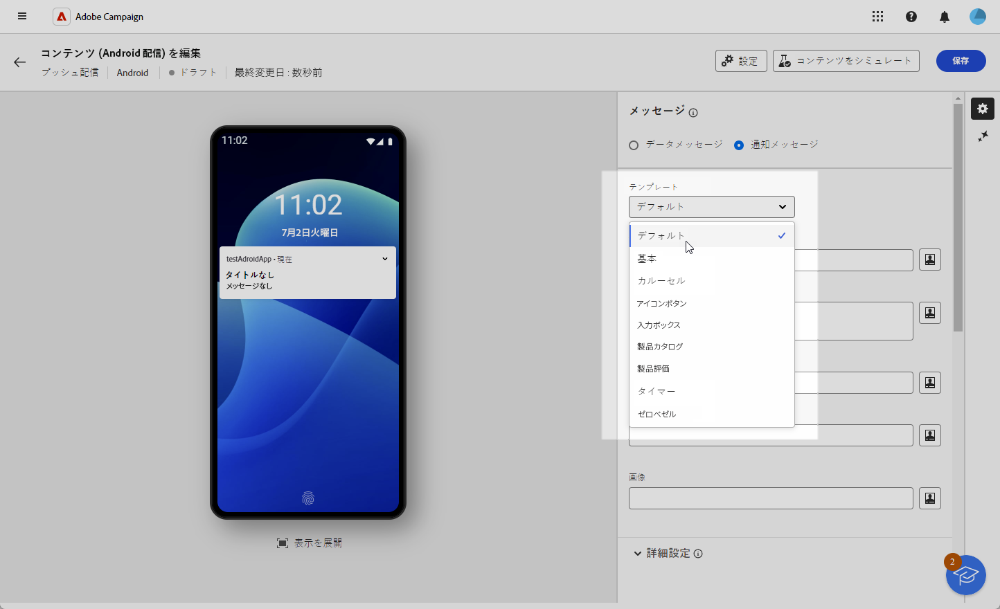

1. メッセージを作成するには、「**[!UICONTROL タイトル]**」フィールドと「**[!UICONTROL メッセージ]**」フィールドにテキストを入力します。

   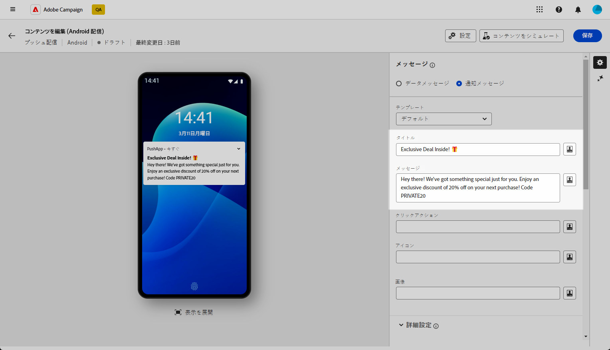

1. 式エディターを使用して、コンテンツの定義、データのパーソナライズ、動的コンテンツの追加を行います。[詳細情報](../personalization/personalize.md)

1. 通知のユーザークリックに関連付けられた&#x200B;**[!UICONTROL クリックアクション]**&#x200B;を定義します。これにより、ユーザーが通知を操作するときの動作（特定の画面を開く、アプリで特定のアクションを実行するなど）が決定されます。

1. プッシュ通知をさらにパーソナライズするには、プッシュ通知に追加する&#x200B;**[!UICONTROL 画像]** URL、プロファイルのデバイスに表示する通知の&#x200B;**[!UICONTROL アイコン]**&#x200B;を選択します。

   

1. プッシュ通知の&#x200B;**[!UICONTROL 詳細設定]**&#x200B;を設定します。[詳細情報](#push-advanced)

メッセージのコンテンツを定義したら、テストサブスクライバーを利用して、メッセージをプレビューしテストできます。

>[!TAB 基本]

1. **[!UICONTROL テンプレート]**&#x200B;ドロップダウンから、「**[!UICONTROL 基本]**」を選択します。

   

1. メッセージを作成するには、「**[!UICONTROL タイトル]**」、「**[!UICONTROL メッセージ]**」、「**[!UICONTROL 拡張されたメッセージ]**」の各フィールドにテキストを入力します。

   **[!UICONTROL メッセージ]**&#x200B;テキストは折りたたまれたビューに表示され、通知を拡張すると&#x200B;**[!UICONTROL 拡張されたメッセージ]**&#x200B;が表示されます。

   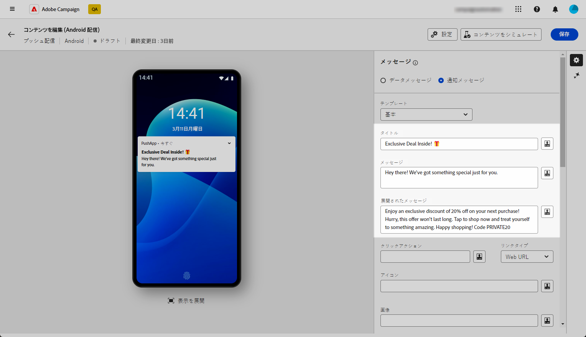

1. 式エディターを使用して、コンテンツの定義、データのパーソナライズ、動的コンテンツの追加を行います。[詳細情報](../personalization/personalize.md)

1. 通知のユーザークリックに関連付けられた&#x200B;**[!UICONTROL クリックアクション]**&#x200B;を定義する URL を追加します。これにより、ユーザーが通知を操作するときの動作（特定の画面を開く、アプリで特定のアクションを実行するなど）が決定されます。

1. 「**[!UICONTROL クリックアクション]**」フィールドに追加した URL の&#x200B;**[!UICONTROL リンクタイプ]**&#x200B;を選択します。

   * **[!UICONTROL Web URL]**：Web URL は、ユーザーをオンラインコンテンツに誘導します。クリックすると、デバイスのデフォルトの web ブラウザーが開き、指定した URL に移動するように求められます。

   * **[!UICONTROL ディープリンク]**：ディープリンクは、アプリが閉じている場合でも、ユーザーをアプリ内の特定のセクションに誘導する URL です。クリックすると、ダイアログが表示され、ユーザーはリンクを処理できる様々なアプリから選択できます。

   * **[!UICONTROL オープンアプリ]**：オープンアプリの URL を使用すると、アプリケーション内のコンテンツに直接接続できます。これにより、アプリケーションでは、曖昧さ回避ダイアログをバイパスして、特定のタイプのリンクのデフォルトハンドラーとして確立できます。

   Android アプリリンクの処理方法について詳しくは、[Android 開発者向けドキュメント](https://developer.android.com/training/app-links)を参照してください。

   

1. プッシュ通知をさらにパーソナライズするには、プッシュ通知に追加する&#x200B;**[!UICONTROL 画像]** URL、プロファイルのデバイスに表示する通知の&#x200B;**[!UICONTROL アイコン]**&#x200B;を選択します。

1. 「**[!UICONTROL 追加ボタン]**」をクリックし、次のフィールドに入力します。

   * **[!UICONTROL ラベル]**：ボタンに表示されるテキスト。
   * **[!UICONTROL リンク URI]**：ボタンクリック時に実行する URI を指定します。
   * **[!UICONTROL リンクタイプ]**：リンクのタイプは、**[!UICONTROL Web URL]**、**[!UICONTROL ディープリンク]**、**[!UICONTROL オープンアプリ]**&#x200B;のいずれかです。

   プッシュ通知には、最大 3 つのボタンを含めるオプションがあります。「**[!UICONTROL 後で通知ボタン]**」を選択した場合、含めることができるボタンは最大 2 つだけです。

   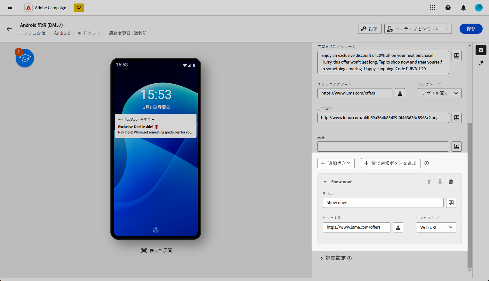

1. 「**[!UICONTROL 後で通知を追加]**」ボタンをクリックして、プッシュ通知に後で通知するオプションを追加します。**[!UICONTROL ラベル]**&#x200B;と&#x200B;**[!UICONTROL タイムスタンプ]**&#x200B;を入力します。

   「タイムスタンプ」フィールドには、エポックを表す値（秒単位）が必要です。

   

1. プッシュ通知の&#x200B;**[!UICONTROL 詳細設定]**&#x200B;を設定します。[詳細情報](#push-advanced)

メッセージのコンテンツを定義したら、テストサブスクライバーを利用して、メッセージをプレビューしテストできます。

>[!TAB カルーセル]

1. **[!UICONTROL テンプレート]**&#x200B;ドロップダウンから、「**[!UICONTROL カルーセル]**」を選択します。

   

1. メッセージを作成するには、「**[!UICONTROL タイトル]**」、「**[!UICONTROL メッセージ]**」、「**[!UICONTROL 拡張されたメッセージ]**」の各フィールドにテキストを入力します。

   **[!UICONTROL メッセージ]**&#x200B;テキストは折りたたまれたビューに表示され、通知を拡張すると&#x200B;**[!UICONTROL 拡張されたメッセージ]**&#x200B;が表示されます。

   

1. 式エディターを使用して、コンテンツの定義、データのパーソナライズ、動的コンテンツの追加を行います。[詳細情報](../personalization/personalize.md)

1. 通知のユーザークリックに関連付けられた&#x200B;**[!UICONTROL クリックアクション]**&#x200B;を定義する URL を追加します。これにより、ユーザーが通知を操作するときの動作（特定の画面を開く、アプリで特定のアクションを実行するなど）が決定されます。

1. 「**[!UICONTROL クリックアクション]**」フィールドに追加した URL の&#x200B;**[!UICONTROL リンクタイプ]**&#x200B;を選択します。

   * **[!UICONTROL Web URL]**：Web URL は、ユーザーをオンラインコンテンツに誘導します。クリックすると、デバイスのデフォルトの web ブラウザーが開き、指定した URL に移動するように求められます。

   * **[!UICONTROL ディープリンク]**：ディープリンクは、アプリが閉じている場合でも、ユーザーをアプリ内の特定のセクションに誘導する URL です。クリックすると、ダイアログが表示され、ユーザーはリンクを処理できる様々なアプリから選択できます。

   * **[!UICONTROL オープンアプリ]**：オープンアプリの URL を使用すると、アプリケーション内のコンテンツに直接接続できます。これにより、アプリケーションでは、曖昧さ回避ダイアログをバイパスして、特定のタイプのリンクのデフォルトハンドラーとして確立できます。

   Android アプリリンクの処理方法について詳しくは、[Android 開発者向けドキュメント](https://developer.android.com/training/app-links)を参照してください。

   

1. プッシュ通知をさらにパーソナライズするには、プロファイルのデバイスに表示する通知の&#x200B;**[!UICONTROL アイコン]**&#x200B;を選択します。

1. **[!UICONTROL カルーセル]**&#x200B;の操作方法を選択します。

   * **[!UICONTROL 自動]**：画像をスライドとして自動的に切り替えさせ、定義済みの間隔で移行します。
   * **[!UICONTROL 手動]**：ユーザーはスライド間を手動でスワイプして画像間を移動できます。

     「**[!UICONTROL フィルムストリップ]**」オプションを有効にすると、メインスライドの横に前と次の画像のプレビューが表示されます。

1. 「**[!UICONTROL 画像を追加]**」をクリックし、画像の URL とテキストを入力します。

   少なくとも 3 つの画像、最大 5 つの画像を含めます。

   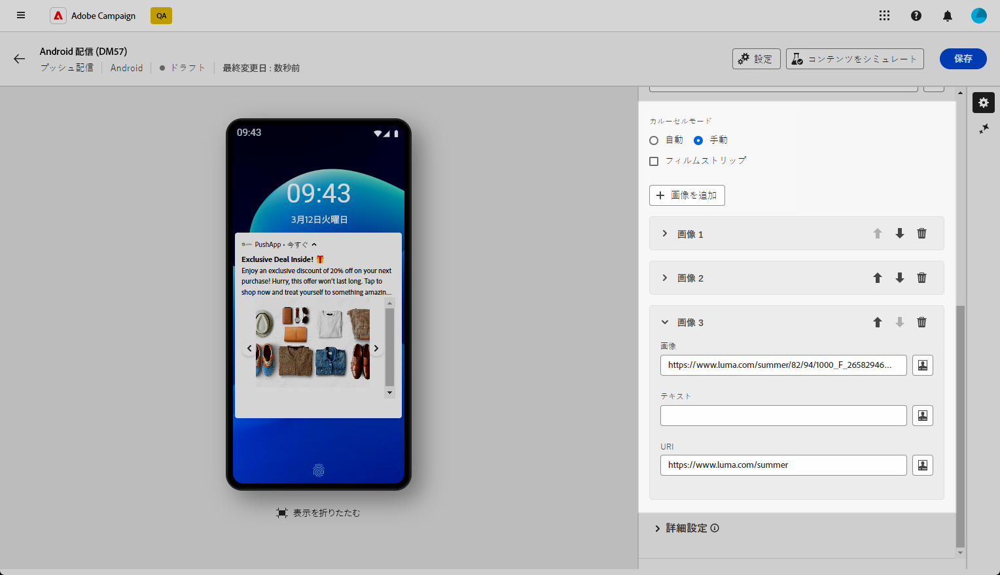

1. 下向き矢印と上向き矢印を使用して、画像の順序を操作します。

1. プッシュ通知の&#x200B;**[!UICONTROL 詳細設定]**&#x200B;を設定します。[詳細情報](#push-advanced)

メッセージのコンテンツを定義したら、テストサブスクライバーを利用して、メッセージをプレビューしテストできます。

>[!TAB アイコンボタン]

1. **[!UICONTROL テンプレート]**&#x200B;ドロップダウンから、**[!UICONTROL アイコンボタン]**&#x200B;を選択します。

   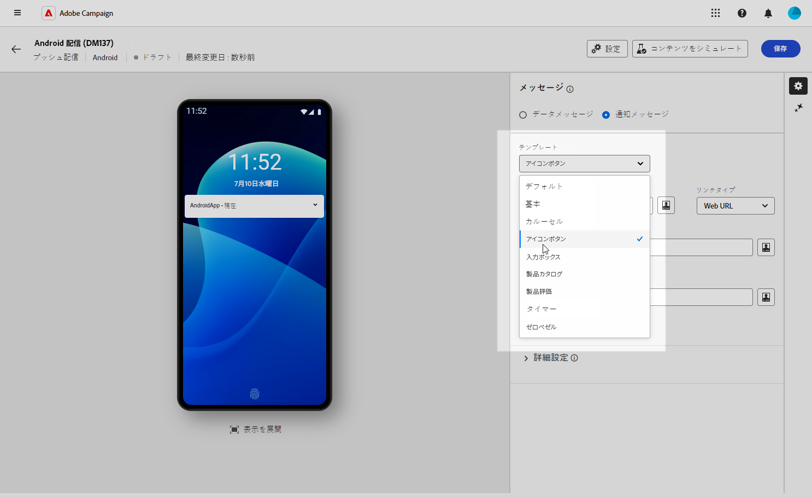

1. 通知のユーザークリックに関連付けられた&#x200B;**[!UICONTROL クリックアクション]**&#x200B;を定義する URL を追加します。これにより、ユーザーが通知を操作するときの動作（特定の画面を開く、アプリで特定のアクションを実行するなど）が決定されます。

1. 「**[!UICONTROL クリックアクション]**」フィールドに追加した URL の&#x200B;**[!UICONTROL リンクタイプ]**&#x200B;を選択します。

   * **[!UICONTROL Web URL]**：Web URL は、ユーザーをオンラインコンテンツに誘導します。クリックすると、デバイスのデフォルトの web ブラウザーが開き、指定した URL に移動するように求められます。

   * **[!UICONTROL ディープリンク]**：ディープリンクは、アプリが閉じている場合でも、ユーザーをアプリ内の特定のセクションに誘導する URL です。クリックすると、ダイアログが表示され、ユーザーはリンクを処理できる様々なアプリから選択できます。

   * **[!UICONTROL オープンアプリ]**：オープンアプリの URL を使用すると、アプリケーション内のコンテンツに直接接続できます。これにより、アプリケーションでは、曖昧さ回避ダイアログをバイパスして、特定のタイプのリンクのデフォルトハンドラーとして確立できます。

   Android アプリリンクの処理方法について詳しくは、[Android 開発者向けドキュメント](https://developer.android.com/training/app-links)を参照してください。

   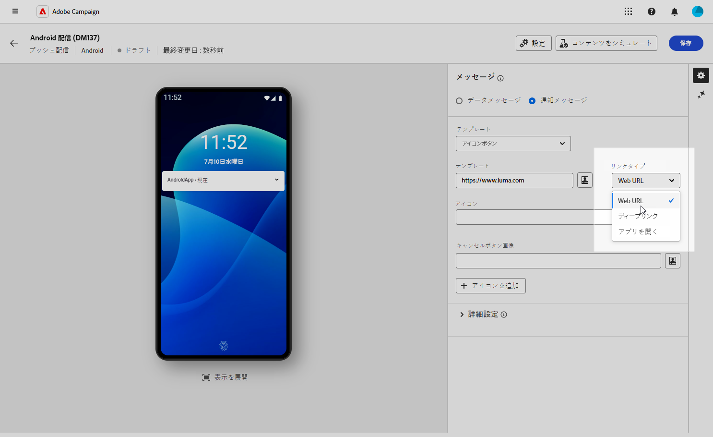

1. プッシュ通知をさらにパーソナライズするには、プロファイルのデバイスに表示する通知の&#x200B;**[!UICONTROL アイコン]**&#x200B;を選択します。

1. **[!UICONTROL キャンセルボタン画像]**&#x200B;の URL を追加します。

1. 「**[!UICONTROL アイコンを追加]**」をクリックし、**画像 URL**、**[!UICONTROL リンク URI]** を入力して、**[!UICONTROL リンクタイプ]**&#x200B;を選択します。

   少なくとも 3 つのアイコン、最大 5 つのアイコンを含めます。

   

1. 下向き矢印と上向き矢印を使用して、画像の順序を操作します。

1. プッシュ通知の&#x200B;**[!UICONTROL 詳細設定]**&#x200B;を設定します。[詳細情報](#push-advanced)

   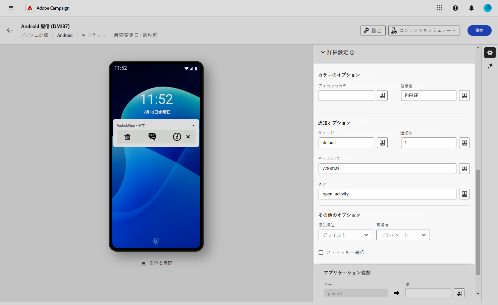

メッセージのコンテンツを定義したら、テストサブスクライバーを利用して、メッセージをプレビューしテストできます。

>[!TAB 入力ボックス]

1. **[!UICONTROL 通知タイプ]**&#x200B;ドロップダウンから、「**[!UICONTROL 入力ボックス]**」を選択します。

   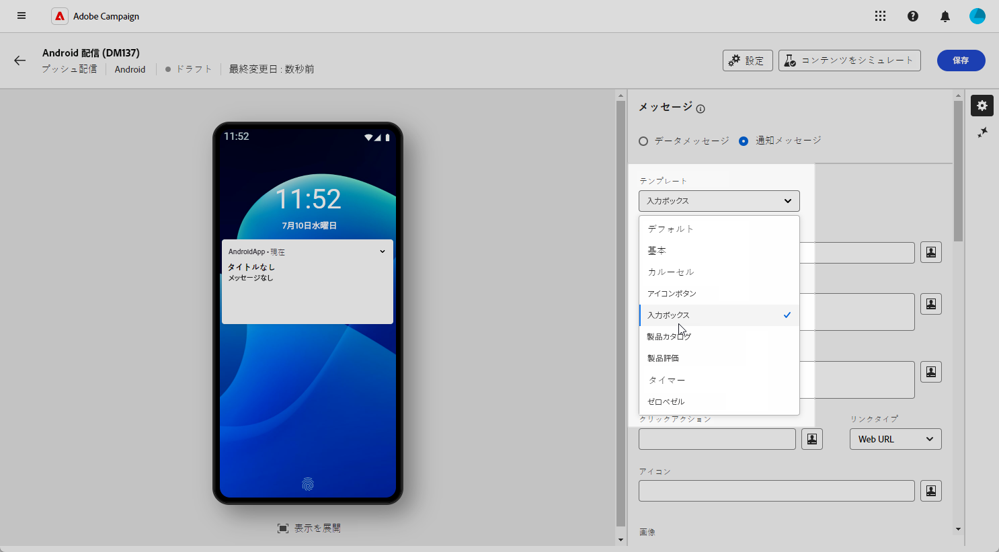

1. メッセージを作成するには、「**[!UICONTROL タイトル]**」、「**[!UICONTROL メッセージ]**」、「**[!UICONTROL 拡張されたメッセージ]**」の各フィールドにテキストを入力します。

   **[!UICONTROL メッセージ]**&#x200B;テキストは折りたたまれたビューに表示され、通知を拡張すると&#x200B;**[!UICONTROL 拡張されたメッセージ]**&#x200B;が表示されます。

   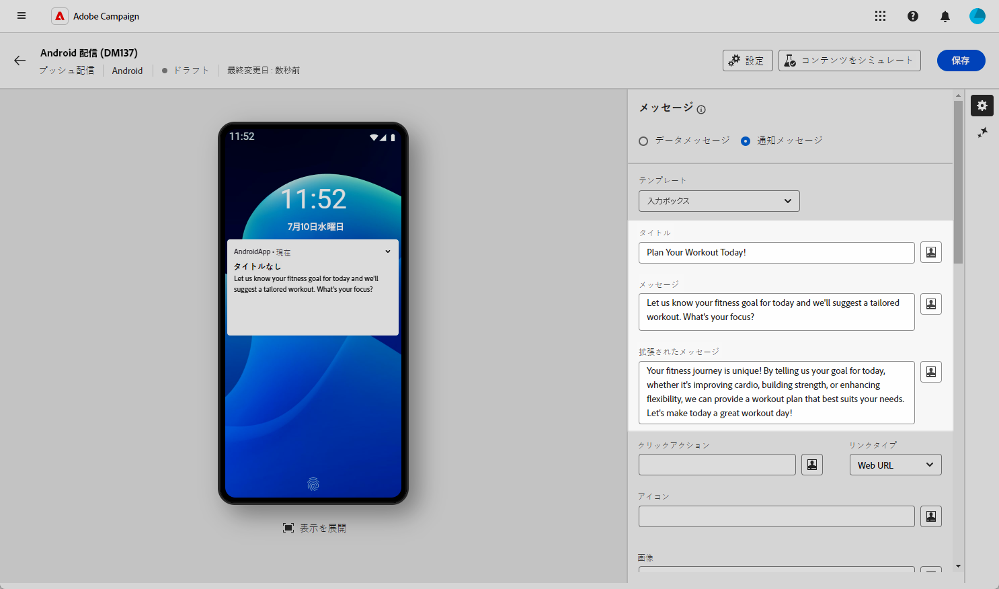

1. 動的パーソナライゼーションフィールドを使用して、コンテンツの定義、データのパーソナライズ、動的コンテンツの追加を行います。[詳細情報](../personalization/personalize.md)

1. 通知のユーザークリックに関連付けられた&#x200B;**[!UICONTROL クリックアクション]**&#x200B;を定義する URL を追加します。これにより、ユーザーが通知を操作するときの動作（特定の画面を開く、アプリで特定のアクションを実行するなど）が決定されます。

1. 「**[!UICONTROL クリックアクション]**」フィールドに追加した URL の&#x200B;**[!UICONTROL リンクタイプ]**&#x200B;を選択します。

   * **[!UICONTROL Web URL]**：Web URL は、ユーザーをオンラインコンテンツに誘導します。クリックすると、デバイスのデフォルトの web ブラウザーが開き、指定した URL に移動するように求められます。

   * **[!UICONTROL ディープリンク]**：ディープリンクは、アプリが閉じている場合でも、ユーザーをアプリ内の特定のセクションに誘導する URL です。クリックすると、ダイアログが表示され、ユーザーはリンクを処理できる様々なアプリから選択できます。

   * **[!UICONTROL オープンアプリ]**：オープンアプリの URL を使用すると、アプリケーション内のコンテンツに直接接続できます。これにより、アプリケーションでは、曖昧さ回避ダイアログをバイパスして、特定のタイプのリンクのデフォルトハンドラーとして確立できます。

   Android アプリリンクの処理方法について詳しくは、[Android 開発者向けドキュメント](https://developer.android.com/training/app-links)を参照してください。

1. プッシュ通知をさらにパーソナライズするには、プッシュ通知に追加する&#x200B;**[!UICONTROL 画像]** URL、プロファイルのデバイスに表示する通知の&#x200B;**[!UICONTROL アイコン]**&#x200B;を選択します。

1. **入力ボックス**&#x200B;に次のオプションを入力します。

   * **[!UICONTROL 入力受信者名]**：入力の受信者の名前または識別子を入力します。
   * **[!UICONTROL 入力テキスト]**：**入力ボックス**&#x200B;のテキストを入力します。
   * **[!UICONTROL フィードバックテキスト]**：返信の後に表示するテキストを入力します。
   * **[!UICONTROL フィードバック画像]**：返信の後に表示される画像の URL を追加します。

   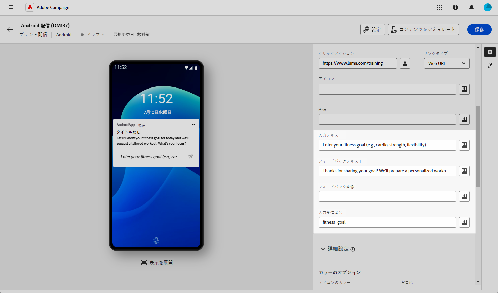

1. プッシュ通知の&#x200B;**[!UICONTROL 詳細設定]**&#x200B;を設定します。[詳細情報](#push-advanced)

メッセージのコンテンツを定義したら、テストサブスクライバーを利用して、メッセージをプレビューしテストできます。

>[!TAB 製品カタログ]

1. **[!UICONTROL 通知タイプ]**&#x200B;ドロップダウンから、「**[!UICONTROL 製品カタログ]**」を選択します。

   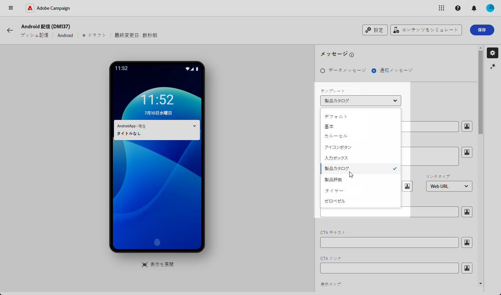

1. メッセージを作成するには、「**[!UICONTROL タイトル]**」フィールドと「**[!UICONTROL メッセージ]**」フィールドにテキストを入力します。

   

1. 動的パーソナライゼーションフィールドを使用して、コンテンツの定義、データのパーソナライズ、動的コンテンツの追加を行います。[詳細情報](../personalization/personalize.md)

1. 通知のユーザークリックに関連付けられた&#x200B;**[!UICONTROL クリックアクション]**&#x200B;を定義する URL を追加します。これにより、ユーザーが通知を操作するときの動作（特定の画面を開く、アプリで特定のアクションを実行するなど）が決定されます。

1. 「**[!UICONTROL クリックアクション]**」フィールドに追加した URL の&#x200B;**[!UICONTROL リンクタイプ]**&#x200B;を選択します。

   * **[!UICONTROL Web URL]**：Web URL は、ユーザーをオンラインコンテンツに誘導します。クリックすると、デバイスのデフォルトの web ブラウザーが開き、指定した URL に移動するように求められます。

   * **[!UICONTROL ディープリンク]**：ディープリンクは、アプリが閉じている場合でも、ユーザーをアプリ内の特定のセクションに誘導する URL です。クリックすると、ダイアログが表示され、ユーザーはリンクを処理できる様々なアプリから選択できます。

   * **[!UICONTROL オープンアプリ]**：オープンアプリの URL を使用すると、アプリケーション内のコンテンツに直接接続できます。これにより、アプリケーションでは、曖昧さ回避ダイアログをバイパスして、特定のタイプのリンクのデフォルトハンドラーとして確立できます。

   Android アプリリンクの処理方法について詳しくは、[Android 開発者向けドキュメント](https://developer.android.com/training/app-links)を参照してください。

1. プッシュ通知をさらにパーソナライズするには、プロファイルのデバイスに表示する通知の&#x200B;**[!UICONTROL アイコン]**&#x200B;を選択します。

1. **クリックトゥアクションテキスト**&#x200B;と&#x200B;**画像**&#x200B;を入力します。

1. **[!UICONTROL 表示タイプ]**&#x200B;を「水平」または「垂直」から選択します。

1. **[!UICONTROL カタログ]**&#x200B;の項目情報を入力します。

   少なくとも 3 つの項目、最大 5 つの項目を含めます。

   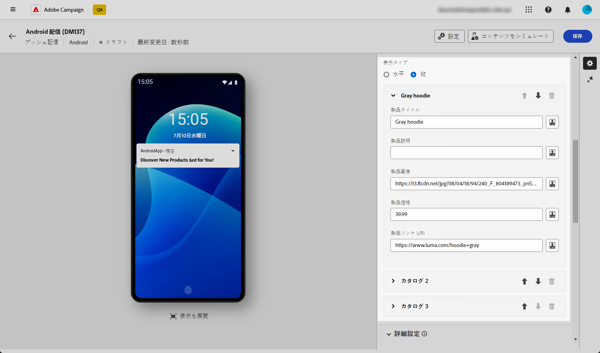

1. 下向き矢印と上向き矢印を使用して、画像の順序を操作します。

1. プッシュ通知の&#x200B;**[!UICONTROL 詳細設定]**&#x200B;を設定します。[詳細情報](#push-advanced)

メッセージのコンテンツを定義したら、テストサブスクライバーを利用して、メッセージをプレビューしテストできます。

>[!TAB 製品評価]

1. **[!UICONTROL 通知タイプ]**&#x200B;ドロップダウンから、「**[!UICONTROL 製品評価]**」を選択します。

   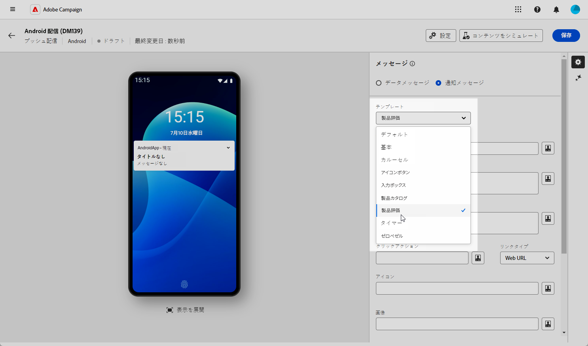

1. メッセージを作成するには、「**[!UICONTROL タイトル]**」、「**[!UICONTROL メッセージ]**」、「**[!UICONTROL 拡張されたメッセージ]**」の各フィールドにテキストを入力します。

   **[!UICONTROL メッセージ]**&#x200B;テキストは折りたたまれたビューに表示され、通知を拡張すると&#x200B;**[!UICONTROL 拡張されたメッセージ]**&#x200B;が表示されます。

   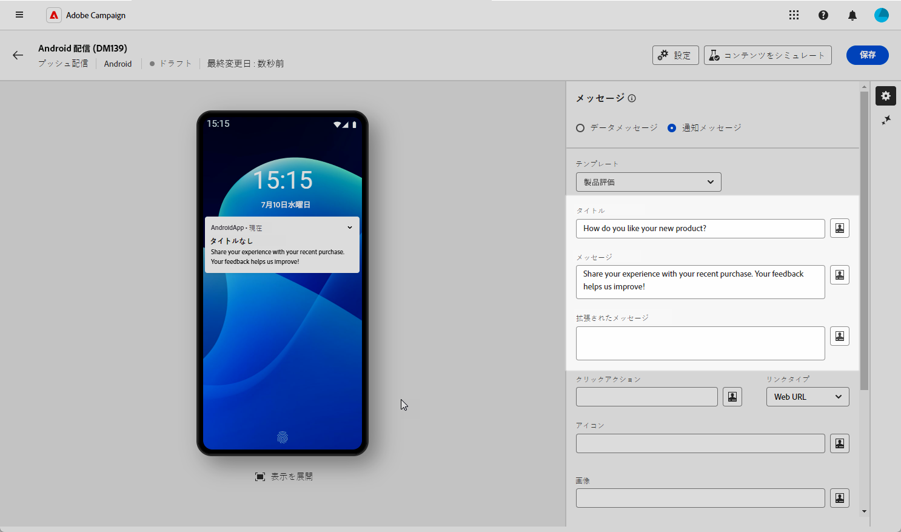

1. 通知のユーザークリックに関連付けられた&#x200B;**[!UICONTROL クリックアクション]**&#x200B;を定義する URL を追加します。これにより、ユーザーが通知を操作するときの動作（特定の画面を開く、アプリで特定のアクションを実行するなど）が決定されます。

1. 「**[!UICONTROL クリックアクション]**」フィールドに追加した URL の&#x200B;**[!UICONTROL リンクタイプ]**&#x200B;を選択します。

   * **[!UICONTROL Web URL]**：Web URL は、ユーザーをオンラインコンテンツに誘導します。クリックすると、デバイスのデフォルトの web ブラウザーが開き、指定した URL に移動するように求められます。

   * **[!UICONTROL ディープリンク]**：ディープリンクは、アプリが閉じている場合でも、ユーザーをアプリ内の特定のセクションに誘導する URL です。クリックすると、ダイアログが表示され、ユーザーはリンクを処理できる様々なアプリから選択できます。

   * **[!UICONTROL オープンアプリ]**：オープンアプリの URL を使用すると、アプリケーション内のコンテンツに直接接続できます。これにより、アプリケーションでは、曖昧さ回避ダイアログをバイパスして、特定のタイプのリンクのデフォルトハンドラーとして確立できます。

   Android アプリリンクの処理方法について詳しくは、[Android 開発者向けドキュメント](https://developer.android.com/training/app-links)を参照してください。

1. プッシュ通知をさらにパーソナライズするには、プッシュ通知に追加する&#x200B;**[!UICONTROL 画像]** URL、プロファイルのデバイスに表示する通知の&#x200B;**[!UICONTROL アイコン]**&#x200B;を選択します。

1. **[!UICONTROL 選択されていない状態の評価アイコン]**&#x200B;と&#x200B;**[!UICONTROL 選択されている状態の評価アイコン]**&#x200B;の URL を追加します。

   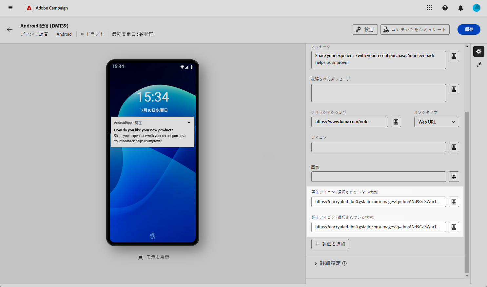

1. 「**[!UICONTROL 評価を追加]**」をクリックし、**[!UICONTROL リンク URI]** と&#x200B;**[!UICONTROL リンクタイプ]**&#x200B;を入力します。

   少なくとも 3 つの評価、最大 5 つの評価を含めます。

   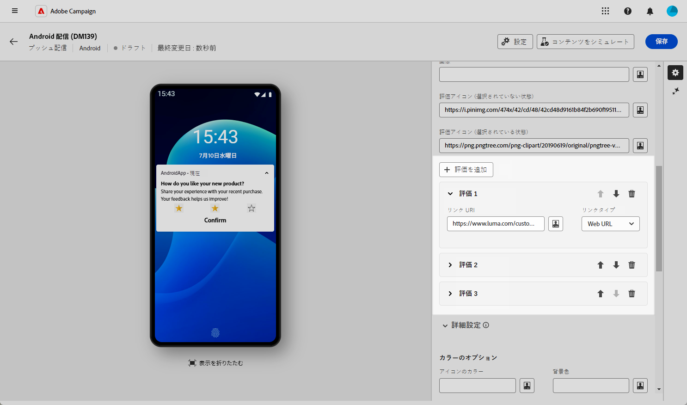

1. 下向き矢印と上向き矢印を使用して、画像の順序を操作します。

1. プッシュ通知の&#x200B;**[!UICONTROL 詳細設定]**&#x200B;を設定します。[詳細情報](#push-advanced)

メッセージのコンテンツを定義したら、テストサブスクライバーを利用して、メッセージをプレビューしテストできます。

>[!TAB タイマー]

1. **[!UICONTROL 通知タイプ]**&#x200B;ドロップダウンから、「**[!UICONTROL タイマー]**」を選択します。

   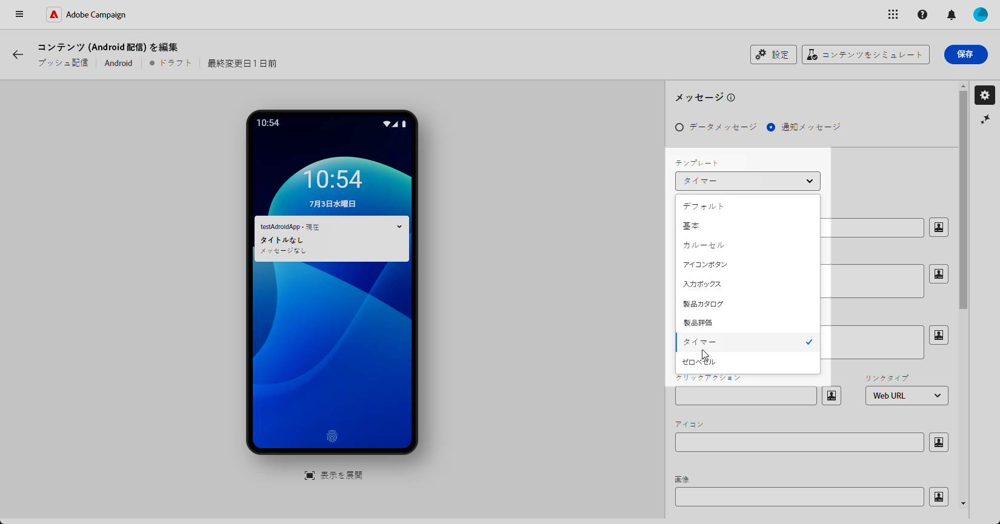

1. メッセージを作成するには、「**[!UICONTROL タイトル]**」フィールドと「**[!UICONTROL メッセージ]**」フィールドにテキストを入力します。

   動的パーソナライゼーションフィールドを使用して、コンテンツの定義、データのパーソナライズ、動的コンテンツの追加を行います。[詳細情報](../personalization/personalize.md)

   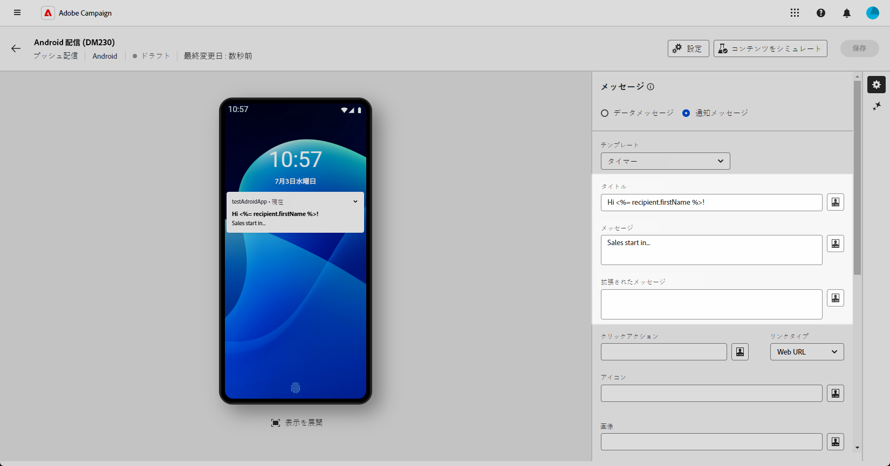

1. 通知のユーザークリックに関連付けられた&#x200B;**[!UICONTROL クリックアクション]**&#x200B;を定義する URL を追加します。これにより、ユーザーが通知を操作するときの動作（特定の画面を開く、アプリで特定のアクションを実行するなど）が決定されます。

1. 「**[!UICONTROL クリックアクション]**」フィールドに追加した URL の&#x200B;**[!UICONTROL リンクタイプ]**&#x200B;を選択します。

   * **[!UICONTROL Web URL]**：Web URL は、ユーザーをオンラインコンテンツに誘導します。クリックすると、デバイスのデフォルトの web ブラウザーが開き、指定した URL に移動するように求められます。

   * **[!UICONTROL ディープリンク]**：ディープリンクは、アプリが閉じている場合でも、ユーザーをアプリ内の特定のセクションに誘導する URL です。クリックすると、ダイアログが表示され、ユーザーはリンクを処理できる様々なアプリから選択できます。

   * **[!UICONTROL オープンアプリ]**：オープンアプリの URL を使用すると、アプリケーション内のコンテンツに直接接続できます。これにより、アプリケーションでは、曖昧さ回避ダイアログをバイパスして、特定のタイプのリンクのデフォルトハンドラーとして確立できます。

   Android アプリリンクの処理方法について詳しくは、[Android 開発者向けドキュメント](https://developer.android.com/training/app-links)を参照してください。

   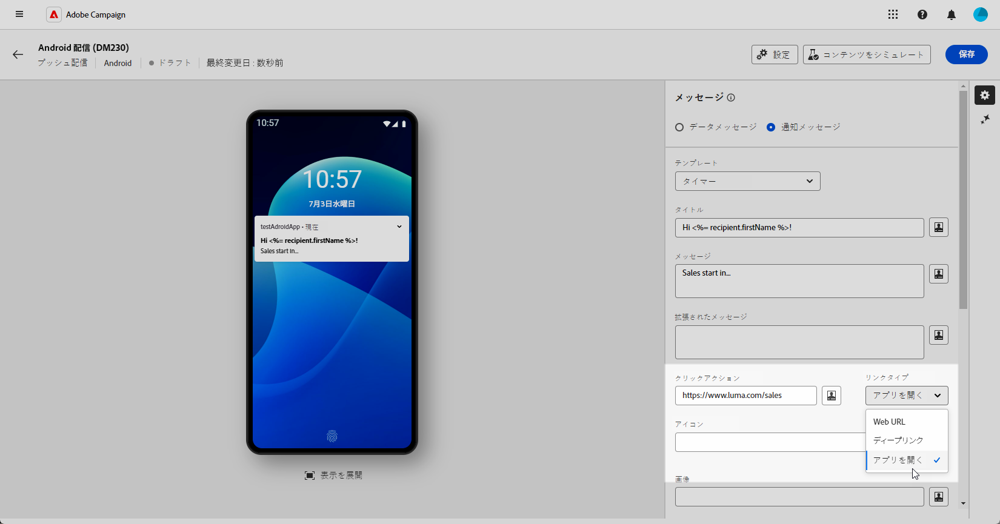

1. プッシュ通知をさらにパーソナライズするには、プッシュ通知に追加する&#x200B;**[!UICONTROL 画像]** URL、プロファイルのデバイスに表示する通知の&#x200B;**[!UICONTROL アイコン]**&#x200B;を選択します。

1. **[!UICONTROL タイマー期間]**&#x200B;を秒単位で設定するか、**[!UICONTROL タイマー終了タイムスタンプ]**&#x200B;を特定のエポックタイムスタンプに設定します。

   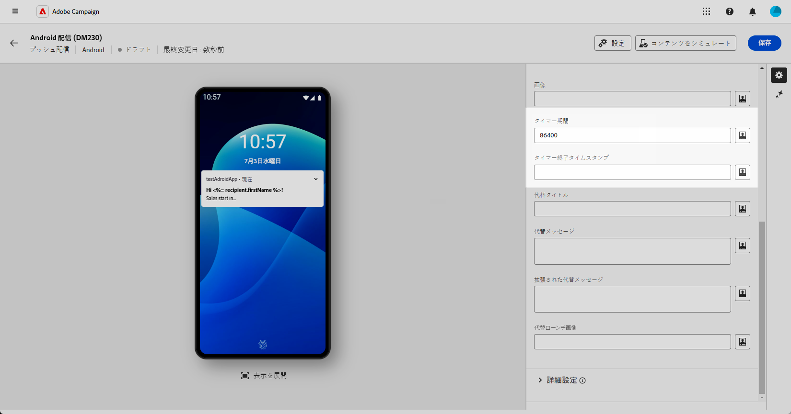

1. タイマーの有効期限が切れた後に表示されるテキストと画像を「**[!UICONTROL 代替タイトル]**」、「**[!UICONTROL 代替メッセージ]**」、「**[!UICONTROL 拡張された代替メッセージ]**」、「**[!UICONTROL 代替ローンチ画像]**」の各フィールドに入力します。

   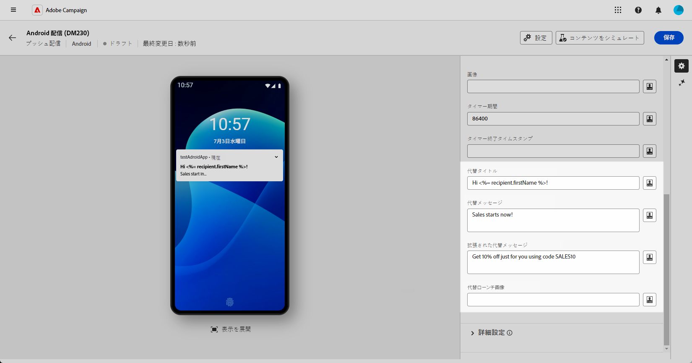

1. プッシュ通知の&#x200B;**[!UICONTROL 詳細設定]**&#x200B;を設定します。[詳細情報](#push-advanced)

メッセージのコンテンツを定義したら、テストサブスクライバーを利用して、メッセージをプレビューしテストできます。

>[!TAB ゼロベゼル]

1. **[!UICONTROL 通知タイプ]**&#x200B;ドロップダウンから、「**[!UICONTROL ゼロベゼル]**」を選択します。

   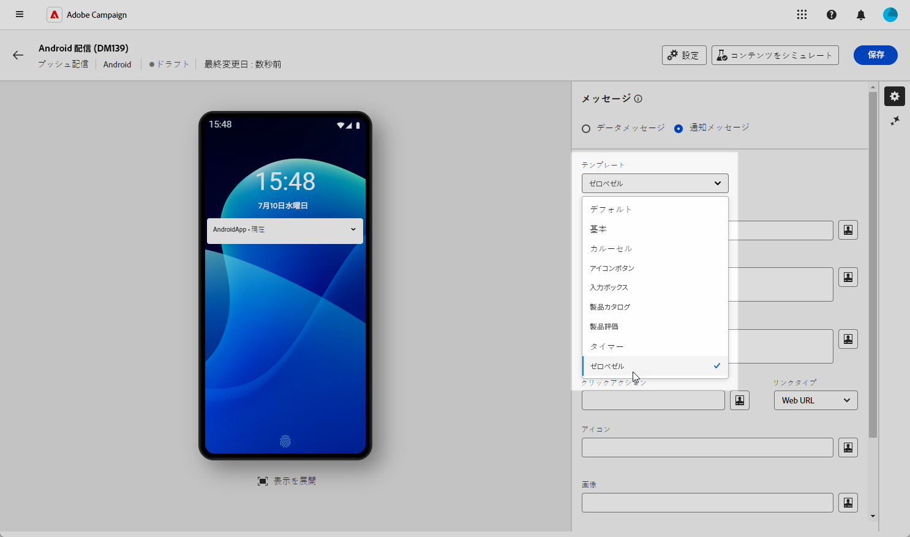

1. メッセージを作成するには、「**[!UICONTROL タイトル]**」、「**[!UICONTROL メッセージ]**」、「**[!UICONTROL 拡張されたメッセージ]**」の各フィールドにテキストを入力します。

   **[!UICONTROL メッセージ]**&#x200B;テキストは折りたたまれたビューに表示され、通知を拡張すると&#x200B;**[!UICONTROL 拡張されたメッセージ]**&#x200B;が表示されます。

   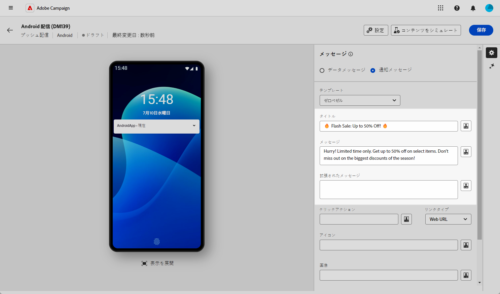

1. 動的パーソナライゼーションフィールドを使用して、コンテンツの定義、データのパーソナライズ、動的コンテンツの追加を行います。[詳細情報](../personalization/personalize.md)

1. 通知のユーザークリックに関連付けられた&#x200B;**[!UICONTROL クリックアクション]**&#x200B;を定義する URL を追加します。これにより、ユーザーが通知を操作するときの動作（特定の画面を開く、アプリで特定のアクションを実行するなど）が決定されます。

1. 「**[!UICONTROL クリックアクション]**」フィールドに追加した URL の&#x200B;**[!UICONTROL リンクタイプ]**&#x200B;を選択します。

   * **[!UICONTROL Web URL]**：Web URL は、ユーザーをオンラインコンテンツに誘導します。クリックすると、デバイスのデフォルトの web ブラウザーが開き、指定した URL に移動するように求められます。

   * **[!UICONTROL ディープリンク]**：ディープリンクは、アプリが閉じている場合でも、ユーザーをアプリ内の特定のセクションに誘導する URL です。クリックすると、ダイアログが表示され、ユーザーはリンクを処理できる様々なアプリから選択できます。

   * **[!UICONTROL オープンアプリ]**：オープンアプリの URL を使用すると、アプリケーション内のコンテンツに直接接続できます。これにより、アプリケーションでは、曖昧さ回避ダイアログをバイパスして、特定のタイプのリンクのデフォルトハンドラーとして確立できます。

   Android アプリリンクの処理方法について詳しくは、[Android 開発者向けドキュメント](https://developer.android.com/training/app-links)を参照してください。

1. プッシュ通知をさらにパーソナライズするには、プッシュ通知に追加する&#x200B;**[!UICONTROL 画像]** URL、プロファイルのデバイスに表示する通知の&#x200B;**[!UICONTROL アイコン]**&#x200B;を選択します。

   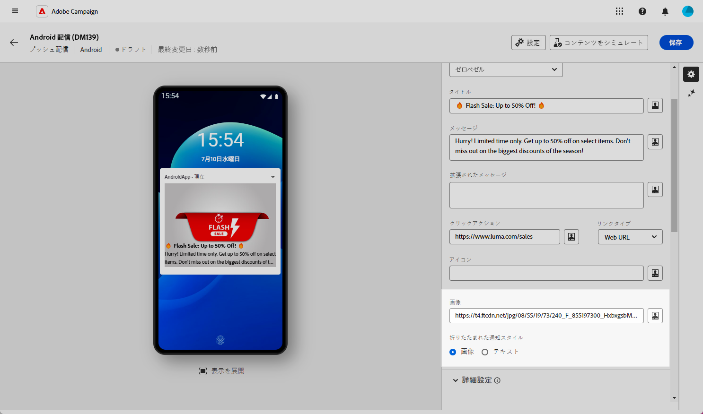

1. 通知に主に画像を表示するかテキストを表示するかに応じて、通知の&#x200B;**[!UICONTROL 折りたたまれた通知スタイル]**&#x200B;を選択します。

1. プッシュ通知の&#x200B;**[!UICONTROL 詳細設定]**&#x200B;を設定します。[詳細情報](#push-advanced)

メッセージのコンテンツを定義したら、テストサブスクライバーを利用して、メッセージをプレビューしテストできます。

>[!ENDTABS]

## プッシュ通知の詳細設定 {#push-advanced}

{zoomable="yes"}

| パラメーター | 説明 |
|---------|---------|
| **[!UICONTROL アイコンの色]** | アイコンの色を 16 進数のカラーコードで設定します。 |
| **[!UICONTROL タイトルの色]** | タイトルの色を 16 進数のカラーコードで設定します。 |
| **[!UICONTROL メッセージテキストの色]** | メッセージテキストの色を 16 進数のカラーコードで設定します。 |
| **[!UICONTROL タイマーの色]** | タイマーの色を 16 進数のカラーコードで設定します。 |
| **[!UICONTROL 通知の背景色]** | 通知の背景色を 16 進数のカラーコードで設定します。 |
| **[!UICONTROL サウンド]** | デバイスが通知を受け取るときに再生するサウンドを設定します。 |
| **[!UICONTROL 通知数]** | アプリケーションアイコンに直接表示する新しい未読情報の数を設定します。これにより、ユーザーは保留中の通知数をすばやく確認できます。 |
| **[!UICONTROL チャネル ID]** | 通知のチャネル ID を設定します。このチャネル ID を持つ通知を受信するには、このチャネル ID を持つチャネルをアプリで事前に作成しておく必要があります。 |
| **[!UICONTROL タグ]** | 通知ドロワー内の既存の通知を置き換えるために使用する識別子を設定します。これにより、複数の通知が蓄積されるのを防ぎ、関連する最新通知のみが表示されるようにします。 |
| **[!UICONTROL 優先順位]** | 通知の優先度レベル（デフォルト、最小、低、高）を設定します。 優先度レベルは通知の重要度と緊急性を決定し、通知の表示方法と、特定のシステム設定をバイパスできるかどうかに影響します。詳しくは、[FCM のドキュメント](https://firebase.google.com/docs/reference/fcm/rest/v1/projects.messages?hl=ja#notificationpriority)を参照してください。 |
| **[!UICONTROL 可視性]** | 通知の表示レベルを（パブリック、プライベート、秘密）のいずれかに設定します。表示レベルは、通知の内容をロック画面やその他の機密領域にどの程度表示するかを決定します。詳しくは、[FCM ドキュメント](https://firebase.google.com/docs/reference/fcm/rest/v1/projects.messages#visibility)を参照してください。 |
| **[!UICONTROL スティッキー通知]** | 有効にした場合、ユーザーがクリックした後も通知は表示されたままになります。 無効にした場合、ユーザーが操作すると通知は自動的に閉じられます。スティッキー動作を使用すると、重要な通知を長期間画面に保持できます。 |
| **[!UICONTROL アプリケーション変数]** | 通知動作を定義できます。 これらの変数は完全にカスタマイズ可能で、モバイルデバイスに送信されるメッセージペイロードの一部に含まれます。 |