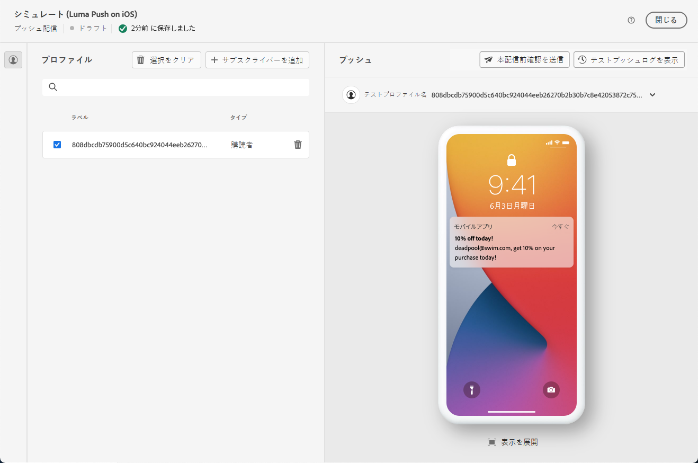

# プッシュ配信のプレビューと送信 {#send-push-delivery}

## プッシュ通知配信をプレビュー {#preview-push}

メッセージのコンテンツを定義したら、テストサブスクライバーを利用して、メッセージをプレビューしテストします。パーソナライズされたコンテンツを挿入してある場合は、そのコンテンツがメッセージにどのように表示されるかを、テストプロファイルデータを利用して確認します。ここで、メッセージが正しくレンダリングされ、パーソナライズされた要素が適切に組み込まれていることを確認できます。

プッシュ通知をプレビューする主な手順は次のとおりです。配信のプレビュー方法の詳細については、[この節](../preview-test/preview-content.md)を参照してください。

1. 配信コンテンツページから、「**[!UICONTROL コンテンツをシミュレート]**」を使用して、パーソナライズされたコンテンツをプレビューします。

   {zoomable="yes"}

1. 「**[!UICONTROL サブスクライバーを追加]**」をクリックし、1 つまたは複数のプロファイルを選択して、プッシュ通知コンテンツ内のデータをプレビューします。

   <!--Once your test subscribers are selected, click **[!UICONTROL Select]**.
    {zoomable="yes"}-->

1. 右側のパネルにはプッシュ通知のプレビューが表示され、パーソナライズされた要素が選択したプロファイルのデータに動的に置き換えられます。

   {zoomable="yes"}

プッシュ通知を確認してオーディエンスに送信します。

## プッシュ通知配信をテスト {#test-push}

**Adobe Campaign** を使用して、メインオーディエンスに配信する前に本配信前確認を送信します。この手順では、配信を検証し、問題を特定します。

テストプロファイルは、本配信前確認の受信者として機能します。リンク、画像、パーソナライゼーションなどのコンポーネントと設定をレビューおよび検証し、最適なパフォーマンスの確保やエラー検出を行います。このプロセスでは、メインオーディエンスに届ける前にプッシュ通知を調整し、最適化します。[詳しくは、本配信前確認の送信方法を参照してください](../preview-test/test-deliveries.md#subscribers)。

{zoomable="yes"}

## プッシュ通知配信を送信 {#send-push}

1. プッシュ通知コンテンツをパーソナライズした後、**[!UICONTROL 配信]**&#x200B;ページから「**[!UICONTROL 確認して送信]**」をクリックします。

   {zoomable="yes"}

1. 「**[!UICONTROL 準備]**」をクリックし、表示される進行状況と統計を監視します。

   エラーが発生した場合は、ログメニューでエラーに関する詳細情報を参照してください。

   {zoomable="yes"}

1. 「**[!UICONTROL 送信]**」をクリックしてメッセージを送信し、最終的な送信プロセスに進みます。

1. 「**[!UICONTROL 送信]**」をクリックして、送信アクションを確定します。

   プッシュ配信がスケジュールされている場合は、「**[!UICONTROL スケジュールどおりに送信]**」ボタンをクリックします。配信スケジュールについて詳しくは、[この節](../msg/gs-messages.md#schedule-the-delivery-sending)を参照してください。

   {zoomable="yes"}

配信が送信されると、配信ページから主要業績評価指標（KPI）データを追跡し、**[!UICONTROL ログ]**&#x200B;メニューからデータを追跡します。

組み込みレポートを使用して、メッセージの影響の測定を開始します。[詳細情報](../reporting/push-report.md)。