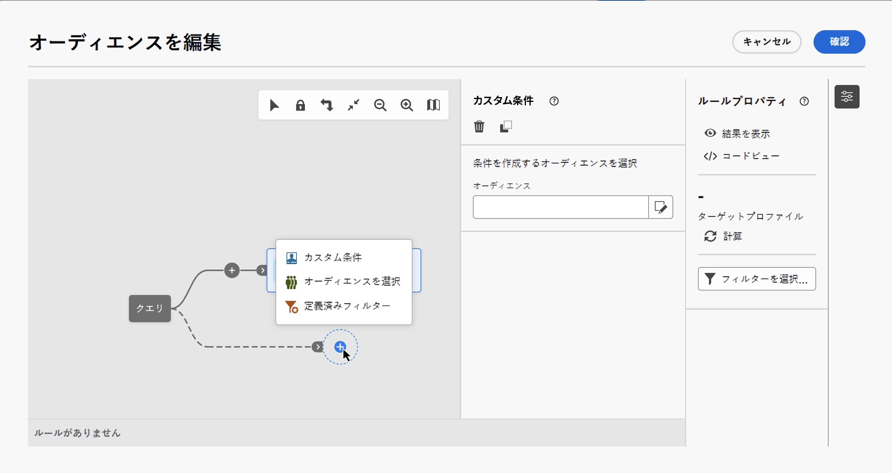
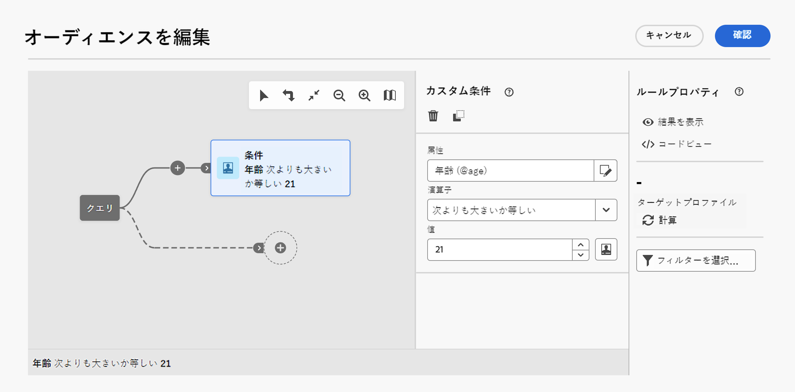
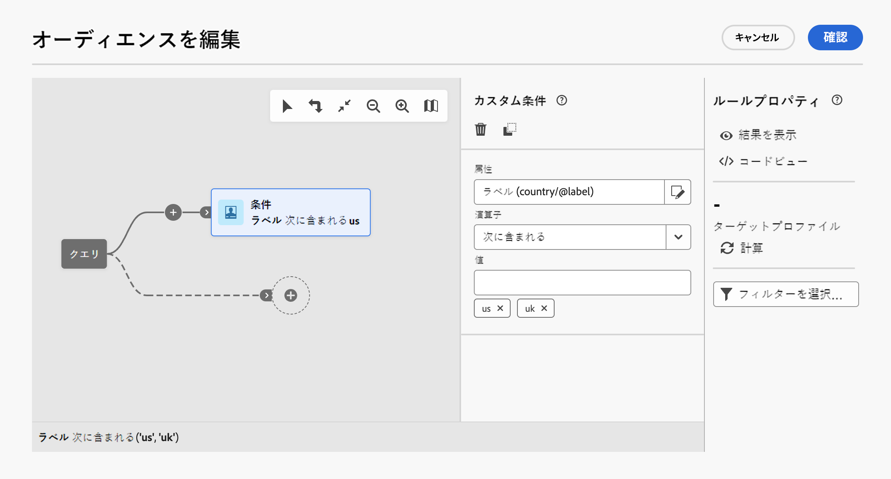
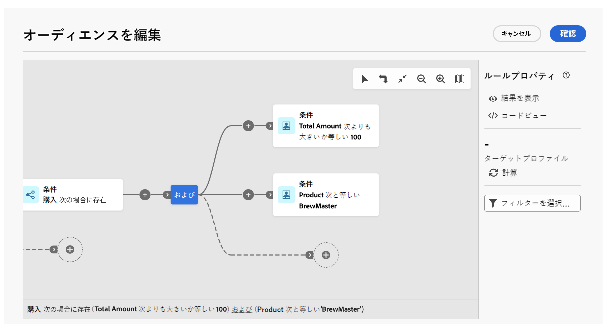
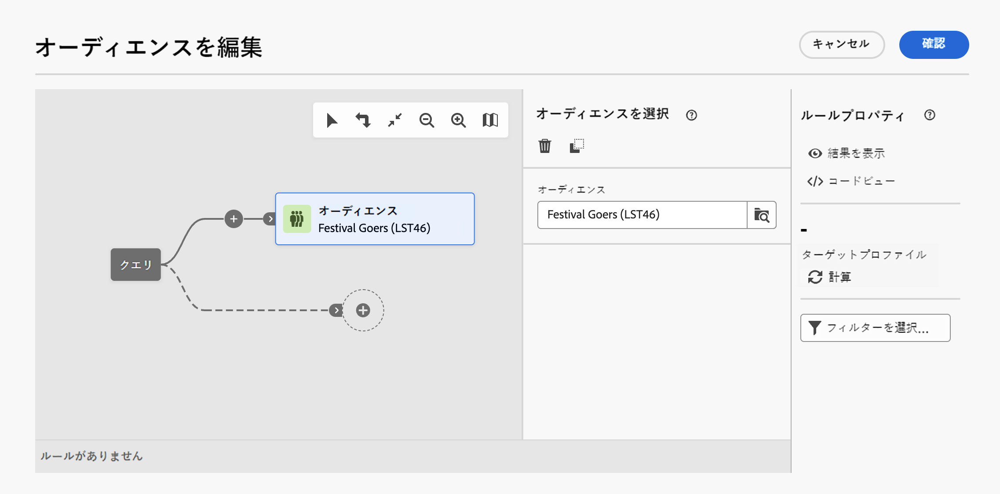
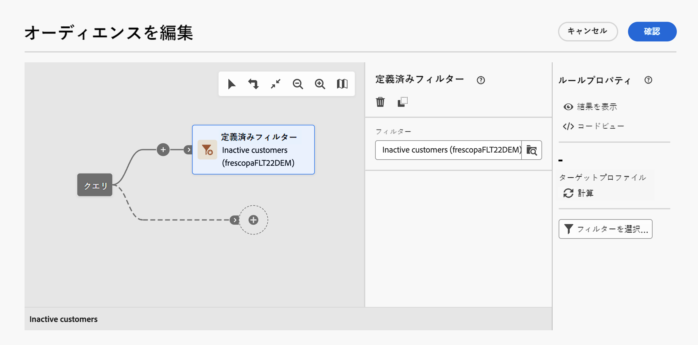
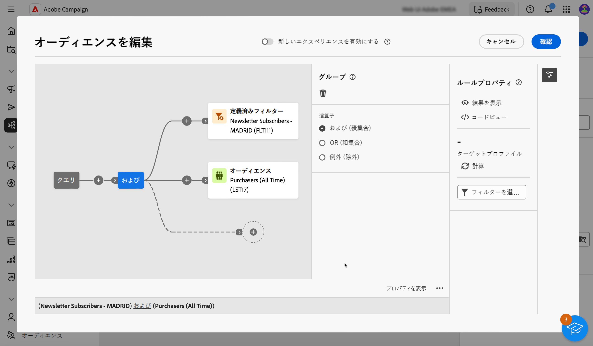

# 最初のクエリの作成 {#build-query}

クエリの作成を開始するには、実行するアクションに応じて、選択した場所からクエリモデラーにアクセスします。クエリモデラーが開き、空白のキャンバスが表示されます。「**+**」ボタンをクリックして、クエリの最初のノードを設定します。

次の 2 種類の要素を追加できます。

* **コンポーネントのフィルタリング**（カスタム条件、オーディエンスを選択、定義済みフィルター）を使用すると、独自のルールを作成したり、オーディエンスまたは定義済みフィルターを選択してクエリを絞り込んだりできます。[詳しくは、コンポーネントフィルタリングの操作方法を参照してください](#filtering)

  例：

  *「スポーツ」ニュースレターを購読した受信者*。*ニューヨークに住む受信者*、*サンフランシスコに住む受信者*

* **グループ演算子**（AND、OR、EXCEPT）を使用すると、ニーズに合わせて、ダイアグラム内のフィルタリングコンポーネントをグループ化できます。[詳しくは、演算子の操作方法を参照してください](#filtering)

  例：

  *「スポーツ」ニュースレターを購読した受信者&#x200B;**および**ニューヨーク&#x200B;**または**サンフランシスコに住む受信者*。

## フィルタリングコンポーネントの追加 {#filtering}

コンポーネントをフィルタリングすると、次を使用してクエリを絞り込むことができます。

* **カスタム条件**：データベースの属性と高度な式を使用して独自の条件を作成し、クエリをフィルタリングします。
* **オーディエンス**：既存のオーディエンスを使用してクエリをフィルタリングします。
* **定義済みフィルター**：既存の定義済みフィルターを使用してクエリをフィルタリングします。

### カスタム条件の設定

>[!CONTEXTUALHELP]
>id="acw_orchestration_querymodeler_customcondition"
>title="カスタム条件"
>abstract="カスタム条件"

カスタム条件を使用してクエリをフィルタリングするには、次の手順に従います。

1. 目的のノードの「**+**」ボタンをクリックし、「**[!UICONTROL カスタム条件]**」を選択します。右側にカスタム条件のプロパティパネルが開きます。

1. 「**属性**」フィールドで、条件の作成に活用するデータベースから属性を選択します。属性リストには、テーブルにリンクされた属性を含む、Campaign データベースのすべての属性が含まれます。

   

   >[!NOTE]
   >
   >「式を編集」ボタンを使用すると、Campaign web 式エディターを活用し、データベースのフィールドとヘルパー関数を使用して式を手動で定義できます。

1. 適用する演算子をドロップダウンリストから選択します。様々な演算子が使用可能です。ドロップダウンリストで使用できる演算子は、属性のデータタイプによって異なります。

   +++使用可能な演算子のリスト

   | 演算子 | 目的 | 例 |
   |  ---  |  ---  |  ---  |
   | 次と等しい | 2 番目の「値」列に入力されたデータと同一の結果を返します。 | 姓（@lastName）が「佐藤」と等しいは、姓が佐藤の受信者のみを返します。 |
   | 次と等しくない | 入力された値と等しくないすべての値を返します。 | 言語（@language）が「英語」と等しくない。 |
   | 次の値より大きい | 入力された値より大きい値を返します。 | 年齢（@age）が 50 より大きい</strong>は、「50」より大きいすべての値（「51」、「52」など）を返します。 |
   | より小さい | 入力された値より小さい値を返します。 | 作成日（@created）が「DaysAgo(100)」より小さい</strong>は、過去 100 日以内に作成されたすべての受信者を返します。 |
   | 次よりも大きいか等しい | 入力された値より大きいか等しいすべての値を返します。 | 年齢（@age）が「30」よりも大きいか等しい</strong>は、30 歳以上のすべての受信者を返します。 |
   | 次よりも小さいか等しい | 入力された値より小さいか等しいすべての値を返します。 | 年齢（@age）が「60」よりも小さいか等しい</strong>は、60 歳以下のすべての受信者を返します。 |
   | 次に含まれる | 指定された値に含まれる結果を返します。これらの値はコンマで区切る必要があります。 | 生年月日（@birthDate）が「1979/12/10, 1984/12/10」に含まれる範囲は、これらの日付の間に生まれた受信者を返します。 |
   | 次に含まれない | 「次に含まれる」演算子と同様に機能します。ここでは、入力された値に基づいて受信者を除外します。 | 生年月日（@birthDate）が「1972/12/10, 1984/12/10」に含まれない。前の例とは異なり、これらの日付に生まれた受信者は返されません。 |
   | 空である | この場合、検索する結果は、2 番目の「値」列にある空の値と一致します。 | モバイル（@mobilePhone）が空であるは、モバイル番号がないすべての受信者を返します。 |
   | 空でない | 「空である」演算子の逆の機能です。2 番目の「値」列にあるデータを入力する必要はありません。 | メール（@email）は空でない。 |
   | 次で始まる | 入力された値で始まる結果を返します。 | アカウント番号（@account）が「32010」で始まる。 |
   | 次で始まらない | 入力された値で始まらない結果を返します。 | アカウント番号（@account）が「20」で始まらない。 |
   | 次を含む | 入力された値を含む結果を返します。 | メールドメイン（@domain）が「mail」を含む</strong>は、「mail」を含むすべてのドメイン名を返します。したがって、「gmail.com」ドメインも返されます。 |
   | 次を含まない | 入力された値を含まない結果を返します。 | メールドメイン（@domain）が「vo」を含まない</strong>。この場合、「vo」を含むドメイン名は返されません。結果には「voila.jp」ドメイン名は表示されません。 |
   | 次に類似 | 「次に類似」は、「次を含む」演算子とよく似ています。値に % ワイルドカード文字を挿入できます。 | 姓（@lastName）が「Jon%s」に類似している。ここでは、オペレーターが「n」と「s」の間の欠落している英数字を忘れたので、ワイルドカード文字が「Jones」という名前を検索するための「ジョーカー」として使用されています。 |
   | 次に類似しない | 「次に類似」は、「次を含む」演算子とよく似ています。値に % ワイルドカード文字を挿入できます。 | 姓（@lastName）が「Smi%h」に類似していない。この場合、姓が「Smi%h」の受信者は返されません。 |

+++

1. 「**値**」フィールドで、期待値を定義します。また、Campaign web 式エディターを利用して、データベースのフィールドとヘルパー関数を使用して式を手動で定義することもできます。それには、「**式を編集**」ボタンをクリックします。

   *21 歳以上のすべてのプロファイルを返すクエリの例：*

   

**距離テーブルのカスタム条件（1 対 1 および 1 対多リンク）**

カスタム条件を使用すると、受信者テーブルにリンクされた距離テーブルに対してクエリを実行できます。

別のデータベースリソースとの **1 対 1** リンクの場合、対象となるテーブルから直接値を選択します。

+++クエリの例

ここでは、クエリは、国または地域が指定した値（英国と米国）に含まれている受信者をターゲットにしています。

+++

別のデータベースリソースとの **1 対多**&#x200B;リンクの場合、この 2 番目のリソースのフィールドにサブ条件を定義できます。

例えば、購入プロファイルに対して「存在する」演算子を選択し、購入が存在するすべてのプロファイルをターゲットにすることができます。完了したら、アウトバウンドトランジションにカスタム条件を追加し、ニーズに合わせてフィルターを作成します。

+++クエリの例

ここでは、クエリは、BrewMaster 製品に関連する購入金額の合計が 100 ドル以上の受信者をターゲットにしています。

+++

### オーディエンスを選択

>[!CONTEXTUALHELP]
>id="acw_orchestration_querymodeler_selectaudience"
>title="オーディエンスを選択"
>abstract="オーディエンスを選択"

既存のオーディエンスを使用してクエリをフィルタリングするには、次の手順に従います。

1. 目的のノードの「**+**」ボタンをクリックし、「**[!UICONTROL オーディエンスを選択]**」を選択します。

1. **オーディエンスを選択**&#x200B;プロパティパネルが右側に開きます。クエリのフィルタリングに使用するオーディエンスを選択します。

   *「フェスティバル来場者」オーディエンスに属するすべてのプロファイルを返すクエリの例：*

   

### 定義済みフィルターを使用

>[!CONTEXTUALHELP]
>id="acw_orchestration_querymodeler_predefinedfilter"
>title="定義済みフィルター"
>abstract="定義済みフィルター"

定義済みフィルターを使用してクエリをフィルタリングするには、次の手順に従います。

1. 目的のノードの「**+**」ボタンをクリックし、「**[!UICONTROL 定義済みフィルター]**」を選択します。

1. **定義済みフィルター**&#x200B;プロパティパネルが右側に開きます。カスタムフィルターのリストまたはお気に入りから定義済みフィルターを選択します。

   *「非アクティブな顧客」定義済みフィルターに対応するすべてのプロファイルを返すクエリの例：*

   

## フィルタリングコンポーネントと演算子を結合 {#operators}

>[!CONTEXTUALHELP]
>id="acw_orchestration_querymodeler_group"
>title="グループ"
>abstract="グループ"

新しいフィルターコンポーネントをクエリに追加するたびに、AND 演算子によって他のコンポーネントに自動的にリンクされます。つまり、両方のフィルタリングコンポーネントの結果が、クエリ結果に結合されます。

この例では、2 つ目のトランジションに新しいオーディエンスタイプのフィルタリングコンポーネントを追加しました。このコンポーネントは、AND 演算子を使用して定義済みフィルタータイプの条件にリンクされています。つまり、クエリ結果には、「マドリード在住」の定義済みフィルターのターゲットであり、かつ「ディスカウントハンター」オーディエンスに属する受信者が含まれます。

フィルタリング条件を相互にリンクするために使用する演算子を変更するには、この演算子をクリックし、右側に開くグループパネルで目的の演算子を選択します。

使用可能な演算子を以下に示します。

* **AND（積集合）**：アウトバウンドトランジション内のすべてのフィルタリングコンポーネントと一致する結果を結合します。
* **OR（和集合）**：アウトバウンドトランジション内のフィルタリングコンポーネントの 1 つ以上と一致する結果が含まれます。
* **EXCEPT（除外）**：アウトバウンドトランジションのすべてのフィルタリングコンポーネントと一致する結果を除外します。

## クエリを確認および検証

>[!CONTEXTUALHELP]
>id="acw_orchestration_querymodeler_ruleproperties"
>title="ルールプロパティ"
>abstract="ルールプロパティ"

キャンバスでクエリを作成したら、右側にある&#x200B;**ルールのプロパティ**&#x200B;パネルを使用してクエリを確認できます。使用可能な操作を以下に示します。

* **結果を表示：**&#x200B;クエリから生成されたデータを表示します。
* **コードビュー**：クエリのコードベースバージョンを SQL で表示します。
* **計算**：クエリのターゲットとなるレコードの数を更新および表示します。
* **フィルターを選択または保存**：キャンバスで使用する既存の定義済みフィルターを選択するか、後で再利用できるように、クエリを定義済みフィルターとして保存します。[定義済みフィルターの操作方法の詳細情報](../get-started/predefined-filters.md)

  >[!IMPORTANT]
  >
  >ルールのプロパティパネルから定義済みフィルターを選択すると、キャンバスに作成されたクエリが選択したフィルターで置き換えられます。
