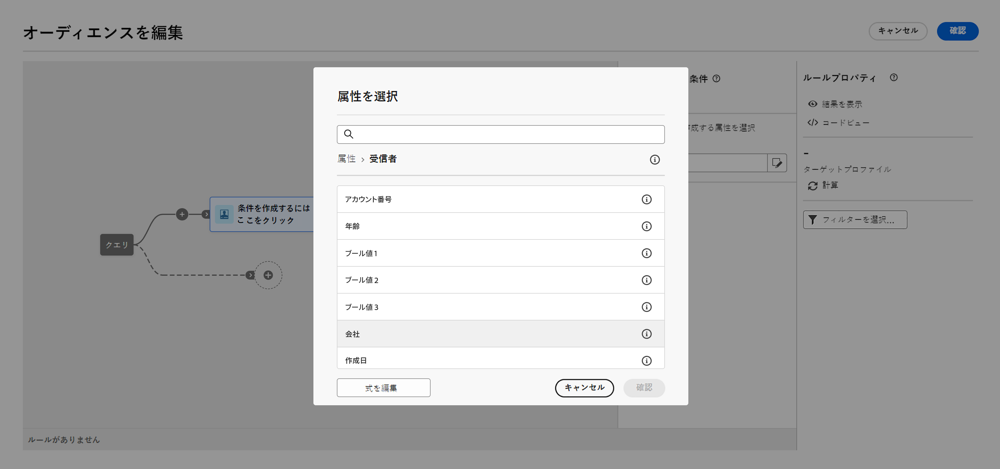

# 最初のクエリを作成 {#build-query}

クエリの作成を開始するには、実行するアクションに応じて、選択した場所からクエリモデラーにアクセスします。 クエリモデラーが空白のキャンバスで開きます。 「 + 」ボタンをクリックして、クエリの最初のノードを追加します。

次の 2 種類の要素を追加できます。

* フィルタリングコンポーネント（カスタム条件、オーディエンスの選択、定義済みフィルター）を使用すると、独自のルールを作成したり、オーディエンスまたは定義済みフィルターを選択してクエリを絞り込んだりできます。

  例 *「スポーツ」ニュースレターを購読した受信者*. *ニューヨークに住んでいる受信者*, *サンフランシスコに住んでいる受信者*

* グループ演算子 (AND、OR、EXCEPT) を使用すると、ダイアグラム内のフィルタリングコンポーネントを、ニーズに合わせてグループ化できます。

  例： *「スポーツ」ニュースレターを購読した受信者&#x200B;**および**ニューヨークに住む&#x200B;**または**サンフランシスコ*.

フィルタリングコンポーネントとグループオペレーターを追加および組み合わせる方法に関する詳細な手順については、以下で説明します。

## フィルターコンポーネントを追加

コンポーネントをフィルタリングすると、次を使用してクエリを絞り込むことができます。

* **カスタム条件**：データベースの属性と高度な式を使用して独自の条件を作成し、クエリをフィルタリングします。
* **オーディエンス**：既存のオーディエンスを使用してクエリをフィルタリングします。
* **定義済みフィルター**：既存の定義済みフィルターを使用してクエリをフィルタリングします。

### カスタム条件の設定

>[!CONTEXTUALHELP]
>id="acw_orchestration_querymodeler_customcondition"
>title="カスタム条件"
>abstract="カスタム条件"

カスタム条件を使用してクエリをフィルタリングするには、次の手順に従います。

1. 目的のノードの「+」ボタンをクリックし、「 」を選択します。 **[!UICONTROL カスタム条件]**.
1. 右側にカスタム条件プロパティペインが開きます。 「属性」フィールドで、条件の作成に利用する属性をデータベースから選択します。

   使用可能な属性は、Campaign データベースのすべてのフィールドを表します。これには、受信者テーブルにリンクされたテーブルのフィールドも含まれます。

   

   >[!NOTE]
   >
   >「式を編集」ボタンを使用すると、Campaign の Web 式エディターを活用して、データベースのフィールドとヘルパー関数を使用して式を手動で定義できます。

1. 適用する演算子をドロップダウンリストから選択します。

   +++使用可能な演算子のリスト

   >[!NOTE]
   >
   >ドロップダウンリストで使用できる演算子は、選択した属性のデータタイプによって異なります。

   | 演算子 | 目的 | 例 |
   |  ---  |  ---  |  ---  |
   | 次と等しい | 2 番目の「値」列に入力されたデータと同一の結果を返します。 | 姓 (@lastName) が「佐藤」と等しいは、姓が佐藤の受信者のみを返します。 |
   | 次と等しくない | 入力された値と等しくないすべての値を返します。 | 言語 (@language) が「英語」と等しい |
   | 次の値より大きい | 入力された値より大きい値を返します。 | 年齢 (@age) が 50 を超えています</strong>は「50」より大きいすべての値（「51」、「52」など）を返します。 |
   | より小さい | 入力された値より小さい値を返します。 | 作成日 (@created) が「DaysAgo(100)」より前</strong>は、100 日未満に作成されたすべての受信者を返します。 |
   | 次よりも大きいか等しい | 入力された値より大きいか等しいすべての値を返します。 | 年齢 (@age) が「30」以上</strong>は、30 歳以上のすべての受信者を返します。 |
   | 次よりも小さいか等しい | 入力された値より小さいか等しいすべての値を返します。 | 年齢 (@age) が「60」以下</strong>は、60 歳以下のすべての受信者を返します。 |
   | 次に含まれる | 指定された値に含まれる結果を返します。これらの値はコンマで区切る必要があります。 | 生年月日 (@birthDate) が「12/10/1979,12/10/1984」に含まれる場合、はこれらの日付の間に生まれた受信者を返します。 |
   | 次に含まれない | 「次に含まれる」演算子と同様に機能します。 ここでは、入力された値に基づいて受信者を除外します。 | 生年月日 (@birthDate) が「12/10/1979,12/10/1984」に含まれていません。 前の例とは異なり、これらの日付の間に生まれた受信者は返されません。 |
   | 空である | この場合、検索する結果は、2 番目の「値」列にある空の値と一致します。 | モバイル (@mobilePhone) が空の場合は、モバイル番号を持たないすべての受信者を返します。 |
   | 空でない | 「空である」演算子の逆の機能です。 2 番目の「値」列にあるデータを入力する必要はありません。 | E メール (@email) が空ではありません。 |
   | 次で始まる | 入力された値で始まる結果を返します。 | アカウント番号（@account）が「32010」で始まる。 |
   | 次で始まらない | 入力された値で始まらない結果を返します。 | アカウント番号 (@account) が「20」で始まっていません |
   | 次を含む | 入力された値を含む結果を返します。 | E メールドメイン (@domain) に「mail」が含まれています</strong>は、「mail」を含むすべてのドメイン名を返します。 したがって、「gmail.com」ドメインも返されます。 |
   | 次を含まない | 入力された値を含まない結果を返します。 | E メールドメイン (@domain) が「vo」を含まない</strong>. この場合、「vo」を含むドメイン名は返されません。結果には「Voila.jp」ドメイン名は表示されません。 |
   | 次に類似 | 「次に類似」は、「次を含む」演算子とよく似ています。 値に%ワイルドカード文字を挿入できます。 | 姓 (@lastName) が「Jon%s」に類似している。 ここでは、オペレーターが「AB」と「345」の間の欠落している英数字を忘れたので、ワイルドカード文字が「ABS2345」という番号を検索するための「ジョーカー」として使用されています。 |
   | 次に類似しない | 「次に類似」は、「次を含む」演算子とよく似ています。 値に%ワイルドカード文字を挿入できます。 | 姓 (@lastName) が「Smi%h」に類似していない。 この場合、アカウント番号が「QR%789」の受信者は返されません。 |

+++

1. 「値」フィールドで、期待される値を選択します。

   また、Campaign の Web 式エディターを利用して、データベースのフィールドとヘルパー関数を使用して式を手動で定義することもできます。 それには、「式を編集」ボタンをクリックします。

   *例： 21 歳以上のすべてのプロファイルを返すクエリ*

   

<!--
querying linked tables
collect additional information on the targeted population, e.g. contract numbers, subscriptions to newsletters or origin.
Select the type of data you want to add. This can be data belonging to the filtering dimension or data stored in linked tables. Select the table which contains the information you want to collect and click Next.

aggregates: Define a calculation mode for the field to be added, such as an aggregate for example.-->

### オーディエンスの選択

>[!CONTEXTUALHELP]
>id="acw_orchestration_querymodeler_selectaudience"
>title="オーディエンスを選択"
>abstract="オーディエンスを選択"

既存のオーディエンスを使用してクエリをフィルタリングするには、次の手順に従います。

1. 目的のノードの「+」ボタンをクリックし、「 」を選択します。 **[!UICONTROL オーディエンスを選択]**.

1. 右側にオーディエンスプロパティを選択パネルが開きます。 クエリのフィルタリングに利用するオーディエンスを選択します。

   *例：「Festival Goers」オーディエンスに属するすべてのプロファイルを返すクエリ*

   

### 定義済みフィルターを使用

>[!CONTEXTUALHELP]
>id="acw_orchestration_querymodeler_predefinedfilter"
>title="定義済みフィルター"
>abstract="定義済みフィルター"

定義済みフィルターを使用してクエリをフィルターするには、次の手順に従います。

1. 目的のノードの「+」ボタンをクリックし、「 」を選択します。 **[!UICONTROL 定義済みフィルター]**.

1. 右側にオーディエンスプロパティを選択パネルが開きます。 カスタムフィルターのリストまたはお気に入りから定義済みフィルターを選択します。

   *例：定義済みフィルター「非アクティブな顧客」に対応するすべてのプロファイルを返すクエリ。*

   

## フィルターコンポーネントと演算子の組み合わせ

>[!CONTEXTUALHELP]
>id="acw_orchestration_querymodeler_group"
>title="グループ"
>abstract="グループ"

フィルタリングコンポーネントをクエリに追加する場合、クエリキャンバスに新しいトランジションが自動的に作成され、新しいフィルタリングコンポーネントは AND 演算子で最初のトランジションにリンクされます。 つまり、両方のフィルタリングコンポーネントの結果が、クエリ結果に組み合わされます。

この例では、新しいオーディエンスタイプのフィルタリングコンポーネントがキャンバスに追加されています。 このフィルターは新しいトランジションに自動的に追加され、AND 演算子を使用して事前定義済みのフィルタータイプ条件にリンクされます。 この場合、クエリ結果には、「マドリディアン」事前定義フィルター AND が「割引ハンター」オーディエンスに属する、「マドリディアン」がターゲットとする受信者が含まれます。

フィルター条件のリンクに使用する演算子を変更するには、その演算子をクリックし、右側に表示されるグループパネルから目的の演算子を選択し、「変更できます」で目的の演算子を選択します。

使用可能な演算子は次のとおりです。

* AND（積集合）：アウトバウンドトランジション内のすべてのフィルタリングコンポーネントの結果を組み合わせます。
* OR（和集合）：アウトバウンドトランジションに 1 つ以上のフィルタリングコンポーネントの結果が含まれます。
* 例外（除外）：アウトバウンドトランジションのすべてのフィルタリングコンポーネントから結果を除外します。

## クエリの確認と検証

>[!CONTEXTUALHELP]
>id="acw_orchestration_querymodeler_ruleproperties"
>title="ルールプロパティ"
>abstract="ルールプロパティ"

キャンバスでクエリを作成したら、右側の「ルールプロパティ」ウィンドウを使用してクエリを確認できます。 使用可能な操作は次のとおりです。

* **結果を表示：** クエリから生成されたデータを表示します。
* **コードビュー**：クエリのコードベースバージョンを SQL で表示します。
* **計算**：クエリのターゲットレコード数を更新して表示します。
* **フィルターを選択または保存**：キャンバスで使用する既存の定義済みフィルターを選択するか、後で再利用するために定義済みフィルターとしてクエリを保存します。 [定義済みフィルターの操作方法の詳細情報](../get-started/predefined-filters.md)

  >[!IMPORTANT]
  >
  >ルールのプロパティウィンドウから定義済みフィルターを選択すると、キャンバスに作成されたクエリが、選択したフィルターに置き換えられます。
