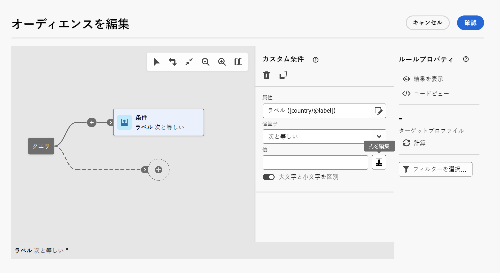

# 式を編集 {#expression}

式を編集する場合は、条件を手動で入力してルールを作成します。 このモードでは、高度な関数を使用できます。これらの関数を使用すると、日付、文字列、数値の各フィールドの操作や並べ替えなど、具体的なクエリの実行に使用する値を操作できます。

これらの操作は、クエリモデラーの式を編集ボタンから実行できます。このボタンは、カスタム条件を設定する際に Attribute フィールドと Value フィールドで使用できます。



式エディターには次の機能があります。

* 式を定義するための入力フィールド。
* 式で使用でき、クエリのターゲティングディメンションに対応する使用可能なフィールドのリスト。
* 使用可能な関数のカテゴリ別一覧。

入力フィールドに式を直接入力するか、使用可能なフィールドや関数のリストを使用して、式を編集します。 これをおこなうには、要素を追加する内側の式にカーソルを置き、目的のフィールドまたは式をダブルクリックします。

ワークフローのイベント変数を使用して式を作成できます。詳しくは、xxxx を参照してください。

## 式の構文 {#expression-syntax}

### 標準構文 {#standard-syntax}

標準の式は、次の構文要素に従った 1 つまたは複数の条件で構成されます。

* それぞれの条件は、**&lt;値 1>&lt;比較演算子> &lt;値 2>**&#x200B;の形式で記述します。

   * **&lt;値 1>** はフィールドまたは関数です。例えば、プロファイルの作成日を表す **@created**、またはプロファイルの作成年を表す **Year(@created)**。
   * **&lt;comparison operator=&quot;&quot;>** は、比較演算子の節に記載されている演算子の 1 つです。 **&lt;値 1>** と **&lt;値 2>** の間の比較方法をこの演算子で定義します。
   * **&lt;値 2>** は、手動で入力したフィールド、関数、値のいずれかです。

  >[!NOTE]
  >
  >**&lt;値 1>** と **&lt;値 2>** は同じデータ型でなければなりません。例えば、**&lt;値 1>** が日付の場合は、**&lt;値 2>** も日付である必要があります。

* 複数の条件を使用する場合は、論理演算子を使用して組み合わせることができます。

   * **[!UICONTROL および]**:2 つの条件の積集合を取ります。
   * **[!UICONTROL または]**:2 つの条件の和集合を取ります。

例：

```
Year(@created) = Year(GetDate()) AND Month(@created) = Month(GetDate())
```

この例では、作成日が現在の月と年に該当するプロファイルがターゲットになります。

### JavaScript 構文 {#javascript-syntax}

HTML コンテンツエディターでテキストタイプのブロックの表示条件を定義する場合は、JavaScript タイプ構文に従った式を使用する必要があります。

JavaScript 式は 1 つ以上の条件で構成され、次の構文要素を使用します。

* それぞれの条件は、**&lt;コンテキスト> &lt;比較演算子> &lt;値 2**> の形式で記述します。

   * ここで、**&lt;コンテキスト>** はコンテキストを指定できるフィールドまたは関数です。例えば、プロファイルの E メールアドレスを表す **context.profile.プロファイルのメールアドレスを表す @email** や、プロファイルの名の文字数を表す **context.profile.firstName.length()** を指定します。
   * **&lt;comparison operator=&quot;&quot;>** は、比較演算子の節に記載されている演算子の 1 つです。 **&lt;コンテキスト>** と **&lt;値 2>** の間の比較方法をこの演算子で定義します。
   * **&lt;値 2>** は、手動で入力したフィールド、関数、値のいずれかです。

  >[!NOTE]
  >
  **&lt;コンテキスト>** と **&lt;値 2>** は同じデータ型でなければなりません。例えば、**&lt;コンテキスト>** が日付の場合は、**&lt;値 2>** も日付である必要があります。

* 複数の条件を使用する場合は、論理演算子を使用して組み合わせることができます。

   * **[!UICONTROL &amp;&amp;]**:2 つの条件の積集合を取ります。
   * **[!UICONTROL ||]**:2 つの条件の和集合を取ります。

例：

```
context.profile.age > 21 && context.profile.firstName.length() > 0
```

この例では、年齢が 21 歳より上で、かつ名が指定されている（**firstName** フィールドに 1 文字以上記入されている）プロファイルを条件としています。

## 比較演算子 {#comparison-operators}

ルールによっては、クエリエディターで値を選択して条件を定義できるものがあります。

条件は、次のいずれかの演算子を使用して値にリンクする必要があります。

<table> 
 <thead> 
  <tr> 
   <th> 演算子<br /> </th> 
   <th> 標準構文<br /> </th> 
   <th> JavaScript 構文<br /> </th> 
   <th> 説明<br /> </th> 
   <th> 例<br /> </th> 
  </tr> 
 </thead> 
 <tbody> 
  <tr> 
   <td> <span class="uicontrol">次と等しい</span> <br /> </td> 
   <td> =<br /> </td> 
   <td> ==<br /> </td> 
   <td> 1 つ目の値と 2 つ目の値は完全に同一でなければなりません。<br /> </td> 
   <td> <strong>@lastName = Martin</strong> は、姓が「Martin」と同一の文字列のプロファイルを検索します。<br /> </td> 
  </tr> 
  <tr> 
   <td> <span class="uicontrol">より大きい</span> <br /> </td> 
   <td> &gt;<br /> </td> 
   <td> &gt;<br /> </td> 
   <td> 最初の値は、2 番目の値より大きくなければなりません。<br /> </td> 
   <td> <strong>@age &gt; 50</strong> は、年齢が「50」より上、つまり「51」、「52」などのプロファイルを検索します。<br /> </td> 
  </tr> 
  <tr> 
   <td> <span class="uicontrol">より小さい</span> <br /> </td> 
   <td> &lt;<br /> </td> 
   <td> &lt;<br /> </td> 
   <td> 最初の値は、2 番目の値より小さくなければなりません。<br /> </td> 
   <td> <strong>@created &lt; DaysAgo(100)</strong> は、過去 100 日以内にデータベースに作成されたすべてのプロファイルを検索します。<br /> </td> 
  </tr> 
  <tr> 
   <td> <span class="uicontrol">次よりも大きいか等しい</span> <br /> </td> 
   <td> &gt;=<br /> </td> 
   <td> &gt;=<br /> </td> 
   <td> 最初の値は、2 番目の値より大きいか等しくなければなりません。<br /> </td> 
   <td> <strong>@age &gt;= 30</strong> は、年齢が 30 歳以上のプロファイルを検索します。<br /> </td> 
  </tr> 
  <tr> 
   <td> <span class="uicontrol">次よりも小さいか等しい</span> <br /> </td> 
   <td> &lt;=<br /> </td> 
   <td> &lt;=<br /> </td> 
   <td> 最初の値は、2 番目の値より小さいか等しくなければなりません。<br /> </td> 
   <td> <strong>@age &lt;= 60</strong> は、年齢が 60 歳以下のプロファイルを検索します。<br /> </td> 
  </tr> 
  <tr> 
   <td> <span class="uicontrol">異なる</span><br /> </td> 
   <td> !=<br /> </td> 
   <td> !=<br /> </td> 
   <td> 最初の値は、2 番目の値と異なっていなければなりません。<br /> </td> 
   <td> <strong>@language ! = English</strong> は、英語を母語とする人として定義されていないプロファイルを検索します。<br /> </td> 
  </tr> 
  <tr> 
   <td> <span class="uicontrol">次を含む</span><br /> </td> 
   <td> IN<br /> </td> 
   <td> 該当なし<br /> </td> 
   <td> 最初の値に、2 番目の値が含まれていなければなりません。<br /> </td> 
   <td> <strong>@domain IN mail</strong>。この場合、「mail」の値を含むすべてのドメイン名が結果として返されます。したがって、返される結果の一部には、「gmail.com」というドメイン名が含まれます。<br /> </td> 
  </tr> 
  <tr> 
   <td> <span class="uicontrol">次に類似</span> <br /> </td> 
   <td> LIKE<br /> </td> 
   <td> 該当なし<br /> </td> 
   <td> 「<span class="uicontrol">次に類似</span>」は、「<span class="uicontrol">次を含む</span>」演算子とよく似ています。検索対象の値にワイルドカード文字 <span class="uicontrol">%</span> を挿入することができます。<br /> </td> 
   <td> <strong>@lastName LIKE Mart%n</strong>。この場合、置換文字 <strong>%</strong> は「ジョーカー」として機能するので、仮にスペルが間違っていても「Martin」という名前を検索できます。<br /> </td> 
  </tr> 
  <tr> 
   <td> <span class="uicontrol">次に類似しない</span> <br /> </td> 
   <td> NOT<br /> </td> 
   <td> 該当なし<br /> </td> 
   <td> 「<span class="uicontrol">次に類似</span>」と似ています。入力した値を除外することができます。この演算子でも、入力した値にワイルドカード文字 <span class="uicontrol">%</span> が含まれている必要があります。<br /> </td> 
   <td> <strong>@lastName NOT Smi%h</strong>。この場合、「Smi%h」に該当する名前（Smith など）の受信者は、結果として返されません。<br /> </td> 
  </tr> 
  <tr> 
   <td> <span class="uicontrol">空である</span><br /> </td> 
   <td> IS NULL<br /> </td> 
   <td> 該当なし<br /> </td> 
   <td> 最初の値は、空の値に対応している必要があります。<br /> </td> 
   <td> <strong>@mobilePhone IS NULL</strong> は、携帯電話番号が入力されていないすべてのプロファイルを検索します。<br /> </td> 
  </tr> 
 </tbody> 
</table>