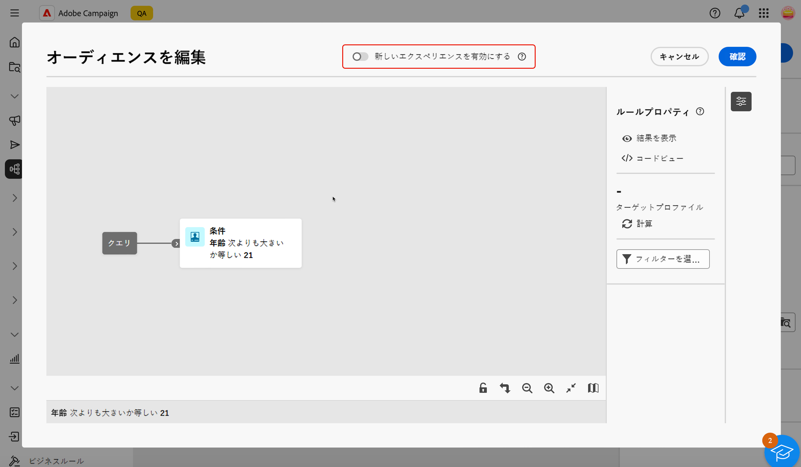
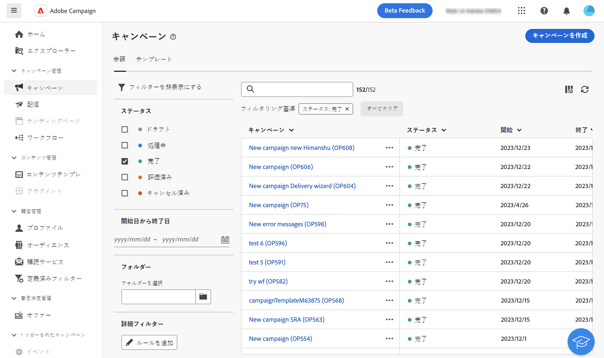
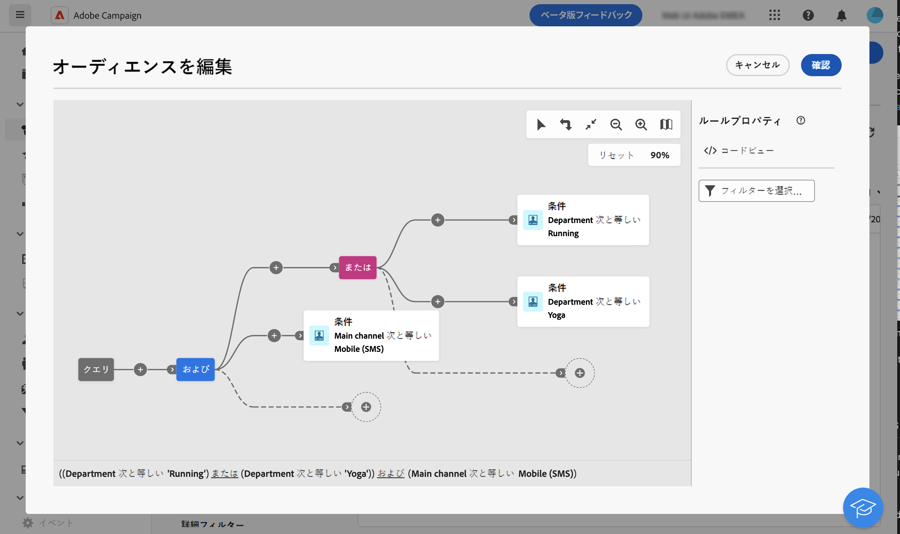

# フィルターリスト {#filter-lists}

Adobe Campaign Web では、オブジェクトの各リスト内にフィルターを提供し、特定のコンテキスト条件に基づいて情報をフィルタリングできます。 例えば、ステータス、チャネル、連絡日またはフォルダーに基づいて配信をフィルタリングできます。 また、配達確認を非表示にすることもできます。

>[!IMPORTANT]
>
>Query Modeler用の新しいインターフェイスが利用可能です。新しいルールビルダーでは、シンプルなインターフェイスにより、クエリをより簡単に構築できます。このエクスペリエンスに切り替えるには、右上隅の切り替えボタンを押します。トグルを押して新しいインターフェイスを無効にするだけで、いつでも従来のクエリモデラーに戻すことができます。この新しいインターフェイスでは、クエリモデラと同じ原則を適用できます。
>{zoomable="yes"}

## フィルターの適用 {#apply}

リストにフィルターを適用するには、リストの左上隅の検索バーの横にある「**[!UICONTROL フィルターを表示]**」ボタンをクリックします。

フィルターパネルが開き、選択したリストで使用可能なフィルターが表示されます。 例えば、キャンペーンをステータス、開始日と終了日またはストレージフォルダーに基づいてフィルタリングでき、サブスクリプションサービスのリストをチャネルとストレージフォルダーに基づいてフィルタリングできます。

{zoomable="yes"}{width="70%" zoomable="yes"}

独自の条件に基づいてリストをフィルタリングするには、カスタムフィルターを作成します。 これを行うには、フィルターパネルの下部を参照し、「**ルールを追加**」ボタンをクリックします。 [詳しくは、カスタムフィルターの作成方法を参照してください](#custom)。

リストに適用すると、検索バーの下にフィルターが表示されます。 個別のフィルターはいつでも削除できます。また、「**すべてクリア**」ボタンをクリックしてすべてのフィルターを削除することもできます。

## カスタムフィルターの作成 {#custom}

カスタムフィルターを使用すると、独自の条件に基づいてリストを絞り込むことができます。 これらは、Campaign クエリモデラーを使用して設計されています。 カスタムフィルターを作成するには、次の手順に従います。

1. フィルターパネルを開き、パネルの下部にある「**ルールを追加**」ボタンをクリックします。

1. クエリモデラーが開きます。 ニーズに応じて、フィルター条件を定義して組み合わせます。 クエリモデラーの使用方法について詳しくは、[この節](../query/query-modeler-overview.md)を参照してください。

   次の例は、ランニング部門またはヨガ部門のオペレーターによって実行された SMS キャンペーンを、キャンペーンリストに表示するように設計されたカスタムフィルターを示しています。

   {zoomable="yes"}{width="70%" zoomable="yes"}

1. カスタムフィルターを設定したら、「**[!UICONTROL 確認]**」をクリックしてリストに適用します。