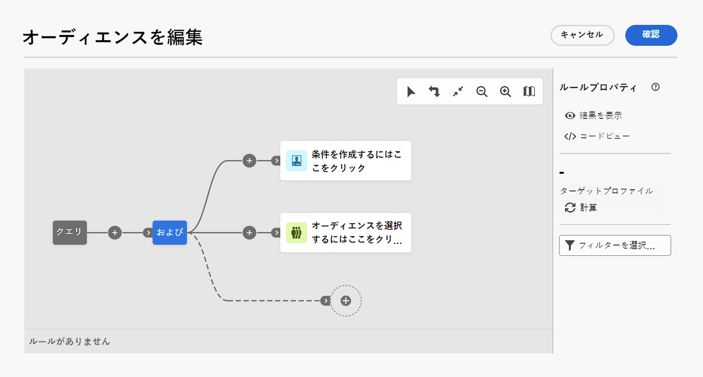

# クエリモデラーの操作 {#segment-builder}

## クエリモデラーの概要 {#overview}

Adobe Campaign Web には、データベースをフィルタリングして、データベースの情報、高度な式および演算子を使用して、様々な条件に従ってターゲットを選択できるクエリモデラーが備わっています。

Adobe Campaign Web には、使いやすいクエリモデラーが備わっており、様々な条件に基づいて特定のターゲットを選択するためにデータベースをフィルタリングするプロセスが簡単になります。 これには、高度な式や演算子の使用も含まれます。

クエリモデラーはインターフェイス全体にシームレスに統合され、フィルタリング操作を実行し、ルールを簡単に作成できます。

* ターゲットオーディエンスの定義：メッセージまたはワークフローでターゲットにする母集団を指定し、必要に応じて容易に新しいオーディエンスを作成できます。
* ワークフローアクティビティのカスタマイズ：「分割」や「紐付け」などのワークフローアクティビティ内にルールを適用し、特定の要件に合わせます。
* コンテンツの動的化：様々な受信者に表示するコンテンツを定義する条件を作成し、パーソナライズされた関連性の高いメッセージを確実に提供することで、コンテンツを動的にします。
* 定義済みフィルター：データリストの操作や配信のオーディエンスの作成など、様々なフィルタリング操作でショートカットとして使用できる定義済みフィルターを作成します。

## クエリモデラーインターフェイス {#interface}

クエリモデラーは、クエリを作成する様々なコンポーネントを追加および組み合わせることができる中央キャンバスと、クエリに関する情報を提供する右側の [ ルールプロパティ ] ペインを提供します。

キャンバスでは、クエリを作成するコンポーネントを追加および組み合わせることができます。 次の要素で構成されます。

* クエリアイコンは、クエリの開始点を示します。
* 1 つ以上のパス：クエリを構成する様々な要素を追加する場所です。

また、左上にあるツールバーには、キャンバス上の要素を簡単に移動および管理するためのオプションが用意されています。

* 複数選択モード
* 回転
* 画面に合わせる
* ズームアウト/ズームイン
* マップを表示

右側には、 **ルールのプロパティ** ペインでは、キャンバスで作成しているクエリに関する情報を取得できます。
