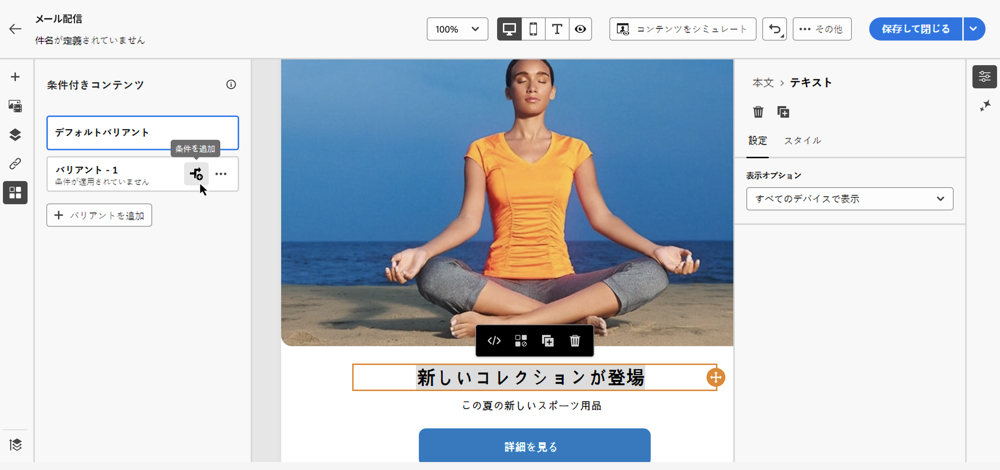
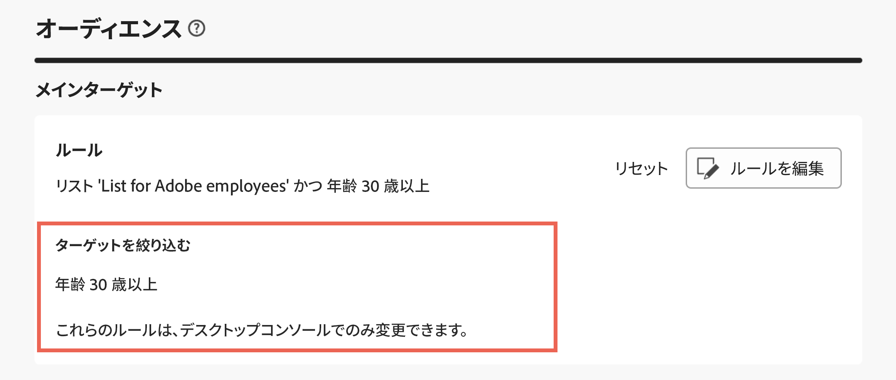
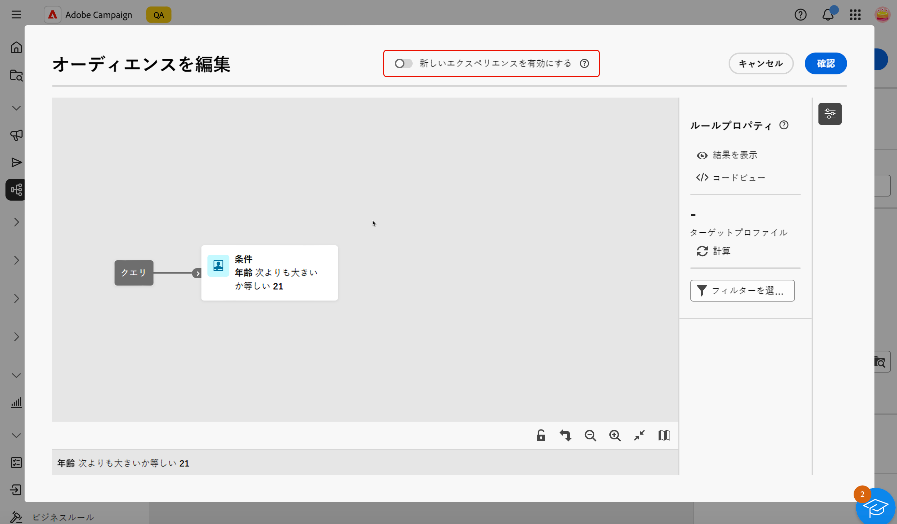

# クエリモデラーを操作 {#segment-builder}

>[!CONTEXTUALHELP]
>id="acw_homepage_welcome_rn1"
>title="新しいルールビルダー"
>abstract="改善されたユーザーインターフェイスで複雑な条件を定義するのに役立つ、新しいルールビルダーが使用できるようになりました。必要に応じて、古いルールビルダーから新しいルールビルダーに切り替えることができます。"
>additional-url="https://experienceleague.adobe.com/docs/campaign-web/v8/release-notes/release-notes.html?lang=ja" text="リリースノートを参照してください"

>[!CONTEXTUALHELP]
>id="acw_homepage_learning_card5"
>title="新しいクエリモデラー"
>abstract="Adobe Campaign Web にはクエリモデラーが備わっています。これにより、データベースをフィルタリングして様々な基準に基づいて特定のターゲットを選択するプロセスが簡素化されます。これには、高度な式と演算子の使用が含まれます。クエリモデラーは、データをフィルタリングするルールを定義する必要があるすべてのコンテキストで使用できます。"

>[!CONTEXTUALHELP]
>id="acw_orchestration_querymodeler_querymessage"
>title="クエリモデラー"
>abstract="データベースから受信者やその他のターゲティングディメンションのフィルタリング条件を定義します。Adobe Experience Platform オーディエンスを活用して、ターゲットオーディエンスをさらに絞り込んで、キャンペーンの効果を最大化します。"

>[!CONTEXTUALHELP]
>id="acw_deliveries_refine_target"
>title="ターゲットを絞り込む"
>abstract="これらのルールは、デスクトップコンソールでのみ変更できます。"

Adobe Campaign Web ユーザーインターフェイスには、様々な基準に基づいてデータベースをフィルタリングするプロセスを簡素化するクエリモデラーが備わっています。これにより、クライアントコンソールで作成したクエリとの完全な互換性が確保され、web ユーザーインターフェイスへのシームレスなトランジションが簡単になります。

また、クエリモデラーは非常に複雑で長いクエリを効率的に管理し、柔軟性と精度を向上させます。また、条件内で定義済みフィルターをサポートしているので、ユーザーは包括的なオーディエンスのターゲティングとセグメント化戦略に高度な式と演算子を利用しながら、クエリを簡単に絞り込むことができます。

## クエリモデラーへのアクセス

クエリモデラーは、データをフィルタリングするルールを定義する必要があるすべてのコンテキストで使用できます。

| 使用状況 | 例 |
|  ---  |  ---  |
| **オーディエンスの定義**：メッセージやワークフローでターゲットにする母集団を指定し、ニーズに合わせて新しいオーディエンスを簡単に作成します。[詳しくは、オーディエンスの作成方法を参照してください。](../audience/one-time-audience.md) | {width="200" align="center" zoomable="yes"} |
| **ワークフローアクティビティのカスタマイズ**：特定の要件に合わせて、**分割**&#x200B;や&#x200B;**紐付け**&#x200B;などのワークフローアクティビティ内にルールを適用します。[ワークフローアクティビティの詳細情報を参照してください](../workflows/activities/about-activities.md) | {width="200" align="center" zoomable="yes"} |
| **定義済みフィルター**：データリストの操作や配信のオーディエンスの形成など、様々なフィルタリング操作中にショートカットとして機能する定義済みフィルターを作成します。[詳しくは、定義済みフィルターの操作方法を参照してください。](../get-started/predefined-filters.md) | {width="200" align="center" zoomable="yes"} |
| **レポートデータのフィルタリング**：レポートに表示されるデータをフィルタリングするルールを追加します。[詳しくは、レポートの操作方法を参照してください。](../reporting/gs-reports.md) | {width="200" align="center" zoomable="yes"} |
| **リストのカスタマイズ**：受信者、配信リストなどのリストに表示されるデータをフィルタリングするカスタムルールを作成します。[詳しくは、リストをフィルターする方法を参照してください。](../get-started/list-filters.md#list-built-in-filters) | {width="200" align="center" zoomable="yes"} |
| **条件付きコンテンツの作成**：様々な受信者に表示するコンテンツを定義する条件を作成することで、メールコンテンツを動的にします。これにより、パーソナライズされた、関連性の高いメッセージを確実に作成できます。[条件付きコンテンツの作成方法の詳細情報](../personalization/conditions.md) | {width="200" align="center" zoomable="yes"} |

>[!NOTE]
>
>オーディエンスや定義済みフィルターなどのルールが適用されているクライアントコンソールで作成したオブジェクトにアクセスすると、「**[!UICONTROL ターゲットを絞り込む]**」セクションが表示される場合があります。つまり、ルールのターゲットを絞り込むために追加のパラメーターが設定されています。これらのパラメーターは、コンソールでのみ変更できます。
>
>{zoomable="yes"}

## クエリモデラーインターフェイス {#interface}

クエリモデラーは、クエリを作成する中央のキャンバスと、クエリに関する情報を示す右側のパネルを提供します。

>[!IMPORTANT]
>
>クエリモデラーで新しいインターフェイスを使用できます。新しいルールビルダーでは、簡素化されたインターフェースにより、クエリをより簡単に作成できます。このエクスペリエンスに切り替えるには、右上隅の切替スイッチボタンを押します。切替スイッチボタンを押して新しいインターフェイスを無効にするだけで、いつでも従来のクエリモデラーに戻ることができます。この新しいインターフェイスでは、クエリモデラーと同じ原則を適用できます。
>>{zoomable="yes"}

>[!CONTEXTUALHELP]
>id="acw_rule_builder_switch_button"
>title="新しいルールビルダーエクスペリエンス"
>abstract="この切替スイッチを使用して、従来のクエリモデラーと新しいルールビルダーエクスペリエンスを切り替えます。新しいルールビルダーでは、簡素で直感的なインターフェイスのおかげで、クエリをより簡単に作成できます。"

{zoomable="yes"}

### 中央のキャンバス {#canvas}

クエリモデラーの中央のキャンバスでは、クエリを作成する様々なコンポーネントを追加して組み合わせます。[クエリの作成方法を学ぶ](build-query.md)

>[!BEGINTABS]

>[!TAB 従来のクエリモデラー]

キャンバスの右下隅にあるツールバーには、クエリコンポーネントを簡単に操作し、キャンバス内を移動するオプションが表示されます。

* **複数選択モード**：複数のフィルタリングコンポーネントを選択して、選択した場所にコピー＆ペーストします。
* **回転**：キャンバスを垂直方向に切り替えます。
* **画面に合わせる**：キャンバスのズームレベルを画面に合わせて調整します。
* **ズームアウト**／**ズームイン**：キャンバスをズームアウトまたはズームインします。
* **マップを表示**：現在の位置を示すキャンバスのスナップショットを開きます。

>[!TAB 新しいルールビルダーエクスペリエンス]

キャンバスの右上隅にあるツールバーには、クエリコンポーネントを簡単に操作し、キャンバス内を移動するオプションが表示されます。

* **選択項目を上に移動**：コンポーネントを 1 行上に移動します。
* **選択項目を下に移動**：コンポーネントを 1 行下に移動します。
* **選択項目をグループ化**：2 つのコンポーネントを 1 つのグループに配置します。
* **選択項目をグループ化解除**：単一グループのコンポーネントを分離します。
* **すべて展開**：すべてのグループを展開します。
* **すべて折りたたむ**：すべてのグループを折りたたみます。
* **すべて削除**：すべてのグループとコンポーネントを削除します。

>[!ENDTABS]

### ルールのプロパティパネル {#rule-properties}

右側にある&#x200B;**[!UICONTROL ルールのプロパティ]**&#x200B;パネルには、クエリに関する情報が表示されます。これにより、様々な操作を実行してクエリを確認し、要件に合っていることを確認できます。このパネルは、オーディエンスを作成するクエリを作成する際に表示されます。[クエリを確認および検証する方法を学ぶ](build-query.md#check-and-validate-your-query)
