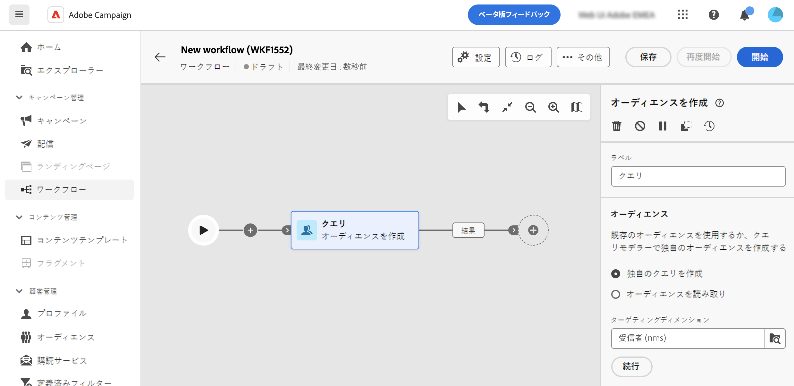
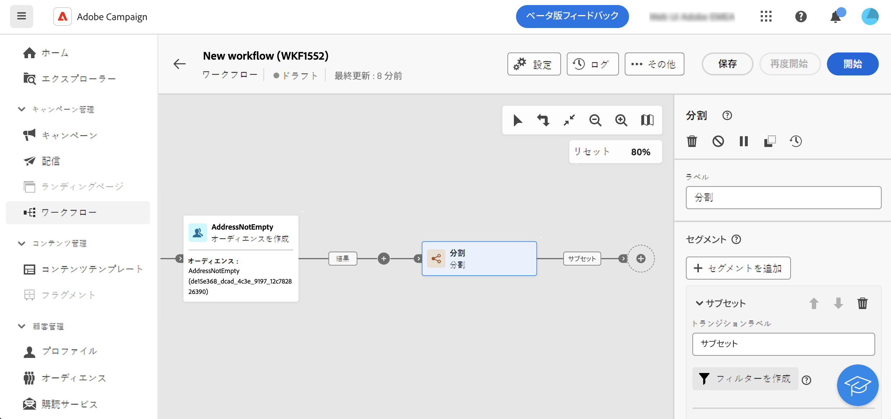
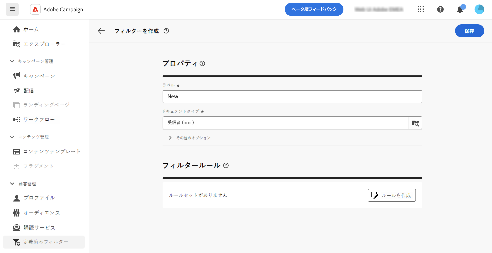
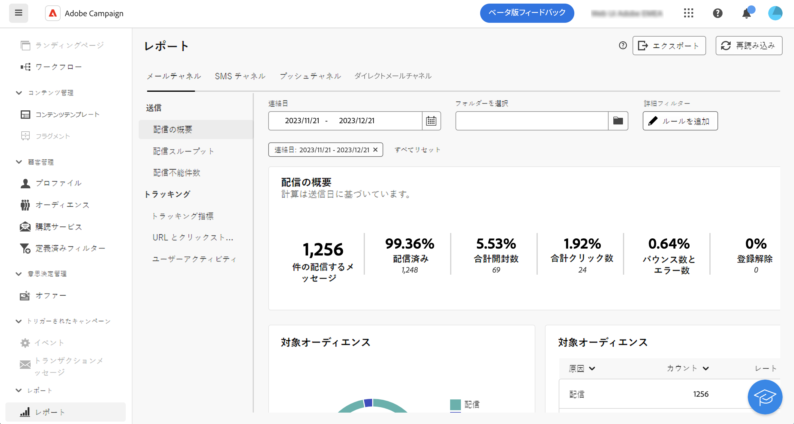
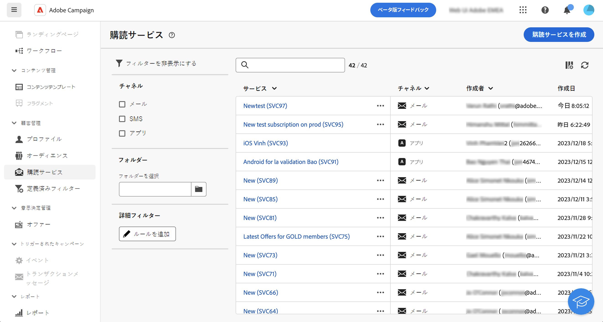

# クエリモデラーを操作 {#segment-builder}

>[!CONTEXTUALHELP]
>id="acw_orchestration_querymodeler_querymessage"
>title="クエリモデラー"
>abstract="データベースから受信者やその他のターゲティングディメンションのフィルタリング条件を定義します。Adobe Experience Platform オーディエンスを活用して、ターゲットオーディエンスをさらに絞り込んで、キャンペーンの効果を最大化します。"

Adobe Campaign Web には、クエリモデラーが備わっており、様々な条件に基づいて特定のターゲットを選択するためのデータベースのフィルタリングプロセスが簡単になります。 これには、高度な式や演算子の使用も含まれます。

## クエリモデラーにアクセスする {#access}

クエリモデラーは、データをフィルタリングするルールを定義する必要があるすべてのコンテキストで使用できます。

* **オーディエンスの定義**：メッセージまたはワークフローのターゲットにする母集団を指定し、必要に応じて容易に新しいオーディエンスを作成します。

  +++例

  

+++

* **ワークフローアクティビティのカスタマイズ**：特定の要件に合わせて、分割や紐付けなどのワークフローアクティビティ内にルールを適用します。

  +++例

  

+++

<!--* **Dynamize content**: make your content dynamic by creating conditions that define which content should be displayed to different recipients, ensuring personalized and relevant messaging.

    +++Example

    

    +++
-->

* **定義済みフィルター**：データリストの操作や配信のオーディエンスの形成など、様々なフィルタリング操作でのショートカットとして機能する定義済みフィルターを作成します。

  +++例

  

+++

* **レポートデータをフィルタリング**：レポートに表示されるデータをフィルターするルールを追加します。

  +++例

  

+++

* **リストのカスタマイズ**：リストに表示されるデータ（受信者、配信リストなど）をフィルターするカスタムルールを作成します。

  +++例

  

+++

## クエリモデラーインターフェイス {#interface}

クエリモデラーは、中央のキャンバスを提供し、クエリを構築する様々なコンポーネントを追加および組み合わせることができます。

右側の [ ルールのプロパティ ] ペインには、クエリに関する情報が表示されます。 様々な操作を実行して、クエリを確認し、ニーズに合うようにします。 クエリを確認および検証する方法を説明します

