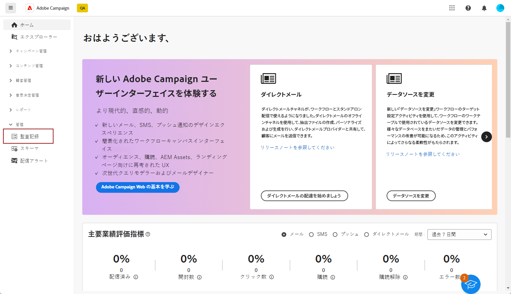
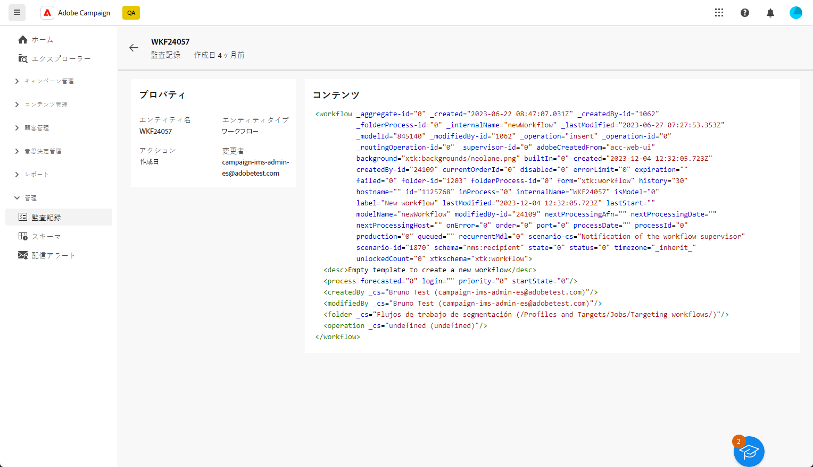

# 監査記録 {#audit-trail}

Adobe Campaign web ユーザーインターフェイスで、**[!UICONTROL 監査記録]**&#x200B;機能により、インスタンス内の重要なエンティティに対して行われたすべての変更（通常、インスタンスのスムーズな操作に大きな影響を与える変更）を完全に表示できます。

>[!IMPORTANT]
>
>* Adobe Campaign web ユーザーインターフェイスでは、ユーザー権限、テンプレート、パーソナライゼーションまたはキャンペーン内で行われた変更を監査しません。
>* 監査記録を管理できるのは、インスタンスの管理者のみです。

**[!UICONTROL 監査記録]**&#x200B;機能は、Adobe Campaign インスタンス内で発生するアクションとイベントの詳細なログをリアルタイムで常に記録します。 データの時系列の記録にアクセスする便利な方法を提供し、ワークフローのステータス、ワークフローを変更した直近のユーザー、インスタンス内でユーザーが実行したアクティビティなどのクエリに対処します。

+++ 詳しくは、監査記録が使用可能なエンティティの詳細情報を参照してください

* **ソーススキーマ監査記録**&#x200B;を使用すると、Campaign v8 クライアントコンソール内のアクティビティとスキーマに対して行った最近の変更とを監視できます。

  スキーマについて詳しくは、[Campaign v8 のドキュメント](https://experienceleague.adobe.com/ja/docs/campaign/campaign-v8/developer/shemas-forms/schemas)を参照してください。

* **ワークフロー監査記録**&#x200B;を使用すると、アクティビティとワークフローに対して行った最近の変更とを追跡できます。その例として、次のような現在の状態があります。

   * 開始
   * 一時停止
   * 停止
   * 再開
   * クリーンアップ（「履歴をパージ」アクションと同じ）
   * シミュレーション（「シミュレーションモードで開始」アクションと同じ）
   * ウェイクアップ（「保留中のタスクを今すぐ実行」アクションと同じ）
   * 無条件停止

  ワークフローについて詳しくは、この[ページ](../workflows/gs-workflows.md)を参照してください。

* **オプション監査記録**&#x200B;を使用すると、Campaign v8 内のアクティビティとオプションに対して行った最近の変更とを監視できます。

  オプションについて詳しくは、この[ページ](https://experienceleague.adobe.com/ja/docs/campaign-classic/using/installing-campaign-classic/appendices/configuring-campaign-options)を参照してください。

* **配信監査記録**&#x200B;では、アクティビティと、配信に最後に行った変更を確認できます。

  配信について詳しくは、この[ページ](../msg/gs-deliveries.md)を参照してください。

* **外部アカウント**&#x200B;では、テクニカルワークフローやキャンペーンワークフローなどの技術的プロセスで使用される Campaign v8 の外部アカウントに対して行った変更を確認できます。

  外部アカウントについて詳しくは、この[ページ](../administration/external-account.md)を参照してください。

* **配信マッピング**&#x200B;では、Campaign v8 内のアクティビティと配信マッピングに対して行った最新の変更とを監視できます。

  配信マッピングについて詳しくは、この[ページ](https://experienceleague.adobe.com/ja/docs/campaign/campaign-v8/audience/add-profiles/target-mappings)を参照してください。

* **Web アプリケーション**&#x200B;では、入力フィールドと選択フィールドを含むページの作成に使用される、Campaign v8 の web フォームに加えた変更を確認できます。これには、データベースのデータが含まれる場合があります。

  Web アプリケーションについて詳しくは、この[ページ](https://experienceleague.adobe.com/ja/docs/campaign/campaign-v8/content/webapps)を参照してください。

* **オファー**&#x200B;では、アクティビティと、オファーに最後に行った変更を確認できます。

  オファーについて詳しくは、この[ページ](../msg/offers.md)を参照してください。

* **オペレーター**&#x200B;では、Campaign v8 内のアクティビティと、オペレーターに対して行った最近の変更とを監視できます。

  オペレーターについて詳しくは、この[ページ](https://experienceleague.adobe.com/ja/docs/campaign/campaign-v8/offers/interaction-settings/interaction-operators)を参照してください。

+++

## 監査記録へのアクセス {#accessing-audit-trail}

インスタンスの&#x200B;**[!UICONTROL 監査記録]**&#x200B;にアクセスするには：

1. **[!UICONTROL 管理]**&#x200B;メニューで、「**[!UICONTROL 監査記録]**」を選択します。

   

1. **[!UICONTROL 監査記録]**&#x200B;ウィンドウが開き、エンティティのリストが表示されます。 Adobe Campaign の web ユーザーインターフェイスは、ワークフロー、オプション、配信およびスキーマの作成、編集、削除アクションを監査します。

   最後の変更の詳細を確認するには、いずれかのエンティティを選択します。

1. **[!UICONTROL エンティティを監査]**&#x200B;ウィンドウには、選択したエンティティに関する次のような詳細情報が表示されます。

   * **[!UICONTROL タイプ]**：ワークフロー、オプション、配信、スキーマ。
   * **[!UICONTROL エンティティ]**：アクティビティの内部名。
   * **[!UICONTROL 変更者]**：このエンティティを最後に変更したユーザーのユーザー名。
   * **[!UICONTROL アクション]**：このエンティティで最後に実行されたアクション（作成済み、変更済み、削除済み）。
   * **[!UICONTROL 変更日]**：このエンティティで最後に実行されたアクションの日付。

   コードブロックには、エンティティ内で正確に何が変更されたかについての詳細情報が表示されます。

   