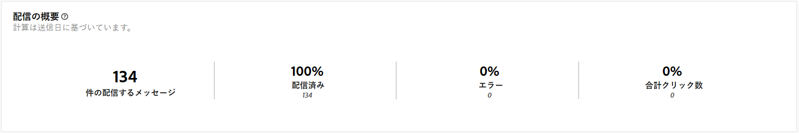
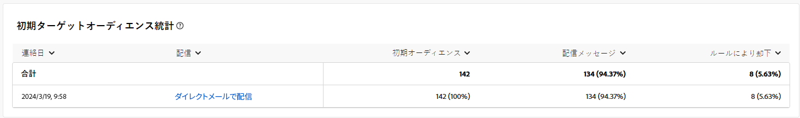
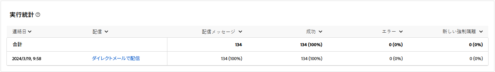
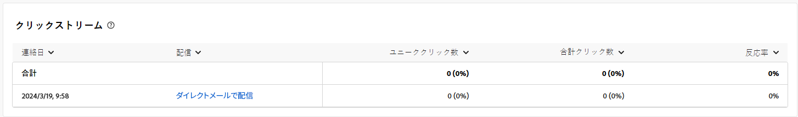

# ダイレクトメールチャネルのキャンペーンレポート {#campaign-reports-direct-mail}

各キャンペーンレポートは、キャンペーンの成功とエラーの詳細を表示する様々なウィジェットに分かれています。ダイレクトメールチャネル、レポートおよび指標について詳しくは、以下を参照してください。キャンペーンレポートにアクセスする方法については、[このページ](campaign-reports.md)を参照してください。

## 配信の概要 {#delivery-summary-direct}

### 配信の概要 {#delivery-overview-direct}

>[!CONTEXTUALHELP]
>id="acw_campaign_reporting_delivery_overview_direct_mail"
>title="配信の概要"
>abstract="**配信の概要**&#x200B;には、各ダイレクトメール配信における訪問者のインタラクションに関する詳細なインサイトを提供する主要業績評価指標（KPI）が表示されます。指標の概要を以下に示します。"

**[!UICONTROL 配信の概要]**&#x200B;には、各ダイレクトメール配信における訪問者のインタラクションに関する詳細なインサイトを提供する主要業績評価指標（KPI）が表示されます。指標の概要を以下に示します。

{zoomable="yes"}{align="center"}

+++配信の概要指標の詳細を説明します。

* **[!UICONTROL 配信メッセージ数]**：配信の準備中に処理されたメッセージの合計数。

* **[!UICONTROL 配信済み数]**：送信されたメッセージの合計数に対する、正常に送信されたメッセージの数。

* **[!UICONTROL エラー数]**：配信と自動返信処理の間に、送信されたメッセージの合計数に関して累積したエラーの合計数。

* **[!UICONTROL 合計クリック数]**：配信で少なくとも 1 回クリックしたユニーク受信者の合計数。

+++

### 初期ターゲットオーディエンス統計 {#delivery-summary-direct-initial-target}

>[!CONTEXTUALHELP]
>id="acw_campaign_reporting_target_audience_direct_mail"
>title="初期ターゲットオーディエンス統計"
>abstract="受信者データとメッセージ情報は、配信準備の分析を反映して、**初期ターゲットオーディエンスの統計**&#x200B;テーブルに表示されます。"

**[!UICONTROL 初期ターゲットオーディエンス統計]**&#x200B;テーブルには、受信者に関連するデータが表示されます。指標は配信の準備中に計算され、初期オーディエンス、送信するメッセージの数、除外された受信者の数を示します。

{zoomable="yes"}

+++初期ターゲットオーディエンス統計指標の詳細を説明します。

* **[!UICONTROL 初期オーディエンス]**：ターゲット受信者の合計数。

* **[!UICONTROL 配信メッセージ数]**：配信準備の後に配信されるメッセージの合計数。

* **[!UICONTROL ルールにより却下]**：不明なアドレス、強制隔離されたアドレス、ブロックリストに登録されているアドレスなど、ルールを適用する際、分析中に無視されたアドレスの合計数。

+++

### 実行統計 {#delivery-summary-direct-exec-stats}

>[!CONTEXTUALHELP]
>id="acw_campaign_reporting_execution_statistics_direct_mail"
>title="配信統計"
>abstract="**実行統計**&#x200B;テーブルには、ダイレクトメール配信の成功と発生したエラーの詳細が表示されます。"

**[!UICONTROL 実行統計]**&#x200B;テーブルには、すべてのダイレクトメール配信の成功の分類と、以下に概要を示す詳細な指標が表示されます。

+++配信統計指標の詳細を説明します。

* **[!UICONTROL 配信メッセージ数]**：配信準備の後に配信されるメッセージの合計数。

* **[!UICONTROL 成功数]**：配信されるメッセージ数に対する、正常に処理されたメッセージ数。

* **[!UICONTROL エラー数]**：配信と自動リバウンド処理の間に、配信されるメッセージ数に関して累積したエラーの合計数。

* **[!UICONTROL 新しい強制隔離数]**：配信の失敗後（例：不明なユーザー、無効なドメイン）、配信されるメッセージ数に関して強制隔離されたアドレスの合計数。

+++

### クリックストリーム {#click-streams}

>[!CONTEXTUALHELP]
>id="acw_campaign_reporting_clicks_direct_mail"
>title="クリックストリーム"
>abstract="**クリックストリーム**&#x200B;テーブルには、受信者による配信の操作に関する入手可能なデータが表示されます。"

{zoomable="yes"}{align="center"}

**クリックストリーム**&#x200B;テーブルには、ターゲットプロファイルから除外されたユーザープロファイルがメッセージを受信できなかった理由が表示されます。

+++生成されたクリックストリーム指標について詳しくは、こちらを参照してください。

* **[!UICONTROL ユニーククリック数]**：配信で少なくとも 1 回クリックしたユニーク受信者の合計数。

* **[!UICONTROL 合計クリック数]**：配信におけるリンクの合計クリック数。

* **[!UICONTROL 反応度]**：配信を開封したと推定されるターゲット受信者数に対する、配信をクリックしたターゲット受信者数の割合。

+++