# メールチャネルのキャンペーンレポート {#campaign-reports-email-channel}

各キャンペーンレポートは、キャンペーンの成功とエラーの詳細を表示する様々なウィジェットに分かれています。E メールチャネルの場合、レポートと指標については、以下で詳しく説明します。 キャンペーンレポートにアクセスする方法については、[このページ](campaign-reports.md)を参照してください。

## 配信の概要 {#delivery-summary-email}

>[!CONTEXTUALHELP]
>id="acw_campaign_reporting_deliveries_overview"
>title="配信の概要"
>abstract="**配信の概要**&#x200B;では、訪問者がメール配信にどのようにエンゲージしたかに関する詳細情報を提供する、主要業績評価指標（KPI）について説明します。"

### 配信の概要 {#delivery-summary-email-ovv}

**[!UICONTROL 配信の概要]**&#x200B;では、訪問者がメール配信にどのようにエンゲージしたかに関する詳細情報を提供する、主要業績評価指標（KPI）について説明します。指標については、以下で詳しく説明します。

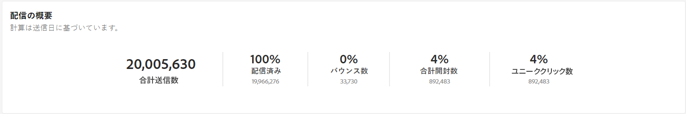{zoomable=&quot;yes&quot;}

+++メールキャンペーンレポート指標の詳細情報。

* **[!UICONTROL 配信メッセージ数]**：配信の準備中に処理されたメッセージの合計数。

* **[!UICONTROL 配信済み数]**：送信されたメッセージの合計数に対して、正常に送信できたメッセージの数。

* **[!UICONTROL バウンス数]**：送信されたメッセージの合計数に対して、配信および自動返信処理の間に累積したエラーの合計数。

* **[!UICONTROL 合計開封数]**：メッセージを 1 回以上開封したターゲット受信者の合計数。

* **[!UICONTROL 合計クリック数]**：配信で少なくとも 1 回クリックしたユニーク受信者の合計数。

+++

### 初期ターゲットオーディエンス統計 {#delivery-summary-email-initial-target}

>[!CONTEXTUALHELP]
>id="acw_campaign_reporting_deliveries_target"
>title="初期ターゲットオーディエンス統計"
>abstract="初期ターゲットオーディエンス統計テーブルには、受信者に関連するデータが表示されます。"

**[!UICONTROL 初期ターゲットオーディエンス統計]**&#x200B;テーブルには、受信者に関連するデータが表示されます。指標については、以下で詳しく説明します。

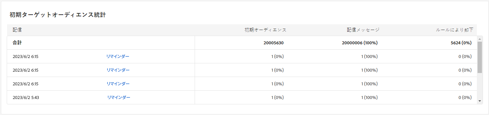{zoomable=&quot;yes&quot;}

+++メールキャンペーンレポート指標の詳細情報。

* **[!UICONTROL 初期オーディエンス数]**：ターゲット受信者の合計数。

* **[!UICONTROL 配信メッセージ数]**：配信準備の後に配信されるメッセージの合計数。

* **[!UICONTROL ルールにより却下]**：ルール（アドレスが不明、強制隔離された、ブロックリストに登録されているなど）を適用する際、分析中に無視されたアドレスの合計数。

+++

### 実行統計 {#delivery-summary-email-exec-stats}

>[!CONTEXTUALHELP]
>id="acw_campaign_reporting_email_exec_stats"
>title="実行統計"
>abstract="**実行統計**&#x200B;テーブルには、配信するメッセージ、成功、エラーおよび新しい強制隔離など、配信の成功の詳細が表示されます。"

**[!UICONTROL 実行統計]**&#x200B;テーブルには、配信の成功の詳細が表示されます。指標については、以下で詳しく説明します。

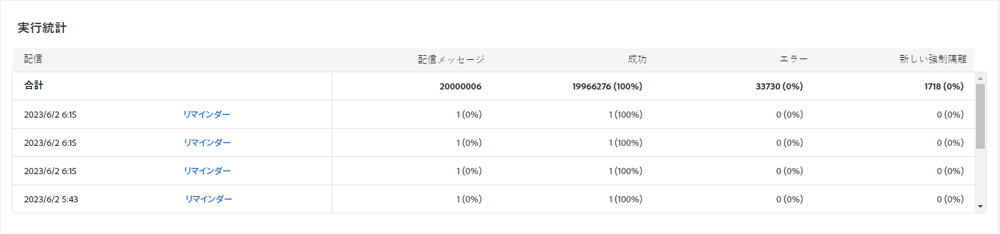{zoomable=&quot;yes&quot;}

+++メールキャンペーンレポート指標の詳細情報。

* **[!UICONTROL 配信メッセージ数]**：配信準備の後に配信されるメッセージの合計数。

* **[!UICONTROL 成功]**：配信されるメッセージ数に関して、正常に処理されたメッセージ数。

* **[!UICONTROL エラー]**：配信と自動リバウンド処理の間に、配信されるメッセージ数に関して累積したエラーの合計数。

* **[!UICONTROL 新しい強制隔離]**：配信の失敗後（不明なユーザー、無効なドメイン）に、配信されるメッセージ数に関して強制隔離されたアドレスの合計数。

  メールのエラータイプは、[Adobe Campaign v8 （クライアントコンソール）ドキュメント](https://experienceleague.adobe.com/docs/campaign/campaign-v8/send/failures/delivery-failures.html?lang=ja#email-error-types){target="_blank"}に記載されています。

+++

### 反応の統計 {#delivery-summary-email-reaction-stats}

>[!CONTEXTUALHELP]
>id="acw_campaign_reporting_email_reaction_stats"
>title="反応の統計"
>abstract="**反応の統計**&#x200B;テーブルには、配信で受信者のアクティビティに使用可能なデータ（開封数、購入数、登録解除数、ミラーページへのクリックリンク）が表示されます。"

**[!UICONTROL 反応の統計]**&#x200B;テーブルには、配信で受信者のアクティビティに使用できるデータが含まれます。指標については、以下で詳しく説明します。

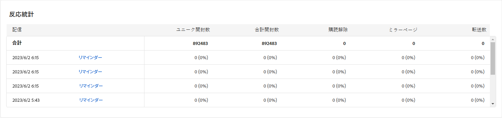{zoomable=&quot;yes&quot;}

+++メールキャンペーンレポート指標の詳細情報。

* **[!UICONTROL ユニーク開封数]**：メッセージを 1 回以上開封したターゲット受信者の合計数。

* **[!UICONTROL 合計開封数]**：メッセージを 1 回以上開封した、このドメインのユニークターゲット受信者の数。

* **[!UICONTROL 購読解除数]**：該当する期間中に購読解除をクリックした受信者の数。

* **[!UICONTROL ミラーページ数]**：ミラーページのリンクをクリックした受信者の数。

* **[!UICONTROL 転送数]**：メールを転送した、クリックした受信者の数。
+++

### クリックストリーム {#delivery-summary-email-click-streams}

>[!CONTEXTUALHELP]
>id="acw_campaign_reporting_email_click_streams"
>title="クリックストリーム"
>abstract="**クリックストリーム**&#x200B;テーブルには、受信者による配信の操作に関する入手可能なデータが表示されます。"

**[!UICONTROL クリックストリーム]**&#x200B;テーブルには、受信者による配信の操作に関するデータが表示されます。指標については、以下で詳しく説明します。

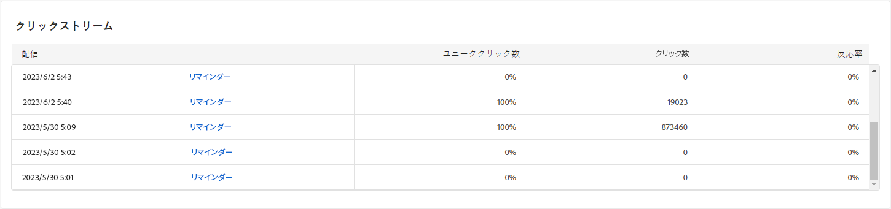{zoomable=&quot;yes&quot;}

+++メールキャンペーンレポート指標の詳細情報。

* **[!UICONTROL ユニーククリック数]**：配信で 1 回以上クリックしたユニーク受信者の合計数。

* **[!UICONTROL 合計クリック数]**：配信におけるリンクの合計クリック数。

* **[!UICONTROL 反応度]**：配信を開封した推定ターゲット受信者数に対する、配信でクリックしたターゲット受信者数の割合。

+++

## 配信不能件数 {#non-deliverables-email}

### タイプ別のエラー分類 {#delivery-summary-email-breakdown-per-type}

>[!CONTEXTUALHELP]
>id="acw_campaign_reporting_error_type"
>title="タイプ別のエラー分類"
>abstract="**タイプ別のエラー分類**&#x200B;テーブルとグラフには、不明なユーザー、メールボックス容量超過、無効なドメインなど、発生した各エラータイプに対して使用可能なデータが含まれています。"

**[!UICONTROL タイプ別のエラー分類]**&#x200B;テーブルとグラフには、各タイプのドメインで発生する可能性のあるエラーに関する使用可能なデータが含まれます。指標については、以下で詳しく説明します。

このレポートに表示されるエラーにより、強制隔離プロセスが実行されることになります。強制隔離の管理について詳しくは、[Campaign v8（クライアントコンソール）ドキュメント](https://experienceleague.adobe.com/docs/campaign/campaign-v8/campaigns/send/failures/delivery-failures.html?lang=ja){target="_blank"}を参照してください。

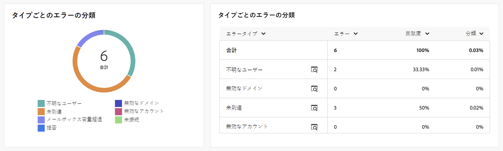{zoomable=&quot;yes&quot;}

+++メールキャンペーンレポート指標の詳細情報。

* **[!UICONTROL 不明なユーザー]**：メールアドレスが無効であることを示すエラータイプで、配信中に生成される。

* **[!UICONTROL 無効なドメイン]**：メールアドレスが正しくないか存在しないことを示すエラータイプ。配信の送信中に生成される。

* **[!UICONTROL メールボックス容量超過]**：受信者の受信ボックスにあるメッセージの数が多すぎることを示すエラータイプで、5 回の配信の試行後に生成される。

* **[!UICONTROL 無効なアカウント]**：アドレスが存在しないことを示すエラータイプ。配信の送信中に生成される。

* **[!UICONTROL 拒否]**：アドレスが IAP（インターネットアクセスプロバイダー）によって却下される場合に生成されるエラータイプ。例えば、セキュリティルールのアプリケーション（スパム対策ソフトウェア）によって却下された場合に生成される。

* **[!UICONTROL 未到達]**：SMTP リレーでのインシデント、ドメインへの一時的な未到達など、メッセージ配分文字列で発生するエラータイプ。

* **[!UICONTROL 未接続]**：受信者の携帯電話の電源が入っていない、または送信時にネットワーク接続が切断されていることを示すエラータイプ。

+++

### ドメイン別のエラー分類 {#delivery-summary-email-breakdown-per-domain}

>[!CONTEXTUALHELP]
>id="acw_campaign_reporting_error_domain"
>title="ドメイン別のエラー分類"
>abstract="**ドメイン別のエラー分類**&#x200B;テーブルとグラフには、各ドメインで発生した各エラータイプに関する使用可能なデータが含まれます。"

**[!UICONTROL ドメイン別のエラー分類]**&#x200B;テーブルとグラフには、各ドメインで発生する可能性のある各エラータイプに関する使用可能なデータが含まれます。指標は、上記の&#x200B;**[!UICONTROL タイプ別のエラー分類]**&#x200B;テーブルとグラフと共通です。

## トラッキング指標 {#tracking-indicators-email}

### 配信統計 {#delivery-summary-email-statistics}

>[!CONTEXTUALHELP]
>id="acw_delivery_campaign_delivery_statistics_summary"
>title="配信統計"
>abstract="**配信統計**&#x200B;グラフには、配信の成功と発生したエラーの詳細が表示されます。"

**[!UICONTROL 配信統計]**&#x200B;指標では、送信されたメールで使用可能なデータに関する詳細情報を提供する主要業績評価指標（KPI）が提供されます。指標については、以下で詳しく説明します。

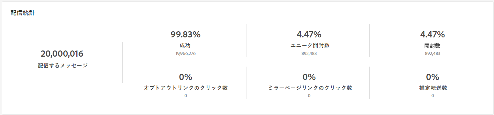{zoomable=&quot;yes&quot;}

+++メールキャンペーンレポート指標の詳細情報。

* **[!UICONTROL 配信メッセージ数]**：配信されるメッセージ数に関して正常に処理されたメッセージ数。

* **[!UICONTROL ユニーク開封数]**：メッセージを 1 回以上開封したターゲット受信者の合計数。

* **[!UICONTROL 合計開封数]**：メッセージを 1 回以上開封した、このドメインのユニークターゲット受信者の数。

* **[!UICONTROL オプトアウトリンクのクリック数]**：購読解除リンクのクリック数。

* **[!UICONTROL ミラーリンクのクリック数]**：ミラーページへのリンクのクリック数。

* **[!UICONTROL 推定転送数]**：ターゲット受信者によって転送されるメール数の推定値。
+++

### 開封率およびクリックスルー率 {#delivery-summary-open-rate}

>[!CONTEXTUALHELP]
>id="acw_campaign_reporting_open_clickthrough"
>title="開封率とクリックスルー率"
>abstract="**開封率およびクリックスルー率**&#x200B;テーブルには、配信に対する受信者のエンゲージメントに関するデータが表示されます。"

**[!UICONTROL 開封率およびクリックスルー率]**&#x200B;テーブルには、受信者に関連するデータが表示されます。指標については、以下で詳しく説明します。

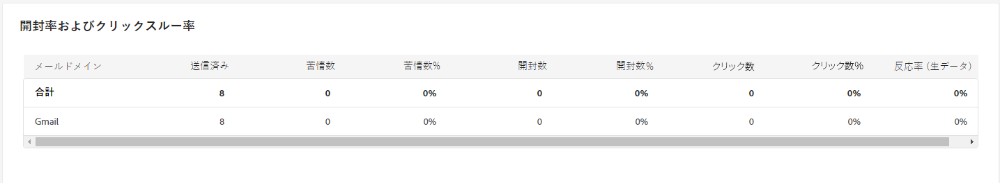{zoomable=&quot;yes&quot;}

+++ 詳しくは、メールキャンペーンレポート指標を参照してください。

* **[!UICONTROL 送信済み]**：送信されたメッセージの合計数。

* **[!UICONTROL 苦情件数]**：このドメインのメッセージのうち、受信者によって望ましくないとレポートされたメッセージ数と割合。

* **[!UICONTROL ユニーク開封数]**：メッセージを 1 回以上開封した、このドメインのユニークターゲット受信者の数と割合。

* **[!UICONTROL ユニーククリック数]**：同じ配信で 1 回以上クリックしたユニークターゲット受信者の数と割合。

* **[!UICONTROL 反応率（生データ）]**：配信を少なくとも 1 回開封した受信者数に対する、配信で少なくとも 1 回クリックした受信者数の割合。

+++

## URL とクリックストリーム {#url-email}

>[!CONTEXTUALHELP]
>id="acw_campaign_reporting_urls_clickstreams"
>title="URL とクリックストリーム"
>abstract="**URL とクリックストリーム**&#x200B;では、配信中に最もクリックされた URL に関する詳細情報を提供する主要業績評価指標（KPI）が提供されます。"

**[!UICONTROL URL とクリックストリーム]**&#x200B;では、配信中に最もクリックされた URL に関する詳細情報を提供する主要業績評価指標（KPI）が提供されます。指標については、以下で詳しく説明します。

{zoomable=&quot;yes&quot;}

+++ 詳しくは、メールキャンペーンレポート指標を参照してください。

* **[!UICONTROL 反応度]**：配信を開封した推定ターゲット受信者数に対する、配信でクリックしたターゲット受信者数の割合。

* **[!UICONTROL ユニーククリック数]**：配信で 1 回以上クリックしたユニーク受信者の合計数。

* **[!UICONTROL 合計クリック数]**：配信におけるリンクの合計クリック数。

* **[!UICONTROL プラットフォームの平均]**：この平均率は、それぞれの率（反応度、ユニーククリック数および累積クリック数）の下に表示され、過去 6 ヶ月間に送信された配信に対して計算されます。同じタイポロジを持つ、同じチャネルでの配信のみが考慮されます。配達確認は除外されます。

+++

### 最も訪問されたリンク上位 10 件 {#top10-campaign-report-email}

>[!CONTEXTUALHELP]
>id="acw_campaign_reporting_urls_clickstreams_top10"
>title="最も訪問されたリンク上位 10 件"
>abstract="**最も訪問されたリンク上位 10 位**&#x200B;グラフとテーブルには、リンクごとの受信者の行動に使用できるデータが含まれます。"

**[!UICONTROL 最も訪問されたリンク上位 10 件]**&#x200B;グラフおよびテーブルには、リンクごとの受信者の行動に関する入手可能なデータが表示されます。指標については、以下で詳しく説明します。

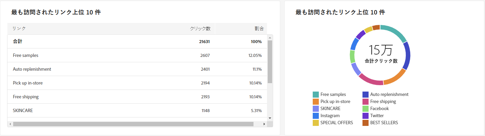{zoomable=&quot;yes&quot;}

+++メールキャンペーンレポート指標の詳細情報。

* **[!UICONTROL クリック数]**：配信におけるリンクの合計クリック数。

* **[!UICONTROL 割合]**：配信で操作したユーザーの割合。

+++

### 時間の経過に伴うクリック数の分類 {#campaign-report-email-breakdown-clicks}

>[!CONTEXTUALHELP]
>id="acw_delivery_campaign_urls_click_breakdown"
>title="時間の経過に伴うクリック数の分類"
>abstract="**時間の経過に伴うクリック数の分類**&#x200B;グラフには、リンクごとの受信者の行動に関する入手可能なデータが表示されます。"

**[!UICONTROL 時間の経過に伴うクリック数の分類]**&#x200B;グラフには、リンクごとの受信者の行動に関する入手可能なデータが表示されます。

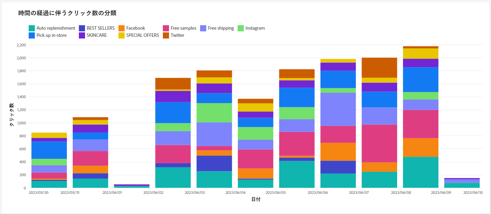{zoomable=&quot;yes&quot;}

## ユーザーアクティビティ {#user-activities-email}

>[!CONTEXTUALHELP]
>id="acw_campaign_reporting_user_activities"
>title="ユーザーアクティビティ"
>abstract="**ユーザーアクティビティ**&#x200B;グラフでは、開封数とクリック数の分類をグラフ形式で表示します。"

**[!UICONTROL ユーザーアクティビティ]**&#x200B;レポートには、開封数とクリック数の分類がチャート形式で表示されます。このレポートの指標については、以下で詳しく説明します。

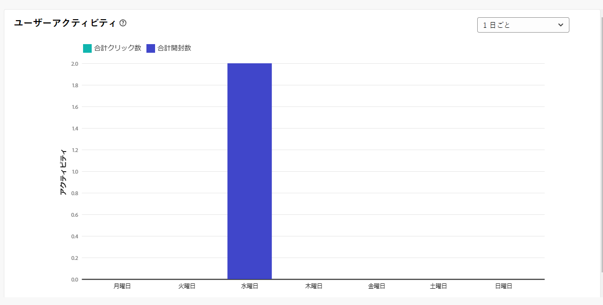{zoomable=&quot;yes&quot;}{align="center"}

+++詳しくは、メール配信レポート指標を参照してください。

* **[!UICONTROL クリック数]**：配信におけるリンクの合計クリック数。

* **[!UICONTROL 開封数]**：メッセージを少なくとも 1 回開封した、このドメインのユニークターゲット受信者の数。

+++
