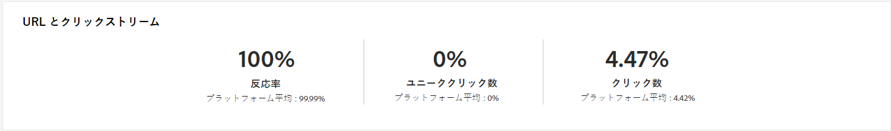

# E メールチャネルのキャンペーンレポート {#campaign-reports-email-channel}

各キャンペーンレポートは、キャンペーンの成功とエラーを示す様々なウィジェットに分割されます。 E メールチャネルの場合、レポートと指標については、以下で詳しく説明します。 キャンペーンレポートにアクセスする方法については、 [このページ](campaign-reports.md).

## 配信の概要 {#delivery-summary-email}

>[!CONTEXTUALHELP]
>id="acw_campaign_reporting_deliveries_overview"
>title="配信の概要"
>abstract="The **配信の概要** は、訪問者が E メール配信にどのように関与しているかに関する詳細情報を提供する主要業績評価指標 (KPI) を提供します。"

### 配信の概要 {#delivery-summary-email-ovv}

The **[!UICONTROL 配信の概要]** レポートは、訪問者が E メール配信にどのように関与しているかに関する詳細情報を提供する主要業績評価指標 (KPI) を提供します。 以下に、指標について詳しく説明します。

+++詳しくは、メールキャンペーンレポート指標を参照してください。

* **[!UICONTROL 合計送信数]**：配信の準備中に処理されたメッセージの合計数。

* **[!UICONTROL 配信済み数]**：送信されたメッセージの合計数に対して、正常に送信できたメッセージの数。

* **[!UICONTROL バウンス数]**：送信されたメッセージの合計数に対して、配信および自動返信処理の間に累積したエラーの合計数。

* **[!UICONTROL ユニーク開封数]**：メッセージを少なくとも 1 回開封したターゲット受信者の合計数。

* **[!UICONTROL ユニーククリック数]**：配信で少なくとも 1 回クリックしたユニーク受信者の合計数。

+++

### 初期ターゲットオーディエンス統計 {#delivery-summary-email-initial-target}

>[!CONTEXTUALHELP]
>id="acw_campaign_reporting_deliveries_target"
>title="初期ターゲットオーディエンス統計"
>abstract="初期ターゲットオーディエンス統計テーブルには、受信者に関連するデータが表示されます。"

The **[!UICONTROL 初期ターゲットオーディエンスの統計]** テーブルには、受信者に関連するデータが表示されます。 以下に、指標について詳しく説明します。

+++詳しくは、メールキャンペーンレポート指標を参照してください。

* **[!UICONTROL 初期オーディエンス数]**：ターゲット受信者の合計数。

* **[!UICONTROL 配信メッセージ数]**：配信準備の後に配信されるメッセージの合計数。

* **[!UICONTROL ルールにより却下]**：ルール（アドレスが不明、強制隔離された、ブロックリストに登録されているなど）を適用する際、分析中に無視されたアドレスの合計数。

+++

### 実行統計 {#delivery-summary-email-exec-stats}

>[!CONTEXTUALHELP]
>id="acw_campaign_reporting_email_exec_stats"
>title="実行統計"
>abstract="The **実行統計** テーブルには、配信の成功の詳細が記載されています。配信するメッセージ、成功、エラーおよび新しい強制隔離です。"

The **[!UICONTROL 実行統計]** テーブルには、配信の成功の詳細が表示されます。 以下に、指標について詳しく説明します。

+++詳しくは、メールキャンペーンレポート指標を参照してください。

* **[!UICONTROL 配信メッセージ数]**：配信準備の後に配信されるメッセージの合計数。

* **[!UICONTROL 成功]**：配信されるメッセージ数に関して正常に処理されたメッセージ数。

* **[!UICONTROL エラー]**：配信と自動リバウンド処理の間に、配信されるメッセージ数に関して累積したエラーの合計数。

* **[!UICONTROL 新しい強制隔離]**：配信の失敗後（不明なユーザー、無効なドメイン）に、配信されるメッセージ数に関して強制隔離されたアドレスの合計数。

  E メールのエラータイプは、 [Adobe Campaign v8 （クライアントコンソール）ドキュメント](https://experienceleague.adobe.com/docs/campaign/campaign-v8/send/failures/delivery-failures.html#email-error-types){target="_blank"}.

+++

### 反応統計 {#delivery-summary-email-reaction-stats}

>[!CONTEXTUALHELP]
>id="acw_campaign_reporting_email_reaction_stats"
>title="反応統計"
>abstract="The **反応統計** テーブルには、配信で受信者アクティビティに使用可能なデータ（開封数、購読、購読解除、ミラーページへのクリックリンク）が表示されます。"

The **[!UICONTROL 反応統計]** テーブルには、配信で受信者のアクティビティに使用できるデータが含まれます。 以下に、指標について詳しく説明します。

+++詳しくは、メールキャンペーンレポート指標を参照してください。

* **[!UICONTROL ユニーク開封数]**：メッセージを少なくとも 1 回開封したターゲット受信者の合計数。

* **[!UICONTROL 開封数]**：メッセージを少なくとも 1 回開封した、このドメインのユニークターゲット受信者の数。

* **[!UICONTROL 購読解除数]**：該当する期間中に購読解除をクリックした受信者の数。

* **[!UICONTROL ミラーページ数]**：ミラーページのリンクをクリックした受信者の数。

* **[!UICONTROL 転送数]**：メールを転送した、クリックした受信者の数。
+++

### クリックストリーム {#delivery-summary-email-click-streams}

>[!CONTEXTUALHELP]
>id="acw_campaign_reporting_email_click_streams"
>title="クリックストリーム"
>abstract="The **クリックストリーム** テーブルには、受信者による配信との関わり方に関して使用可能なデータが表示されます。"

The **[!UICONTROL クリックストリーム]** テーブルには、受信者による配信との関わり方に関するデータが表示されます。 以下に、指標について詳しく説明します。

+++詳しくは、メールキャンペーンレポート指標を参照してください。

* **[!UICONTROL ユニーククリック数]**：配信で少なくとも 1 回クリックしたユニーク受信者の合計数。

* **[!UICONTROL クリック数]**：配信におけるリンクの合計クリック数。

* **[!UICONTROL 反応度]**：配信を開封した推定ターゲット受信者数に対する、配信でクリックしたターゲット受信者数の割合。

+++

## 配信不能件数 {#non-deliverables-email}

### タイプごとのエラーの分類 {#delivery-summary-email-breakdown-per-type}

>[!CONTEXTUALHELP]
>id="acw_campaign_reporting_error_type"
>title="タイプごとのエラーの分類"
>abstract="The **タイプごとのエラーの分類** テーブルとグラフには、不明なユーザー、メールボックス容量超過、無効なドメインなど、発生した各エラータイプに対して使用可能なデータが含まれています。"

The **[!UICONTROL タイプごとのエラーの分類]** テーブルとグラフには、各タイプのドメインで発生した可能性のあるエラーに関して使用可能なデータが含まれています。 以下に、指標について詳しく説明します。

このレポートに表示されるエラーにより、強制隔離プロセスが実行されることになります。強制隔離の管理について詳しくは、[Campaign v8（クライアントコンソール）ドキュメント](https://experienceleague.adobe.com/docs/campaign/campaign-v8/campaigns/send/failures/delivery-failures.html?lang=ja){target="_blank"}を参照してください。

+++詳しくは、メールキャンペーンレポート指標を参照してください。

* **[!UICONTROL 不明なユーザー]**：メールアドレスが無効であることを示すエラータイプで、配信中に生成される。

* **[!UICONTROL 無効なドメイン]**：メールアドレスが正しくないか存在しないことを示すエラータイプ。配信の送信中に生成される。

* **[!UICONTROL メールボックス容量超過]**：受信者の受信ボックスにあるメッセージの数が多すぎることを示すエラータイプで、5 回の配信の試行後に生成される。

* **[!UICONTROL 無効なアカウント]**：アドレスが存在しないことを示すエラータイプ。配信の送信中に生成される。

* **[!UICONTROL 拒否]**：アドレスが IAP（インターネットアクセスプロバイダー）によって却下される場合に生成されるエラータイプ。例えば、セキュリティルールのアプリケーション（スパム対策ソフトウェア）によって却下された場合に生成される。

* **[!UICONTROL 未到達]**：SMTP リレーでのインシデント、ドメインへの一時的な未到達など、メッセージ配分文字列で発生するエラータイプ。

* **[!UICONTROL 未接続]**：受信者の携帯電話の電源が入っていない、または送信時にネットワーク接続が切断されていることを示すエラータイプ。

+++

### ドメインごとのエラーの分類 {#delivery-summary-email-breakdown-per-domain}

>[!CONTEXTUALHELP]
>id="acw_campaign_reporting_error_domain"
>title="ドメインごとのエラーの分類"
>abstract="The **ドメインごとのエラーの分類** テーブルおよびグラフには、各ドメインに応じて発生した各エラータイプで使用可能なデータが表示されます。"

The **[!UICONTROL ドメインごとのエラーの分類]** テーブルとグラフには、各ドメインで発生した可能性のあるエラーに関して使用可能なデータが含まれています。 指標は、 **[!UICONTROL タイプごとのエラーの分類]** 上記の表とグラフについて詳しく説明します。

## トラッキング指標 {#tracking-indicators-email}

### 配信統計 {#delivery-summary-email-statistics}

>[!CONTEXTUALHELP]
>id="acw_delivery_campaign_delivery_statistics_summary"
>title="配信統計"
>abstract="The **配信統計** グラフには、配信の成功と発生したエラーの詳細が表示されます。"

The **[!UICONTROL 配信統計]** 指標には、送信された E メールで使用できるデータの詳細情報を提供する主要業績評価指標 (KPI) が含まれます。 以下に、指標について詳しく説明します。

+++詳しくは、メールキャンペーンレポート指標を参照してください。

* **[!UICONTROL 成功]**：配信されるメッセージ数に関して正常に処理されたメッセージ数。

* **[!UICONTROL ユニーク開封数]**：メッセージを少なくとも 1 回開封したターゲット受信者の合計数。

* **[!UICONTROL 開封数]**：メッセージを少なくとも 1 回開封した、このドメインのユニークターゲット受信者の数。

* **[!UICONTROL オプトアウトリンクのクリック数]**：購読解除リンクのクリック数。

* **[!UICONTROL ミラーリンクのクリック数]**：ミラーページへのリンクのクリック数。

* **[!UICONTROL 推定転送数]**：ターゲット受信者によって転送されるメール数の推定値。
+++

### 開封率およびクリックスルー率 {#delivery-summary-open-rate}

>[!CONTEXTUALHELP]
>id="acw_campaign_reporting_open_clickthrough"
>title="開封率およびクリックスルー率"
>abstract="**開封率およびクリックスルー率**&#x200B;テーブルには、配信に対する受信者のエンゲージメントに関するデータが表示されます。"

The **[!UICONTROL 開封率およびクリックスルー率]** テーブルには、受信者に関連するデータが表示されます。 以下に、指標について詳しく説明します。

+++詳しくは、メールキャンペーンレポート指標を参照してください。

* **[!UICONTROL 送信済み]**：送信されたメッセージの合計数。

* **[!UICONTROL 苦情件数]**：受信者によって望ましくないとレポートされた、このドメインのメッセージ数。

* **[!UICONTROL 開封数]**：メッセージを少なくとも 1 回開封した、このドメインのユニークターゲット受信者の数。

* **[!UICONTROL クリック数]**：同じ配信で少なくとも 1 回クリックしたユニークターゲット受信者の数。

* **[!UICONTROL 反応率（生データ）]**：配信を少なくとも 1 回開封した受信者数に対する、配信で少なくとも 1 回クリックした受信者数の割合。
+++

## URL とクリックストリーム {#url-email}

>[!CONTEXTUALHELP]
>id="acw_campaign_reporting_urls_clickstreams"
>title="URL とクリックストリーム"
>abstract="The **URL とクリックストリーム** レポートには、配信中に最もクリックされた URL に関する詳細情報を提供する主要業績評価指標 (KPI) が表示されます。"

The **[!UICONTROL URL とクリックストリーム]** レポートには、配信中に最もクリックされた URL に関する詳細情報を提供する主要業績評価指標 (KPI) が表示されます。 以下に、指標について詳しく説明します。

+++詳しくは、メールキャンペーンレポート指標を参照してください。

* **[!UICONTROL 反応度]**：配信を開封した推定ターゲット受信者数に対する、配信でクリックしたターゲット受信者数の割合。

* **[!UICONTROL ユニーククリック数]**：配信で少なくとも 1 回クリックしたユニーク受信者の合計数。

* **[!UICONTROL クリック数]**：配信におけるリンクの合計クリック数。

* **[!UICONTROL プラットフォームの平均]**：この平均率は、それぞれの率（反応度、ユニーククリック数および累積クリック数）の下に表示され、過去 6 ヶ月間に送信された配信に対して計算されます。同じタイポロジを持つ、同じチャネルでの配信のみが考慮されます。配達確認は除外されます。
+++

### 最も訪問されたリンク上位 10 件 {#top10-campaign-report-email}

>[!CONTEXTUALHELP]
>id="acw_campaign_reporting_urls_clickstreams_top10"
>title="最も訪問されたリンク上位 10 件"
>abstract="The **最も多く訪問された上位 10 件のリンク** グラフとテーブルには、リンクごとの受信者の行動に使用できるデータが含まれています。"

The **[!UICONTROL 最も多く訪問された上位 10 件のリンク]** グラフとテーブルには、リンクごとの受信者の行動に使用できるデータが含まれています。 以下に、指標について詳しく説明します。

+++詳しくは、メールキャンペーンレポート指標を参照してください。

* **[!UICONTROL クリック数]**：配信におけるリンクの合計クリック数。

* **[!UICONTROL 割合]**：配信で操作したユーザーの割合。

+++

### 時間の経過に伴うクリック数の分類 {#campaign-report-email-breakdown-clicks}

>[!CONTEXTUALHELP]
>id="acw_delivery_campaign_urls_click_breakdown"
>title="時間の経過に伴うクリック数の分類"
>abstract="The **時間の経過に伴うクリック数の分類** グラフには、リンクごとの受信者の行動に使用可能なデータが表示されます。"

の **[!UICONTROL 時間の経過に伴うクリック数の分類]** グラフには、リンクごとの受信者の行動に使用できるデータが含まれます。

## ユーザーアクティビティ {#user-activities-email}

>[!CONTEXTUALHELP]
>id="acw_campaign_reporting_user_activities"
>title="ユーザーアクティビティ"
>abstract="**ユーザーアクティビティ**&#x200B;グラフでは、開封数とクリック数の分類をグラフ形式で表示します。"

The **[!UICONTROL ユーザーアクティビティ]** レポートは、開封数とクリック数の分類をグラフの形式で表示します。 このレポートの指標については、以下で詳しく説明します。

{align="center"}

+++詳しくは、メール配信レポート指標を参照してください。

* **[!UICONTROL クリック数]**：配信におけるリンクの合計クリック数。

* **[!UICONTROL 開封数]**：メッセージを少なくとも 1 回開封した、このドメインのユニークターゲット受信者の数。

+++
