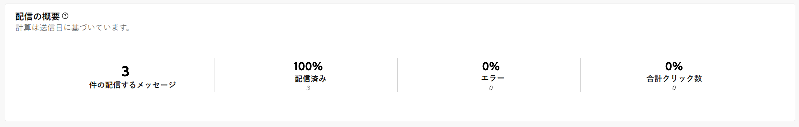
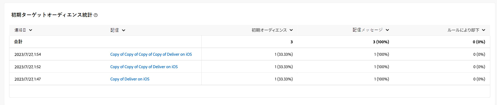
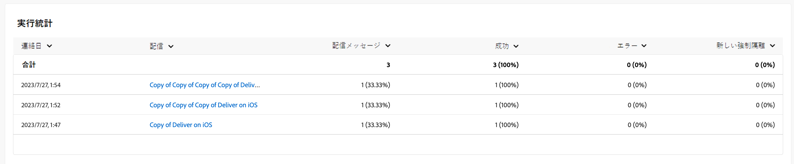

# プッシュチャネル用のキャンペーンレポート {#campaign-reports-push-channel}

各キャンペーンレポートは、キャンペーンの成功とエラーを示す様々なウィジェットに分割されます。 プッシュチャネルの場合、レポートと指標については、以下で詳しく説明します。 キャンペーンレポートにアクセスする方法については、 [このページ](campaign-reports.md).

## 配信の概要 {#delivery-summary-push}

>[!CONTEXTUALHELP]
>id="acw_campaign_reporting_push_deliveries_overview"
>title="配信の概要"
>abstract="The **配信の概要** レポートは、訪問者がプッシュ通知配信にどのように関与しているかに関する詳細な情報を提供する主要業績評価指標 (KPI) を提供します。"

The **[!UICONTROL 配信の概要]** レポートは、訪問者がプッシュ通知配信にどのように関与しているかに関する詳細な情報を提供する主要業績評価指標 (KPI) を提供します。 以下に、指標について詳しく説明します。

+++詳しくは、プッシュキャンペーンレポート指標を参照してください。

* **[!UICONTROL 合計送信数]**：配信の準備中に処理されたメッセージの合計数。

* **[!UICONTROL 配信済み数]**：送信されたメッセージの合計数に対して、正常に送信できたメッセージの数。

* **[!UICONTROL エラー数]**：配信と自動返信処理の間に、送信されたメッセージの合計数に関して累積したエラーの合計数。

* **[!UICONTROL ユニーククリック数]**：配信で少なくとも 1 回クリックしたユニーク受信者の合計数。

+++

### 初期ターゲットオーディエンス統計 {#delivery-summary-push-initial-target}

>[!CONTEXTUALHELP]
>id="acw_campaign_reporting_push_target"
>title="初期ターゲットオーディエンス統計"
>abstract="The **初期ターゲットオーディエンスの統計** テーブルには、受信者に関連するデータが表示されます"

The **[!UICONTROL 初期ターゲットオーディエンスの統計]** テーブルには、受信者に関連するデータが表示されます。 以下に、指標について詳しく説明します。

+++詳しくは、プッシュキャンペーンレポート指標を参照してください。

* **[!UICONTROL 初期オーディエンス数]**：ターゲット受信者の合計数。

* **[!UICONTROL 配信メッセージ数]**：配信準備の後に配信されるメッセージの合計数。

* **[!UICONTROL ルールにより却下]**：ルール（アドレスが不明、強制隔離された、ブロックリストに登録されているなど）を適用する際、分析中に無視されたアドレスの合計数。

+++

### 実行統計 {#delivery-summary-push-exec-stats}

>[!CONTEXTUALHELP]
>id="acw_campaign_reporting_push_exec_stats"
>title="実行統計"
>abstract="The **実行統計** テーブルには、配信の成功の詳細が記載されています。配信するメッセージ、成功、エラーおよび新しい強制隔離です。"

The **[!UICONTROL 実行統計]** テーブルには、配信の成功の詳細が表示されます。 以下に、指標について詳しく説明します。

+++詳しくは、プッシュキャンペーンレポート指標を参照してください。

* **[!UICONTROL 配信メッセージ数]**：配信準備の後に配信されるメッセージの合計数。

* **[!UICONTROL 成功]**：配信されるメッセージ数に関して正常に処理されたメッセージ数。

* **[!UICONTROL エラー]**：配信と自動リバウンド処理の間に、配信されるメッセージ数に関して累積したエラーの合計数。

* **[!UICONTROL 新しい強制隔離]**：配信の失敗後（不明なユーザー、無効なドメイン）に、配信されるメッセージ数に関して強制隔離されたアドレスの合計数。

+++

### クリックストリーム {#delivery-summary-push-click-streams}

>[!CONTEXTUALHELP]
>id="acw_campaign_reporting_push_click_streams"
>title="クリックストリーム"
>abstract="The **クリックストリーム** テーブルには、受信者による配信との関わり方に関して使用可能なデータが表示されます。"

The **[!UICONTROL クリックストリーム]** テーブルには、受信者による配信との関わり方に関するデータが表示されます。 以下に、指標について詳しく説明します。

+++詳しくは、プッシュキャンペーンレポート指標を参照してください。

* **[!UICONTROL ユニーククリック数]**：配信で少なくとも 1 回クリックしたユニーク受信者の合計数。

* **[!UICONTROL クリック数]**：配信におけるリンクの合計クリック数。

* **[!UICONTROL 反応度]**：配信を開封した推定ターゲット受信者数に対する、配信でクリックしたターゲット受信者数の割合。

+++
