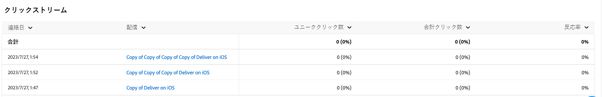

# プッシュチャネルのキャンペーンレポート {#campaign-reports-push-channel}

各キャンペーンレポートは、キャンペーンの成功とエラーの詳細を表示する様々なウィジェットに分かれています。プッシュチャネルのレポートと指標について、以下で詳しく説明します。キャンペーンレポートにアクセスする方法については、[ このページ ](campaign-reports.md) を参照してください。

## 配信の概要 {#delivery-summary-push}

>[!CONTEXTUALHELP]
>id="acw_campaign_reporting_push_deliveries_overview"
>title="配信の概要"
>abstract="**配信の概要**&#x200B;レポートは、プッシュ通知配信に対する訪問者のエンゲージメントの詳細を示す主要業績評価指標（KPI）を提供します。"

**[!UICONTROL 配信の概要]**&#x200B;レポートは、プッシュ通知配信に対する訪問者のエンゲージメントの詳細を示す主要業績評価指標（KPI）を提供します。指標については、以下で詳しく説明します。

{zoomable="yes"}

+++プッシュキャンペーンレポート指標の詳細はこちら。

* **[!UICONTROL 配信メッセージ数]**：配信の準備中に処理されたメッセージの合計数。

* **[!UICONTROL 配信済み数]**：送信されたメッセージの合計数に対して、正常に送信できたメッセージの数。

* **[!UICONTROL エラー]**：送信されたメッセージの合計数に対して、配信および自動返信処理の間に蓄積されたエラーの合計数。

* **[!UICONTROL 合計クリック数]**：配信で少なくとも 1 回クリックしたユニーク受信者の合計数。

+++

### 初期ターゲットオーディエンス統計 {#delivery-summary-push-initial-target}

>[!CONTEXTUALHELP]
>id="acw_campaign_reporting_push_target"
>title="初期ターゲットオーディエンス統計"
>abstract="**初期ターゲットオーディエンス統計** テーブルには、受信者に関連するデータが表示されます。"

**[!UICONTROL 初期ターゲットオーディエンス統計]**&#x200B;テーブルには、受信者に関連するデータが表示されます。指標については、以下で詳しく説明します。

{zoomable="yes"}

+++プッシュキャンペーンレポート指標の詳細はこちら。

* **[!UICONTROL 初期オーディエンス]**：ターゲット受信者の合計数。

* **[!UICONTROL 配信メッセージ数]**：配信準備の後に配信されるメッセージの合計数。

* **[!UICONTROL ルールにより却下]**：アドレスが不明、強制隔離された、ブロックリスト上にあるなど、ルールの適用時に分析中に無視されたアドレスの合計数。

+++

### 実行統計 {#delivery-summary-push-exec-stats}

>[!CONTEXTUALHELP]
>id="acw_campaign_reporting_push_exec_stats"
>title="実行統計"
>abstract="**実行統計**&#x200B;テーブルには、配信するメッセージ、成功、エラーおよび新しい強制隔離など、配信の成功の詳細が表示されます。"

**[!UICONTROL 実行統計]**&#x200B;テーブルには、配信の成功の詳細が表示されます。指標については、以下で詳しく説明します。

{zoomable="yes"}

+++プッシュキャンペーンレポート指標の詳細はこちら。

* **[!UICONTROL 配信メッセージ数]**：配信準備の後に配信されるメッセージの合計数。

* **[!UICONTROL 成功]**：配信されるメッセージ数に関して、正常に処理されたメッセージ数。

* **[!UICONTROL エラー]**：配信と自動リバウンド処理の間に、配信されるメッセージ数に関して蓄積されたエラーの合計数。

* **[!UICONTROL 新しい強制隔離]**：配信の失敗後（無効な登録、メッセージの却下、ペイロードエラーなど）、配信されるメッセージ数に関して強制隔離されたアドレスの合計数。

  プッシュ通知のエラータイプは、[Adobe Campaign v8 （クライアントコンソール）ドキュメント ](https://experienceleague.adobe.com/docs/campaign/campaign-v8/send/failures/delivery-failures.html?lang=ja#push-error-types){target="_blank"} に一覧表示されます。

+++

### クリックストリーム {#delivery-summary-push-click-streams}

>[!CONTEXTUALHELP]
>id="acw_campaign_reporting_push_click_streams"
>title="クリックストリーム"
>abstract="**クリックストリーム**&#x200B;テーブルには、受信者による配信の操作に関する入手可能なデータが表示されます。"

**[!UICONTROL クリックストリーム]**&#x200B;テーブルには、受信者による配信の操作に関するデータが表示されます。指標については、以下で詳しく説明します。

{zoomable="yes"}

+++プッシュキャンペーンレポート指標の詳細はこちら。

* **[!UICONTROL ユニーククリック数]**：配信で少なくとも 1 回クリックしたユニーク受信者の合計数。

* **[!UICONTROL 合計クリック数]**：配信におけるリンクの合計クリック数。

* **[!UICONTROL 反応度]**：配信を開封した推定ターゲット受信者数に対する、配信でクリックしたターゲット受信者数の割合。

+++