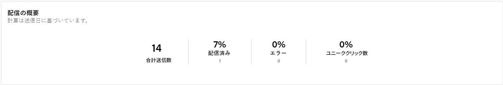
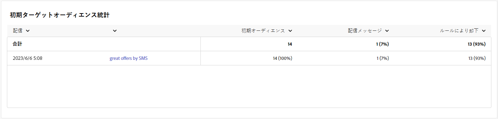
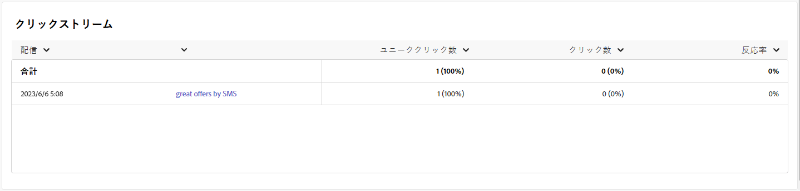

# SMS チャネルのキャンペーンレポート {#campaign-reports-sms-channel}

各キャンペーンレポートは、キャンペーンの成功とエラーの詳細を表示する様々なウィジェットに分かれています。SMS チャネルのレポートと指標について、以下で詳しく説明します。キャンペーンレポートにアクセスする方法については、[このページ](campaign-reports.md)を参照してください。

## 配信の概要 {#delivery-summary-sms}

>[!CONTEXTUALHELP]
>id="acw_campaign_reporting_sms_deliveries_overview"
>title="配信の概要"
>abstract="**配信の概要**&#x200B;レポートは、SMS 配信に対する訪問者のエンゲージメントの詳細を示す主要業績評価指標（KPI）を提供します。"

**[!UICONTROL 配信の概要]**&#x200B;レポートは、SMS 配信に対する訪問者のエンゲージメントの詳細を示す主要業績評価指標（KPI）を提供します。指標については、以下で詳しく説明します。

+++SMS キャンペーンレポート指標の詳細情報。

* **[!UICONTROL 合計送信数]**：配信の準備中に処理されたメッセージの合計数。

* **[!UICONTROL 配信済み数]**：送信されたメッセージの合計数に対して、正常に送信できたメッセージの数。

* **[!UICONTROL エラー数]**：配信と自動返信処理の間に、送信されたメッセージの合計数に関して累積したエラーの合計数。

* **[!UICONTROL ユニーククリック数]**：配信で少なくとも 1 回クリックしたユニーク受信者の合計数。

+++

### 初期ターゲットオーディエンス統計 {#delivery-summary-sms-initial-target}

>[!CONTEXTUALHELP]
>id="acw_campaign_reporting_sms_target"
>title="初期ターゲットオーディエンス統計"
>abstract="**初期ターゲットオーディエンス統計**&#x200B;テーブルには、受信者に関連するデータが表示されます。"

**[!UICONTROL 初期ターゲットオーディエンス統計]**&#x200B;テーブルには、受信者に関連するデータが表示されます。指標については、以下で詳しく説明します。

+++SMS キャンペーンレポート指標の詳細情報。

* **[!UICONTROL 初期オーディエンス数]**：ターゲット受信者の合計数。

* **[!UICONTROL 配信メッセージ数]**：配信準備の後に配信されるメッセージの合計数。

* **[!UICONTROL ルールにより却下]**：ルール（アドレスが不明、強制隔離された、ブロックリストに登録されているなど）を適用する際、分析中に無視されたアドレスの合計数。

+++

### 実行統計 {#delivery-summary-sms-exec-stats}

>[!CONTEXTUALHELP]
>id="acw_campaign_reporting_sms_exec_stats"
>title="実行統計"
>abstract="**実行統計**&#x200B;テーブルには、配信するメッセージ、成功、エラーおよび新しい強制隔離など、配信の成功の詳細が表示されます。"

**[!UICONTROL 実行統計]**&#x200B;テーブルには、配信の成功の詳細が表示されます。指標については、以下で詳しく説明します。

+++SMS キャンペーンレポート指標の詳細情報。

* **[!UICONTROL 配信メッセージ数]**：配信準備の後に配信されるメッセージの合計数。

* **[!UICONTROL 成功]**：配信されるメッセージ数に関して、正常に処理されたメッセージ数。

* **[!UICONTROL エラー]**：配信と自動リバウンド処理の間に、配信されるメッセージ数に関して累積したエラーの合計数。

* **[!UICONTROL 新しい強制隔離]**：配信の失敗後（不明なユーザー、無効なドメイン）に、配信されるメッセージ数に関して強制隔離されたアドレスの合計数。

  SMS エラータイプについては、[Adobe Campaign v8 （クライアントコンソール）ドキュメント](https://experienceleague.adobe.com/docs/campaign/campaign-v8/send/failures/delivery-failures.html?lang=ja#sms-quarantines){target="_blank"}を参照してください。

+++

### クリックストリーム {#delivery-summary-sms-click-streams}

>[!CONTEXTUALHELP]
>id="acw_campaign_reporting_sms_click_streams"
>title="クリックストリーム"
>abstract="**クリックストリーム**&#x200B;テーブルには、受信者による配信の操作に関する入手可能なデータが表示されます。"

**[!UICONTROL クリックストリーム]**&#x200B;テーブルには、受信者による配信の操作に関するデータが表示されます。指標については、以下で詳しく説明します。

+++SMS キャンペーンレポート指標の詳細情報。

* **[!UICONTROL ユニーククリック数]**：配信で少なくとも 1 回クリックしたユニーク受信者の合計数。

* **[!UICONTROL クリック数]**：配信におけるリンクの合計クリック数。

* **[!UICONTROL 反応度]**：配信を開封した推定ターゲット受信者数に対する、配信でクリックしたターゲット受信者数の割合。

+++
