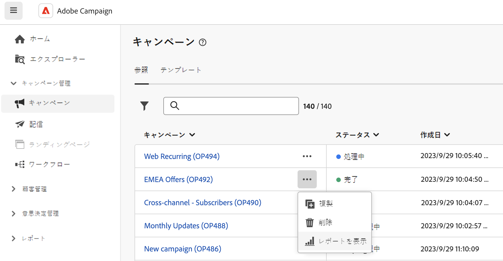

# キャンペーンレポート {#campaign-reports}

<!-- CAN BE REMOVED___
>[!CONTEXTUALHELP]
>id="acw_campaign_reporting_sending"
>title="Reporting Sending"
>abstract="The Sending tab within your report provides in-depth insights into your visitors' interactions with your deliveries and any potential errors they may have encountered."

>[!CONTEXTUALHELP]
>id="acw_campaign_reporting_tracking"
>title="Reporting tracking"
>abstract="The Tracking tab within your report offers valuable data, including recipient behavior per link, breakdown of opens and clicks, as well as detailed information about the most frequently clicked URLs during a delivery."
-->

キャンペーンレポートにアクセスするには、 **レポート** 」ボタンをクリックします。

また、3 つのドットを使用することもできます **その他のアクション** 次に示すように、キャンペーンリスト内のキャンペーン名の横にあるボタン。

{width="50%" align="left" zoomable="yes"}

キャンペーンレポートは、キャンペーンの成功とエラーを示す様々なウィジェットに分かれています。

各チャネルのレポートと関連指標の完全なリストは、次のページで参照できます。

* [メールチャネル](campaign-reports-email.md)
* [SMS チャネル](campaign-reports-sms.md)
* [プッシュチャネル](campaign-reports-push.md)

