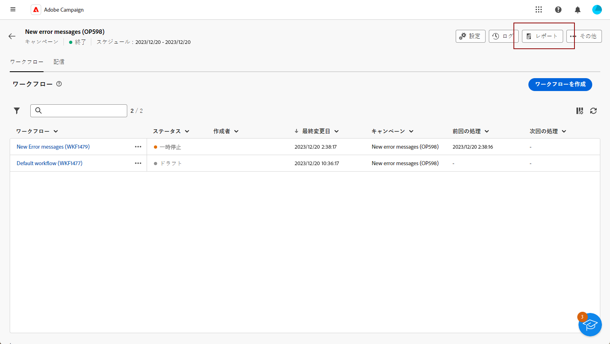
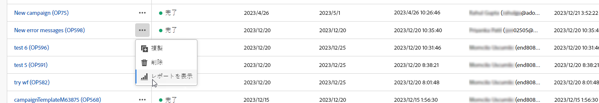
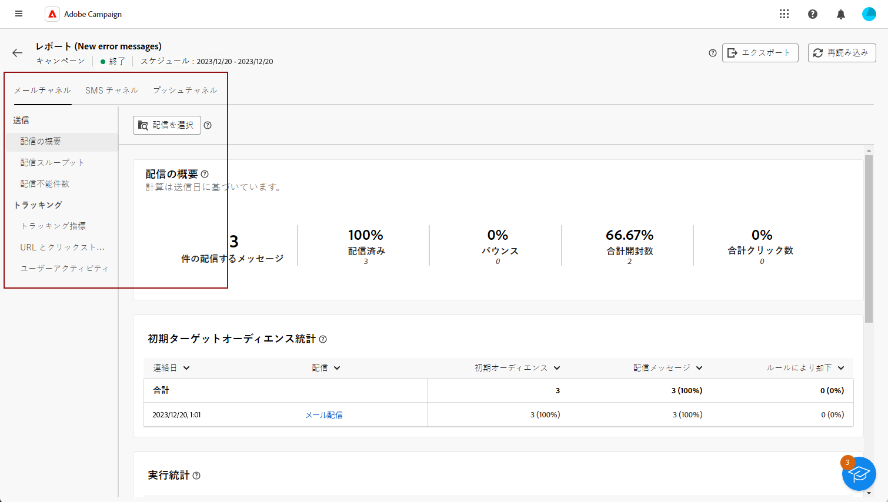
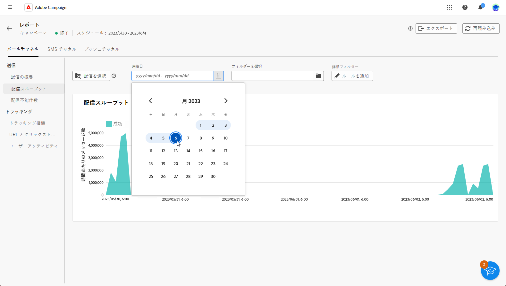
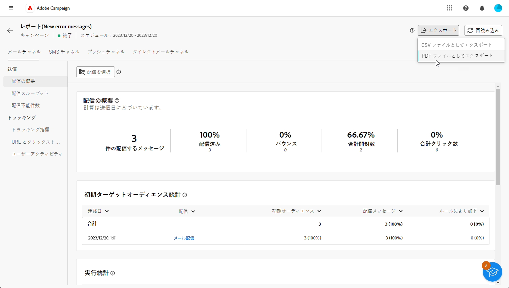

# キャンペーンレポートの概要 {#campaign-reports}

<!-- CAN BE REMOVED___
>[!CONTEXTUALHELP]
>id="acw_campaign_reporting_sending"
>title="Reporting Sending"
>abstract="The Sending tab within your report provides in-depth insights into your visitors' interactions with your deliveries and any potential errors they may have encountered."

>[!CONTEXTUALHELP]
>id="acw_campaign_reporting_tracking"
>title="Reporting tracking"
>abstract="The Tracking tab within your report offers valuable data, including recipient behavior per link, breakdown of opens and clicks, as well as detailed information about the most frequently clicked URLs during a delivery."
-->

The **キャンペーンレポート** の包括的な概要を提供する **campaign**：含まれる様々な配信に関するすべての関連情報を組み込みます。 これらのレポートでは、成功率、オーディエンスのエンゲージメント、その他の重要な指標など、各配信のチャネルごとのパフォーマンスを完全に分析できます。キャンペーンの全体的な有効性と影響を評価できます。

各チャネルのレポートと関連指標の完全なリストについては、下記のページを参照してください。

* [E メールキャンペーンチャネル](campaign-reports-email.md)
* [SMS キャンペーンチャネル](campaign-reports-sms.md)
* [キャンペーンチャネルをプッシュ](campaign-reports-push.md)

## レポートダッシュボードを管理 {#manage-reports}

キャンペーンレポートにアクセスして管理するには、次の手順に従います。

1. 次に移動： **[!UICONTROL キャンペーン]** メニュー。 次をクリック： **レポート** 」ボタンをクリックします。

   

   また、3 つのドットを使用することもできます **その他のアクション** キャンペーンリストでキャンペーン名の横にある「 」ボタンをクリックし、「 」を選択します。 **[!UICONTROL レポートを表示]**.

   

1. 左側のメニューから、リストからレポートを選択し、「 」タブに移動して、各チャネルのデータを表示します。

   

1. ダッシュボードで、 **[!UICONTROL 配信を選択]** キャンペーンに含まれる特定の配信を 1 つターゲットにする場合。

1. Adobe Analytics の **[!UICONTROL 配信スループット]** メニュー、選択 **開始** および **[!UICONTROL 終了時間]** 特定のデータをターゲットに設定します。

   

1. 次から： **[!UICONTROL フォルダを選択]** 「 」フィールドで、特定のフォルダーから配信またはキャンペーンをターゲットにするかを選択します。

   また、 **[!UICONTROL ルールを追加]** をクリックして、レポートデータをより適切にフィルタリングするクエリの作成を開始します。 [クエリモデラーの使用方法を説明します](../query/query-modeler-overview.md)

   

1. 次から： **[!UICONTROL URL とクリックストリーム]**&#x200B;を使用する場合は、 **[!UICONTROL 上位の訪問済みリンク]** または **[!UICONTROL 期間]**.

   The **[!UICONTROL 表示基準]** オプションを使用すると、URL、ラベルまたはカテゴリに基づいてフィルタリングできます。

## レポートをエクスポート {#export-reports}

様々なレポートをPDFまたは CSV 形式で簡単に書き出し、それらを共有、操作または印刷できます。

1. レポートで、 **[!UICONTROL 書き出し]** を選択し、 **[!UICONTROL 書き出しPDFファイル]** または **[!UICONTROL CSV ファイルとして書き出し]**.

   

1. ファイルを保存するフォルダを探し、必要に応じて名前を変更して、「 **[!UICONTROL 保存]**.

これで、レポートをPDFまたは CSV ファイルで表示または共有できるようになりました。

