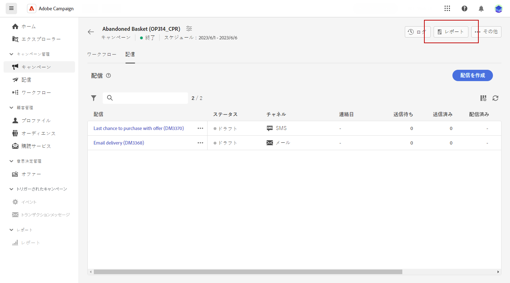

# キャンペーンレポート {#campaign-reports}

<!-- CAN BE REMOVED___
>[!CONTEXTUALHELP]
>id="acw_campaign_reporting_sending"
>title="Reporting Sending"
>abstract="The Sending tab within your report provides in-depth insights into your visitors' interactions with your deliveries and any potential errors they may have encountered."

>[!CONTEXTUALHELP]
>id="acw_campaign_reporting_tracking"
>title="Reporting tracking"
>abstract="The Tracking tab within your report offers valuable data, including recipient behavior per link, breakdown of opens and clicks, as well as detailed information about the most frequently clicked URLs during a delivery."
-->

キャンペーンレポートは、キャンペーンの成功とエラーの詳細を示す様々なウィジェットに分かれています。

次のタブを含むキャンペーンレポートページが表示されます。

* [メールチャネル](campaign-reports-email.md)
* [SMS チャネル](campaign-reports-sms.md)
* [プッシュチャネル](campaign-reports-push.md)

キャンペーンレポートにアクセスするには、キャンペーンのダッシュボードで「レポート」をクリックします。

