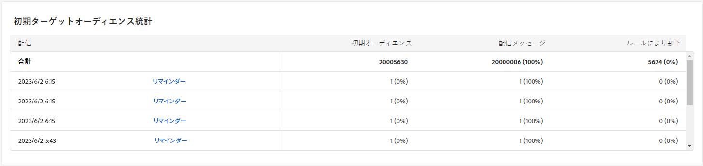

# キャンペーンレポート {#campaign-reports}

## メールチャネル {#email-channel}

### 配信の概要 {#delivery-summary-email}

* **[!UICONTROL 配信の概要]** は、訪問者が E メール配信にどのように関与しているかに関する詳細情報を提供する主要業績評価指標 (KPI) を提供します。

  +++電子メールキャンペーンレポート指標の詳細を説明します。

   * **[!UICONTROL 送信総数]**:配信の分析中に処理されたメッセージの合計数。

   * **[!UICONTROL 配信済み]**:送信されたメッセージの合計数に関する、正常に送信されたメッセージの数。

   * **[!UICONTROL バウンス]**:送信されたメッセージの合計数に関する、配信および自動返信処理の間に累積したエラーの合計。

   * **[!UICONTROL ユニーク開封数]**:メッセージを少なくとも 1 回開封したターゲット受信者の合計数。

   * **[!UICONTROL ユニーククリック数]**:配信で少なくとも 1 回クリックしたユニーク受信者の合計数。

+++

  

* **[!UICONTROL 初期ターゲットオーディエンス統計]**

  +++電子メールキャンペーンレポート指標の詳細を説明します。

   * **[!UICONTROL 初期オーディエンス]**:ターゲット受信者の合計数。

   * **[!UICONTROL 配信するメッセージ]**:配信の分析後に配信されるメッセージの合計数。

   * **[!UICONTROL ルールによって却下]**:ルールの適用時に分析中に無視されたアドレスの合計数：アドレスが見つからない、強制隔離された、ブロックリスト上など

+++

  

* **[!UICONTROL 実行統計]**

  +++電子メールキャンペーンレポート指標の詳細を説明します。

   * **[!UICONTROL 配信するメッセージ]**:配信の分析後に配信されるメッセージの合計数。

   * **[!UICONTROL 成功]**:配信されるメッセージ数に関して正常に処理されたメッセージ数。

   * **[!UICONTROL エラー]**:配信と自動リバウンド処理の間に、配信されるメッセージ数に関して累積したエラーの合計数。

   * **[!UICONTROL 新しい強制隔離]**:配信に失敗した配信（不明なユーザー、無効なドメイン）後に、配信されるメッセージの数に関して強制隔離されたアドレスの合計数。

+++

  

* **[!UICONTROL 反応統計]**

  +++電子メールキャンペーンレポート指標の詳細を説明します。

   * **[!UICONTROL ユニーク開封数]**:メッセージを少なくとも 1 回開封したターゲット受信者の合計数。

   * **[!UICONTROL 開封数]**：メッセージを少なくとも 1 回開封した、このドメインのユニークターゲット受信者の数。

   * **[!UICONTROL 購読解除]**:該当する期間中に購読解除をクリックした受信者数。

   * **[!UICONTROL ミラーページ]**:ミラーページのリンクをクリックした受信者の数。

   * **[!UICONTROL 転送数]**:E メールを転送した受信者の数。

  
+++

* **[!UICONTROL クリックストリーム]**

  

  +++電子メールキャンペーンレポート指標の詳細を説明します。

   * **[!UICONTROL ユニーククリック数]**:配信で少なくとも 1 回クリックしたユニーク受信者の合計数。

   * **[!UICONTROL クリック数]**：配信におけるリンクの合計クリック数。

   * **[!UICONTROL 反応度]**：配信を開封した推定ターゲット受信者数に対する、配信でクリックしたターゲット受信者数の割合。

+++

### 配信不能件数 {#non-deliverables-email}

* **[!UICONTROL タイプごとのエラーの分類]** および **[!UICONTROL ブラウザーごとのエラーの分類]**

  +++電子メールキャンペーンレポート指標の詳細を説明します。

   * **[!UICONTROL エラー]**:配信されるメッセージ数に関して、配信と自動リバウンド処理の間に累積したエラーの合計数。

   * **[!UICONTROL 寄与率]**:

   * **[!UICONTROL 分類]**:

+++

  

### トラッキング指標 {#tracking-indicators-email}

* **[!UICONTROL 配信統計]**

  +++電子メールキャンペーンレポート指標の詳細を説明します。

   * **[!UICONTROL 成功]**:配信されるメッセージ数に関して正常に処理されたメッセージ数。

   * **[!UICONTROL ユニーク開封数]**:メッセージを少なくとも 1 回開封したターゲット受信者の合計数。

   * **[!UICONTROL 開封数]**：メッセージを少なくとも 1 回開封した、このドメインのユニークターゲット受信者の数。

   * **[!UICONTROL オプトアウトリンクのクリック数]**:購読解除リンクのクリック数。

   * **[!UICONTROL ミラーリンクのクリック数]**:ミラーページへのリンクでのクリック数。

   * **[!UICONTROL 推定転送数]**：ターゲット受信者によって転送される E メール数の推定値。
+++

  

* **[!UICONTROL 開封率およびクリックスルー率]**

  +++電子メールキャンペーンレポート指標の詳細を説明します。

   * **[!UICONTROL 送信済み]**:送信されたメッセージの合計数。

   * **[!UICONTROL 苦情数]**：受信者によって望ましくないとレポートされた、このドメインのメッセージ数。

   * **[!UICONTROL 開封数]**：メッセージを少なくとも 1 回開封した、このドメインのユニークターゲット受信者の数。

   * **[!UICONTROL クリック数]**：同じ配信で少なくとも 1 回クリックしたユニークターゲット受信者の数。

   * **[!UICONTROL 反応率（生データ）]**：配信を少なくとも 1 回開封した受信者数に対する、配信で少なくとも 1 回クリックした受信者数の割合。
+++

  

### URL とクリックストリーム {#url-email}

* **[!UICONTROL URL とクリックストリーム]**

  +++電子メールキャンペーンレポート指標の詳細を説明します。

   * **[!UICONTROL 反応度]**：配信を開封した推定ターゲット受信者数に対する、配信でクリックしたターゲット受信者数の割合。

   * **[!UICONTROL ユニーククリック数]**:配信で少なくとも 1 回クリックしたユニーク受信者の合計数。

   * **[!UICONTROL クリック数]**：配信におけるリンクの合計クリック数。

+++

  

* **[!UICONTROL 最も訪問されたリンク上位 10 件]**

  +++電子メールキャンペーンレポート指標の詳細を説明します。

   * **[!UICONTROL クリック数]**：配信におけるリンクの合計クリック数。

   * **[!UICONTROL 割合]**:配信で操作したユーザーの割合。

+++

  

* **[!UICONTROL 時間の経過に伴うクリック数の分類]**、クリック数

  

### ユーザーアクティビティ {#user-activities-email}

* **[!UICONTROL ユーザーアクティビティ]**

   * **[!UICONTROL クリック数]**：配信におけるリンクの合計クリック数。

   * **[!UICONTROL 開封数]**：メッセージを少なくとも 1 回開封した、このドメインのユニークターゲット受信者の数。

+++

  

## SMS チャネル {#sms-channel}

### 配信の概要 {#delivery-summary-sms}

* **[!UICONTROL 配信の概要]** は、訪問者が SMS 配信にどのように関わっているかに関する詳細情報を提供する主要業績評価指標 (KPI) を提供します。

  +++SMS キャンペーンレポート指標の詳細を説明します。

   * **[!UICONTROL 送信総数]**:配信の分析中に処理されたメッセージの合計数。

   * **[!UICONTROL 配信済み]**:送信されたメッセージの合計数に関する、正常に送信されたメッセージの数。

   * **[!UICONTROL エラー]**:送信されたメッセージの合計数に関する、配信および自動返信処理の間に累積したエラーの合計。

   * **[!UICONTROL ユニーククリック数]**:配信で少なくとも 1 回クリックしたユニーク受信者の合計数。

+++

* **[!UICONTROL 初期ターゲットオーディエンス統計]**

  +++SMS キャンペーンレポート指標の詳細を説明します。

   * **[!UICONTROL 初期オーディエンス]**:ターゲット受信者の合計数。

   * **[!UICONTROL 配信するメッセージ]**:配信の分析後に配信されるメッセージの合計数。

   * **[!UICONTROL ルールによって却下]**:ルールの適用時に分析中に無視されたアドレスの合計数：アドレスが見つからない、強制隔離された、ブロックリスト上など

+++

* **[!UICONTROL 実行統計]**

  +++SMS キャンペーンレポート指標の詳細を説明します。

   * **[!UICONTROL 配信するメッセージ]**:配信の分析後に配信されるメッセージの合計数。

   * **[!UICONTROL 成功]**:配信されるメッセージ数に関して正常に処理されたメッセージ数。

   * **[!UICONTROL エラー]**:配信と自動リバウンド処理の間に、配信されるメッセージ数に関して累積したエラーの合計数。

   * **[!UICONTROL 新しい強制隔離]**:配信に失敗した配信（不明なユーザー、無効なドメイン）後に、配信されるメッセージの数に関して強制隔離されたアドレスの合計数。

+++

* **[!UICONTROL クリックストリーム]**

  +++SMS キャンペーンレポート指標の詳細を説明します。

   * **[!UICONTROL ユニーククリック数]**:配信で少なくとも 1 回クリックしたユニーク受信者の合計数。

   * **[!UICONTROL クリック数]**：配信におけるリンクの合計クリック数。

   * **[!UICONTROL 反応度]**：配信を開封した推定ターゲット受信者数に対する、配信でクリックしたターゲット受信者数の割合。

+++

## プッシュチャネル {#push-channel}

### 配信の概要 {#delivery-summary-push}

* **[!UICONTROL 配信の概要]** は、訪問者がプッシュ通知配信にどのように関与しているかに関する詳細情報を提供する主要業績評価指標 (KPI) を提供します。

  +++プッシュキャンペーンレポート指標の詳細を説明します。

   * **[!UICONTROL 送信総数]**:配信の分析中に処理されたメッセージの合計数。

   * **[!UICONTROL 配信済み]**:送信されたメッセージの合計数に関する、正常に送信されたメッセージの数。

   * **[!UICONTROL エラー]**:送信されたメッセージの合計数に関する、配信および自動返信処理の間に累積したエラーの合計。

   * **[!UICONTROL ユニーククリック数]**:配信で少なくとも 1 回クリックしたユニーク受信者の合計数。

+++

* **[!UICONTROL 初期ターゲットオーディエンス統計]**

  +++プッシュキャンペーンレポート指標の詳細を説明します。

   * **[!UICONTROL 初期オーディエンス]**:ターゲット受信者の合計数。

   * **[!UICONTROL 配信するメッセージ]**:配信の分析後に配信されるメッセージの合計数。

   * **[!UICONTROL ルールによって却下]**:ルールの適用時に分析中に無視されたアドレスの合計数：アドレスが見つからない、強制隔離された、ブロックリスト上など

+++

* **[!UICONTROL 実行統計]**

  +++プッシュキャンペーンレポート指標の詳細を説明します。

   * **[!UICONTROL 配信するメッセージ]**:配信の分析後に配信されるメッセージの合計数。

   * **[!UICONTROL 成功]**:配信されるメッセージ数に関して正常に処理されたメッセージ数。

   * **[!UICONTROL エラー]**:配信と自動リバウンド処理の間に、配信されるメッセージ数に関して累積したエラーの合計数。

   * **[!UICONTROL 新しい強制隔離]**:配信に失敗した配信（不明なユーザー、無効なドメイン）後に、配信されるメッセージの数に関して強制隔離されたアドレスの合計数。

+++

* **[!UICONTROL クリックストリーム]**

  +++プッシュキャンペーンレポート指標の詳細を説明します。

   * **[!UICONTROL ユニーククリック数]**:配信で少なくとも 1 回クリックしたユニーク受信者の合計数。

   * **[!UICONTROL クリック数]**：配信におけるリンクの合計クリック数。

   * **[!UICONTROL 反応度]**：配信を開封した推定ターゲット受信者数に対する、配信でクリックしたターゲット受信者数の割合。

+++
