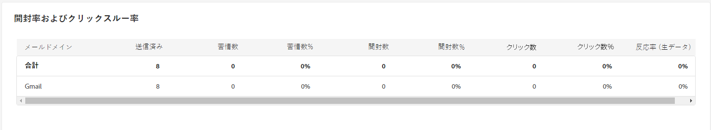
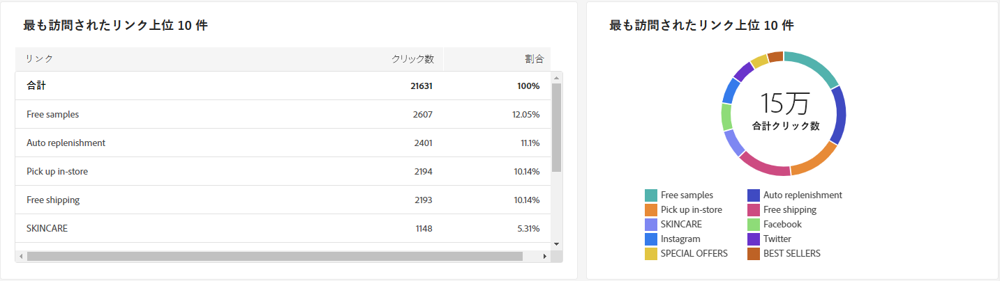

# キャンペーンレポート {#campaign-reports}

>[!CONTEXTUALHELP]
>id="acw_campaign_reporting_sending"
>title="送信のレポート"
>abstract="レポート内の「送信中」タブには、訪問者の配信とのやり取りに関する詳細なインサイトと、発生した可能性のあるエラーが表示されます。"

>[!CONTEXTUALHELP]
>id="acw_campaign_reporting_tracking"
>title="追跡のレポート"
>abstract="レポート内の「トラッキング」タブには、受信者のリンクごとの行動、開封数およびクリック数の分類、配信中に最も頻繁にクリックされた URL に関する詳細情報など、有用なデータが表示されます。"

>[!CONTEXTUALHELP]
>id="acw_campaign_reporting_deliveries_overview"
>title="配信の概要"
>abstract="配信の概要は、訪問者が E メール配信にどのように関与しているかに関する詳細な情報を提供する主要業績評価指標 (KPI) を示します。"

>[!CONTEXTUALHELP]
>id="acw_campaign_reporting_deliveries_target"
>title="初期ターゲットオーディエンス統計"
>abstract="「初期ターゲットオーディエンス統計」の表には、受信者に関するデータが表示されます"

キャンペーンレポートは、キャンペーンの成功とエラーを示す様々なウィジェットに分かれています。

次のタブを含むキャンペーンレポートページが表示されます。

* [メールチャネル](#email-channel)
* [SMS チャネル](#sms-channel)
* [プッシュチャネル](#push-channel)

キャンペーンレポートにアクセスするには、キャンペーンのダッシュボードで「レポート」をクリックします。

## メールチャネル {#email-channel}

### 配信の概要 {#delivery-summary-email}

* **[!UICONTROL 配信の概要]**&#x200B;では、訪問者がメール配信にエンゲージする方法に関する詳細情報を提供する主要業績評価指標（KPI）について説明します。

  

  +++詳しくは、メールキャンペーンレポート指標を参照してください。

   * **[!UICONTROL 送信総数]**：配信の準備中に処理されたメッセージの合計数。

   * **[!UICONTROL 配信済み数]**：送信されたメッセージの合計数に対して、正常に送信できたメッセージの数。

   * **[!UICONTROL バウンス数]**：送信されたメッセージの合計数に対して、配信および自動返信処理の間に累積したエラーの合計数。

   * **[!UICONTROL ユニーク開封数]**：メッセージを少なくとも 1 回開封したターゲット受信者の合計数。

   * **[!UICONTROL ユニーククリック数]**：配信で少なくとも 1 回クリックしたユニーク受信者の合計数。

+++

* **[!UICONTROL 初期ターゲットオーディエンス統計]**&#x200B;テーブルには、受信者に関連するデータが表示されます。

  

  +++詳しくは、メールキャンペーンレポート指標を参照してください。

   * **[!UICONTROL 初期オーディエンス数]**：ターゲット受信者の合計数。

   * **[!UICONTROL 配信するメッセージ]**：配信の準備後に配信されるメッセージの合計数。

   * **[!UICONTROL ルールにより却下]**：ルール（アドレスが不明、強制隔離された、ブロックリストに登録されているなど）を適用する際、分析中に無視されたアドレスの合計数。

+++

* **[!UICONTROL 実行統計]**&#x200B;テーブルには、配信の成功の詳細が表示されます。

  

  +++詳しくは、メールキャンペーンレポート指標を参照してください。

   * **[!UICONTROL 配信するメッセージ]**：配信の準備後に配信されるメッセージの合計数。

   * **[!UICONTROL 成功]**：配信されるメッセージ数に関して正常に処理されたメッセージ数。

   * **[!UICONTROL エラー]**：配信と自動リバウンド処理の間に、配信されるメッセージ数に関して累積したエラーの合計数。

   * **[!UICONTROL 新しい強制隔離数]**：配信の失敗後（不明なユーザー、無効なドメイン）、配信されるメッセージ数に関して強制隔離されたアドレスの合計数。

+++

* **[!UICONTROL 反応統計]**&#x200B;テーブルには、配信で受信者のアクティビティに使用できるデータが含まれます。

  

  +++詳しくは、メールキャンペーンレポート指標を参照してください。

   * **[!UICONTROL ユニーク開封数]**：メッセージを少なくとも 1 回開封したターゲット受信者の合計数。

   * **[!UICONTROL 開封数]**：メッセージを少なくとも 1 回開封した、このドメインのユニークターゲット受信者の数。

   * **[!UICONTROL 購読解除数]**：該当する期間中に購読解除をクリックした受信者の数。

   * **[!UICONTROL ミラーページ数]**：ミラーページのリンクをクリックした受信者の数。

   * **[!UICONTROL 転送数]**：メールを転送した、クリックした受信者の数。
+++

* **[!UICONTROL クリックストリーム]**&#x200B;テーブルには、受信者による配信の操作に関するデータが表示されます。

  

  +++詳しくは、メールキャンペーンレポート指標を参照してください。

   * **[!UICONTROL ユニーククリック数]**：配信で少なくとも 1 回クリックしたユニーク受信者の合計数。

   * **[!UICONTROL クリック数]**：配信におけるリンクの合計クリック数。

   * **[!UICONTROL 反応度]**：配信を開封した推定ターゲット受信者数に対する、配信でクリックしたターゲット受信者数の割合。

+++

### 配信不能件数 {#non-deliverables-email}

* **[!UICONTROL タイプごとのエラーの分類]**&#x200B;および&#x200B;**[!UICONTROL ドメインごとのエラーの分類]**&#x200B;テーブルとグラフには、各ドメインで発生する可能性のあるエラーに関する使用可能なデータが含まれます。

  このレポートに表示されるエラーにより、強制隔離プロセスが実行されることになります。強制隔離の管理について詳しくは、[Campaign v8（クライアントコンソール）ドキュメント](https://experienceleague.adobe.com/docs/campaign/campaign-v8/campaigns/send/failures/delivery-failures.html?lang=ja){target="_blank"}を参照してください。

  

  +++詳しくは、メールキャンペーンレポート指標を参照してください。

   * **[!UICONTROL 不明なユーザー]**：メールアドレスが無効であることを示すエラータイプで、配信中に生成される。

   * **[!UICONTROL 無効なドメイン]**：メールアドレスが正しくないか存在しないことを示すエラータイプ。配信の送信中に生成される。

   * **[!UICONTROL メールボックス容量超過]**：受信者の受信ボックスに含まれるメッセージの数が多すぎることを示すエラータイプで、5 回の配信の試行後に生成される。

   * **[!UICONTROL 無効なアカウント]**：アドレスが存在しないことを示すエラータイプ。配信の送信中に生成される。

   * **[!UICONTROL 拒否]**：アドレスが IAP（インターネットアクセスプロバイダー）によって却下される場合に生成されるエラータイプ。例えば、セキュリティルールのアプリケーション（スパム対策ソフトウェア）によって却下された場合に生成される。

   * **[!UICONTROL 未到達]**：SMTP リレーでのインシデント、ドメインへの一時的な未到達など、メッセージ配分文字列で発生するエラータイプ。

   * **[!UICONTROL 未接続]**：受信者の携帯電話の電源が入っていない、または送信時にネットワーク接続が切断されていることを示すエラータイプ。

+++

### トラッキング指標 {#tracking-indicators-email}

* **[!UICONTROL 配信統計]**&#x200B;では、送信されたメールで使用可能なデータに関する詳細情報を提供する主要業績評価指標（KPI）が提供されます。

  

  +++詳しくは、メールキャンペーンレポート指標を参照してください。

   * **[!UICONTROL 成功]**：配信されるメッセージ数に関して正常に処理されたメッセージ数。

   * **[!UICONTROL ユニーク開封数]**：メッセージを少なくとも 1 回開封したターゲット受信者の合計数。

   * **[!UICONTROL 開封数]**：メッセージを少なくとも 1 回開封した、このドメインのユニークターゲット受信者の数。

   * **[!UICONTROL オプトアウトリンクのクリック数]**：購読解除リンクのクリック数。

   * **[!UICONTROL ミラーリンクのクリック数]**：ミラーページへのリンクのクリック数。

   * **[!UICONTROL 推定転送数]**：ターゲット受信者によって転送されるメール数の推定値。
+++

* **[!UICONTROL 初期ターゲットオーディエンス統計]**&#x200B;テーブルには、受信者に関連するデータが表示されます。

  

  +++詳しくは、メールキャンペーンレポート指標を参照してください。

   * **[!UICONTROL 送信済み]**：送信されたメッセージの合計数。

   * **[!UICONTROL 苦情件数]**：受信者によって望ましくないとレポートされた、このドメインのメッセージ数。

   * **[!UICONTROL 開封数]**：メッセージを少なくとも 1 回開封した、このドメインのユニークターゲット受信者の数。

   * **[!UICONTROL クリック数]**：同じ配信で少なくとも 1 回クリックしたユニークターゲット受信者の数。

   * **[!UICONTROL 反応率（生データ）]**：配信を少なくとも 1 回開封した受信者数に対する、配信で少なくとも 1 回クリックした受信者数の割合。
+++

### URL とクリックストリーム {#url-email}

* **[!UICONTROL URL とクリックストリーム]**&#x200B;では、配信中に最もクリックされた URL に関する詳細情報を提供する主要業績評価指標（KPI）が提供されます。

  

  +++詳しくは、メールキャンペーンレポート指標を参照してください。

   * **[!UICONTROL 反応度]**：配信を開封した推定ターゲット受信者数に対する、配信でクリックしたターゲット受信者数の割合。

   * **[!UICONTROL ユニーククリック数]**：配信で少なくとも 1 回クリックしたユニーク受信者の合計数。

   * **[!UICONTROL クリック数]**：配信におけるリンクの合計クリック数。

   * **[!UICONTROL プラットフォームの平均]**：この平均率は、それぞれの率（反応度、ユニーククリック数および累積クリック数）の下に表示され、過去 6 ヶ月間に送信された配信に対して計算されます。同じタイポロジを持つ、同じチャネルでの配信のみが考慮されます。配達確認は除外されます。
+++

* **[!UICONTROL 最も訪問されたリンク上位 10 位]**&#x200B;グラフとテーブルには、リンクごとの受信者の行動に使用できるデータが含まれます。

  

  +++詳しくは、メールキャンペーンレポート指標を参照してください。

   * **[!UICONTROL クリック数]**：配信におけるリンクの合計クリック数。

   * **[!UICONTROL 割合]**：配信で操作したユーザーの割合。

+++

* **[!UICONTROL 時間の経過に伴うクリック数の分類]**&#x200B;グラフには、リンクごとの受信者の行動に使用できるデータが含まれます。

  

### ユーザーアクティビティ {#user-activities-email}

* **[!UICONTROL ユーザーアクティビティ]**&#x200B;では、開封数とクリック数の分類をグラフ形式で表示します。

  

  +++詳しくは、メールキャンペーンレポート指標を参照してください。

   * **[!UICONTROL クリック数]**：配信におけるリンクの合計クリック数。

   * **[!UICONTROL 開封数]**：メッセージを少なくとも 1 回開封した、このドメインのユニークターゲット受信者の数。

+++

## SMS チャネル {#sms-channel}

### 配信の概要 {#delivery-summary-sms}

* **[!UICONTROL 配信の概要]**&#x200B;では、訪問者が SMS 配信にエンゲージする方法に関する詳細情報を提供する主要業績評価指標（KPI）について説明します。

  

  +++詳しくは、SMS キャンペーンレポート指標を参照してください。

   * **[!UICONTROL 送信総数]**：配信の準備中に処理されたメッセージの合計数。

   * **[!UICONTROL 配信済み数]**：送信されたメッセージの合計数に対して、正常に送信できたメッセージの数。

   * **[!UICONTROL エラー数]**：配信と自動返信処理の間に、送信されたメッセージの合計数に関して累積したエラーの合計数。

   * **[!UICONTROL ユニーククリック数]**：配信で少なくとも 1 回クリックしたユニーク受信者の合計数。

+++

* **[!UICONTROL 初期ターゲットオーディエンス統計]**&#x200B;テーブルには、受信者に関連するデータが表示されます。

  

  +++詳しくは、SMS キャンペーンレポート指標を参照してください。

   * **[!UICONTROL 初期オーディエンス数]**：ターゲット受信者の合計数。

   * **[!UICONTROL 配信するメッセージ]**：配信の準備後に配信されるメッセージの合計数。

   * **[!UICONTROL ルールにより却下]**：ルール（アドレスが不明、強制隔離された、ブロックリストに登録されているなど）を適用する際、分析中に無視されたアドレスの合計数。

+++

* **[!UICONTROL 実行統計]**&#x200B;テーブルには、配信の成功の詳細が表示されます。

  

  +++詳しくは、SMS キャンペーンレポート指標を参照してください。

   * **[!UICONTROL 配信するメッセージ]**：配信の準備後に配信されるメッセージの合計数。

   * **[!UICONTROL 成功]**：配信されるメッセージ数に関して正常に処理されたメッセージ数。

   * **[!UICONTROL エラー]**：配信と自動リバウンド処理の間に、配信されるメッセージ数に関して累積したエラーの合計数。

   * **[!UICONTROL 新しい強制隔離数]**：配信の失敗後（不明なユーザー、無効なドメイン）、配信されるメッセージ数に関して強制隔離されたアドレスの合計数。

+++

* **[!UICONTROL クリックストリーム]**&#x200B;テーブルには、受信者による配信の操作に関するデータが表示されます。

  

  +++詳しくは、SMS キャンペーンレポート指標を参照してください。

   * **[!UICONTROL ユニーククリック数]**：配信で少なくとも 1 回クリックしたユニーク受信者の合計数。

   * **[!UICONTROL クリック数]**：配信におけるリンクの合計クリック数。

   * **[!UICONTROL 反応度]**：配信を開封した推定ターゲット受信者数に対する、配信でクリックしたターゲット受信者数の割合。

+++

## プッシュチャネル {#push-channel}

### 配信の概要 {#delivery-summary-push}

* **[!UICONTROL 配信の概要]**&#x200B;では、訪問者がプッシュ通知配信にエンゲージする方法に関する詳細情報を提供する主要業績評価指標（KPI）について説明します。

  +++詳しくは、プッシュキャンペーンレポート指標を参照してください。

   * **[!UICONTROL 送信総数]**：配信の準備中に処理されたメッセージの合計数。

   * **[!UICONTROL 配信済み数]**：送信されたメッセージの合計数に対して、正常に送信できたメッセージの数。

   * **[!UICONTROL エラー数]**：配信と自動返信処理の間に、送信されたメッセージの合計数に関して累積したエラーの合計数。

   * **[!UICONTROL ユニーククリック数]**：配信で少なくとも 1 回クリックしたユニーク受信者の合計数。

+++

* **[!UICONTROL 初期ターゲットオーディエンス統計]**&#x200B;テーブルには、受信者に関連するデータが表示されます。

  +++詳しくは、プッシュキャンペーンレポート指標を参照してください。

   * **[!UICONTROL 初期オーディエンス数]**：ターゲット受信者の合計数。

   * **[!UICONTROL 配信するメッセージ]**：配信の準備後に配信されるメッセージの合計数。

   * **[!UICONTROL ルールにより却下]**：ルール（アドレスが不明、強制隔離された、ブロックリストに登録されているなど）を適用する際、分析中に無視されたアドレスの合計数。

+++

* **[!UICONTROL 実行統計]**&#x200B;テーブルには、配信の成功の詳細が表示されます。

  +++詳しくは、プッシュキャンペーンレポート指標を参照してください。

   * **[!UICONTROL 配信するメッセージ]**：配信の準備後に配信されるメッセージの合計数。

   * **[!UICONTROL 成功]**：配信されるメッセージ数に関して正常に処理されたメッセージ数。

   * **[!UICONTROL エラー]**：配信と自動リバウンド処理の間に、配信されるメッセージ数に関して累積したエラーの合計数。

   * **[!UICONTROL 新しい強制隔離数]**：配信の失敗後（不明なユーザー、無効なドメイン）、配信されるメッセージ数に関して強制隔離されたアドレスの合計数。

+++

* **[!UICONTROL クリックストリーム]**&#x200B;テーブルには、受信者による配信の操作に関するデータが表示されます。

  +++詳しくは、プッシュキャンペーンレポート指標を参照してください。

   * **[!UICONTROL ユニーククリック数]**：配信で少なくとも 1 回クリックしたユニーク受信者の合計数。

   * **[!UICONTROL クリック数]**：配信におけるリンクの合計クリック数。

   * **[!UICONTROL 反応度]**：配信を開封した推定ターゲット受信者数に対する、配信でクリックしたターゲット受信者数の割合。

+++
