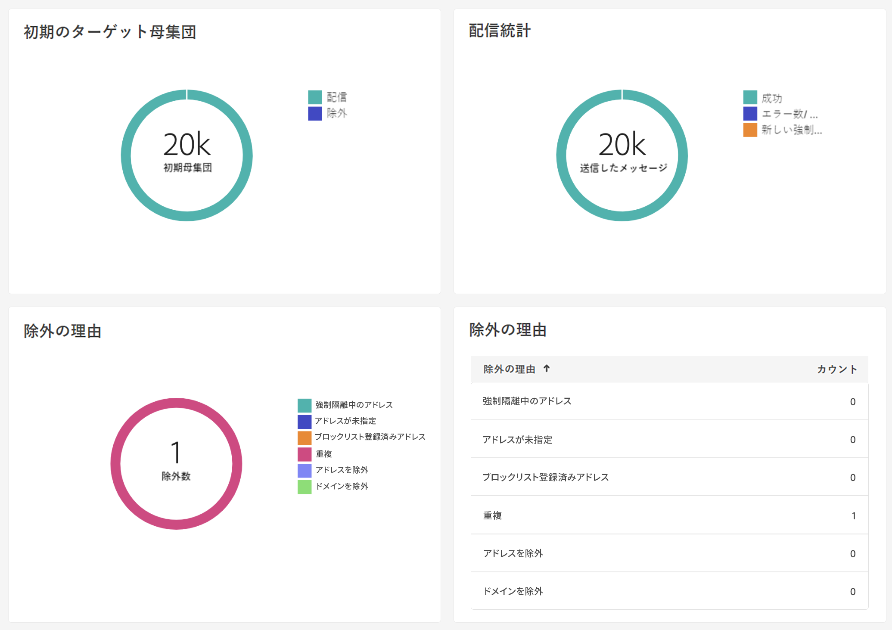
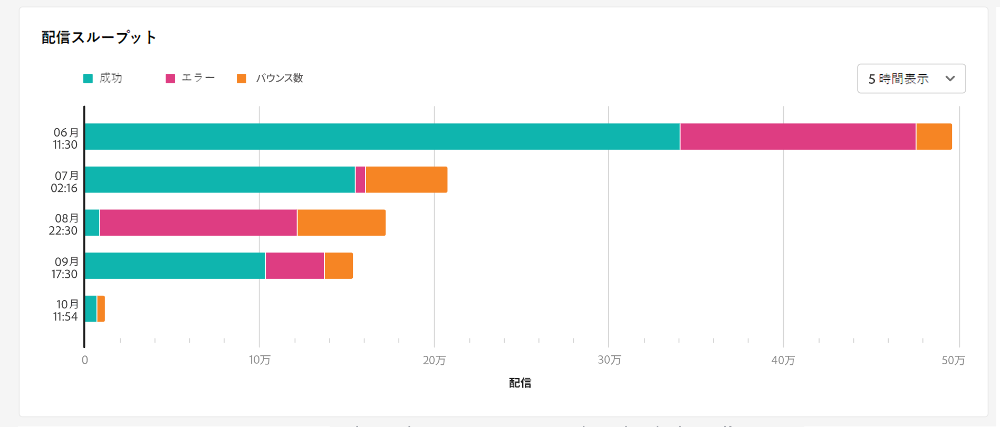
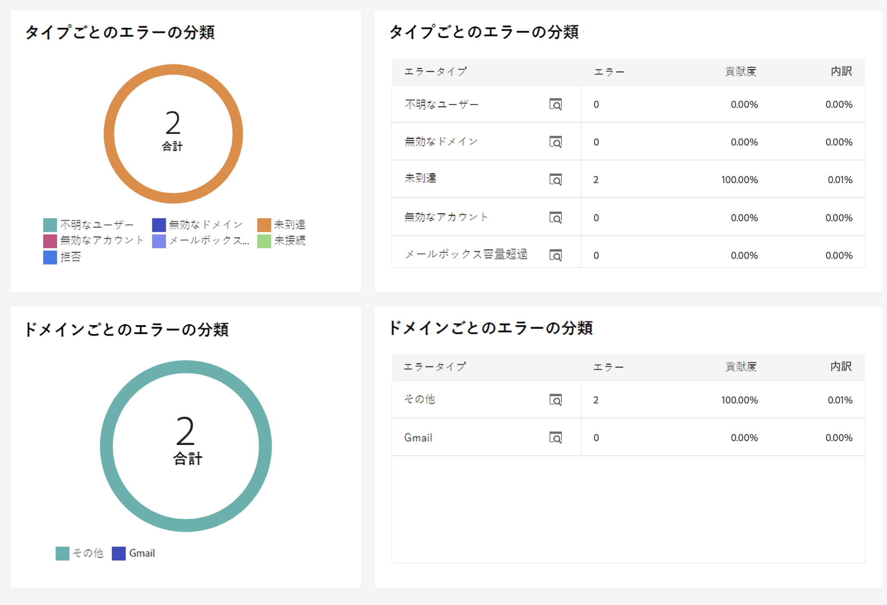
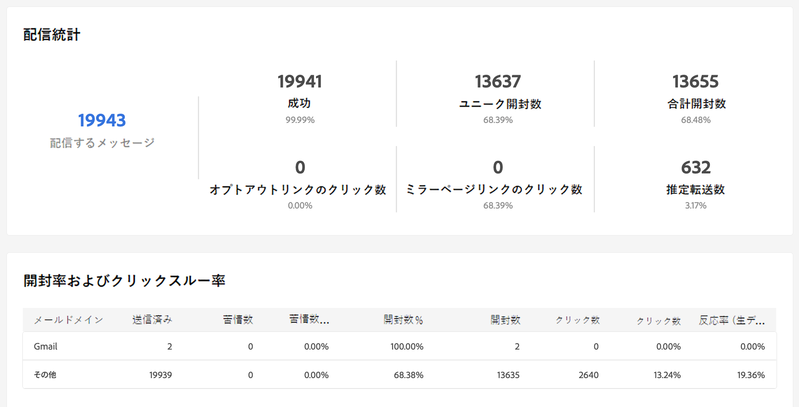
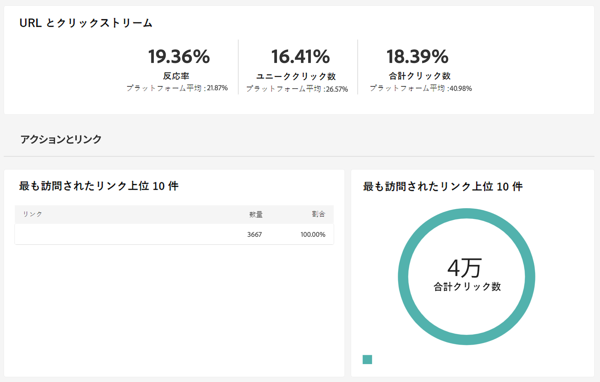
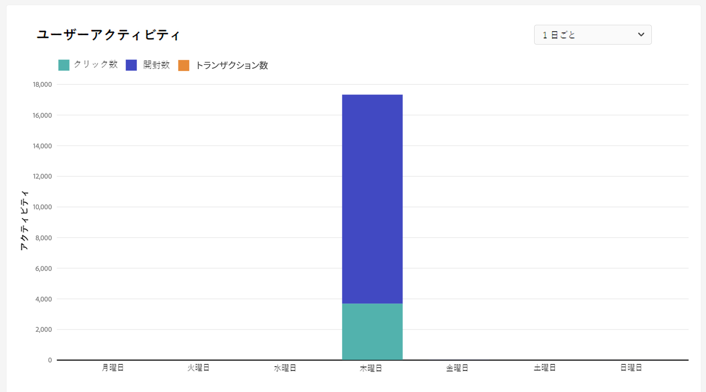
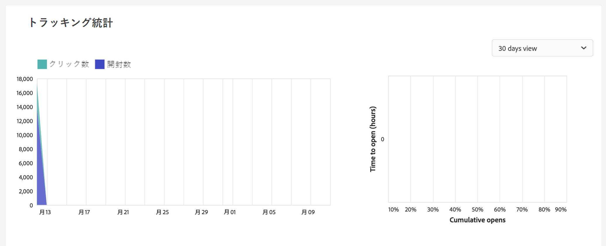
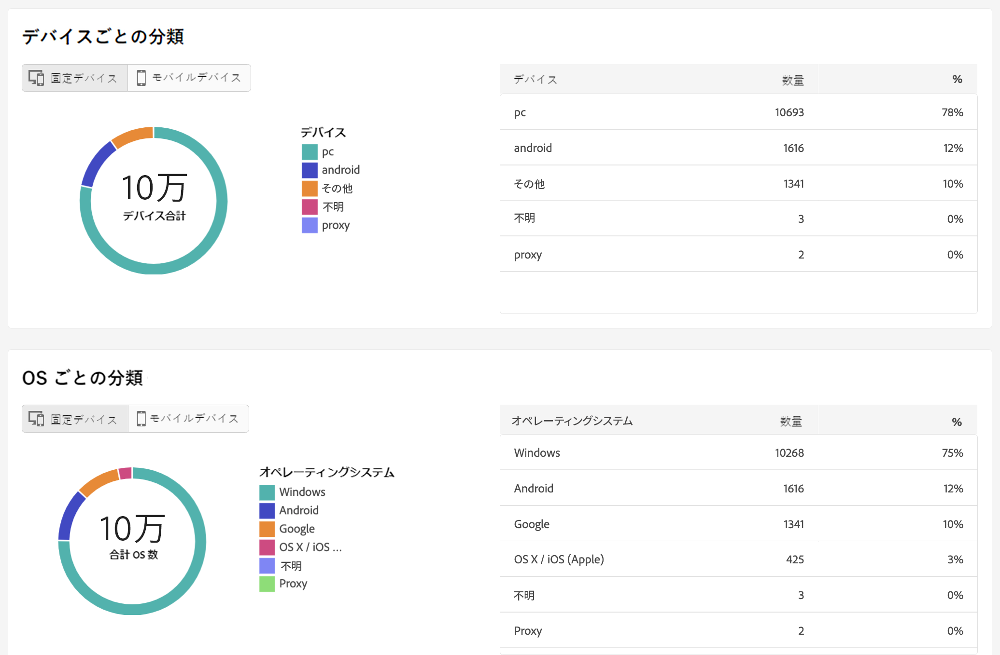

# 配信レポート {#reports}

Adobe Campaign には、配信ごとにアクセス可能な複数のタイプのレポートが用意されています。 これらのレポートを使用すると、メッセージの影響とパフォーマンスを組み込みダッシュボードで測定し視覚化できます。

レポートを表示するには、次の手順に従います。

1. メール配信にアクセスし、「**レポート**」ボタンをクリックします。

   

1. 左メニューで、リストからレポートを選択します。

   {width="70%" align="left"}

## 送信

* **配信の概要**：このレポートは、配信に関するすべての主要な情報を提供します。ターゲット母集団、除外の原因、配信統計。

   

* **配信スループット**：このレポートには、指定された期間の配信スループットに関する情報が含まれています。メッセージが配信される速度を測定するには、1 時間に送信されたメッセージの数とメッセージのサイズ（bps）が基準になります。次の例では、最初のグラフに正常な配信を青で、誤った配信をオレンジで示しています。

   

* **ブロードキャスト統計情報**：このレポートは、処理および送信されたすべてのメッセージ数、ハードバウンス数とソフトバウンス数、開封数、クリック数、購読解除数をインターネットドメインごとに分類表示します。

   

* **配信不能件数とバウンス数**：このレポートは、配信不能件数の分類だけでなく、バウンス数の分類についてもインターネットドメインごとに表示します。

   

## トラッキング

* **トラッキング指標**：このレポートでは、配信を受信したときの受信者の行動をトラッキングするための主要な指標を組み合わせています。配信統計と受信統計、開封率とクリックスルー率、生成されたクリックストリーム、web トラッキングだけでなく、ソーシャルネットワークへの共有アクティビティにもアクセスできます。

   

* **URL とクリックストリーム**：このレポートでは、配信後に訪問されたページのリストを示します。

   

* **ユーザーアクティビティ**：このレポートは、30 分、1 時間、1 日あたりの開封数とクリック数の分類をグラフ形式で表示します。

   

* **トラッキング統計**：このレポートは、開封数とクリック数の統計を表示します。

   

* **開封数の分類**：このレポートは、対象となる期間中の、オペレーティングシステム、デバイスおよびブラウザーごとの開封数の分類を表示します。それぞれのカテゴリで、2 つのグラフが使用されます。最初のグラフは、コンピューターおよびモバイルデバイスでの開封数に関する統計を示しています。2 つ目のグラフはモバイルデバイスでの開封数のみに関する統計を示しています。

   

## ホットクリック数

このレポートは、各リンクでのメッセージのコンテンツ（HTML および／またはテキスト）を、リンクでのクリック率と共に表示します。パーソナライゼーションブロックの購読解除リンク、ミラーページリンクおよびオファーリンクは、累積クリック数の合計では考慮されますが、レポートには表示されません。

