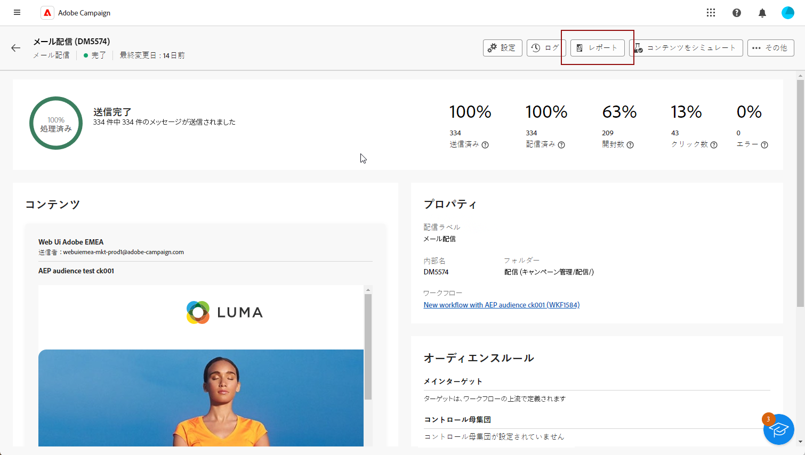
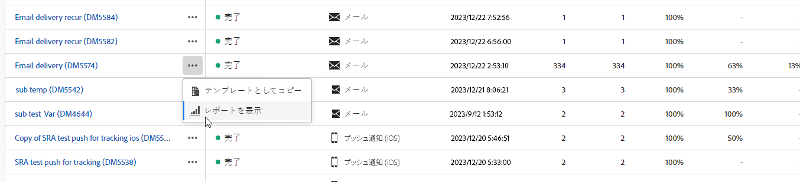
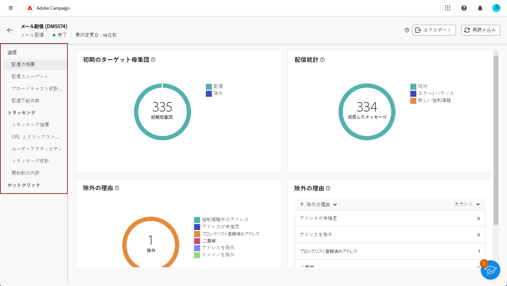
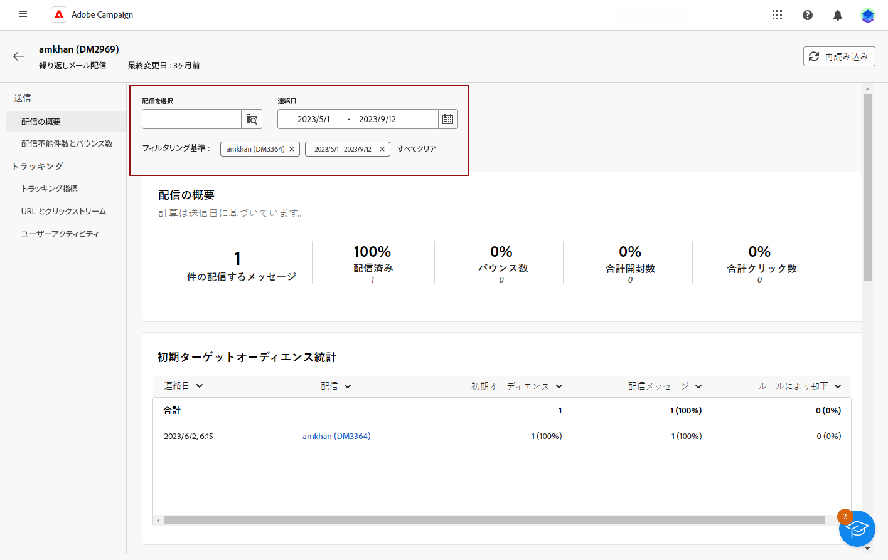
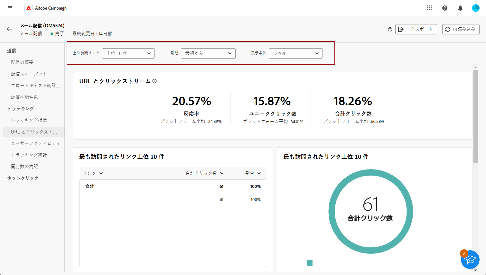
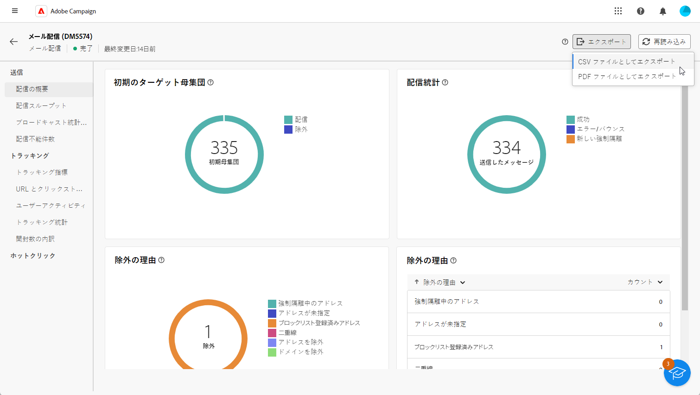

# 配信レポートの概要 {#reports}

>[!CONTEXTUALHELP]
>id="acw_campaign_reporting_deliveries_selection"
>title="配信の集計レポート"
>abstract="集計データレポートを表示する配信を 2 つ以上選択します。"

>[!CONTEXTUALHELP]
>id="acw_reporting_email_exportation"
>title="書き出し"
>abstract="「**書き出し**」ボタンをクリックして、これらの指標を PDF または CSV 形式に書き出します。この形式では、指標を共有または印刷できます。"

The **配信レポート** お客様の **配信** 」と入力します。 個々の配信のパフォーマンス、有効性、結果に関する詳細情報が提供され、包括的な概要が得られます。

各チャネルのレポートと関連指標の完全なリストについては、下記のページを参照してください。

* [メール配信レポート](email-report.md)
* [SMS 配信レポート](sms-report.md)
* [プッシュ配信レポート](push-report.md)

## レポートダッシュボードを管理 {#manage-reports}

Adobe Campaign には、配信ごとにアクセス可能な複数のタイプのレポートが用意されています。 これらのレポートを使用すると、メッセージの影響とパフォーマンスを組み込みダッシュボードで測定し視覚化できます。

レポートを表示および管理するには、次の手順に従います。

1. 特定の配信に関するレポートを生成するには、**[!UICONTROL 配信]**&#x200B;メニューに移動し、レポートする配信を選択します。

1. **[!UICONTROL 配信]**&#x200B;ダッシュボードで、「**[!UICONTROL レポート]**」をクリックします。

   

   また、3 つのドットを使用することもできます **その他のアクション** 配信リストで配信名の横にある「 」ボタンをクリックし、「 」を選択します。 **[!UICONTROL レポートを表示]**.

   {width="50%" zoomable="yes"}

1. 左メニューで、リストからレポートを選択します。

   

1. 配信を繰り返し行う場合は、「**[!UICONTROL 配信を選択]**」をクリックして、レポートする特定の配信を選択します。

   また、「**[!UICONTROL コンタクト日]**」を選択して、レポートに期間を適用することもできます。

   

1. 次から： **[!UICONTROL URL とクリックストリーム]**&#x200B;を使用する場合は、 **[!UICONTROL 上位の訪問済みリンク]** または **[!UICONTROL 期間]**.

   The **[!UICONTROL 表示基準]** オプションを使用すると、URL、ラベルまたはカテゴリに基づいてフィルタリングできます。

   

## レポートをエクスポート {#export-reports}

様々なレポートをPDFまたは CSV 形式で簡単に書き出し、それらを共有、操作または印刷できます。

1. レポートで、 **[!UICONTROL 書き出し]** を選択し、 **[!UICONTROL 書き出しPDFファイル]** または **[!UICONTROL CSV ファイルとして書き出し]**.

   

1. ファイルを保存するフォルダを探し、必要に応じて名前を変更して、「 **[!UICONTROL 保存]**.

これで、レポートをPDFまたは CSV ファイルで表示または共有できるようになりました。

